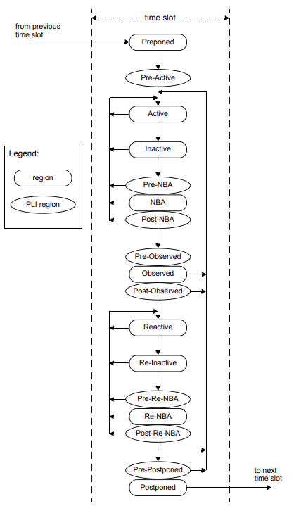

# 4. 调度语义
## 4.1 一般规定
本章描述以下内容：
 - 基于事件的仿真调度语义
 - systemverilog 的分层时间调度算法
 - 事件顺序的确定性和不确定性
 - 竞争条件的可能来源
 - PLI 回调控制点

## 4.2 硬件模型的执行及其验证环境
本标准剩余各章描述了语⾔各个元素的⾏为。本章概述了这些元素之间的相互作⽤，特别是关于事件的安排和执行。

组成 SystemVerilog 语⾔的元素可⽤于描述电⼦硬件的不同抽象层次的⾏为。SystemVerilog 是⼀种并⾏的编程语⾔。某些语⾔结构的执⾏由块或进程的并⾏执⾏定义。重要的是理解什么执⾏顺序可以保证给⽤⼾，什么执⾏顺序是不确定的。

尽管 SystemVerilog 不仅仅⽤于仿真，但该语⾔的语义是针对仿真，其他⼀切都是从这个基本定义中抽象出来的。

## 4.3 事件仿真
SystemVerilog 语言根据离散事件执行模型定义。本章将更详细地描述离散事件模拟，以便提供上下文来描述 SystemVerilog 结构的含义和有效解释。这些定义为仿真提供了标准的 SystemVerilog 参考算法，所有兼容的模拟器都应实现该参考算法。在下面的事件执行模型定义中，有很多选择，不同的模拟器在执行的一些细节上可能存在差异。此外，SystemVerilog 模拟器可以自由使用本条款中描述的不同算法，前提是用户可见的效果与参考算法一致。

一个SystemVerilog描述由连接的执行线程或进程组成。进程是可以计算的对象，可以有状态，可以对输入的变化作出响应，从而产生输出。进程是并发调度的元素，如 **initial** 过程。进程的例子包括但不限于原语；**initial、always、always_comb、always_latch** 和 **always_ff** 过程；连续赋值；异步任务；过程赋值语句。

在被模拟的系统描述中，线网或变量的状态的每一个变化都被认为是一个 *更新事件*。

进程对更新事件敏感。当执行更新事件时，对该事件敏感的所有进程都将考虑以任意顺序进行计算。过程的计算也是一个事件，称为 *计算事件*。

计算事件还包括 PLI 回调，它是执行模型中的点，可以从模拟内核调用 PLI 应用程序。

除了事件之外，模拟器的另一个关键方面是时间。术语 *仿真时间* 是指模拟器维护的时间值，用于模拟系统描述被模拟所需的实际时间。在本章中，术语 *时间* 与 *仿真时间* 可以互换使用。

为了完全支持清晰和可预测的交互，单个时隙被划分为多个区域，在这些区域中，事件可以被安排为特定类型的执行顺序。这允许属性和检查器在 DUT 处于稳定状态时采样数据。属性表达式可以安全地求值，测试平台可以以零延迟的方式对属性和检查器做出反应，所有这些都以一种可预测的方式进行。这种机制还允许设计、时钟传播和/或激励和响应代码中的非零延时自由地混合，并与周期精确描述一致。

## 4.4 分层事件调度器
一个合格的 SystemVerilog 模拟器应该维护某种形式的数据结构，允许事件被动态地调度、执行，并随着模拟器的时间推移而删除。该数据结构通常实现为一组按时间顺序排列的链表，以定义良好的方式进行划分和再划分。

第一种划分是时间划分。每个事件都有且只有一个模拟执行时间，在模拟过程中的任何给定时间点，可以是当前时间，也可以是未来的某个时间。所有在特定时间调度的事件定义一个时隙。模拟的过程是，按照时间顺序执行并删除当前模拟时隙中的所有事件，然后再移动到下一个非空时隙。这个过程可以保证模拟器永远不会回到过去。

一个时隙被划分为一组有序的区域，如下所示：
 1. Preponed
 2. Pre-Active 
 3. Active
 4. Inactive
 5. Pre-NBA
 6. NBA
 7. Post-NBA
 8. Pre-Observed 
 9. Observed
 10. Post-Observed 
 11. Reactive
 12. Re-Inactive 
 13. Pre-Re-NBA 
 14. Re-NBA
 15. Post-Re-NBA
 16. Pre-Postponed 
 17. Postponed

将时隙划分为这些有序区域的目的是在设计和测试代码之间提供可预测的交互。

注意：这些区域实际上包含了 IEEE 1364-2005 模拟参考模型，具有完全相同的确定性水平。换句话说，遗留的 Verilog 代码应该继续正确运行，而无需根据 SystemVerilog 机制修改。

### 4.4.1 Active 区域集合和 reactive 区域集合
有两组重要的事件区域用于帮助定义 SystemVerilog 活动的调度，即 active 区域集和 reactive 区域集。调度在 Active、Inactive、Pre-NBA、NBA 和 Post-NBA 区域中的事件为 *Active 区域集合* 事件。调度在 Reactive、Re-Inactive、Pre- Re-NBA、Re-NBA 和 Post-Re-NBA 区域中的事件是 *Reactive 区域集合* 事件。

Active、Inactive、Pre-NBA、NBA、Post-NBA、Pre-Observed、Observed、 Post- Observed、Reactive、Re-Inactive、Pre-Re-NBA、Re-NBA、Post-Re-NBA 和 Pre-Postponed 区域称为 *可迭代区域*。

每个时隙的所有事件区域除了分为 active 区域集和 reactive 区域集外，还可以分为 *仿真区域*（参见4.4.2）或 *PLI 区域*（参见4.4.3）。

### 4.4.2 仿真区域
一个时隙的仿真区域为 Preponed、Active、Inactive、NBA、Observed、Reactive、Re-Inactive、Re-NBA 和 Postponed。事件区域的执行流程如图 4-1 所示。

#### 4.4.2.1 Preponed 事件区域
`#1step` 采样延迟提供了在进入当前时隙之前立即采样数据的能力。`#1step` 采样等同于在当前时隙的 Preponed 区域中获取数据样本。在 Preponed 区域的采样与在前一个 Postponed 区域的采样是等价的。

Preoned 区域 PLI 事件也调度在该区域中（参见4.4.3.1）。

#### 4.4.4.2 Active 事件区域
Active 区域保存了当前被计算的 active 区域集事件，可以以任何顺序处理。

#### 4.4.2.3 Inactive 事件区域
Inactive 区域保存了在所有 active 事件处理完毕后要计算的事件。

如果事件在 active 区域集中执行，则显式的 `#0` 延迟控制要求暂停进程，并将事件调度到当前时间槽的 Inactive 区域，以便在下一次从 Inactive 到 Active 的迭代中恢复进程。

#### 4.4.2.4 NBA 事件区域
NBA (nonblocking assignment update，非阻塞赋值更新) 区域保存了所有 Inactive 事件处理完毕后要计算的事件。

如果事件在 active 区域集合中执行，则非阻塞赋值将在 NBA 区域中创建一个事件，调度在当前或以后的仿真时间进行。

#### 4.4.2.5 Observed 事件区域
Observed 区域用于触发属性表达式时的计算。在属性计算时，应将通过/失败代码安排在当前时隙的 Reactive 区域内。在 Observed 区域中不允许 PLI 回调。

#### 4.4.2.6 Reactive 事件区域
Reactive 区域保存了当前被计算的 reactive 区域集事件，可以以任何顺序处理。
由程序块中的阻塞赋值指定的代码和并发断言的动作块中的代码被调度在 Reactive 区域中。Reactive 区域是 reactive 区域集合的 Active 区域的对偶（参见4.4.2.2）。

#### 4.4.2.7 Re-Inactive 事件区域
Re-Inactive 区域保存了在所有 Reactive 事件处理完毕后要计算的事件。

如果事件在 reactive 区域集合中执行，则显式的 `#0` 延迟控制需要暂停进程，并将事件调度到当前时间片的 Re-Inactive 区域中，以便在下一次 Re-Inactive 到 Reactive 的迭代中恢复进程。Re-Inactive 区域是 reactive 区域集合的 Inactive 区域的对偶（参见4.4.2.3）。

#### 4.4.2.8 Re-NBA 事件区域
在所有 Re-Inactive 的事件处理完毕后，Re-NBA 区域保存着要计算的事件。
如果事件正在 reactive 区域集中执行，则非阻塞赋值将在为当前或以后的仿真时间调度的 Re-NBA 更新区域中创建事件。Re-NBA 区域是 reactive 区域集合的 NBA 区域的对偶（见4.4.2.4）。

#### 4.4.2.9 Postponed 事件区域
`$monitor`、`$strobe` 和其他类似的事件被调度在 Postponed 区域。

一旦 Postponed 区域到达，当前时隙中就不允许有新的值发生变化。在这个区域内，向任何线网或变量写入值，或者在当前时间槽内调度事件到之前的任何区域都是非法的。

Postponed 区域 PLI 事件也调度在该区域内（见4.4.3.10）。

### 4.4.3 PLI 区域
除了可以调度 PLI 回调的仿真区域之外，还有其他特定于 PLI 的区域。一个时间片的 PLI 区域为 Preponed、Pre-Active、Pre-NBA、Post-NBA、Pre-Observed、Post-Observed、Pre-Re-NBA、Post-Re-NBA 和 Pre-Postponed 区域。PLI 区域的执行流程如图 4-1 所示。

#### 4.4.3.1 Preponed PLI 区域
Preponed 区域提供了一个 PLI 回调控制点，允许 PLI 应用程序在任何线网或变量状态改变之前访问当前时隙的数据。在这个区域内，向任何线网或变量写入值，或者在当前时间片内安排任何其他区域的事件都是非法的。

注意：PLI 当前不调度 Preponed 区域中的回调函数。

#### 4.4.3.2 Pre-Active PLI 区域
Pre-Active 区域提供了一个 PLI 回调控制点，允许 PLI 应用程序在 Active 区域中的事件被计算之前读写值和创建事件（见4.5）。

#### 4.4.3.3 Pre-NBA PLI 区域
Pre-NBA 区域提供了一个 PLI 回调控制点，允许 PLI 应用程序在 NBA 区域内的事件被计算之前读写值和创建事件（见4.5）。

#### 4.4.3.4 Post-NBA PLI 区域
Post-NBA 区域提供了一个 PLI 回调控制点，允许 PLI 应用程序在 NBA 区域内的事件被计算之后读写值和创建事件（见4.5）。

#### 4.4.3.5 Pre-Observed PLI 区域
Pre-Observed 区域提供了一个 PLI 回调控制点，允许 PLI 应用程序在 active 区域集稳定后读取值。在这个区域内，向任何线网或变量写入值或在当前时隙内调度事件都是非法的。

#### 4.4.3.6 Post-Observed PLI 区域
Post-Observed 区域提供了一个 PLI 回调控制点，允许 PLI 应用程序在属性求值后读取值（在 Observed 区域或更早的区域中）。

注意：PLI 当前不调度 Observed 区域的回调函数。

#### 4.4.3.7 Pre-Re-NBA PLI 区域
Pre-Re-NBA 区域提供了一个 PLI 回调控制点，允许 PLI 应用程序在 Re-NBA 区域中的事件被计算之前读写值和创建事件（见4.5）。

#### 4.4.3.8 Post-Re-NBA PLI 区域
Post-Re-NBA 区域提供了一个 PLI 回调控制点，允许 PLI 应用程序在 Re-NBA 区域中的事件被求值之后读写值和创建事件（见4.5）。

#### 4.4.3.9 Pre-Postponed PLI 区域
Pre-Postponed 区域提供了一个 PLI 回调控制点，允许 PLI 应用程序在处理除 Postponed 区域之外的所有其他区域之后读写值和创建事件。

#### 4.4.4.10 Postponed PLI区域
Postponed 区域提供了一个 PLI 回调控制点，允许 PLI 应用程序在处理所有其他区域之后创建只读事件。PLI `cbReadonlySynch` 和其他类似的事件被安排在 Postponed 区域。

SystemVerilog 的时隙和事件区域流程如图 4-1 所示。



图 4-1 — Event scheduling regions
## 4.5 SystemVerilog 仿真参考算法
```
execute_simulation {
    T = 0;
    initialize the values of all nets and variables;
    schedule all initialization events into time 0 slot;
    while (some time slot is nonempty) {
        move to the first nonempty time slot and set T;
        execute_time_slot (T);
    }
}

execute_time_slot {
    execute_region (Preponed);
    execute_region (Pre-Active); 
    while (any region in [Active ... Pre-Postponed] is nonempty) {
        while (any region in [Active ... Post-Observed] is nonempty) {
            execute_region (Active);
            R = first nonempty region in [Active ... Post-Observed];
            if (R is nonempty)
                move events in R to the Active region;
        }
        while (any region in [Reactive ... Post-Re-NBA] is nonempty) {
            execute_region (Reactive);
            R = first nonempty region in [Reactive ... Post-Re-NBA];
            if (R is nonempty)
                move events in R to the Reactive region;
        }
        if (all regions in [Active ... Post-Re-NBA] are empty)
            execute_region (Pre-Postponed);
    }
    execute_region (Postponed);
}

execute_region {
    while (region is nonempty) {
        E = any event from region;
        remove E from the region;
        if (E is an update event) {
            update the modified object;
            schedule evaluation event for any process sensitive to the object;
        } else { /* E is an evaluation event */
            evaluate the process associated with the event and possibly
            schedule further events for execution;
        }
    }
}
```

迭代区域及其顺序为 Active、Inactive、Pre-NBA、NBA、Post-NBA、Pre-Observed、Observed、Post-Observed、Reactive、Re-Inactive、Pre-Re-NBA、Re-NBA、Post-Re-NBA和 Pre-Postponed。在算法中，一旦处理了 Reactive、Re-Inactive、Pre-Re-NBA、Re-NBA 或 Post-Re-NBA 区域，就不会继续迭代其他区域，直到这 5 个区域为空。

## 4.6 确定性
标准保证特定的调度顺序：
 1. begin-end 语句块中的语句应按照它们在 begin-end 语句块中出现的顺序执行。特定begin-end 块中的语句执行可以暂停，以便模型中的其他进程执行；但是，在任何情况下，begin-end 块中的语句都不能以源语句中出现的顺序以外的任何顺序执行。
 2. 非阻塞赋值应按照语句的执行顺序执行（参见 10.4.2）。

考虑如下的例子：
```verilog
module test;
    logic a;
    initial begin
        a <= 0;
        a <= 1;
    end
endmodule
```

当这个代码块被执行时，会有两个事件被添加到 NBA 区域。前面的规则要求它们按执行顺序进入事件区域，在顺序的 begin-end 块中，执行顺序就是源代码顺序。这条规则要求他们必须从 NBA 区域取出，并按执行顺序执行。因此，在仿真时间为 0 时，变量 a 将被赋值为 0，然后赋值为 1。

## 4.7 不确定性
不确定性的一个来源是，active 事件可以从 active 事件区域或 reactive 事件区域中移除，并以任何顺序处理。不确定性的另一个来源是过程块中没有时间控制结构的语句不必作为一个事件执行。时间控制语句是 `#` 表达式和 `@` 表达式结构（参见 9.4）。在计算过程语句时，仿真器可以随时暂停执行，并将部分完成的事件作为待决事件放置在事件区域中。这样做的效果是允许流程执行的交错，尽管交错执行的顺序是不确定的，并且不受用户控制。

## 4.8 竞态条件
因为表达式求值和线网更新事件的执行可能是混合的，所以可能存在竞态条件：例如：

```verilog
assign p = q; 
initial begin
    q = 1;
    #1 q = 0; 
    $display(p); 
end
```

仿真器显示 1 或 0 都是正确的。将 0 分配给 q 触发 p 的更新事件。仿真器可以继续并执行 `$display` 任务，或执行 p 的更新，然后执行 `$display` 任务。

## 4.9 赋值的调度含义
赋值被转换为进程和事件，详情见 4.9.1 到 4.9.7。

### 4.9.1 连续赋值
连续赋值语句（参见10.3）对应于一个进程，对表达式中的源元素敏感。当表达式的值发生变化时，它会导致一个 active 更新事件被添加到事件区域，使用当前值来确定目标。连续赋值过程也在时间 0 时进行计算，以便传播常量值。这包括从端口连接推断出的隐式连续赋值（参见4.9.6）。

### 4.9.2 过程连续赋值
一个过程连续赋值(即 `assign` 或 `force` 语句；参见 10.6)对应于一个对表达式中的源元素敏感的进程。当表达式的值发生变化时，它会导致一个 active 更新事件被添加到事件区域，使用当前值来确定目标。

`deassign` 或 `release` 语句使任何相应的 `assign` 或 `force` 语句失效。

### 4.9.3 阻塞赋值
具有内部赋值延迟的阻塞赋值语句（参见 10.4.1）会使用当前值计算右边的值，然后导致正在执行的进程被挂起并作为未来的事件调度。如果延迟为 0，则进程在当前时间作为 Inactice 事件调度。如果一个零延迟的阻塞赋值是从一个 Reactive 区域执行的，那么该进程将被调度为一个 Re-Inactive 事件。

当返回进程时（或者如果没有指定延迟，则立即返回），进程将对左侧执行赋值，并根据左侧的更新启用一些事件。进程恢复时的值用于确定目标。然后可以继续执行下一个顺序语句或其他活动或 Reactive 事件。

### 4.9.4 非阻塞赋值
非阻塞赋值语句（参见 10.4.2）总是计算更新后的值，并将更新调度为NBA 更新事件，如果延迟为零，则在当前时间步长进行更新，如果延迟非零，则在未来时间步长进行更新。当更新被放置在事件区域中时，有效的值用于同时计算右边的值和左边的目标。

### 4.9.5 开关（晶体管）处理
4.5 中描述的事件驱动仿真算法依赖于单向信号流，能够独立地处理每个事件。读取输入，计算结果，并安排更新。

SystemVerilog 除了提供行为和门级建模外，还提供了开关级建模。开关提供双向的信号流，需要开关连接的节点进行协同处理。

建模开关的源元素是各种形式的晶体管，称为 `tran`、`tranif0`、`tranif1`、`rtran`、`rtranif0` 和` rtranif1`。

由于开关的输入和输出是相互作用的，因此开关处理必须考虑双向开关连接线网中的所有设备，然后才能为线网上的任何节点确定合适的值。仿真器可以使用一种松弛技术来做到这一点。该仿真器可以随时处理晶体管。它可以在特定时间处理跨连接事件的一个子集，与其他active 事件的执行混合在一起。

当某些晶体管的门值为 x 时，需要进一步细化。一种概念上简单的技术是将这些晶体管设置为全导电和非导电晶体管的所有可能组合，反复求解线网。任何在所有情况下具有唯一逻辑级别的节点，其稳态响应等于该级别。所有其他节点的稳态响应为 x。

### 4.9.6 端口连接
端口通过隐式的连续赋值语句或隐式的双向连接连接进程。双向连接类似于两个线网之间始终启用的 `tran` 连接，但不会降低任何强度。

端口总是可以表示为声明的连接对象，如下所示：
 - 如果是输入端口，则是外部表达式对本地（输入）线网或变量的连续赋值
 - 如果是输出端口，则是本地输出表达式到外部线网或变量的连续赋值
 - 如果是 inout 端口，则是连接本地线网到外部线网的非强度降低晶体管

原语终端（包括UDP终端）不同于模块端口。原语输出和 inout 终端应直接连接到 1 位网或 1 位结构线网表达式（见 23.3.3），不进行可能改变强度的干预过程。原语求值的更改被调度为连接线网中的 active 更新事件。与 1 位网或 1 位结构线网表达式连接的输入终端也直接连接，不存在影响强度的干预过程。连接到其他类型表达式的输入终端表示为从表达式到连接到输入终端的隐式线网的隐式连续赋值。

### 4.9.7 子进程
子进程参数是通过值传递的，它在调用时复制进来，在返回时复制出去。在返回时复制出的函数与阻塞赋值的行为相同。

## 4.10 PLI 回调控制点
有两种PLI回调：一种是在某些特定活动发生时立即执行的，另一种是显式注册为一次性求值事件的。

各种 PLI 回调的对应关系如表 4-1 所示。

表 4-1 — PLI 回调
| Callback | Event region | 
| --- | --- | 
| cbAfterDelay | Pre-Active |
| cbNextSimTime | Pre-Active |
| cbReadWriteSynch | Pre-NBA or Post-NBA |
| cbAtStartOfSimTime | Pre-Active |
| cbNBASynch | Pre-NBA |
| cbAtEndOfSimTime | Pre-Postponed | 
| cbReadOnlySynch | Postponed |
