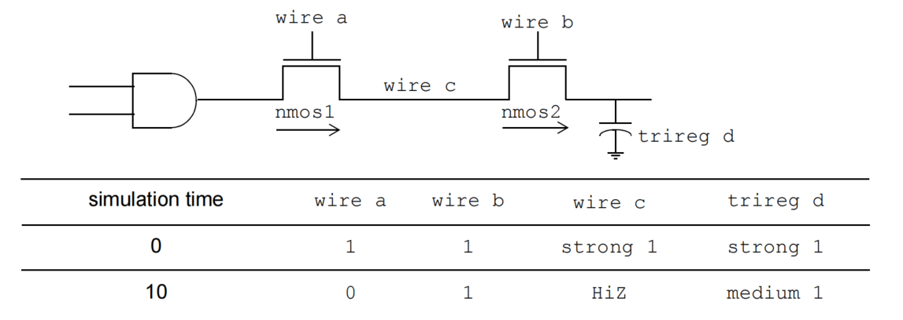
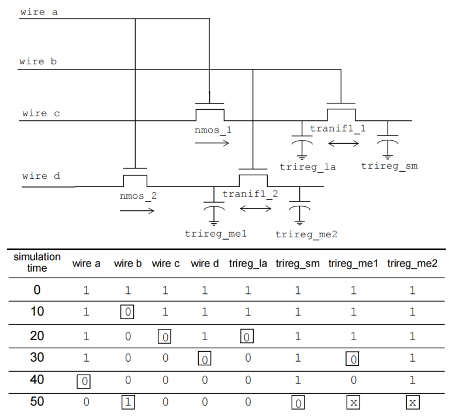
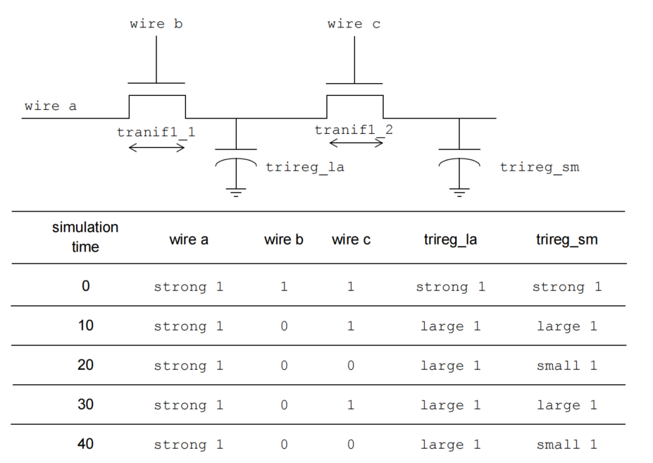

# 6. 数据类型
## 6.1 概述
本章描述以下内容：
 - SystemVerilog 逻辑值和强度集
 - 线网声明
 - 单变量声明
 - 常量
 - 数据的范围和生命周期
 - 类型兼容性
 - 类型运算符和类型转换

## 6.2 数据类型和数据对象
SystemVerilog 区分对象和其数据类型。数据类型是一组值和可以对这些值执行的操作的集合。数据类型可用于声明数据对象或定义从其他数据类型构造的用户定义数据类型。数据对象是一个具有数据值和与之关联的数据类型的命名实体，例如参数、变量或线网。

## 6.3 值集
### 6.3.1 逻辑值
SystemVerilog 值集包括以下四个基本值：
 - `0`——表示逻辑零或假条件
 - `1`——表示逻辑一或真条件
 - `x`——表示未知逻辑值
 - `z`——表示高阻态

`0` 和 `1` 是逻辑互补值。

当 `z` 值出现在门的输入处或在表达式中遇到时，通常的效果与 `x` 值相同。值得注意的例外是可以传递 `z` 值的金属氧化物半导体（MOS）原语。

这种原始数据类型的名称是 `logic`。此名称可用于声明对象和从 4 状态数据类型构造其他数据类型。SystemVerilog 的几种数据类型是 4 状态类型，可以存储所有四个逻辑值。4 状态向量的所有位都可以独立设置为四个基本值之一。有些 SystemVerilog 数据类型是 2 状态的，每个向量的位中只存储 0 或 1 值。其他例外是事件类型（见 6.17），它没有存储，以及实数类型（见 6.12）。

### 6.3.2 强度
语言除了线网的基本值信息还包括 *强度* 信息。这在第 28 章中详细描述。与线网的位相关联的附加强度信息不被视为数据类型的一部分。

在线网声明中可以指定两种类型的强度，如下所示：
 - 只有在声明 `trireg` 类型的线网时才应使用 *电荷强度*。
 - 只有在将连续赋值放置在声明该线网的语句中时才应使用 *驱动强度*。

门声明也可以指定驱动强度。有关门和强度的更多信息，请参见第 28 章。

#### 6.3.2.1 电荷强度
电荷强度规范仅应与 `trireg` 线网一起使用。`trireg` 线网应用于模拟电荷存储；电荷强度应指定由以下关键字之一指示的电容的相对大小：
 - `small`
 - `medium`
 - `large`

`trireg` 线网的默认电荷强度应为 `medium`。

`trireg` 线网可以模拟随时间衰减的电荷存储节点。电荷衰减的仿真时间应在 `trireg` 线网的延迟规范中指定（见 28.16.2）。

例如：
```verilog
    trireg a; // 电荷强度为中等的 `trireg` 线网
    trireg (large) #(0,0,50) cap1; // 电荷强度为大的 `trireg` 线网，电荷衰减时间为 50 个时间单位
    trireg (small) signed [3:0] cap2; // 电荷强度为小的 4 位有符号 `trireg` 向量
```

#### 6.3.2.2 驱动强度
驱动强度规范允许在声明该线网的语句中将连续赋值放置在线网上。有关线网驱动强度属性的详细信息，请参见第 28 章。

## 6.4 单一和聚合类型
数据类型分为 *单一* 和 *聚合* 两类。单一类型应为除未打包结构、未打包联合或未打包数组（见 7.4 数组）之外的任何数据类型。聚合类型应为未打包结构、未打包联合或未打包数组数据类型。单一变量或表达式表示单个值、符号或句柄。聚合表达式和变量表示一组单一值的集合。整数类型（见 6.11.1）始终为单一类型，即使它们可以切片为多个单一值。*字符串* 数据类型是单一类型，即使字符串可以类似于字节的未打包数组进行索引。

这些类别的定义是为了使运算符和函数可以简单地将这些数据类型作为一个集体组进行引用。例如，一些函数会递归地进入聚合变量，直到达到单一值，然后对每个单一值执行操作。

虽然类是一种类型，但没有直接的类类型变量或表达式，只有单一的类对象句柄。因此，类无需以这种方式分类（见第 8 章关于类的内容）。

## 6.5 线网和变量
数据对象分为两大组：变量和线网。这两组在赋值和保存值的方式上有所不同。

线网可以由一个或多个连续赋值、原语输出或通过模块端口进行赋值。多个驱动的结果值由线网类型的解析函数确定。线网不能被过程性地赋值。如果一个端口的一侧的线网由另一侧的变量驱动，那么就暗含了一个连续赋值。`force` 语句可以覆盖线网的值。释放后，线网返回到解析值。

变量可以由一个或多个过程性语句（包括过程性连续赋值）进行赋值。最后一次写入决定值。或者，变量可以由一个连续赋值或一个端口进行赋值。

变量可以是其他类型的打包或未打包聚合（见 7.4 打包和未打包类型）。对独立元素进行多次赋值是独立检查的。独立元素包括结构的不同成员或数组的不同元素。打包类型的每个位也是一个独立元素。因此，在打包类型的聚合中，聚合中的每个位都是一个独立元素。

左侧包含切片的赋值被视为对整个切片的单个赋值。因此，一个结构或数组可以有一个元素被过程性赋值，另一个元素被连续赋值。并且结构或数组的元素可以被多个连续赋值赋值，只要每个元素都不被多个连续赋值覆盖。

确切的规则是，对于变量的最长静态前缀的扩展中的任何项进行多次连续赋值或过程性和连续赋值的混合写入是错误的（见 11.5.3 关于最长静态前缀的定义）。

例如，假设以下结构声明：
```verilog
struct {
    bit [7:0] A;
    bit [7:0] B;
    byte C;
} abc;
```

以下语句是合法的对 `struct` `abc` 的赋值：
```verilog
assign abc.C = sel ? 8'hBE : 8'hEF;
not (abc.A[0],abc.B[0]),
    (abc.A[1],abc.B[1]),
    (abc.A[2],abc.B[2]),
    (abc.A[3],abc.B[3]);
always @(posedge clk) abc.B <= abc.B + 1;
```

以下额外的语句是对结构 `abc` 的非法赋值：
```verilog
// 对 abc.C 进行多次连续赋值
assign abc.C = sel ? 8'hDE : 8'hED;
// 混合连续和过程性赋值给 abc.A[3]
always @(posedge clk) abc.A[7:3] <= !abc.B[7:3];
```

对于上述规则，声明的变量初始化或过程性连续赋值被视为过程性赋值。`force` 语句覆盖过程性赋值，过程性赋值覆盖正常赋值。`force` 语句既不是连续赋值也不是过程性赋值。

当一个变量连接到输入端口声明时，将暗含一个连续赋值。这使得对一个声明为输入端口的变量的赋值非法。当一个变量连接到实例的输出端口时，将暗含一个连续赋值。这使得将一个连接到实例的输出端口的变量进行额外的过程性或连续赋值非法。

变量不能连接到 `inout` 端口的任一侧。变量可以通过 `ref` 端口类型在端口之间共享。有关端口和端口连接规则的更多信息，请参见 23.3.3。

如果连续赋值可能向变量驱动除 `St0`、`St1`、`StX` 或 `HiZ` 之外的强度，则编译器可以发出警告。在任何情况下，将应用自动类型转换到赋值，并丢失强度。

与线网不同，变量不能在其声明的一部分具有隐式连续赋值。声明变量的赋值是变量初始化，而不是连续赋值。

例如：
```verilog
wire w = vara & varb; // 具有连续赋值的线网
logic v = consta & constb; // 具有初始化的变量
logic vw; // 没有初始赋值
assign vw = vara & varb; // 对变量的连续赋值
real circ;
assign circ = 2.0 * PI * R; // 对变量的连续赋值
```

数据在使用之前必须声明，除了隐式线网（见 6.10）。

在一个命名空间（见 3.13）中，不得重新声明已由线网、变量或其他声明声明的名称。

## 6.6 线网类型
有两种不同类型的线网：内置和用户定义。*线网* 类型可以表示结构实体之间的物理连接，例如门。线网的值不应存储（除非是 `trireg` 线网）。相反，它的值应由其驱动器的值确定，例如连续赋值或门。这些构造的定义见第 10 章和第 28 章。如果没有驱动器连接到线网，则其值应为高阻态（`z`），除非线网是 `trireg`，在这种情况下，它应保持先前驱动的值。

内置线网类型有几种不同类型，如表 6-1 所示。

表 6-1—内置线网类型
| wire | tri | tri0 | supply0 |
| ---- | --- | ---- | ------- |
| wand | triand | tri1 | supply1 |
| wor | trior | trireg | uwire |

### 6.6.1 wire 和 tri 网
*wire* 和 *tri* 网连接元素。网类型 `wire` 和 `tri` 在语法和功能上应相同；提供两个名称，以便网的名称可以指示该模型中网的目的。`wire` 网可用于由单个门或连续赋值驱动的网。`tri` 网类型可用于多个驱动器驱动网的情况。

在线网或 tri 网上的多个来源的逻辑冲突导致 x（未知）值。

表 6-2 是解决 `wire` 和 `tri` 网上多个驱动器的真值表。它假定两个驱动器的强度相等。有关逻辑强度建模的讨论，请参见 28.11。

表 6-2——wire 和 tri 网的真值表
| wire/tri | 0 | 1 | x | z |
| ------- | - | - | - | - |
| 0 | 0 | x | x | 0 |
| 1 | x | 1 | 1 | x |
| x | x | x | x | x |
| z | 0 | 1 | x | z |

### 6.6.2 无法解析的网
*uwire* 网是无法解析或单驱动器线网，用于模拟只允许单个驱动器的网。`uwire` 类型可用于强制执行此限制。将 uwire 网的任何位连接到多个驱动器将是一个错误。将 uwire 网连接到双向传递开关的双向端口将是一个错误。

在 23.3.3.6 中的端口连接规则在整个网层次结构中强制执行此限制，否则将发出警告。

### 6.6.3 有线网
*wired* 网是 `wor`、`wand`、`trior` 和 `triand` 类型，用于模拟有线逻辑配置。wired 网使用不同的真值表来解决多个驱动器驱动同一网时产生的冲突。`wor` 和 `trior` 网应创建 *有线* 或配置，以便当任何驱动器为 1 时，网的结果值为 1。`wand` 和 `triand` 网应创建有线和配置，以便如果任何驱动器为 0，则网的值为 0。

线网类型 `wor` 和 `trior` 在语法和功能上应相同。线网类型 `wand` 和 `triand` 在语法和功能上应相同。表 6-3 和表 6-4 给出了有线网的真值表，假设两个驱动器的强度相等。有关逻辑强度建模的讨论，请参见 28.11。

表 6-3——wand 和 triand 网的真值表
| wand/triand | 0 | 1 | x | z |
| ----------- | - | - | - | - |
| 0 | 0 | 0 | 0 | 0 |
| 1 | 0 | 1 | x | 1 |
| x | 0 | x | x | x |
| z | 0 | 1 | x | z |

表 6-4——wor 和 trior 网的真值表
| wor/trior | 0 | 1 | x | z |
| --------- | - | - | - | - |
| 0 | 0 | 1 | x | 0 |
| 1 | 1 | 1 | 1 | 1 |
| x | x | 1 | x | x |
| z | 0 | 1 | x | z |

### 6.6.4 Trireg 网
*trireg* 网存储一个值，用于模拟电荷存储节点。trireg 网可以处于两种状态之一，如下所示：
 - *驱动状态*：当 `trireg` 网的至少一个驱动器的值为 1、0 或 x 时，解析值传播到 `trireg` 网中，并且是 `trireg` 网的驱动值。
 - *电容状态*：当 `trireg` 网的所有驱动器都处于高阻态值（z）时，`trireg` 网保留其上次驱动的值；高阻态值不会从驱动器传播到 `trireg`。

`trireg` 网在电容状态下的值强度可以是 `small`、`medium` 或 `large`，具体取决于在 `trireg` 网的声明中指定的大小。`trireg` 网在驱动状态下的值强度可以是 `supply`、`strong`、`pull`、或 `weak`，具体取决于驱动器的强度。

例如，图 6-1 显示了包括 `medium`大小的 `trireg` 网、其驱动器和仿真结果的原理图。


图 6-1——trireg 和它的驱动的仿真值

 - a) 在仿真时间 0，线网 a 和线网 b 的值为 1。具有 `strong` 强度的值 1 从与门通过连接到线网 c 的 nmos 开关传播到 `trireg` 网 d。
 - b) 在仿真时间 10，线网 a 的值更改为 0，将线网 c 从与门断开。当线网 c 不再连接到与门时，线网 c 的值更改为高阻态。线网 b 的值保持为 1，因此线网 c 通过 nmos2 开关仍然连接到 `trireg` 网 d。高阻态值不会从线网 c 传播到 `trireg` 网 d。相反，`trireg` 网 d 进入电容状态，存储其上次驱动的值 1。它以 `medium` 强度存储 1。

#### 6.6.4.1 电容网络
电容网络是两个或多个 `trireg` 网之间的连接。在电容网络中，处于电容状态的 `trireg` 网之间可以传播逻辑和强度值。

例如，图 6-2 显示了一个电容网络，其中 `trireg` 网处于电容状态，其逻辑值更改了其他 `trireg` 网的逻辑值。

图 6-2——电容网络的仿真结果

在图 6-2 中，`trireg_la` 网的电容强度为 `large`，`trireg_me1` 和 `trireg_me2` 网的电容强度为 `medium`，`trireg_sm` 网的电容强度为 `small`。仿真报告以下事件序列：
 - a) 在仿真时间 0，线网 a 和线网 b 的值为 1。线网 c 驱动值 1 到 `trireg_la` 和 `trireg_sm`；线网 d 驱动值 1 到 `trireg_me1` 和 `trireg_me2`。
 - b) 在仿真时间 10，线网 b 的值更改为 0，将 `trireg_sm` 和 `trireg_me2` 从其驱动器断开。这些 `trireg` 网进入电容状态，并存储其上次驱动的值 1。
 - c) 在仿真时间 20，线网 c 驱动值 0 到 `trireg_la`。
 - d) 在仿真时间 30，线网 d 驱动值 0 到 `trireg_me1`。
 - e) 在仿真时间 40，线网 a 的值更改为 0，将 `trireg_la` 和 `trireg_me1` 从其驱动器断开。这些 `trireg` 网进入电容状态，并存储值 0。
 - f) 在仿真时间 50，线网 b 的值更改为 1。
 - g) 线网 b 的值更改后，将 `trireg_sm` 连接到 `trireg_la`；这些 `trireg` 网的大小不同，存储了不同的值。这种连接导致较小的 `trireg` 网存储较大 `trireg` 网的值，因此 `trireg_sm` 现在存储值 0。

线网 b 的值更改还将 `trireg_me1` 连接到 `trireg_me2`；这些 `trireg` 网的大小相同，存储了不同的值。连接导致 `trireg_me1` 和 `trireg_me2` 都更改为 x。

在电容网络中，电荷强度从较大的 `trireg` 网传播到较小的 `trireg` 网。图 6-3 显示了一个电容网络及其仿真结果。

图 6-3——电荷共享的仿真结果

在图 6-3 中，`trireg_la` 的电容强度是大，`trireg_sm` 的电容强度是小。仿真报告以下结果：
 - a) 在仿真时间 0，线网 a、线网 b 和线网 c 的值为 1。线网 a 驱动强值 1 到 `trireg_la` 和 `trireg_sm`。
 - b) 在仿真时间 10，线网 b 的值更改为 0，将 `trireg_la` 和 `trireg_sm` 从线网 a 断开。`trireg_la` 和 `trireg_sm` 进入电容状态。这两个 `trireg` 网通过 tranif1_2 保持连接，因此它们共享 `trireg_la` 的大电荷。
 - c) 在仿真时间 20，线网 c 的值更改为 0，将 `trireg_sm` 从 `trireg_la` 断开。`trireg_sm` 不再共享 `trireg_la` 的大电荷，现在存储小电荷。
 - d) 在仿真时间 30，线网 c 的值更改为 1，连接两个 `trireg` 网。这些 `trireg` 网现在共享相同的电荷。
 - e) 在仿真时间 40，线网 c 的值再次更改为 0，将 `trireg_sm` 从 `trireg_la` 断开。`trireg_sm` 不再共享 `trireg_la` 的大电荷，现在存储小电荷。

#### 6.6.4.2 理想电容状态和电荷衰减
`trireg` 网可以永久保留其值，或者其电荷可以随时间衰减。电荷衰减的仿真时间在 `trireg` 网的延迟规范中指定。有关电荷衰减的解释，请参见 28.16.2。

### 6.6.5 Tri0 和 tri1 网
`tri0` 和 `tri1` 网建模在其上有电阻 *下拉* 和电阻 *上拉* 器件的网。`tri0` 网等效于一个由连续 0 值的 `pull` 驱动的线网。`tri1` 网等效于一个由连续 1 值的 `pull` 驱动的线网。

当没有驱动器驱动 `tri0` 网时，其值为 0，强度为 `pull` 。当没有驱动器驱动 `tri1` 网时，其值为 1，强度为 `pull` 。当 `tri0` 或 `tri1` 网上有驱动器时，驱动器与隐式驱动在网上驱动的 `pull` 值相结合，以确定网的值。有关逻辑强度建模的讨论，请参见 28.11。

表 6-5 和表 6-6 是建模 `tri0` 和 `tri1` 网上多个强度为 `strong` 的驱动器的真值表。除非两个驱动器都是 z，否则网上的结果值具有强度强，否则网上的结果值具有 `pull` 强度。

表 6-5——tri0 网的真值表
| tri0 | 0 | 1 | x | z |
| ---- | - | - | - | - |
| 0 | 0 | x | x | 0 |
| 1 | x | 1 | x | 1 |
| x | x | x | x | x |
| z | 0 | 1 | x | 0 |

表 6-6——tri1 网的真值表
| tri1 | 0 | 1 | x | z |
| ---- | - | - | - | - |
| 0 | 0 | x | x | 0 |
| 1 | x | 1 | x | 1 |
| x | x | x | x | x |
| z | 0 | 1 | x | 1 |

### 6.6.6 供应网
供应网 `supply0` 和 `supply1` 可用于建模电路中的电源。这些网应具有 `supply` 强度。

### 6.6.7 用户定义的网类型
用户定义的 `nettype` 允许用户描述线网中的更一般的抽象值，包括其解析函数。`nettype` 类似于某些方面的 `typedef`，但只能在声明网时使用。它为特定数据类型提供了一个名称，以及可选的关联解析函数。

网类型声明的语法如 Syntax 6-1 所示。
```verilog
net_type_declaration ::= // from A.2.1.3
nettype data_type net_type_identifier 
[ with [ package_scope | class_scope ] tf_identifier ] ;
| nettype [ package_scope | class_scope ] net_type_identifier net_type_identifier ;
```

语法 6-1—网类型声明的语法（摘自附录 A）

使用 `nettype` 声明的网使用该数据类型，如果指定，则使用关联的解析函数。用户定义的 `nettype` 需要一个显式的数据类型。

对于用户定义的 `nettype`，对网的数据类型有一些限制。网的数据类型应为以下数据类型之一：
 - 4 状态整数类型，包括打包数组、打包结构或联合。
 - 2 状态整数类型，包括具有 2 状态数据类型成员的打包数组、打包结构或联合。
 - 实数或 shortreal 类型。
 - 固定大小的未打包数组、未打包结构或联合，其中每个元素都是用户定义的网类型的有效数据类型。

`nettype` 声明的第二种形式是为现有网类型创建另一个名称。

原子网是其值作为整体更新和解析的网。使用用户定义的 `nettype` 声明的网是原子网。同样，逻辑网是原子网，但逻辑向量网不是原子网，因为每个逻辑元素都是独立解析和更新的。虽然原子网可以具有单一或聚合值，但每个原子网都旨在描述设计中的单个连接点。

用户定义的 `nettype` 的解析由 SystemVerilog 函数声明指定。如果指定了解析函数，则当网的驱动器的值更改时，在 Active（或 Reactive）区域的网上安排更新事件。当更新事件成熟时，模拟器调用与该网类型关联的解析函数来计算网的值，该值是从驱动器的值计算而来的。函数的返回类型应与 `nettype` 的数据类型匹配。函数应接受任意数量的驱动器，因为网的不同实例可能连接到不同数量的驱动器。驱动器的值的任何更改都应触发与该网类型关联的解析函数的评估。

`nettype` 的解析函数应为自动的（或不保留状态信息）并且没有副作用。解析函数不应调整动态数组输入参数的大小，也不应写入动态数组输入参数的任何部分。虽然类函数方法可以用作解析函数，但这种函数应该是类静态方法，因为方法调用发生在没有类对象参与的调用上下文中。这种方法的参数化变体可以通过使用参数化类方法来创建，如 13.8 中所述。

两种不同的网类型可以使用相同的数据类型，但具有不同的解析函数。可以声明没有解析函数的 `nettype`，在这种情况下，对于具有该 `nettype` 的网具有多个驱动器是错误的。

由于调度区域内的不确定性，如果在调度区域内有多个驱动器更新，则可能会多次评估解析函数。

`force` 语句可以覆盖用户定义 `nettype` 的网的值。释放后，网返回到解析值。

```verilog
// 用户定义的数据类型 T
typedef struct {
    real field1;
    bit field2;
} T;

// 用户定义的解析函数 Tsum
function automatic T Tsum (input T driver[]);
    Tsum.field1 = 0.0;
    foreach (driver[i])
        Tsum.field1 += driver[i].field1;
    endfunction

nettype T wT; // 一个未解析的数据类型为 T 的 wT 网
// 一个数据类型为 T 的 wTsum 网，解析函数为 Tsum
nettype T wTsum with Tsum;

// 用户定义的数据类型 TR
typedef real TR[5];
// 一个未解析的数据类型为实数数组的 wTR 网
nettype TR wTR;

// 为 nettype wTsum 声明另一个名称 nettypeid2
nettype wTsum nettypeid2;
```

以下示例显示了如何使用参数化类定义与类静态方法来参数化用户定义 `nettype` 的数据类型。

```verilog
class Base #(parameter p = 1);
    typedef struct {
        real r;
        bit[p-1:0] data;
    } T;
    static function T Tsum (input T driver[]);
        Tsum.r = 0.0;
        Tsum.data = 0;
        foreach (driver[i])
            Tsum.data += driver[i].data;
        Tsum.r = $itor(Tsum.data);
    endfunction
endclass

typedef Base#(32) MyBaseT;
nettype MyBaseT::T narrowTsum with MyBaseT::Tsum;

typedef Base#(64) MyBaseType;
nettype MyBaseType::T wideTsum with MyBaseType::Tsum;

narrowTsum net1; // 数据宽度为 32 位
wideTsum net2; // 数据宽度为 64 位
```

### 6.6.8 通用互连
在 SystemVerilog 中，可以使用网类型和配置来创建具有不同抽象级别的设计模型。为了支持主要指定设计元素实例和设计元素之间的网连接的网表设计，SystemVerilog 定义了一种通用形式的网。这种通用网允许将网连接的规范与连接的类型分离。

声明为 `interconnect`（互连网或端口）的网或端口表示无类型或通用网。这种网或端口仅能表达网端口和终端连接，并且不得在任何过程性上下文或任何连续或过程性连续赋值中使用。`interconnect` 网或端口不得在除了所有网或端口都是 `interconnect` 的 net_lvalue 表达式之外的任何表达式中使用。即使数组中的不同位被解析为不同的网类型，也应将 `interconnect` 数组视为有效，如下面的示例所示。可以在 `interconnect` net_lvalue 中指定 net_alias 语句。有关 `interconnect` 网的端口和终端连接规则，请参见 23.3.3.7.1 和 23.3.3.7.2。

```verilog
package NetsPkg;
    nettype real realNet;
endpackage : NetsPkg

module top();
    interconnect [0:1] iBus;
    lDriver l1(iBus[0]);
    rDriver r1(iBus[1]);
    rlMod m1(iBus);
endmodule : top

module lDriver(output wire logic out);
endmodule : lDriver

module rDriver
    import NetsPkg::*;
    (output realNet out);
endmodule : rDriver

module rlMod(input interconnect [0:1] iBus);
    lMod l1(iBus[0]);
    rMod r1(iBus[1]);
endmodule : rlMod
```

以下简单示例用于说明 `interconnect` 网的有用性。该示例包含一个顶层模块（top），该模块实例化一个激励模块（driver）和一个比较器模块（cmp）。此配置旨在比较两个元素并确定它们是否相等。根据两个不同版本的配置，由两个不同的 `config` 块描述：一个用于 `real` 值，一个用于 `logic` 值。通过使用无类型的 `interconnect` 网，我们可以在不必更改测试台本本身的情况下，使用相同的测试台本与两个配置。`interconnect` 网 aBus 从其连接的类型中获取数据类型。

```verilog
<file lib.map>
library realLib *.svr;
library logicLib *.sv;

config cfgReal;
    design logicLib.top; 
    default liblist realLib logicLib;
endconfig

config cfgLogic; 
    design logicLib.top; 
    default liblist logicLib realLib;
endconfig

<file top.sv>
module top();
    interconnect [0:3] [0:1] aBus;
    logic [0:3] dBus;
    driver driverArray[0:3](aBus);
    cmp cmpArray[0:3](aBus,rst,dBus);
endmodule : top

<file nets.pkg>
package NetsPkg;
    nettype real realNet;
endpackage : NetsPkg

<file driver.svr>
module driver
    import NetsPkg::*; 
    #(parameter int delay = 30,
                int iterations = 256)
    (output realNet [0:1] out);
    timeunit 1ns / 1ps;
    real outR[1:0];
    assign out = outR;
    initial begin
        outR[0] = 0.0;
        outR[1] = 3.3;
        for (int i = 0; i < iterations; i++) begin
            #delay outR[0] += 0.2;
            outR[1] -= 0.2;
        end
    end
endmodule : driver

<file driver.sv>
module driver #(parameter int delay = 30,
                          int iterations = 256)
               (output wire logic [0:1] out);
    timeunit 1ns / 1ps;
    logic [0:1] outvar;

    assign out = outvar;
    
    initial begin
        outvar = '0;
        for (int i = 0; i < iterations; i++)
            #delay outvar++;
    end
endmodule : driver

<file cmp.svr>
module cmp
    import NetsPkg::*; 
    #(parameter real hyst = 0.65)
     (input realNet [0:1] inA,
     input logic rst,
     output logic out);
    timeunit 1ns / 1ps;
    real updatePeriod = 100.0;

    initial out = 1’b0;

    always #updatePeriod begin
        if (rst) out <= 1’b0;
        else if (inA[0] > inA[1]) out <= 1’b1;
        else if (inA[0] < inA[1] - hyst) out <= 1’b0;
    end
endmodule : cmp
<file cmp.sv>
module cmp #(parameter real hyst = 0.65)
            (input wire logic [0:1] inA,
    input logic rst,
    output logic out);

    initial out = 1’b0;

    always @(inA, rst) begin
        if (rst) out <= 1'b0;
        else if (inA[0] & ~inA[1]) out <= 1'b1;
        else out <= 1'b0;
    end
endmodule : cmp
```

## 6.7 线网声明
线网声明的语法如 Syntax 6-2 所示。

---
```verilog
net_declaration12 ::= // from A.2.1.3
net_type [ drive_strength | charge_strength ] [ vectored | scalared ] 
data_type_or_implicit [ delay3 ] list_of_net_decl_assignments ;
| net_type_identifier [ delay_control ] 
list_of_net_decl_assignments ;
| interconnect implicit_data_type [ # delay_value ] 
net_identifier { unpacked_dimension } 
[ , net_identifier { unpacked_dimension }] ;
net_type ::= // from A.2.2.1
supply0 | supply1 | tri | triand | trior | trireg | tri0 | tri1 | uwire | wire | wand | wor
drive_strength ::= // from A.2.2.2
( strength0 , strength1 )
| ( strength1 , strength0 )
| ( strength0 , highz1 )
| ( strength1 , highz0 )
| ( highz0 , strength1 )
| ( highz1 , strength0 )
strength0 ::= supply0 | strong0 | pull0 | weak0
strength1 ::= supply1 | strong1 | pull1 | weak1
charge_strength ::= ( small ) | ( medium ) | ( large )
delay3 ::= // from A.2.2.3
# delay_value | # ( mintypmax_expression [ , mintypmax_expression [ , mintypmax_expression ] ] )
delay2 ::= # delay_value | # ( mintypmax_expression [ , mintypmax_expression ] )
delay_value ::= 
unsigned_number 
| real_number 
| ps_identifier 
| time_literal 
| 1step
list_of_net_decl_assignments ::= net_decl_assignment { , net_decl_assignment } // from A.2.3
net_decl_assignment ::= net_identifier { unpacked_dimension } [ = expression ] // from A.2.4
---
```
语法 6-2—网声明的语法（摘自附录 A）

### 6.7.1 具有内置网类型的线网声明
没有赋值且其 `nettype` 不是用户定义 `nettype` 的网声明在本节中描述。具有赋值的线网声明在第 10 章中描述。

线网声明以确定线网值如何解析的线网类型开始。声明可以包括可选信息，如延迟值、驱动或电荷强度和数据类型。

如果一组线网共享相同的特性，则可以在同一声明语句中声明它们。

任何 4 状态数据类型都可以用于声明线网。例如：
```verilog
trireg (large) logic #(0,0,0) cap1;
typedef logic [31:0] addressT;
wire addressT w1;
wire struct packed { logic ecc; logic [7:0] data; } memsig;
```

如果在线网声明中未指定数据类型，或者仅指定了范围和/或签名，则网的数据类型将隐式声明为 `logic`。例如：
```verilog
wire w; // 等效于 "wire logic w;"
wire [15:0] ww; // 等效于 "wire logic [15:0] ww;"
```

作为 `interconnect` 声明的网应：
 - 没有数据类型，但可以有可选的打包或未打包维度；
 - 不指定驱动强度或电荷强度；
 - 不具有赋值表达式；
 - 指定最多一个延迟值。

对网的数据类型有一些限制。网的有效数据类型应为以下数据类型之一：
    - 4 状态整数类型，包括打包数组或打包结构。
    - 固定大小的未打包数组或未打包结构，其中每个元素都是网的有效数据类型。

这种递归定义的效果是，网完全由 4 状态位组成，并相应地处理。除了信号值之外，网的每个位应具有额外的强度信息。当信号位组合时，将根据 28.12 中描述的方式确定结果信号的强度和值。

在网或端口声明中使用 `reg` 关键字的词法限制。线网类型关键字后面不应直接跟随 `reg` 关键字。因此，以下声明是错误的：
```verilog
tri reg r;
inout wire reg p;
```

如果在网类型关键字和 `reg` 关键字之间有词法元素，则可以在网或端口声明中使用 `reg` 关键字。

线网的默认初始化值应为 z 值。具有驱动器的网应假定其驱动器的输出值。`trireg` 网是一个例外。`trireg` 网的默认值应为 x 值，其强度在网声明中指定（`small`、`medium` 或 `large`）。

如 6.6.8 中所述，`interconnect` 在其声明和使用方面受到限制。以下是一些合法和非法的 `interconnect` 声明示例：
```verilog
interconnect w1; // 合法
interconnect [3:0] w2; // 合法
interconnect [3:0] w3 [1:0]; // 合法
interconnect logic [3:0] w4; // 非法 – 指定了数据类型
interconnect #(1,2,3) w5; // 非法 – 仅允许一个延迟
assign w1 = 1; // 非法 – 不允许在连续赋值中
initial $display(w1); // 非法 – 不允许在过程上下文中
```

### 6.7.2 具有用户定义网类型的网声明
用户定义的网类型允许用户描述线网中的更一般的抽象值。网类型声明使用数据类型和该网类型的任何关联解析函数。

```verilog
// 未解析的网类型 wT，其数据类型为 T
// 有关数据类型 T 的声明，请参见 6.6.7 中的示例
nettype T wT;

// 一个数据类型为 T 和解析函数为 Tsum 的 wTsum 网类型
// 有关 Tsum 的声明，请参见 6.6.7 中的示例
nettype T wTsum with Tsum;

// 一个未解析的 wT 网
wT w1;

// 一个数组，每个网元素都是未解析的 wT 网类型
wT w2[8];

// 一个解析的 wTsum 网类型和解析函数为 Tsum
wTsum w3;

// 一个数组，每个网都是解析的 wTsum 网类型
wTsum w4[8];

// 用户定义的数据类型 TR，它是一个实数数组
typedef real TR[5];

// 一个未解析的 wTR 网类型，其数据类型为 TR
nettype TR wTR;

// 一个未解析的 wTR 网类型和数据类型 TR
wTR w5;

// 一个数组，每个网都有未解析的 wTR 网类型和数据类型 TR
wTR w6[8];
```

### 6.7.3 使用用户定义网类型初始化网
用户定义网类型的任何网的解析函数在时间零时至少一次被激活。即使在时间零时没有驱动器或驱动器上的值更改，也会发生此激活。这种激活即使对于没有驱动器或驱动器上的值更改的网也会发生。由于解析函数的实际评估受调度的不确定性影响，因此不能假设在保证调用之前或之后的时间零时的驱动器值的状态，这可能在时间零时之前或之后发生任何驱动器更改。

用户定义网类型的任何网的初始值应在启动任何初始或始终过程之前设置，并在激活保证时间零时解析调用之前设置。用户定义网类型的网的默认初始化值应为数据类型定义的默认值。表 6-7 定义了变量的数据类型的默认值，如果没有提供初始化程序；这些默认值也适用于用户定义网类型的网的有效数据类型。对于数据类型为结构类型的网，应用结构内成员的任何初始化表达式。

注意——用户定义网类型的逻辑网的默认值为 X。这个默认值意味着如果逻辑数据类型的位没有驱动器，则它的值将是 X，而不是 Z。对于具有解析网类型的网，如果没有驱动器，则值将由执行带有空驱动器值数组的解析函数确定。

## 6.8 变量声明
*变量* 是数据存储元素的抽象。变量应在一个赋值到下一个赋值之间存储一个值。在过程中的赋值语句充当触发器，改变数据存储元素中的值。

变量声明的语法如 Syntax 6-3 所示。

---
```verilog
data_declaration10 ::= // from A.2.1.3
[ const ] [ var ] [ lifetime ] data_type_or_implicit list_of_variable_decl_assignments ;
| type_declaration 
... 
data_type ::= // from A.2.2.1
integer_vector_type [ signing ] { packed_dimension } 
| integer_atom_type [ signing ] 
| non_integer_type 
| struct_union [ packed [ signing ] ] { struct_union_member { struct_union_member } }
{ packed_dimension }13 
| enum [ enum_base_type ] { enum_name_declaration { , enum_name_declaration } }
{ packed_dimension } 
| string
| chandle
| virtual [ interface ] interface_identifier [ parameter_value_assignment ] [ . modport_identifier ] 
| [ class_scope | package_scope ] type_identifier { packed_dimension } 
| class_type 
| event
| ps_covergroup_identifier 
| type_reference14
integer_type ::= integer_vector_type | integer_atom_type 
integer_atom_type ::= byte | shortint | int | longint | integer | time
integer_vector_type ::= bit | logic | reg
non_integer_type ::= shortreal | real | realtime
signing ::= signed | unsigned
simple_type ::= integer_type | non_integer_type | ps_type_identifier | ps_parameter_identifier 
data_type_or_void ::= data_type | void
IEEE Std 1800-2012
IEEE STANDARD FOR SYSTEMVERILOG—UNIFIED HARDWARE DESIGN, SPECIFICATION, AND 
VERIFICATION LANGUAGE
65
Copyright © 2013 IEEE. All rights reserved.
variable_decl_assignment ::= // from A.2.4
variable_identifier { variable_dimension } [ = expression ] 
| dynamic_array_variable_identifier unsized_dimension { variable_dimension } 
[ = dynamic_array_new ] 
| class_variable_identifier [ = class_new ] 
// 10) 在不在过程上下文中的 data_declaration 中，使用 automatic 关键字是非法的。在 data_declaration 中，除非使用 var 关键字，否则不得省略显式的 data_type。
// 13) 当 packed 维度与 struct 或 union 关键字一起使用时，也应使用 packed 关键字。
// 14) 在网声明中使用 type_reference 时，应在 net 类型关键字之前使用 net 类型关键字；在变量声明中使用 type_reference 时，应在 var 关键字之前使用 var 关键字。
```
---
语法 6-3—变量声明的语法（摘自附录 A）

变量声明的一种形式由数据类型后跟一个或多个实例组成。
```verilog
shortint s1, s2[0:9];
```

另一种形式的变量声明以关键字 `var` 开头。在这种情况下，数据类型是可选的。如果未指定数据类型，或者仅指定了范围和/或签名，则数据类型将隐式声明为 `logic`。
```verilog
var byte my_byte; // 等效于 "byte my_byte;"
var v; // 等效于 "var logic v;"
var [15:0] vw; // 等效于 "var logic [15:0] vw;"
var enum bit { clear, error } status;
input var logic data_in;
var reg r;
```

如果一组变量共享相同的特性，则可以在同一声明语句中声明它们。

变量可以在声明中使用初始化程序，例如：
```verilog
int i = 0;
```

将静态变量的初始值设置为变量声明的一部分（包括静态类成员）应在启动任何 initial 或 always 过程之前发生（也请参见 6.21 和 10.5 关于具有静态和自动生命周期的变量初始化）。

注意——在 IEEE Std 1364-2005 中，作为声明的一部分指定的初始化值被执行，就好像在模拟开始后从初始过程中进行了赋值。

初始值不限于简单常量；它们可以包括运行时表达式，包括动态内存分配。例如，可以通过调用其 new 方法（请参见 15.4.1）创建并初始化静态类句柄或邮箱，或者通过调用 `$urandom` 系统任务将静态变量初始化为随机值。这可能需要在运行时进行特殊的预初始化传递。

表 6-7 包含了如果未指定初始化程序的变量的默认值。

表 6-7——变量的默认值
| 类型 | 默认值 |
| ---- | ------ |
| 4-state 整数 | x |
| 2-state 整数 | 0 |
| 实数 | 0.0 |
| 枚举 | 默认枚举值 |
| 字符串 | 空字符串 |
| 事件 | 新事件 |
| 类 | null |
| chandle | null |

线网和变量可以赋值为负数值，但只有有符号类型保留符号的重要性。byte、shortint、int、integer 和 longint 类型默认为有符号类型。其他网和变量类型可以显式声明为有符号类型。有关有符号和无符号网和变量如何由某些运算符处理的描述，请参见 11.4.3.1

## 6.9 向量声明
未指定范围的声明的数据对象被视为 1 位宽，并称为*标量*。使用范围声明的多位数据对象被视为*向量*。向量是标量的打包数组。

### 6.9.1 指定向量
范围说明符（[msb_constant_expression : lsb_constant_expression]）给多位 `reg`、`logic` 或 `bit` 向量中的各个位提供地址。由 *msb* 常量表达式指定的最高有效位是范围中的左值，由 *lsb* 常量表达式指定的最低有效位是范围中的右值。

msb 和 lsb 常量表达式（请参见 11.2.1）可以是任何整数值，包括正数、负数或零。它们不得包含任何未知（x）或高阻态位。lsb 值可以大于、等于或小于 msb 值。

向量应遵守模 2 的 n 次方（2^n）的算术规则，其中 n 是向量中的位数。reg、logic 和 bit 类型的向量应被视为无符号量，除非声明为有符号量或连接到声明为有符号量的端口（请参见 23.3.3.1 和 23.3.3.8）。

示例：
```verilog
wand w; // 一个标量 "wand" 网
tri [15:0] busa; // 一个 16 位总线
trireg (small) storeit; // 一个强度为 small 的电荷存储节点
logic a; // 一个标量变量
logic[3:0] v; // 一个由 v[3]、v[2]、v[1] 和 v[0] 组成的 4 位向量
logic signed [3:0] signed_reg; // 一个范围为 -8 到 7 的 4 位向量
logic [-1:4] b; // 一个 6 位向量
wire w1, w2; // 声明两个网
logic [4:0] x, y, z; // 声明三个 5 位变量
```

实现可以对向量的最大长度设置限制，但该限制至少应为 65536（2^16）位。

实现不需要检测整数操作的溢出。

### 6.9.2 向量线网的可访问性
*vectored* 和 *scalared* 是可选的建议关键字，用于向量网声明。如果实现了这些关键字，则可能会限制对向量网的某些操作。如果使用了关键字 `vectored`，则可能不允许位选择、部分选择和强度规范，并且 PLI 可能会认为网未展开。如果使用了关键字 `scalared`，则应允许网的位选择和部分选择，并且 PLI 应该认为网已展开。

例如：
```verilog
tri1 scalared [63:0] bus64; // 一个将被展开的总线
tri vectored [31:0] data; // 一个可能会被展开的总线
```

## 6.10 隐式声明
语法 6.7 和 6.8 中显示的语法应用于显式声明。在以下情况下，将假定隐式声明一个标量网：
 - 如果一个标识符在端口表达式声明中使用，则将假定一个隐式的默认类型网，其向量宽度为端口表达式声明的向量宽度。有关端口表达式声明的讨论，请参见 23.2.2.1
 - 如果一个标识符在原语实例的终端列表中使用，或者在模块、接口、程序或静态检查器实例的端口连接列表中使用（但不在过程检查器实例中，请参见 17.3），并且该标识符在实例出现的范围内之前没有被声明，或者在实例出现的范围内之前没有被直接引用的范围中被声明（请参见 23.9），则将假定一个标量网。
 - 如果一个标识符出现在连续赋值语句的左侧，并且该标识符在连续赋值语句出现的范围内之前没有被声明，或者在连续赋值语句出现的范围内之前没有被直接引用的范围中被声明（请参见 23.9），则将假定一个标量网。连续赋值语句的讨论，请参见 10.3。

隐式网声明应属于线网引用出现的范围。例如，如果隐式网是由引用在生成块中声明的，则该网只在该生成块中隐式声明。从生成块外部或在同一模块中的另一个生成块中对网的后续引用要么是非法的，要么会创建另一个不同网的隐式声明（取决于引用是否符合上述标准）。有关生成块的信息，请参见第 27 章。

有关控制使用 `` `default_nettype `` 编译器指令隐式声明的网类型的类型的讨论，请参见 22.8。

## 6.11 整数数据类型
SystemVerilog 提供了几种整数数据类型，如表 6-8 所示。

表 6-8——整数数据类型
| 类型 | 描述 |
| ---- | ---- |
| shortint | 2 状态数据类型，16 位有符号整数 |
| int | 2 状态数据类型，32 位有符号整数 |
| longint | 2 状态数据类型，64 位有符号整数 |
| byte | 2 状态数据类型，8 位有符号整数或 ASCII 字符 |
| bit | 2 状态数据类型，用户定义的向量大小，无符号 |
| logic | 4 状态数据类型，用户定义的向量大小，无符号 |
| reg | 4 状态数据类型，用户定义的向量大小，无符号 |
| integer | 4 状态数据类型，32 位有符号整数 |
| time | 4 状态数据类型，64 位无符号整数 |

### 6.11.1 整数类型
术语 *整数* 在本标准中用于指代可以表示单个基本整数数据类型、打包数组、打包结构、打包联合、枚举变量或时间变量的数据类型。

术语 *简单位向量类型* 在本标准中用于指代可以直接表示一维打包位数组的数据类型。表 6-8 中列出的整数类型都是预定义宽度的简单位向量类型。打包结构类型（参见 7.2）和多维打包数组类型（参见 7.4）不是简单位向量类型，但是每个都等效于（参见 6.22.2）某个简单位向量类型，可以轻松地互相转换。

### 6.11.2 2 状态（二值）和 4 状态（四值）数据类型
可以具有未知和高阻态值的类型称为 *4 状态类型*。这些是 `logic`、`reg`、`integer` 和 `time`。其他类型没有未知值，称为 *2 状态类型*，例如 `bit` 和 `int`。

`int` 和 `integer` 之间的区别在于 `int` 是 2 状态类型，而 `integer` 是 4 状态类型。4 状态值具有附加位，用于编码 X 和 Z 状态。2 状态数据类型可以更快地仿真，占用更少的内存，并且在某些设计风格中更受欢迎。

关键字 `reg` 并不总是准确描述用户意图，因为它可能被认为暗示硬件寄存器。关键字 `logic` 是一个更具描述性的术语。`logic` 和 `reg` 表示相同的类型。

从较少位数自动转换为较多位数涉及零扩展（如果无符号）或符号扩展（如果有符号）。从较多位数自动转换为较少位数涉及最高有效位（MSB）的截断。当 4 状态值自动转换为 2 状态值时，任何未知或高阻态位都应转换为零。

### 6.11.3 有符号和无符号整数类型
整数类型使用整数算术，可以是有符号或无符号的。这会影响某些运算符的含义（请参见第 11 章中的运算符和表达式）。

`byte`、`shortint`、`int`、`integer` 和 `longint` 默认为有符号的。`time`、`bit`、`reg` 和 `logic` 默认为无符号的，数组也是如此。可以使用关键字 `signed` 和 `unsigned` 明确定义有符号性。

```verilog
int unsigned ui;
int signed si;
```

## 6.12 real、shortreal 和 realtime 数据类型
`real` 数据类型是 C 语言中的 `double`。`shortreal` 数据类型是 C 语言中的 `float`。`realtime` 声明应与 `real` 声明视为同义，并且可以互换使用。这三种类型的变量统称为 *实数变量*。

### 6.12.1 运算符和实数
在实数和实数变量上使用逻辑或关系运算符的结果是一个单比特标量值。并非所有运算符都可以用于涉及实数和实数变量的表达式（请参见 11.3.1）。实数常量和实数变量在以下情况下也是禁止的：
 - 应用于实数变量的边沿事件控制（posedge、negedge、edge）
 - 实数声明中的位选择或部分选择引用的变量
 - 向量的位选择或部分选择引用的实数索引表达式

### 6.12.2 转换
实数应通过将实数四舍五入到最近的整数来转换为整数，而不是将其截断。当将实数分配给整数时，将发生隐式转换。如果实数的小数部分恰好为 0.5，则应将其远离零四舍五入。

当将表达式分配给实数时，应进行隐式转换。在转换时，网络或变量中的单个位如果为 x 或 z，则在转换时应视为零。

可以使用强制转换（请参见 6.24）或使用系统任务（请参见 20.5）来指定显式转换。

## 6.13 void 数据类型

*void* 数据类型表示不存在的数据。此类型可用于指示函数没有返回值。此类型还可用于标记联合的成员（请参见 7.3.2）。

## 6.14 Chandle 数据类型
*chandle* 数据类型表示使用 DPI（参见第 35 章）传递的指针的存储。该数据类型的值的大小取决于平台，但至少应足够大，以便在运行工具的机器上保存指针。

声明句法如下：
```verilog
chandle variable_name;
```

其中 *variable_name* 是有效的标识符。Chandles 应始终初始化为值 *null*，其在 C 侧的值为 0。Chandles 的使用受到限制，其唯一合法用途如下：
 - 仅在 `chandle` 变量上有效的操作符如下：
   - 与另一个 `chandle` 或 `null` 的相等性（`==`）、不等性（`!=`）
   - 与另一个 `chandle` 或 `null` 的情况相等性（`===`）、不等性（`!==`）（与 `==` 和 `!=` 的语义相同）
 - 可以测试 `chandle` 的布尔值，如果 chandle 为 `null`，则布尔值为 0，否则为 1。
 - 只能对 `chandle` 进行以下赋值：
   - 从另一个 `chandle` 赋值
   - 赋值为 `null`
 - 可以将 chandle 插入到关联数组中（参见 7.8），但是这种关联数组中任何两个条目的相对顺序可能会有所不同，即使是在同一工具的连续运行之间也可能如此。
 - 可以在类中使用 chandle。
 - 可以将 chandle 作为参数传递给子进程。
 - 可以从函数返回 chandle。

Chandles 的使用受到以下限制：
 - 端口不得具有 `chandle` 数据类型。
 - 不得将 chandle 赋值给任何其他类型的变量。
 - 不得如下使用 chandle：
   - 在除本子句允许的情况外的任何表达式中
   - 作为端口
   - 在敏感性列表或事件表达式中
   - 在连续赋值中
   - 在未标记的联合中
   - 在打包类型中

## 6.15 类
类变量可以保存对类对象的句柄。定义类和创建对象在第 8 章中讨论。

## 6.16 字符串数据类型
`string` 数据类型是字符的有序集合。`string` 变量的长度是集合中的字符数。`string` 类型的变量是动态的，因为它们的长度在仿真期间可能会变化。可以通过索引变量来选择读取或写入 `string` 变量的单个字符。`string` 变量的单个字符是 `byte` 类型。

SystemVerilog 还包括一些特殊方法来处理字符串，这些方法在本节中定义。

字符串变量不像字符串字面量（请参见 5.9）那样表示字符串。字符串字面量的行为类似于宽度为 8 位的多位数组。将字符串字面量分配给不同大小的整数变量时，字符串字面量将被截断为变量的大小，或者根据需要在左侧填充零。使用 `string` 数据类型而不是整数变量时，字符串可以是任意长度，不会发生截断。将字符串字面量分配给 `string` 类型或使用 `string` 类型操作数的表达式时，字符串字面量将隐式转换为 `string` 类型。

字符串变量的索引应从 0 到 N-1（其中 N 是字符串的长度），以便索引变量。字符串变量可以采用特殊值 `""`（空字符串），索引空字符串变量将是越界访问。

字符串变量不得包含特殊字符“\0”。将值 0 分配给字符串字符将被忽略。

声明字符串变量的语法如下：
```verilog
string variable_name [= initial_value];
```

其中 *variable_name* 是有效的标识符，可选的 *initial_value* 可以是字符串字面量、空字符串的值或字符串数据类型表达式。例如：
```verilog
parameter string default_name = "John Smith";
string myName = default_name;
```

如果在声明中未指定初始值，则变量将初始化为 `""`（空字符串）。空字符串的长度为零。

SystemVerilog 提供了一组运算符，可用于操作字符串变量和字符串字面量的组合。在表 6-9 中列出了 `string` 数据类型的基本运算符。

字符串字面量可以分配给 `string` 类型或整数数据类型的变量。将字符串字面量分配给整数数据类型的变量时，如果数据对象的位数不等于字符串字面量中的字符数乘以 8，则字符串字面量将右对齐，并根据需要在左侧截断或填充零。例如：
```verilog
byte c = "A"; // 将 "A" 分配给 c
bit [10:0] b = "\x41"; // 将 'b000_0100_0001' 分配给 b
bit [1:4][7:0] h = "hello"; // 将 "ello" 分配给 h
```

可以将字符串字面量或 `string` 类型表达式直接分配给 `string` 类型变量（*字符串变量*）。整数类型的值可以分配给字符串变量，但需要进行转换。将整数值转换为字符串变量时，该变量将增长或缩小以容纳整数值。如果整数值的大小不是 8 位的倍数，则该值将在左侧填充零，以使其大小为 8 位的倍数。

将字符串字面量分配给字符串变量时，将按以下步骤进行转换：
 - 字符串字面量中的所有“\0”字符将被忽略（即，从字符串中删除）。
 - 如果第一步的结果是空字符串字面量，则将分配空字符串。
 - 否则，将分配字符串字面量中剩余的字符。

将整数值转换为字符串变量的强制转换如下所示：
    - 如果整数值的大小（以位为单位）不是 8 的倍数，则将整数值左扩展并填充零，直到其大小为 8 的倍数。然后，将扩展值视为字符串字面量，其中每 8 位表示一个字符。
    - 然后应用上述用于字符串字面量转换的步骤。

例如：
```verilog
string s0 = "String literal assign"; // 将 s0 设置为 "String literal assign"
string s1 = "hello\0world"; // 将 s1 设置为 "helloworld"
bit [11:0] b = 12'ha41;
string s2 = string'(b); // 将 s2 设置为 16'h0a41
```

作为第二个示例：
```verilog
typedef logic [15:0] r_t;
r_t r;
integer i = 1;
string b = "";
string a = {"Hi", b};

r = r_t'(a); // OK
b = string'(r); // OK
b = "Hi"; // OK
b = {5{"Hi"}}; // OK
a = {i{"Hi"}}; // OK（非常量复制）
r = {i{"Hi"}}; // 无效（非常量复制）
a = {i{b}}; // OK
a = {a,b}; // OK
a = {"Hi",b}; // OK
r = {"H",""}; // 产生 "H"
```

表 6-9——字符串运算符
| 运算符 | 语义 |
| ------ | ---- |
| Str1 == Str2 | *相等*。检查两个字符串操作数是否相等。如果它们相等，则结果为 1；否则为 0。两个操作数都可以是字符串类型的表达式，或者一个可以是字符串类型的表达式，另一个可以是字符串字面量，该字面量将隐式转换为字符串类型以进行比较。如果两个操作数都是字符串字面量，则该运算符与整数类型的相等运算符相同。 |
| Str1 != Str2 | *不等*。等于的逻辑否定 |
| Str1 <  Str2 <br> Str1 <= Str2 <br> Str1 >  Str2 <br> Str1 >= Str2 | *比较*。如果使用两个字符串 Str1 和 Str2 的字典序，对应的条件为真，关系操作符返回 1。比较使用字符串的比较方法。两个操作数都可以是字符串类型的表达式，或者一个可以是字符串类型的表达式，另一个可以是字符串字面量，该字面量将隐式转换为字符串类型以进行比较。如果两个操作数都是字符串字面量，则该运算符与整数类型的比较运算符相同。 |
| {Str1,Str2,...,Strn} | *连接*。每个操作数都可以是字符串字面量或字符串类型的表达式。如果所有操作数都是字符串字面量，则表达式应该像整数值的连接一样行为；如果这样的连接的结果在涉及字符串类型的另一个表达式中使用，则应该隐式转换为字符串类型。如果至少一个操作数是字符串类型的表达式，则在执行连接之前应将任何字符串字面量操作数转换为字符串类型，连接的结果应为字符串类型。 |
| {multiplier{Str}} | *复制*。Str 可以是字符串字面量或字符串类型的表达式。multiplier 应该是整数类型的表达式，不需要是常量表达式。如果 multiplier 是非常量的，或者 Str 是字符串类型的表达式，则结果是一个字符串，其中包含 N 个 Str 的连接副本，其中 N 由 multiplier 指定。如果 Str 是字面量，multiplier 是常量，则表达式的行为类似于数字复制（如果结果在涉及字符串类型的另一个表达式中使用，则应隐式转换为字符串类型）。 |
| Str[index] | *索引*。返回一个字节，即给定索引处的 ASCII 代码。索引范围从 0 到 N-1，其中 N 是字符串中的字符数。如果给定超出范围的索引，则返回 0。在语义上等同于 Str.getc(index)。 |
| Str.method(...) | 使用点（.）运算符在字符串上调用指定的方法。 |

SystemVerilog 还包括一些处理字符串的特殊方法，这些方法使用内置的方法表示法。这些方法在 6.16.1 到 6.16.15 中描述。

### 6.16.1 Len()
`function int len();`

 - `str.len()` 返回字符串的长度，即字符串中的字符数。
 - 如果 `str` 是 `""`，则 `str.len()` 返回 0。

### 6.16.2 Putc()
`function void putc(int i, byte c);`

 - `str.putc(i, c)` 用给定的整数值替换字符串中的第 i 个字符。
 - `putc` 不会更改字符串的大小：如果 i < 0 或 i >= str.len()，则字符串保持不变。
 - 如果 `putc` 的第二个参数为零，则字符串不受影响。

`putc` 方法赋值 `str.putc(j, x)` 在语义上等同于 `str[j] = x`。

### 6.16.3 Getc()
`function byte getc(int i);`

 - `str.getc(i)` 返回字符串中第 i 个字符的 ASCII 代码。
 - 如果 i < 0 或 i >= str.len()，则 `str.getc(i)` 返回 0。

`getc` 方法赋值 `x = str.getc(j)` 在语义上等同于 `x = str[j]`。

### 6.16.4 Toupper()
`function string toupper();`

 - `str.toupper()` 返回一个字符串，其中的字符转换为大写。
 - 字符串保持不变。

### 6.16.5 Tolower()
`function string tolower();`

 - `str.tolower()` 返回一个字符串，其中的字符转换为小写。
 - 字符串保持不变。

### 6.16.6 Compare()
`function int compare(string s);`

 - `str.compare(s)` 比较 `str` 和 `s`，与 ANSI C 的 `strcmp` 函数相同，关于词法顺序和返回值。

请参见表 6-9 中的关系字符串运算符。

### 6.16.7 Icompare()
`function int icompare(string s);`

 - `str.icompare(s)` 比较 `str` 和 `s`，与 ANSI C 的 `strcmp` 函数相同，关于词法顺序和返回值，但比较是不区分大小写的。

### 6.16.8 Substr()
`function string substr(int i, int j);`

 - `str.substr(i, j)` 返回一个新字符串，由 `str` 中位置 i 到 j 的字符组成。
 - 如果 i < 0、j < i 或 j >= str.len()，则 `substr()` 返回 `""`（空字符串）。

### 6.16.9 Atoi(), atohex(), atooct(), atobin()
`function integer atoi();`
`function integer atohex();`
`function integer atooct();`
`function integer atobin();`

 - `str.atoi()` 返回与 `str` 中的 ASCII 十进制表示相对应的整数。例如：
```verilog
str = "123";
int i = str.atoi(); // 将 123 赋给 i。
```
转换扫描所有前导数字和下划线字符（_），并在遇到任何其他字符或字符串结束时立即停止。如果没有遇到数字，则返回零。它不解析整数文字的完整语法（符号、大小、撇号、基数）。
 - `atohex` 将字符串解释为十六进制。
 - `atooct` 将字符串解释为八进制。
 - `atobin` 将字符串解释为二进制。

注意：这些 ASCII 转换函数返回 32 位整数值。可能会发生截断而没有警告。要转换大于 32 位的整数值，请参见 21.3.4 中的 `$sscanf`。

### 6.16.10 Atoreal()
`function real atoreal();`

 - `str.atoreal()` 返回与 `str` 中的 ASCII 十进制表示相对应的实数。

转换解析实数常量。扫描遇到任何不符合此语法的字符或字符串结束时立即停止。如果没有遇到数字，则返回零。

### 6.16.11 Itoa()
`function void itoa(integer i);`

 - `str.itoa(i)` 将 `i` 的 ASCII 十进制表示存储到 `str` 中（`atoi` 的反函数）。

### 6.16.12 Hextoa()
`function void hextoa(integer i);`

 - `str.hextoa(i)` 将 `i` 的 ASCII 十六进制表示存储到 `str` 中（`atohex` 的反函数）。

### 6.16.13 Octtoa()
`function void octtoa(integer i);`

 - `str.octtoa(i)` 将 `i` 的 ASCII 八进制表示存储到 `str` 中（`atooct` 的反函数）。

### 6.16.14 Bintoa()
`function void bintoa(integer i);`

 - `str.bintoa(i)` 将 `i` 的 ASCII 二进制表示存储到 `str` 中（`atobin` 的反函数）。

### 6.16.15 Realtoa()
`function void realtoa(real r);`

 - `str.realtoa(r)` 将 `r` 的 ASCII 实数表示存储到 `str` 中（`atoreal` 的反函数）。
