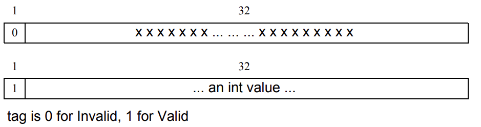
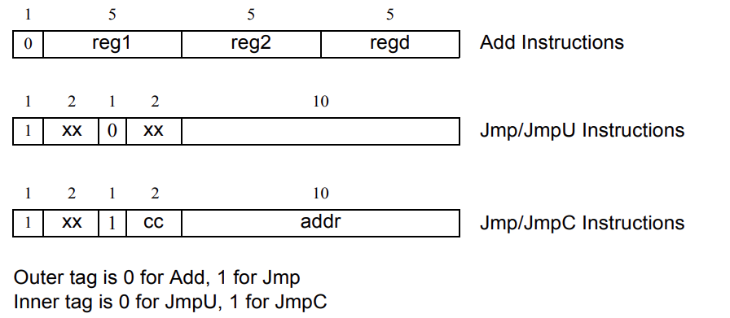

# 7. 聚合数据类型
## 7.1 概述
本章描述以下内容：
 - 结构定义和使用
 - 联合定义和使用
 - 打包数组、未打包数组、动态数组、关联数组和队列
 - 数组查询和操作方法

## 7.2 结构
*结构* 表示可以整体引用的数据类型集合，或者可以按名称引用构成结构的各个数据类型。默认情况下，结构是未打包的，这意味着数据类型有实现相关的打包。未打包结构可以包含任何数据类型。

结构声明遵循 C 语法，但在“`{`”之前没有可选的结构标签。结构声明的语法如 7-1 所示。

---
```verilog
data_type ::= // from A.2.2.1
... 
| struct_union [ packed [ signing ] ] { struct_union_member { struct_union_member } }
{ packed_dimension }13 
struct_union_member16 ::= 
{ attribute_instance } [random_qualifier] data_type_or_void list_of_variable_decl_assignments ;
data_type_or_void ::= data_type | void
struct_union ::= struct | union [ tagged ] 
// 13) 当使用带有 struct 或 union 关键字的打包维度时，也应使用 packed 关键字。
// 16) 只有在标记联合内部才能声明 void struct_union_member。
```
---
语法 7-1——结构声明语法（摘自附录 A）

以下是声明结构的示例：
```verilog
struct { bit [7:0] opcode; bit [23:0] addr; } IR; // 匿名结构定义变量 IR

IR.opcode = 1; // 设置 IR 中的字段

typedef struct { 
    bit [7:0] opcode; 
    bit [23:0] addr; 
} instruction; // 命名结构类型
instruction IR; // 定义变量
```

### 7.2.1 打包结构
打包结构是将向量细分为子字段的机制，可以方便地作为成员访问。因此，打包结构由位字段组成，这些位字段在内存中紧密打包在一起，没有间隙。未打包结构具有依赖实现的打包，通常与 C 编译器匹配。打包结构与未打包结构的区别在于，当打包结构作为主要结构时，应将其视为单个向量。

打包结构可以整体使用算术和逻辑运算符。指定的第一个成员是最重要的，随后的成员按降低的重要性顺序排列。使用 `packed` 关键字声明结构，可以在后面跟随 `signed` 或 `unsigned` 关键字，根据所需的算术行为。默认为 unsigned。

```verilog
struct packed signed { 
    int a; 
    shortint b; 
    byte c; 
    bit [7:0] d;
} pack1; // 有符号，2 状态

struct packed insigned {
    time a;
    integer b;
    logic [31:0] c;
} pack2; // 无符号, 4 状态
```

未打包结构的符号是不允许的，下列声明将被认为非法：
```verilog
typedef struct signed {
int f1 ;
logic f2 ;
} sIllegalSignedUnpackedStructType; // 非法声明
```

如果打包结构内的所有数据类型都是 2 状态的，那么结构整体被视为 2 状态的。

如果打包结构内的任意数据类型是 4 状态的，那么结构整体被视为 4 状态的。如果结构中也包含2态成员，在读取这些成员时会发生从4态到2态的隐式转换，而在写入这些成员时则会发生从2态到4态的隐式转换。

打包结构体的一个或多个位可以像打包数组一样被选择，其范围为[n-1:0]：
```verilog
pack1 [15:8] // c
```

打包结构体中仅允许使用打包数据类型和表 6-8（见6.11）中总结的整数数据类型。

打包结构体可以与 `typedef` 一起使用。
```verilog
typedef struct packed { // 默认无符号
    bit [3:0] GFC; 
    bit [7:0] VPI; 
    bit [11:0] VCI; 
    bit CLP; 
    bit [3:0] PT ; 
    bit [7:0] HEC; 
    bit [47:0] [7:0] Payload; 
    bit [2:0] filler; 
} s_atmcell; 
```

### 7.2.2 给结构体赋值
结构体可以作为一个整体进行赋值，并且可以作为整体传递给子程序或从子程序返回。

结构体数据类型的成员可以通过在声明每个成员时使用初始赋值来分配单独的默认成员值。所赋值的表达式应当是常量表达式。

以下是初始化结构体类型成员的一个例子：
```verilog
typedef struct {
    int addr = 1 + constant;
    int crc;
    byte data [4] = '{4{1}};
} packet1;
```

然后可以实例化该结构体：
`packet1 p1; // 使用typedef中定义的初始化;p1.crc 将使用 int 的默认值`

如果在变量声明时使用了显式的初始值表达式，则结构体数据类型中的初始赋值表达式将被忽略。5.10 讨论了为结构体分配初始值。例如：
`packet1 pi = '{1,2,'{2,3,4,5}}; // 抑制了typedef中的初始化`

包含联合体的非打包结构体成员以及打包结构体成员不应分配单独的默认成员值。

当使用数据类型声明没有用户定义 nettype 的线网时，数据类型中的初始赋值表达式将被忽略（见6.7.1）。

## 7.3 联合体
*联合体* 是一种数据类型，它表示可以使用其中一个命名成员数据类型访问的单一存储单元。联合体中的数据类型一次只能使用其中一种。默认情况下，联合体是未打包的，这意味着对于联合体成员的存储表示没有强制要求。动态类型和 chandle 类型只能用于带标签的联合体。

以下 7-2 是联合体声明的语法格式：

---
```verilog
data_type ::= // from A.2.2.1
... 
| struct_union [ packed [ signing ] ] { struct_union_member { struct_union_member } }
{ packed_dimension }13 
struct_union_member16 ::= 
{ attribute_instance } [random_qualifier] data_type_or_void list_of_variable_decl_assignments ;
data_type_or_void ::= data_type | void
struct_union ::= struct | union [ tagged ]
// 13）当使用带有 struct 或 union 关键字的打包维度时，也应使用 packed 关键字。
// 16）只有在标记联合内部才能声明 void struct_union_member。
```
---
语法 7-2——联合体声明语法（摘自附录 A）

例如：
```verilog
typedef union { int i; shortreal f; } num; // 命名联合体
num n; 
n.f = 0.0; // set n in floating point format
typedef struct { 
    bit isfloat; 
    union { int i; shortreal f; } n; // 匿名联合体
} tagged_st; // 命名结构体
```

如果联合体的成员没有指定初始值，则变量将被初始化为联合体类型的声明顺序中第一个成员类型的默认初始值。

为了简化未打包联合体的使用，存在一个特殊规定：如果一个未打包联合体包含几个共享公共初始序列的未打包结构，并且未打包联合体对象当前包含其中一个结构，则允许在任何声明完整类型的联合体可见的地方检查任何一个结构的公共初始部分。如果对应的成员具有等效类型的一个或多个初始成员的序列，则两个结构共享一个公共初始序列。

### 7.3.1 打包联合体
打包联合体只能包含整数数据类型的成员。打包联合体的成员应该是相同大小的（与未打包联合体或打包带标签联合体不同，这些联合体的成员可以是不同大小的）。因此，可以将一个写入的联合体成员作为另一个成员读取。打包联合体也可以作为整体使用算术和逻辑运算符，其行为由 `signed` 或 `unsigned` 关键字确定，后者是默认值。可以像打包数组一样选择打包联合体的一个或多个位，其范围为[n-1:0]。

只有打包数据类型和表 6-8（见6.11）中总结的整数数据类型可以在打包联合体中合法使用。

如果打包联合体包含 2 状态成员和 4 状态成员，则整个联合体是 4 状态的。在读取 2 状态成员时，会发生从 4 状态到 2 状态的隐式转换，而在写入 2 状态成员时，会发生从 2 状态到 4 状态的隐式转换。

例如，联合体可以使用不同的访问宽度：
```verilog
typedef union packed { // 默认无符号
    s_atmcell acell; 
    bit [423:0] bit_slice; 
    bit [52:0][7:0] byte_slice; 
} u_atmcell; 
u_atmcell u1;
byte b; bit [3:0] nib;
b = u1.bit_slice[415:408]; // b = u1.byte_slice[51];
nib = u1.bit_slice [423:420]; // nib = u1.acell.GFC;
```

对于打包联合体，写一个成员并读取另一个成员与机器的字节顺序无关，这与未打包联合体的未打包结构不同，后者是 C 兼容的，成员按地址升序排列。

### 7.3.2 标记联合体
在联合体中使用 `tagged` 声明为 *标记联合体*，使其成为一种类型检查的联合体。普通（未标记）联合体可以使用一个成员类型的值进行更新，并作为另一个成员类型的值读取，这是一种潜在的类型漏洞。标记联合体存储成员值和 *标记*，即表示当前成员名称的附加位。标记和值只能一起一致地使用静态类型检查的标记联合体表达式进行更新（见 11.9）。只能使用与当前标记值（即成员名称）一致的类型读取成员值。因此，不可能存储一个类型的值并（误）将位解释为另一个类型。

动态类型和 chandle 类型不得在未标记联合体中使用，但可以在标记联合体中使用。

标记联合体的成员可以作为标记表达式引用。见 11.9。

除了类型安全性之外，使用成员名称作为标记的使用也使代码比必须跟踪具有显式标记的联合体的代码更简单、更小。标记联合体也可以与模式匹配（见 12.6）一起使用，进一步提高可读性。

在标记联合体中，成员可以声明为 void 类型，当所有信息都在标记本身时，如下面的整数和有效位示例：
```verilog
typedef union tagged {
    void Invalid;
    int Valid;
} VInt;
```

VInt 类型的值是无效的（不包含任何内容）或有效的（包含一个 int）。11.9 描述了如何构造此类型的值，也描述了为何不可能从当前具有 Invalid 标记的 VInt 值中读取整数。

例如：
```verilog
typedef union tagged {
    struct {
        bit [4:0] reg1, reg2, regd;
    } Add;
    union tagged {
        bit [9:0] JmpU;
        struct {
            bit [1:0] cc; 
            bit [9:0] addr;
        } JmpC;
    } Jmp;
} Instr;
```

Instr 类型的值是一个 Add 指令，其中包含三个 5 位寄存器字段，或者是一个 Jmp 指令。在后一种情况下，它要么是无条件跳转，其中包含一个 10 位目的地址，要么是条件跳转，其中包含一个 2 位条件码寄存器字段和一个 10 位目的地址。11.9 描述了如何构造 Instr 类型的值，并描述了如何读取 cc 字段，例如，为了读取 cc 字段，指令必须具有 Jmp 操作码和子操作码 JmpC。

当在标记联合体上使用 packed 限定符时，所有成员都必须具有打包类型，但它们的大小不必相同。打包标记联合体的（标准）表示如下：
- 大小始终等于表示标记所需的位数加上成员的最大大小。
- 标记的大小是编码所有成员名称所需的最小位数（例如，五到八个成员需要 3 个标记位）。
- 标记位始终左对齐（即，朝向 MSB）。
- 对于每个成员，成员位始终右对齐（即，朝向最低有效位（LSB））。
- 标记位和成员位之间的位是未定义的。在 void 成员的极端情况下，只有标记是重要的，所有剩余位都是未定义的。

该表示方案递归地应用于任何嵌套的标记联合体。

例如，如果 VInt 类型定义具有 `packed` 限定符，则 Invalid 和 Valid 值的布局如图 7-1 所示。

图 7-1 带限定符的 vint 类型

例如，如果 Instr 类型有打包的限定符，它的值将具有如图 7-2 所示的布局。

图 7-2 带限定符的 Instr 类型

## 7.4 打包和未打包数组
SystemVerilog 支持数据的打包数组和未打包数组。*打包数组* 是指在数据标识符名称之前声明维度。*未打包数组* 是指在数据标识符名称之后声明维度。
```verilog
bit [7:0] c1; // 标量位类型的打包数组
real u [7:0]; // 实数类型的未打包数组
```

一维打包数组通常称为向量（见 6.9）。也允许多维打包数组。

未打包数组可以是固定大小数组（见 7.4.2）、动态数组（见 7.5）、关联数组（见 7.8）或队列（见 7.10）。未打包数组可以由任何数据类型组成，包括其他打包或未打包数组（见 7.4.5）。

### 7.4.1 打包数组
打包数组是一种将向量细分为子字段的机制，可以方便地作为数组元素访问。因此，打包数组保证表示为一组连续的位。未打包数组可能或可能不是这样表示的。打包数组与未打包数组的区别在于，当打包数组作为主要数组时，应将其视为单个向量。

如果打包数组声明为有符号的，则将数组视为单个向量时应为有符号的。除非声明为有符号的命名类型，否则数组的各个元素都是无符号的。打包数组的部分选择应为无符号的。

打包数组允许任意长度的整数类型；因此，可以由 48 位整数组成 48 位。然后可以用于 48 位算术。打包数组的最大大小可以受到限制，但至少应为 65536（2^16）位。

打包数组只能由单比特数据类型（bit、logic、reg）、枚举类型和递归其他打包数组和打包结构组成。

预定义宽度的整数类型不得声明为打包数组。这些类型是 byte、shortint、int、longint、integer 和 time。尽管预定义宽度为 n 的整数类型不是打包数组，但它匹配（见 6.22），并且可以从中选择，就好像它是一个具有单一 [n-1:0] 维度的打包数组类型。

```verilog
byte c2; // 与 bit signed [7:0] c2; 相同
integer i1; // 与 logic signed [31:0] i1; 相同
```

### 7.4.2 未打包数组
未打包数组可以由任何数据类型组成。数组的元素本身是数组的多维数组（见 7.4.5）。应在声明标识符后指定元素地址范围。

线网数组的元素可以像标量或向量线网一样使用。线网数组对于连接到循环生成结构内模块实例的端口很有用（见 27.4）。

每个固定大小的维度应由地址范围表示，例如 [1:1024]，或一个单个正数来指定固定大小的未打包数组的大小，如 C 中所示。换句话说，[size] 变为 [0:size-1]。

以下示例声明了等效大小的两维固定大小 int 变量数组：
```verilog
int Array[0:7][0:31]; // 使用范围声明数组
int Array[8][32]; // 使用大小声明数组
```

指定地址范围的表达式应为常量整数表达式。常量表达式的值可以是正整数、负整数或零。它们不得包含任何未知（x）或高阻态位。

实现可能会限制数组的最大大小，但它们应至少允许 16777216（2^24）个元素。

### 7.4.3 数组操作
可以对所有数组执行以下操作，无论是打包数组还是未打包数组。这些规则提供的示例假定 A 和 B 是相同形状和类型的数组。
 - 读取和写入数组，例如，A = B
 - 读取和写入数组的切片，例如，A[i:j] = B[i:j]
 - 读取和写入数组的变量切片，例如，A[x+:c] = B[y+:c]
 - 读取和写入数组的元素，例如，A[i] = B[i]
 - 数组或数组切片的相等操作，例如，A==B，A[i:j] != B[i:j]

可以对打包数组执行以下操作，但不能对未打包数组执行。这些规则提供的示例假定 A 是数组。
 - 从整数赋值，例如，A = 8'b11111111;
 - 在表达式中将其视为整数，例如，(A + 3)

如果未打包数组声明为有符号，则这适用于数组的各个元素，因为整个数组不能被视为单个向量。

有关赋值到打包和未打包数组的规则，请参见 7.6。

### 7.4.4 存储器
具有 `reg`、`logic` 或 `bit` 类型元素的一维数组也称为 *存储器*。存储器数组可用于模拟只读存储器（ROM）、随机存储器（RAM）和寄存器文件。数组中的打包维度元素称为存储器 *元素* 或 *字*。

```verilog
logic [7:0] mema [0:255]; // 声明 256 个 8 位字节的存储器数组。数组索引为 0 到 255
mema[5] = 0; // 写入地址 5 处的字
data = mema[addr]; // 读取由 addr 索引的地址处的字
```

### 7.4.5 多维数组
*多维数组* 是数组的数组。可以通过在单个声明中包含多个维度来声明多维数组。在标识符之前的维度设置打包维度。在标识符之后的维度设置未打包维度。
```verilog
bit [3:0] [7:0] joe [1:10]; // 10 个 4 个 8 位字节的元素。数组索引为 1 到 10
```

可以使用如下：
```verilog
joe[9] = joe[8] + 1; // 4 字节加法
joe[7][3:2] = joe[6][1:0]; // 2 字节复制
```

在多维声明中，类型后面和名称之前声明的维度（[3:0][7:0]）比名称后面的维度（[1:10]）变化更快。在引用时，打包维度（[3:0]、[7:0]）在未打包维度（[1:10]）之后。

在维度列表中，最右边的维度变化最快，就像 C 语言一样。但是，打包维度比未打包维度变化更快。

```verilog
bit [1:10] v1 [1:5]; // 1 到 10 变化最快；与存储器数组兼容
bit v2 [1:5] [1:10]; // 1 到 10 变化最快，与 C 兼容
bit [1:5] [1:10] v3 ; // 1 到 10 变化最快
bit [1:5] [1:6] v4 [1:7] [1:8]; // 1 到 6 变化最快，然后是 1 到 5，然后是 1 到 8，然后是 1 到 7
```

可以使用 `typedef` 逐步定义多个打包维度。
```verilog
typedef bit [1:5] bsix;
bsix [1:10] v5; // 1 到 5 变化最快
```

可以使用 `typedef` 逐步定义多个未打包维度。
```verilog
typedef bsix mem_type [0:3]; // 四个 'bsix' 元素的数组
mem_type ba [0:7]; // 八个 'mem_type' 元素的数组
```

*子数组* 是另一个数组的元素。与 C 语言一样，子数组通过省略一个或多个数组维度的索引来引用，始终省略最快变化的维度。省略所有维度的索引引用整个数组。

```verilog
int A[2][3][4], B[2][3][4], C[5][4];
...
A[0][2] = B[1][1]; // 分配由四个整数组成的子数组
A[1] = B[0]; // 分配由三个包含四个整数组成的数组
A = B; // 分配整个数组
A[0][1] = C[4]; // 分配由四个整数组成的子数组
```

可以指定逗号分隔的数组声明列表。列表中的所有数组都应具有相同的数据类型和相同的打包数组维度。
```verilog
bit [7:0] [31:0] v7 [1:5] [1:10], v8 [0:255]; // 声明两个数组
```

### 7.4.6 数组的索引和切片
表达式可以选择打包数组的部分，或者可以选择任何整数类型，编号向下数到 0。

术语 *部分选择* 指的是选择打包数组的一个或多个连续位。
```verilog
logic [63:0] data;
logic [7:0] byte2;
byte2 = data[23:16]; // 从 data 中选择 8 位部分
```

术语 *切片* 指的是选择数组的一个或多个连续元素。

注意：IEEE Std 1364-2005 仅允许选择数组的单个元素。

可以使用索引名称选择打包或未打包数组的单个元素。

```verilog
bit [3:0] [7:0] j; // j 是打包数组
byte k;
k = j[2]; // 从 j 中选择一个 8 位元素
```

可以使用切片名称选择一个或多个连续元素。打包数组的切片名称是打包数组。未打包数组的切片名称是未打包数组。

```verilog
bit signed [31:0] busA [7:0]; // 8 个 32 位向量的未打包数组
int busB [1:0]; // 2 个整数的未打包数组
busB = busA[7:6]; // 从 busA 中选择一个 2 向量切片
```

部分选择或切片的大小应为常量，但位置可以是变量。

```verilog
int i = bitvec[j +: k]; // k 必须是常量
int a[x:y], b[y:z], e;
a = {b[c -: d], e}; // d 必须是常量
```

数组的切片只能应用于一个维度，但其他维度可以在表达式中具有单个索引值。

如果索引表达式超出范围，或者索引表达式中的任何位为 x 或 z，则索引应为无效。使用无效索引读取未打包数组将返回表 7-1 中指定的值。使用无效索引写入数组将不执行任何操作，除了写入队列的元素 [$+1]（见 7.10.1）和创建关联数组的新元素（见 7.8.6）。如果在数组的读取或写入操作中出现无效索引，实现可能会发出警告。

访问具有无效索引的打包数组的行为在 11.5.1 中描述。

有关矢量和数组元素选择和切片的更多信息，请参见 11.5.1 和 11.5.2。

表 7-1——从不存在的数组条目中读取的值
| 数组类型 | 读取值 |
| :---: | :---: |
| 4 状态整数类型 | 'X |
| 2 状态整数类型 | '0 |
| 枚举 | 枚举的基本类型中指定的值 |
| real、shortreal | 0.0 |
| 字符串 | "" |
| 类 | null |
| 事件 | null |
| chandle | null |
| 虚拟接口 | null |
| 变量大小未打包数组（动态数组、队列或关联数组） | 数组大小为零（没有元素） |
| 固定大小的未打包数组 | 该数组的所有元素的值为该数组元素类型的表中指定的值 |
| 未打包结构 | 该结构的每个成员的值为该成员类型的表中指定的值，除非该成员在其声明中具有初始赋值（见 7.2.2），在这种情况下，该成员的值应为其初始赋值给定的值 |
| 未打包联合体 | 该联合体的第一个成员类型的值的默认初始值 |

## 7.5 动态数组
*动态数组* 是可以在运行时设置或更改大小的未打包数组。未初始化的动态数组的默认大小为零。动态数组的大小由 `new` 构造函数或数组赋值（见 7.5.1 和 7.6）设置。动态数组支持所有变量数据类型作为元素类型，包括数组。

动态数组维度在数组声明中由 `[ ]` 表示。数组声明中的任何未打包维度都可以是动态数组维度。

例如：
```verilog
bit [3:0] nibble[]; // 4 位向量的动态数组
integer mem[2][]; // 由整数组成的 2 个动态子数组的固定大小未打包数组
```

注意，为了表示动态数组，标识符必须在声明中具有动态数组维度作为最左边的未打包维度。

`new[]` 构造函数用于设置或更改数组的大小并初始化其元素（见 7.5.1）。

size() 内置方法返回数组的当前大小（见 7.5.2）。

delete() 内置方法清除所有元素，产生一个空数组（大小为零）（见 7.5.3）。

### 7.5.1 new[] 
`new[]` 构造函数设置动态数组的大小并初始化其元素。它可以出现在变量声明赋值的右侧表达式中，也可以出现在阻塞过程赋值中。

---
```verilog
blocking_assignment ::= // from A.6.2
... 
| nonrange_variable_lvalue = dynamic_array_new 
... 
dynamic_array_new ::= new [ expression ] [ ( expression ) ] // from A.2.4
```
---
语法 7-3——动态数组 new 构造函数语法（摘自附录 A）

`[expression]`：动态数组的所需大小。此操作数的类型为 `longint`。如果此操作数的值为负，则将出现错误。如果此操作数的值为零，则数组将变为空。

`(expression)`：可选。用于初始化动态数组的数组。

`new` 构造函数遵循 SystemVerilog 优先级规则。因为方括号 `[]` 和括号 `()` 具有相同的优先级，所以 `new[]` 构造函数的参数按从左到右的顺序进行评估：首先是 `[expression]`，然后是 `(expression)`。

动态数组声明可以包括声明赋值，其中 `new` 构造函数作为右侧表达式：
```verilog
int arr1 [][2][3] = new [4]; // arr1 大小为 4；元素是固定大小数组，因此不需要初始化
int arr2 [][] = new [4]; // arr2 大小为 4；动态子数组保持未设置和未初始化
int arr3 [1][2][] = new [4]; // 错误——arr3 不是动态数组，尽管它包含动态子数组
```

在过程上下文中，可以使用阻塞赋值中的 `new` 构造函数初始化动态数组：
```verilog
int arr[2][][];
arr[0] = new [4]; // 动态子数组 arr[0] 大小为 4
arr[0][0] = new [2]; // 合法，arr[0][n] 为 n=0..3 创建
arr[1][0] = new [2]; // 非法，arr[1] 未初始化，因此 arr[1][0] 不存在
arr[0][] = new [2]; // 非法，语法错误——左侧没有下标的维度
arr[0][1][1] = new[2]; // 非法，arr[0][1][1] 是 int，不是动态数组
```

在任一情况下，如果 `new` 构造函数调用未指定初始化表达式，则元素将初始化为其类型的默认值。

可选的初始化表达式用于初始化动态数组。当存在时，它应为与左侧动态数组兼容的数组。

```verilog
int idest[], isrc[3] = '{5, 6, 7};
idest = new [3] (isrc); // 设置大小和数组元素数据值（5, 6, 7）
```

大小参数不必与初始化数组的大小匹配。当初始化数组的大小更大时，它将被截断以匹配大小参数；当它更小时，将使用默认值填充初始化数组以达到指定大小。

```verilog
int src[3], dest1[], dest2[];
src = '{2, 3, 4};
dest1 = new[2] (src); // dest1 的元素为 {2, 3}。
dest2 = new[4] (src); // dest2 的元素为 {2, 3, 4, 0}。
```

此行为提供了一种在保留其内容的情况下调整动态数组大小的机制。可以通过将其用作左侧项和初始化表达式来调整现有动态数组的大小。

```verilog
integer addr[]; // 声明动态数组
addr = new[100]; // 创建一个 100 元素数组
...
// 将数组大小加倍，保留以前的值
// 对 addr 的现有引用已过时
addr = new[200](addr);
```

使用 `new` 重新调整或重新初始化先前初始化的动态数组是破坏性的；不保留任何先前的数组数据（除非重新初始化为其旧内容——见上文），所有先前的数组元素引用都已过时。

### 7.5.2 size()
`size()` 方法的原型如下：
```verilog
function int size();
```

`size()` 方法返回动态数组的当前大小，如果数组尚未创建，则返回零。

```verilog
int j = addr.size;
addr = new[addr.size() * 4] (addr); // 将 addr 数组乘以 4
```

`size` 动态数组方法等效于 `$size( addr, 1 )` 数组查询系统函数（见 20.7）。

### 7.5.3 Delete()
`delete()` 方法的原型如下：
```verilog
function void delete();
```

`delete()` 方法清空数组，导致零大小的数组。

```verilog
int ab[] = new[ N]; // 创建大小为 N 的临时数组
// 使用 ab
ab.delete; // 删除数组内容
$display( "%d", ab.size ); // 打印 0
```

## 7.6 数组赋值
为了赋值，打包数组被视为向量。任何向量表达式都可以赋值给任何打包数组。打包数组的边界不影响赋值。不能直接将打包数组赋值给未打包数组，除非有显式转换。

关联数组只能与关联数组兼容，如 7.8.9 中所述。固定大小未打包数组、动态数组或队列，或这些数组的切片，应与任何其他这些数组或切片兼容，如果满足以下所有条件：
 - 源和目标的元素类型应该是等效的。
 - 如果目标是固定大小数组或切片，则源数组应具有与目标相同数量的元素。

这里的 *元素* 是最慢变化的数组维度的元素。这些元素本身可能是某种未打包数组类型。因此，为了使两个数组赋值兼容，它们具有相同数量的未打包维度是必要的（但不是充分的）。未打包数组的赋值兼容性是一种比类型等效性更弱的条件，因为它不要求它们的最慢变化的维度是相同的未打包数组类型（队列、动态或固定大小）。这种较弱的条件仅适用于最慢变化的维度。任何更快变化的维度必须满足整个数组的等效性要求（见 6.22.2）。

赋值应通过将源数组的每个元素赋值给目标数组的相应元素来完成。元素之间的对应关系由每个数组中元素的从左到右顺序确定。例如，如果数组 A 声明为 `int A[7:0]`，数组 B 声明为 `int B[1:8]`，则赋值 `A = B;` 将元素 B[1] 分配给元素 A[7]，依此类推。如果赋值的目标是队列或动态数组，则应调整其大小以具有与源表达式相同数量的元素，然后按照前面描述的从左到右元素对应关系进行赋值。

```verilog
int A[10:1]; // 10 个元素的固定大小数组
int B[0:9]; // 10 个元素的固定大小数组
int C[24:1]; // 24 个元素的固定大小数组

A = B; // 正确。兼容类型和相同大小
A = C; // 类型检查错误：不同大小
```

可以将线网数组赋值给变量数组，反之亦然，如果源和目标数组的数据类型兼容。

```verilog
logic [7:0] V1[10:1];
logic [7:0] V2[10];
wire [7:0] W[9:0]; // 数据类型是 logic [7:0] W[9:0]
assign W = V1;
initial #10 V2 = W;
```

当动态数组或队列赋值给固定大小数组时，无法确定源数组的大小，直到运行时。尝试将动态数组或队列复制到具有不同数量元素的固定大小数组目标将导致运行时错误，并且不会执行任何操作。以下是显示将动态数组赋值给固定大小数组的示例代码。

```verilog
int A[2][100:1];
int B[] = new[100]; // 100 个元素的动态数组
int C[] = new[8]; // 8 个元素的动态数组
int D [3][][]; // 具有动态子数组的多维数组
D[2] = new [2]; // 初始化 D 的一个动态子数组
D[2][0] = new [100];

A[1] = B; // 正确。两者都是 100 个整数的数组
A[1] = C; // 类型检查错误：不同大小（100 与 8 个整数）
A = D[2]; // A[0:1][100:1] 和子数组 D[2][0:1][0:99] 都包含 2 个 100 个整数的子数组
```

以下示例显示了赋值给动态数组的示例（有关涉及动态数组的其他赋值示例，请参见 7.5.1）。

```verilog
int A[100:1]; // 100 个元素的固定大小数组
int B[]; // 空动态数组
int C[] = new[8]; // 8 个元素的动态数组
B = A; // 正确。B 有 100 个元素
B = C; // 正确。B 有 8 个元素
```

上面的最后一条语句等效于：

```verilog
B = new[ C.size ] (C);
```

同样，赋值的源可以是涉及数组切片或连接的复杂表达式。例如:

```verilog
string d[1:5] = '{ "a", "b", "c", "d", "e" };
string p[];
p = { d[1:3], "hello", d[4:5] };
```

前面的示例创建了动态数组 p，其中包含 "a"、"b"、"c"、"hello"、"d" 和 "e"。

## 7.7 作为子例程参数的数组
数组可以作为子例程的参数传递。控制数组参数传递的规则与数组赋值的规则相同（见 7.6）。当数组参数传递为值时，将传递数组的副本。这对于所有数组类型都是正确的：固定大小、动态、队列或关联数组。

控制数组实际参数是否可以与给定形式参数相关联的规则与源数组的值是否可以分配给目标数组的规则相同（见 7.6）。如果形式的维度未定义大小（未定义维度可以出现在动态数组、队列和导入 DPI 函数的形式参数中），则它与实际参数的相应维度的任何大小匹配。

例如，声明

```verilog
task fun(int a[3:1][3:1]);
```

声明了一个名为 fun 的任务，它接受一个参数，一个 2 维数组，每个维度大小为 3。对 fun 的调用必须传递一个 2 维数组，并且所有维度的大小都为 3。例如，给定上述对 fun 的描述，考虑以下实际参数：

```verilog
int b[3:1][3:1]; // 正确：相同的类型、维度和大小
int b[1:3][0:2]; // 正确：相同的类型、维度和大小（不同的范围）
logic b[3:1][3:1]; // 错误：不兼容的元素类型
event b[3:1][3:1]; // 错误：不兼容的类型
int b[3:1]; // 错误：不兼容的维数
int b[3:1][4:1]; // 错误：不兼容的大小（3 与 4）
```

接受固定大小数组的子例程也可以接受具有兼容类型和相同大小的动态数组或队列。

例如，声明

```verilog
task t( string arr[4:1] );
```

声明了一个任务，它接受一个参数，一个 4 个字符串的数组。此任务可以接受以下实际参数：

```verilog
string b[4:1]; // 正确：相同的类型和大小
string b[5:2]; // 正确：相同的类型和大小（不同的范围）
string b[] = new[4]; // 正确：相同的类型、维数和维度大小；需要运行时检查
```

接受动态数组或队列的子例程可以接受具有兼容类型和相同大小的动态数组、队列或固定大小数组。

例如，声明

```verilog
task t ( string arr[] );
```

声明了一个任务，它接受一个参数，一个字符串的动态数组。此任务可以接受任何一维未打包数组的字符串或任何一维动态数组或队列的字符串。

动态数组和队列形式参数的规则也适用于 DPI 开放数组形式参数的行为（见 7.6）。DPI 开放数组也可以具有孤立的未定义大小的打包维度（见 34.5.6.1）。如果 DPI 形式参数具有未定义的维度和输出方向模式，则不得将动态数组或队列作为实际参数传递。

## 7.8 关联数组
动态数组在处理未知大小的数据集时非常有用。然而，当数据集是稀疏的或索引不是整数时，关联数组是更好的选择。关联数组不分配存储空间，直到使用它们时。关联数组的索引可以是任何类型，而不仅仅是整数。

关联数组实现了其声明类型的元素的查找表。用作索引的数据类型作为查找键，并强加了一个排序。

声明关联数组的语法如下：

```verilog
data_type array_id [ index_type ];
```

其中
 - `data_type` 是数组元素的数据类型。可以是任何允许固定大小数组的类型。
 - `array_id` 是正在声明的数组的名称。
 - `index_type` 是要用作索引的数据类型，或者是 `*`。如果指定 `*`，则数组由任意大小的任意整数表达式索引。索引类型将索引表达式限制为特定类型。声明索引类型为数组是非法的。

关联数组声明的示例如下：

```verilog
integer i_array[*]; // 整数的关联数组（未指定索引）
bit [20:0] array_b[string]; // 21 位向量的关联数组，由字符串索引
event ev_array[myClass]; // 由类 myClass 索引的事件的关联数组
```

关联数组的元素是动态分配的。当将其用作赋值的目标或作为通过引用传递的参数的实际参数时，将为不存在的关联数组元素分配一个条目。关联数组根据索引数据类型维护已分配值的条目及其相对顺序。关联数组元素是未打包的。换句话说，除了复制或比较数组之外，在大多数表达式中必须从数组中选择单个元素，然后才能使用它。

### 7.8.1 通配符索引类型
例如：
```verilog
int array_name [*];
```

指定通配符索引类型的关联数组具有以下属性：
 - 数组可以由任何整数表达式索引。因为索引表达式的大小可能不同，所以相同的数值可能有多个表示，每个表示的大小不同。SystemVerilog通过删除前导零并计算最小长度来解决这种模糊性，并使用该表示来表示该值。
 - 非整数索引值是非法的，并导致错误。
 - 包含 X 或 Z 的 4 状态索引值是无效的。
 - 索引表达式是自决定的，并被视为无符号的。
 - 字符串文字索引自动转换为等效大小的位向量。
 - 排序基于数字（从小到大）。
 - 指定通配符索引类型的关联数组不得在 `foreach` 循环（见 12.7.3）中使用，也不得与返回索引值或值数组的数组操作方法（见 7.12）一起使用。


### 7.8.2 字符串索引
例如：
```verilog
int array_name [ string ];
```

指定字符串索引的关联数组具有以下属性：
 - 索引可以是任意长度的字符串或字符串字面量。其他类型是非法的，并导致错误。
 - 空字符串索引是有效的。
 - 排序是字典序（从小到大）。

### 7.8.3 类索引
例如：
```verilog
int array_name [ some_Class ];
```

指定类索引的关联数组具有以下属性：
 - 索引可以是该特定类型的对象或派生自该类型的对象。任何其他类型都是非法的，并导致错误。
 - 空索引是有效的。
 - 排序是确定性的但是任意的。

### 7.8.4 整数索引
例如：
```verilog
int array_name1 [ integer ];
typedef bit signed [4:1] SNibble;
int array_name2 [ SNibble ];
typedef bit [4:1] UNibble;
int array_name3 [ UNibble ];
```

指定整数数据类型索引的关联数组具有以下属性：
 - 索引表达式应按照索引类型的强制转换进行评估，除了实数或短实数数据类型的隐式转换是非法的。
 - 包含 X 或 Z 的 4 状态索引表达式是无效的。
 - 排序是有符号或无符号数字，取决于索引类型的有符号性。

### 7.8.5 其他用户定义类型
例如：
```verilog
typedef struct {byte B; int I[*];} Unpkt;
int array_name [ Unpkt ];
```

一般来说，指定任何类型索引的关联数组具有以下属性：
 - 声明的索引应具有其类型的相等运算符才能合法。这包括所有动态大小的类型作为合法索引类型。但是，`real` 或 `shortreal` 数据类型，或包含实数或短实数的类型，应为非法索引类型。
 - 索引表达式中的任何元素包含 X 或 Z 是无效的。
 - 索引表达式中的任何元素为空值或空值对于任何元素都不使索引无效。
 - 如果索引类型定义了关系运算符，则排序如前面的子句中所定义的。如果没有，则在任何两个条目之间的相对排序可能会有所不同，即使在同一工具的连续运行之间也可能会有所不同。但是，在没有添加或删除索引的情况下，相对排序在同一模拟运行中保持不变。

### 7.8.6 访问无效索引
如果读取操作使用一个索引，该索引是一个 4 状态表达式，其中一个或多个位是 x 或 z 位，或者尝试读取一个不存在的条目，则应发出警告，并返回数组类型的不存在的条目值，如表 7-1 中所示（见 7.4.6）。用户指定的默认值不会发出警告，并返回 7.9.11 中指定的值。

如果在写操作期间使用无效索引，则将忽略该写操作，并发出警告。

### 7.8.7 分配关联数组元素
当关联数组元素作为赋值的目标或作为通过引用传递的参数的实际参数时，将为不存在的关联数组元素分配一个条目。有些结构可以在单个语句中同时执行读操作和写操作，例如递增操作。在这些情况下，在引用该元素之前，将为不存在的元素分配其默认或用户指定的初始值。

例如：

```verilog
int a[int] = '{default:1};
typedef struct { int x=1,y=2; } xy_t;
xy_t b[int];

begin
    a[1]++;
    b[2].x = 5;
end
```

假设在执行这些语句之前，对a[1]和b[2]的引用是不存在的元素。在执行 a[1]++ 时，a[1] 将被分配并初始化为 1。递增后，a[1] 将为 2。执行 b[2].x = 5 时，将分配 b[2]，b[2].X 是 1，b[2].y 等于 2。执行赋值后，b[2].x 将更新为 5。

## 7.9 关联数组方法
除了索引操作之外，还提供了一些内建方法，让用户分析操作关联数组，也可以遍历索引或键。

### 7.9.1 Num() 和 size()
num() 和 size() 方法的语法如下：
```verilog
function int num(); 
function int size();
```

num() 和 size() 方法返回关联数组中元素的个数。如果数组为空，则返回 0。

```verilog
int imem[int];
imem[ 2'b3 ] = 1;
imem[ 16'hffff ] = 2;
imem[ 4b'1000 ] = 3;
$display( "%0d entries\n", imem.num ); // 打印 "3 entries" 
```

### 7.9.2 Delete()
delete() 方法的语法如下：
`function void delete( [input index] ); `

index 是待查询数组的可选的合适类型的下标。

如果指定了索引，则 `delete()` 方法会移除指定索引处的条目。如果要删除的条目不存在，该方法不会发出警告。

如果未指定索引，则 `delete()` 方法会移除数组中的所有元素。

```verilog
int map[ string ];
map[ "hello" ] = 1;
map[ "sad" ] = 2;
map[ "world" ] = 3;
map.delete( "sad" ); // 从 map 中移除下标为 sad 的项
map.delete; // 移除 map 的所有项
```

### 7.9.3 Exists()
exists() 的语法如下：
`function int exists( input index ); `

其中 index 是适当类型的数组的索引。

exists() 方法检查给定数组中是否存在指定索引的元素。如果元素存在，则返回 1；否则返回 0。

```verilog
if ( map.exists( "hello" ))
    map[ "hello" ] += 1;
else
    map[ "hello" ] = 0;
```

### 7.9.4 First()
first() 方法的语法如下：
`function int first( ref index ); `

其中 index 是适当类型的数组的索引。不允许具有通配符索引类型的关联数组。

first() 方法将给定索引变量的值设置为关联数组中的第一个（最小）索引的值。如果数组为空，则返回 0；否则返回 1。

```verilog
string s;
if ( map.first( s ) )
    $display( "First entry is : map[ %s ] = %0d\n", s, map[s] );
```

### 7.9.5 Last()
last() 方法的语法如下：
`function int last( ref index ); `

其中 index 是适当类型的数组的索引。不允许具有通配符索引类型的关联数组。

last() 方法将给定索引变量的值设置为关联数组中的最后一个（最大）索引的值。如果数组为空，则返回 0；否则返回 1。

```verilog
string s;
if ( map.last( s ) )
    $display( "Last entry is : map[ %s ] = %0d\n", s, map[s] );
```

### 7.9.6 Next()
next() 方法的语法如下：
`function int next( ref index ); `

其中 index 是适当类型的数组的索引。不允许具有通配符索引类型的关联数组。

next() 方法查找大于给定索引参数的最小索引。

如果存在下一个条目，则将索引变量分配给下一个条目的索引，并返回 1。否则，索引保持不变，并返回 0。

```verilog
string s;
if ( map.first( s ) )
    do
        $display( "%s : %d\n", s, map[ s ] );
    while ( map.next( s ) );
```

### 7.9.7 Prev()
prev() 方法的语法如下：
`function int prev( ref index ); `

其中 index 是适当类型的数组的索引。不允许具有通配符索引类型的关联数组。

prev() 方法查找小于给定索引参数的最大索引。如果存在上一个条目，则将索引变量分配给上一个条目的索引，并返回 1。否则，索引保持不变，并返回 0。

```verilog
string s;
if ( map.last( s ) )
    do
        $display( "%s : %d\n", s, map[ s ] );
    while ( map.prev( s ) );
```

### 7.9.8 遍历方法的参数
传递给四个关联数组遍历方法 first()、last()、next() 和 prev() 的参数应与数组的索引类型兼容。如果参数具有比相应数组索引类型的大小更小的整数类型，则函数返回 -1，并将截断以适应参数。例如：

```verilog
string aa[int];
byte ix;
int status;
aa[ 1000 ] = "a";
status = aa.first( ix ); // status 是 -1；ix 是 232（1000 的最低有效 8 位）
```

### 7.9.9 关联数组赋值
关联数组只能赋值给另一个具有兼容类型和相同索引类型的关联数组。其他类型的数组不能赋值给关联数组，也不能将关联数组赋值给其他类型的数组，无论是固定大小的还是动态的。

将关联数组赋值给另一个关联数组会导致目标数组清除任何现有条目，然后将源数组中的每个条目复制到目标数组。

### 7.9.10 关联数组参数
关联数组只能传递给具有兼容类型和相同索引类型的关联数组的子例程。不能将其他类型的数组，无论是固定大小的还是动态的，传递给接受关联数组作为参数的子例程。同样，关联数组不能传递给接受其他类型的数组的子例程。

通过值传递关联数组会创建关联数组的本地副本。

### 7.9.11 关联数组字面量
关联数组字面量使用 '{index:value} 语法，带有可选的默认索引。与所有其他数组一样，可以一次写入一个条目，或者可以用数组字面量替换整个数组内容。

例如：

```verilog
// 由 2 状态整数索引的字符串关联数组，默认为 "hello"。
string words [int] = '{default: "hello"};

// 由字符串索引的 4 状态整数关联数组，默认为 -1
integer tab [string] = '{"Peter":20, "Paul":22, "Mary":23, default:-1 };
```

如果指定了默认值，则读取不存在的元素将产生指定的默认值，并且不会发出警告。否则，将返回 7.4.6 的 表 7-1 中指定的值。

定义默认值不会影响关联数组方法的操作（见 7.9）。

## 7.10 队列
队列是一个变量大小的有序集合，其中的元素是同质的。队列支持对其所有元素的常量时间访问，以及在队列的开头或结尾的常量时间插入和删除。队列中的每个元素由表示其在队列中的位置的序数号标识，其中 0 表示第一个，`$` 表示最后一个。队列类似于一个自动增长和缩小的一维未打包数组。因此，与数组一样，可以使用索引、连接、切片运算符语法和相等运算符来操作队列。

队列使用与未打包数组相同的语法声明，但指定 `$` 作为数组大小。队列的最大大小可以通过指定其可选的右边界（最后一个索引）来限制。

队列值可以使用赋值模式或未打包数组连接（见 10.9、10.10）来写入。

声明队列的语法如下 7-4：

---
```verilog
variable_dimension ::= // from A.2.5
unsized_dimension 
| unpacked_dimension 
| associative_dimension 
| queue_dimension 
queue_dimension ::= [ $ [ : constant_expression ] ]
```
---
语法 7-4—队列维度的声明（摘自附录 A）

constant_expression 应计算为正整数值。

例如：

```verilog
byte q1[$]; // 一个字节队列
string names[$] = { "Bob" }; // 一个包含一个元素的字符串队列
integer Q[$] = { 3, 2, 7 }; // 一个初始化的整数队列
bit q2[$:255]; // 最大大小为 256 位的队列
```

空数组字面量 `{}` 用于表示空队列。如果在声明中未提供初始值，则队列变量将初始化为空队列。

### 7.10.1 队列操作
队列支持与未打包数组上的操作相同的操作。此外，队列支持以下操作：
 - 队列将调整自身大小以容纳写入它的任何值，除非其最大大小受到限制（见 7.10）。
 - 在队列切片表达式中，如 `Q[a:b]`，切片边界可以是任意整数表达式，特别是不需要是常量表达式。
 - 队列支持 7.10.2 中描述的方法。

与数组不同，空队列 `{}` 是有效的队列，并且是某些队列操作的结果。以下规则管理队列操作：
 - `Q[a:b]` 生成一个包含 b - a + 1 个元素的队列。
    - 如果 a > b，则 `Q[a:b]` 生成空队列 `{}`。
    - `Q[n:n]` 生成一个包含一个元素的队列，该元素位于位置 n。因此，`Q[n:n] === { Q[n] }`。
    - 如果 n 超出 Q 的范围（n < 0 或 n > `$`），则 `Q[n:n]` 生成空队列 `{}`。
    - 如果 a 或 b 中的任何一个是包含 X 或 Z 值的 4 状态表达式，则生成空队列 `{}`。
 - 当 a < 0 时，`Q[a:b]` 与 `Q[0:b]` 相同。
 - 当 b > `$` 时，`Q[a:b]` 与 `Q[a:$]` 相同。
 - 无效的索引值（即，包含一个或多个 x 或 z 位的 4 状态表达式的值，或者位于 0...`$` 之外的值）将导致读操作返回适用于队列元素类型的不存在数组条目的值（如 7.4.6 中的表 7-1 中所述）。
 - 无效的索引（即，包含 X 或 Z 的 4 状态表达式，或者位于 0...`$+1` 之外的值）将导致写操作被忽略，并发出运行时警告；但是，写入 `Q[$+1]` 是合法的。
 - 使用语法 `[$:N]` 指定右边界的队列称为 *有界队列*，并且应限制其索引不大于 N（其大小不得超过 N+1）。有关有界队列的其他规则，请参见 7.10.5。

### 7.10.2 队列方法
除了数组操作符，队列还提供了几种内置方法。假设以下声明用于后面的示例：

```verilog
typedef mytype element_t; // mytype 是队列的任何合法类型
typedef element_t queue_t[$];
element_t e;
queue_t Q;
int i;
```

#### 7.10.2.1 Size()
size() 方法的原型如下：
`function int size(); `

size() 方法返回队列中的条目数。如果队列为空，则返回 0。

```verilog
for ( int j = 0; j < Q.size; j++ ) $display( Q[j] );
```

#### 7.10.2.2 Insert()
insert() 方法的原型如下：
`function void insert(input integer index, input element_t item); `

insert() 方法在指定的索引位置插入给定的条目。

如果索引参数具有任何位为未知（x/z）值，或为负数，或大于队列的当前大小，则该方法对队列没有影响，并可能导致发出警告。

注意：索引参数的类型为 `integer` 而不是 int，以便可以检测调用者的实际参数值中的 x/z 值。

#### 7.10.2.3 Delete()
delete() 方法的原型如下：
`function void delete( [input integer index] ); `

index 是一个可选的索引。

如果未指定索引，则 delete() 方法删除队列中的所有元素，使队列为空。

如果指定了索引，则 delete() 方法删除指定索引位置的条目。如果索引参数具有任何位为未知（x/z）值，或为负数，或大于队列的当前大小，则该方法对队列没有影响，并可能导致发出警告。

#### 7.10.2.4 Pop_front()
pop_front() 方法的原型如下：
`function element_t pop_front(); `

pop_front() 方法移除并返回队列的第一个元素。

如果在空队列上调用此方法：
 - 其返回值应与尝试读取不存在的数组元素的相同类型的值相同（如 7.4.6 中的表 7-1 中所述）；
 - 它对队列没有影响，并可能导致发出警告。

#### 7.10.2.5 Pop_back()
pop_back() 方法的原型如下：
`function element_t pop_back(); `

pop_back() 方法移除并返回队列的最后一个元素。

如果在空队列上调用此方法：
 - 其返回值应与尝试读取不存在的数组元素的相同类型的值相同（如 7.4.6 中的表 7-1 中所述）；
 - 它对队列没有影响，并可能导致发出警告。

#### 7.10.2.6 Push_front()
push_front() 方法的原型如下：
`function void push_front(input element_t item); `

push_front() 方法在队列的前面插入给定的元素。

#### 7.10.2.7 Push_back()
push_back() 方法的原型如下：
`function void push_back(input element_t item); `

push_back() 方法在队列的末尾插入给定的元素。

### 7.10.3 队列元素的引用持久性
13.5.2 提到，队列的元素可能通过引用传递给继续保持引用的任务，而在队列上执行其他操作。某些队列操作将导致任何这样的引用变得过时。本节定义了引用队列元素何时会变得过时的情况。

当 7.10.2 中描述的队列方法更新队列时，对队列中的任何现有元素的引用不会变得过时。方法删除的所有元素将变成过时引用。

当赋值的目标是整个队列时，对原始队列的任何元素的引用将变得过时。

由于此节，使用未打包数组连接语法将元素插入队列，如 7.10.4 中的示例所示，将导致对现有队列的任何元素的引用变得过时。使用 delete、pop_front 和 pop_back 方法将使对弹出或删除的元素的引用变得过时，但将保留对队列的所有其他元素的引用。相比之下，在队列上使用 insert、push_back 和 push_front 方法永远不会导致引用过时（除非在有界队列上使用 insert 或 push_front 会导致队列的最高编号元素被删除，如果队列的新大小超过队列的边界）。

### 7.10.4 使用赋值和未打包数组连接更新队列
如 7.10 中所述，队列变量可以通过赋值来更新。与未打包数组连接一起使用，这为在队列变量上执行操作提供了一种灵活的替代方法。

以下示例显示了队列赋值操作，这些操作表现出与队列方法相似的行为。在每种情况下，队列变量的结果值应与应用队列方法相同，但是对队列元素的任何引用都将变得过时（见 7.10.3）：

```verilog
int q[$] = { 2, 4, 8 };
int e, pos;

// 赋值 // 生成与变量 q 中的值相同的值
// ----------------------------- // -------------------------
q = { q, 6 }; // q.push_back(6)
q = { e, q }; // q.push_front(e)
q = q[1:$]; // void'(q.pop_front()) 或 q.delete(0)
q = q[0:$-1]; // void'(q.pop_back()) 或 q.delete(q.size-1)
q = { q[0:pos-1], e, q[pos:$] }; // q.insert(pos, e)
q = { q[0:pos], e, q[pos+1:$] }; // q.insert(pos+1, e)
q = {}; // q.delete()
```

以下示例说明了一些有用的操作，这些操作无法作为单个队列方法调用来实现。与前面的示例一样，对队列变量的赋值会使其所有元素的引用变得过时。

```verilog
q = q[2:$]; // 生成一个不包含前两个条目的新队列
q = q[1:$-1]; // 生成一个不包含第一个和最后一个条目的新队列
```

### 7.10.5 有界队列
有界队列不能拥有超过其右边界索引的元素。有界队列的操作与无界队列的操作相同，在任意有元素超出边界的操作之后，那些所有超出边界的元素都被删除然后发出警告。

注意：实现可以用任何方式满足这个要求。特别是，它们不需要在删除超出边界的元素之前将它们写入。

## 7.11 数组查询函数
SystemVerilog 提供了新的系统函数来返回有关数组的信息。这些是 `$left`、`$right`、`$low`、`$high`、`$increment`、`$size`、`$dimensions` 和 `$unpacked_dimensions`。这些函数在 20.7 中描述。

## 7.12 数组操作方法
SystemVerilog 提供了几种内置方法来促进数组搜索、排序和减少。

调用这些数组方法的一般语法如下：

---
```verilog
array_method_call ::= 
expression . array_method_name { attribute_instance } [ ( iterator_argument ) ] 
[ with ( expression ) ] 
```
---
语法 7-5—数组方法调用语法（不在附录 A 中）

可选的 `with` 子句接受用括号括起的表达式。与 randomize 方法（见 18.7）使用的 `with` 子句不同，该 with 子句接受用大括号括起的一组约束。

如果 `with` 子句中包含任何副作用，则结果可能是不可预测的。

数组操作方法对数组元素进行迭代，然后使用 `with` 子句指定的表达式来计算。`iterator_argument` 可选地指定用于在每次迭代时指定数组元素的变量的名称。如果未指定，则默认使用名称 `item`。`iterator_argument` 的作用域是 `with` 表达式。指定 `iterator_argument` 而不指定 `with` 子句是非法的。

### 7.12.1 数组定位方法
数组定位方法对任何未打包数组（包括队列）进行操作，但它们的返回类型是队列。这些定位方法允许搜索数组以查找满足给定表达式的元素（或其索引）。数组定位方法以未指定的顺序遍历数组。

索引定位方法对所有数组返回一个 int 队列，除了关联数组，它返回与关联索引类型相同的队列。不允许指定通配符索引类型的关联数组。

如果没有元素满足给定表达式或数组为空（在队列或动态数组的情况下），则返回一个空队列。否则，这些方法返回一个队列，其中包含满足表达式的所有项。索引定位方法返回一个队列，其中包含满足表达式的所有项的索引。可选的由 with 子句指定的表达式应计算为布尔值。

支持以下定位方法（with 子句是强制性的）：
 - `find()` 返回满足给定表达式的所有元素。
 - `find_index()` 返回满足给定表达式的所有元素的索引。
 - `find_first()` 返回满足给定表达式的第一个元素。
 - `find_first_index()` 返回满足给定表达式的第一个元素的索引。
 - `find_last()` 返回满足给定表达式的最后一个元素。
 - `find_last_index()` 返回满足给定表达式的最后一个元素的索引。

第一个或最后一个元素被分别定义为最靠近最左边或最右边的索引元素。对于关联数组，应使用与关联数组索引类型的第一个或最后一个方法返回的索引最接近的元素。

对于以下定位方法，如果数组的给定元素类型定义了关系运算符（<、>、==），则 with 子句（及其表达式）可能省去。如果指定了 with 子句，则数组的给定元素类型必须定义关系运算符（<、>、==）。
 - `min()` 返回具有最小值或其表达式计算为最小值的元素。
 - `max()` 返回具有最大值或其表达式计算为最大值的元素。
 - `unique()` 返回所有具有唯一值或其表达式计算为唯一值的元素。返回的队列包含数组中找到的每个值的一个且仅一个条目。返回的元素的排序与原始数组的排序无关。
 - `unique_index()` 返回所有具有唯一值或其表达式计算为唯一值的元素的索引。返回的队列包含数组中找到的每个值的一个且仅一个条目。返回的元素的排序与原始数组的排序无关。对于重复值条目，返回的索引可能是重复值的索引之一。

例如：

```verilog
string SA[10], qs[$];
int IA[int], qi[$];

// 查找所有大于 5 的项
qi = IA.find( x ) with ( x > 5 );
qi = IA.find( x ); // 应该是一个错误

// 查找所有等于 3 的项的索引
qi = IA.find_index with ( item == 3 );

// 查找第一个等于 Bob 的项
qs = SA.find_first with ( item == "Bob" );

// 查找最后一个等于 Henry 的项
qs = SA.find_last( y ) with ( y == "Henry" );

// 查找大于 Z 的最后一项的索引
qi = SA.find_last_index( s ) with ( s > "Z" );

// 查找最小的项
qi = IA.min;

// 查找数值最大的字符串
qs = SA.max with ( item.atoi );

// 查找所有唯一的字符串元素
qs = SA.unique;

// 查找所有唯一的小写字符串
qs = SA.unique( s ) with ( s.tolower );
```

### 7.12.2 数组排序方法
数组排序方法重新排列任何未打包数组（固定大小或动态大小），但不包括关联数组中的元素。

排序方法的原型如下：
`function void ordering_method ( array_type iterator = item ); `

支持以下排序方法：
 - `reverse()` 反转数组中的元素顺序。指定 with 子句将是编译错误。
 - `sort()` 按升序对数组进行排序，可选地使用 with 子句中的表达式。当数组元素类型定义了关系运算符（<、>、==）时，with 子句（及其表达式）是可选的。如果指定了 with 子句，则数组元素类型必须定义表达式的关系运算符（<、>、==）。
 - `rsort()` 按降序对数组进行排序，可选地使用 with 子句中的表达式。当数组元素类型定义了关系运算符（<、>、==）时，with 子句（及其表达式）是可选的。如果指定了 with 子句，则数组元素类型必须定义表达式的关系运算符（<、>、==）。
 - `shuffle()` 随机化数组中的元素顺序。指定 with 子句将是编译错误。

例如：

```verilog
string s[] = { "hello", "sad", "world" };
s.reverse; // s 变为 { "world", "sad", "hello" };

int q[$] = { 4, 5, 3, 1 };
q.sort; // q 变为 { 1, 3, 4, 5 }

struct { byte red, green, blue; } c [512];
c.sort with ( item.red ); // 对 c 按照 red 进行排序
c.sort( x ) with ( {x.blue, x.green}) // 按 blue 然后 green 进行排序
```

### 7.12.3 数组缩减方法
数组缩减方法可以应用于任何整数值的未打包数组，以将数组缩减为单个值。可选的 with 子句用于指定在缩减方法中使用的值。对于每个数组元素，通过计算此表达式产生的值来使用缩减方法。这与数组定位方法（见 7.12.1）不同，其中 with 子句用作选择条件。

这些方法的原型如下：
`function expression_or_array_type reduction_method ( array_type iterator = item ); `

该方法返回与数组元素类型相同的单个值，或者如果指定，则返回 with 子句中的表达式的类型。如果未指定 with 子句，则数组元素类型的相应算术或布尔缩减操作必须定义。如果指定了 with 子句，则数组元素类型的相应算术或布尔缩减操作必须定义表达式的类型。

支持以下缩减方法：
 - `sum()` 返回所有数组元素的和，或者如果指定了 with 子句，则返回通过计算每个数组元素的值产生的和。
 - `product()` 返回所有数组元素的乘积，或者如果指定了 with 子句，则返回通过计算每个数组元素的值产生的乘积。
 - `and()` 返回所有数组元素的按位与（`&`），或者如果指定了 with 子句，则返回通过计算每个数组元素的值产生的按位与。
 - `or()` 返回所有数组元素的按位或（`|`），或者如果指定了 with 子句，则返回通过计算每个数组元素的值产生的按位或。
 - `xor()` 返回所有数组元素的按位异或（`^`），或者如果指定了 with 子句，则返回通过计算每个数组元素的值产生的按位异或。

例如：

```verilog
byte b[] = { 1, 2, 3, 4 };
int y;
y = b.sum ; // y 变为 10 => 1 + 2 + 3 + 4
y = b.product ; // y 变为 24 => 1 * 2 * 3 * 4
y = b.xor with ( item + 4 ); // y 变为 12 => 5 ^ 6 ^ 7 ^ 8

logic [7:0] m [2][2] = '{ '{5, 10}, '{15, 20} };
int y;
y = m.sum with (item.sum with (item)); // y 变为 50 => 5+10+15+20

logic bit_arr [1024];
int y;
y = bit_arr.sum with ( int'(item) ); // 强制结果为 32 位
```

最后一个示例显示了如何强制调用 bit 数组的 sum 结果为 32 位数量。在这个例子中，默认情况下，调用 sum 的结果将是逻辑值。对 1024 位的值求和可能会导致结果溢出。通过使用 with 子句，可以避免这种溢出。当指定时，with 子句用于确定结果的类型。在这个例子中，通过将 item 强制转换为 int，可以在求和之前将数组元素扩展为 32 位。在这个例子中，调用 sum 的结果是 32 位，因为缩减方法的结果的宽度应与 with 子句中的表达式的宽度相同。

### 7.12.4 迭代器索引查询
数组操作方法有时需要在每次迭代时获取实际数组索引，而不仅仅是数组元素。迭代器的 index 方法返回指定维度的索引值。index 方法的原型如下：
`function int_or_index_type index ( int dimension = 1 ); `

数组维度按照 20.7 中定义的方式编号。最慢变化的是维度 1。依次变化更快的维度具有顺序更高的维度编号。如果未指定维度，则默认使用第一个维度。

index 方法的返回类型对于所有数组迭代器项都是 int，除了关联数组，它返回与关联索引类型相同的索引。不允许指定通配符索引类型的关联数组。

例如：

```verilog
int arr[];
int q[$];
...

// 查找所有等于其位置（索引）的项
q = arr.find with ( item == item.index );
```

