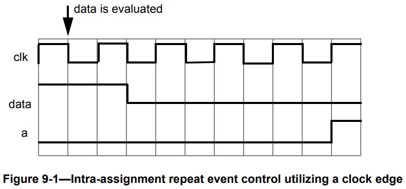

# 9. 进程
## 9.1 概述
本章描述以下内容：
 - 结构化过程（初始过程，总是过程，最终过程）
 - 块语句（begin-end 顺序块，fork-join 并行块）
 - 时序控制（延迟，事件，等待，内部赋值）
 - 过程线程和过程控制

## 9.2 结构化过程
所有 SystemVerilog 中的结构化过程都在以下结构之一中指定：
 - 初始过程，用关键字 `initial` 表示（见 9.2.1）
 - 总是过程，用以下关键字表示：
   - `always`（见 9.2.2.1）
   - `always_comb`（见 9.2.2.2）
   - `always_latch`（见 9.2.2.3）
   - `always_ff`（见 9.2.2.4）
 - `final` 过程，用关键字 `final` 表示（见 9.2.3）
 - 任务
 - 函数

这些结构化过程的语法 9-1 所示。

---
```verilog
initial_construct ::= initial statement_or_null // from A.6.2
always_construct ::= always_keyword statement 
always_keyword ::= always | always_comb | always_latch | always_ff
final_construct ::= final function_statement 
function_declaration ::= function [ lifetime ] function_body_declaration // from A.2.6
task_declaration ::= task [ lifetime ] task_body_declaration // from A.2.7
```
---
语法 9-1—结构化过程的语法（摘自附录 A）

初始过程和总是过程在仿真开始时启用。初始过程只执行一次，当语句执行完毕时，其活动将停止。相反，总是过程将重复执行，只有在仿真终止时，其活动才会停止。

初始过程和总是过程之间没有执行顺序的暗示。初始过程不需要在总是过程之前调度和执行。在模块中定义的初始过程和总是过程的数量没有限制。有关变量初始化的顺序与过程执行的顺序，请参见 6.8。

最终过程在仿真时间结束时启用，只执行一次。

任务和函数是从其他过程中的一个或多个位置启用的过程。任务和函数在第 13 章中描述。

除了这些结构化过程，SystemVerilog 还包含其他过程上下文，例如覆盖点表达式（19.5）、断言序列匹配项（16.10、16.11）和动作块（16.14）。

SystemVerilog 中有以下类型的过程控制流：
 - 选择、循环和跳转（见第 12 章）
 - 子程序调用（见第 13 章）
 - 顺序和并行块（见 9.3）
 - 时序控制（见 9.4）
 - 过程控制（见 9.5 到 9.7）

### 9.2.1 初始过程
初始过程只执行一次，当语句执行完毕时，其活动将停止。

以下示例说明了在仿真开始时初始化变量的初始过程的用法。

```verilog
initial begin
  a = 0; // 初始化 a
  for (int index = 0; index < size; index++)
    memory[index] = 0; // 初始化内存单元
end
```

初始过程的另一个典型用法是指定波形描述，该描述执行一次，以为正在模拟的电路的主要部分提供激励。

```verilog
initial begin
  inputs = 'b000000; // 在时间零初始化
  #10 inputs = 'b011001; // 第一个模式
  #10 inputs = 'b011011; // 第二个模式
  #10 inputs = 'b011000; // 第三个模式
  #10 inputs = 'b001000; // 最后一个模式
end
```

### 9.2.2 总是过程
总是过程有四种形式：`always`、`always_comb`、`always_latch` 和 `always_ff`。所有总是过程的形式都在仿真的整个持续时间内重复执行。

#### 9.2.2.1 通用总是过程
`always` 关键字表示通用总是过程，可用于表示诸如时钟振荡器之类的重复行为。该构造还可与适当的时序控制一起使用，以表示组合、锁存和顺序硬件行为。

通用 `always` 过程，由于其循环性质，仅在与某种形式的时序控制一起使用时才有用。如果 `always` 过程没有控制以使仿真时间前进，它将创建仿真死锁条件。

例如，以下代码创建了一个零延迟的无限循环：

```verilog
always areg = ~areg;
```

为前面的代码提供一个时序控制，创建一个潜在有用的描述，如下所示：

```verilog
always #half_period areg = ~areg;
```

#### 9.2.2.2 组合逻辑 always_comb 过程
SystemVerilog 提供了一个特殊的 `always_comb` 过程，用于建模组合逻辑行为。例如：

```verilog
always_comb
    a = b & c;

always_comb
    d <= #1ns b & c;
```

`always_comb` 过程提供的功能与通用 `always` 过程不同，如下所示：
 - 有一个隐含的敏感性列表，其中包括在 9.2.2.2.1 中定义的表达式。
 - 左侧赋值的变量不得被任何其他过程写入。但是，对变量的独立元素进行多次赋值是允许的，只要它们的最长静态前缀不重叠（见 11.5.3）。例如，一个未打包的结构或数组可以由一个 `always_comb` 过程赋值一个位，另一个位由另一个 `always_comb` 过程连续赋值，等等。有关更多详细信息，请参见 6.5。
 - 该过程在时间零后自动触发一次，此时所有初始和总是过程都已启动，以便过程的输出与输入一致。

软件工具应执行额外的检查，以警告如果 `always_comb` 过程中的行为不表示组合逻辑，例如如果可以推断出锁存行为。

##### 9.2.2.2.1 隐式 always_comb 敏感性
`always_comb` 的隐式敏感性列表包括在块内或在块内的任何调用的函数中读取的每个变量或选择表达式的最长静态前缀，以下情况除外：
 - 在块内或在块内的任何调用的函数中声明的任何变量的扩展
 - 在块内或在块内的任何调用的函数中写入的任何表达式

有关最长静态前缀的定义，参见 11.5.3。

层次函数调用和从包中的函数调用被分析为正常函数，就像调用静态方法函数的类作用域解析运算符（见 8.23）一样。对类对象的引用和类对象的方法调用不会为 `always_comb` 的敏感性列表增加任何内容，除非这些方法调用的参数表达式对这些方法调用的敏感性列表有贡献。

任务调用允许在 `always_comb` 中，但任务的内容不会为敏感性列表增加任何内容。

注意：不消耗时间的任务可以被 void 函数替换，以便对敏感性进行分析。

在过程中使用的立即断言（见 16.3）中的表达式，或在过程中调用的任何函数中使用的表达式，将作为 if 语句的条件使用，将为 `always_comb` 的隐式敏感性列表做出贡献。断言动作块中的表达式不会为 always_comb 的敏感性列表做贡献。在以下示例中，`always_comb` 应在 b、c 或 e 更改时触发。

```verilog
always_comb
begin
    a = b & c;
    A1:assert (a != e) else if (!disable_error) $error("failed");
end
```

##### 9.2.2.2.2 always_comb 与 always @* 的比较
SystemVerilog 的 always_comb 过程与 always @*（见 9.4.2.2）在以下方面有所不同：
 - always_comb 在时间零时自动执行一次，而 always @* 等待在推断的敏感性列表中的信号上发生变化。
 - always_comb 对函数内容内的更改敏感，而 always @* 仅对函数参数的更改敏感。
 - always_comb 中赋值左侧的变量，包括来自调用函数的变量，不得被任何其他过程写入，而 always @* 允许多个过程写入同一变量。
 - always_comb 中的语句不得包括阻塞、有阻塞时间或事件控制的语句，或 fork-join 语句。
 - always_comb 对过程中的立即断言中的表达式敏感，以及对调用过程中的函数中的表达式敏感，而 always @* 仅对过程中的立即断言中的表达式敏感。

#### 9.2.2.3 锁存逻辑 always_latch 过程
SystemVerilog 还提供了一个特殊的 `always_latch` 过程，用于建模锁存逻辑行为。例如：

```verilog
always_latch
    if(ck) q <= d;
```

always_latch 构造与 always_comb 构造相同，但软件工具应执行额外的检查，如果 always_latch 构造中的行为不表示锁存逻辑，则发出警告；同样，如果 always_comb 构造中的行为不表示组合逻辑，则发出警告。所有 9.2.2.2 中的语句都适用于 always_latch。

#### 9.2.2.4 时序逻辑 always_ff 过程
always_ff 过程可用于建模可综合的时序逻辑行为。例如：

```verilog
always_ff @(posedge clock iff reset == 0 or posedge reset) begin
    r1 <= reset ? 0 : r2 + 1;
    ...
end
```

always_ff 过程强制要求它包含一个且仅一个事件控制，没有阻塞时间控制。在 always_ff 过程中的赋值左侧的变量，包括来自调用函数的变量，不得被任何其他过程写入。

软件工具应执行额外的检查，以警告如果 always_ff 过程中的行为不表示时序逻辑。

### 9.2.3 最终过程
`final` 过程类似于 `initial` 过程，定义了一个过程块，除了它发生在仿真时间结束时并且没有延迟。最终过程通常用于显示关于仿真的统计信息。

最终过程中允许的唯一语句是允许在函数声明内的语句，以便它们在单个仿真周期内执行。与初始过程不同，最终过程不作为单独的进程执行；相反，它以零时间执行，作为单个进程的一系列函数调用。所有最终过程将以任意顺序执行。在所有最终过程执行完毕后，不会执行任何剩余的调度事件。

最终过程在由于显式或隐式调用 $finish 而结束仿真时执行。

```verilog
final
    begin
        $display("Number of cycles executed %d",$time/period);
        $display("Final PC = %h",PC);
    end
```

在最终过程中执行 $finish、tf_dofinish() 或 vpi_control(vpiFinish,...) 将导致立即结束仿真。最终过程仿真中只能触发一次。

最终过程应在指示仿真结束的 PLI 回调之前执行。

SystemVerilog 最终过程以任意但确定的顺序执行。这是可能的，因为最终过程仅限于函数允许的合法语句集。

注意：SystemVerilog 不指定最终过程执行的顺序，但实现应定义保持运行顺序的规则。这有助于保持输出日志文件稳定，因为最终过程主要用于显示统计信息。

## 9.3 块语句
*块语句* 是一种将语句组合在一起的方法，使其在语法上像单个语句一样运行。有两种类型的块，如下所示：
 - 顺序块，也称为 begin-end 块
 - 并行块，也称为 fork-join 块

顺序块应由关键字 `begin` 和 `end` 分隔。顺序块中的过程语句应按给定顺序顺序执行。

并行块应由关键字 `fork` 和 `join`、`join_any` 或 `join_none` 分隔。并行块中的过程语句应并行执行。

### 9.3.1 顺序块
*顺序块* 应具有以下特征：
 - 语句应按顺序执行，一个接一个地执行。
 - 每个语句的延迟值应相对于执行前一个语句的仿真时间进行处理。
 - 在最后一个语句执行后，控制应传出块。
  
语法 9-2 给出了顺序块的语法。
---
```verilog
seq_block ::= // from A.6.3
begin [ : block_identifier ] { block_item_declaration } { statement_or_null } 
end [ : block_identifier ] 
block_item_declaration ::= // from A.2.8
{ attribute_instance } data_declaration 
| { attribute_instance } local_parameter_declaration ;
| { attribute_instance } parameter_declaration ;
| { attribute_instance } overload_declaration 
| { attribute_instance } let_declaration
```
---
语法 9-2—顺序块的语法（摘自附录 A）

例1：顺序块使以下两个赋值具有确定性结果：
```verilog
begin
    areg = breg;
    creg = areg; // creg 存储 breg 的值
end
```

在执行第一个赋值之后，控制传递到第二个赋值之前，更新 areg。

例2：事件控制（见 9.4.2）可用于在顺序块中分隔两个赋值。
```verilog
begin
    areg = breg;
    @(posedge clock) creg = areg; // 延迟到时钟上的 posedge
end
```

例3：以下示例显示了如何使用顺序块和延迟控制的组合来指定时间顺序波形：
```verilog
parameter d = 50; // 将 d 声明为参数
logic [7:0] r; // 将 r 声明为 8 位变量

begin // 由顺序延迟控制控制的波形
    #d r = 'h35;
    #d r = 'hE2;
    #d r = 'h00;
    #d r = 'hF7;
end
```

### 9.3.2 并行块
fork-join *并行块* 构造使得可以从其并行语句创建并发进程。并行块应具有以下特征：
 - 语句应并行执行。
 - 每个语句的延迟值应相对于进入块的仿真时间进行处理。
 - 延迟控制可用于为赋值提供时间顺序。
 - 基于 join 关键字的类型，控制应在最后一个按时间顺序的语句执行时传出块。
 - 在函数调用内部有限制的使用（见 13.4）。

语法 9-3 给出了并行块的正式语法。
---
```verilog
par_block ::= // from A.6.3
fork [ : block_identifier ] { block_item_declaration } { statement_or_null } 
join_keyword [ : block_identifier ] 
join_keyword ::= join | join_any | join_none
block_item_declaration ::= // from A.2.8
{ attribute_instance } data_declaration 
| { attribute_instance } local_parameter_declaration ;
| { attribute_instance } parameter_declaration ;
| { attribute_instance } overload_declaration 
| { attribute_instance } let_declaration 
```
---
语法 9-3—并行块的语法（摘自附录 A）

可以指定一个或多个语句；每个语句应作为并发进程执行。fork-join 块中的时序控制不必按时间顺序排列。

以下示例使用并行块而不是顺序块编码了语法 9.3.1 中显示的波形描述。在变量上产生的波形对于两种实现完全相同。
```verilog
fork
    #50 r = 'h35;
    #100 r = 'hE2;
    #150 r = 'h00;
    #200 r = 'hF7;
join
```

SystemVerilog 提供了三种选择，用于指定父（forking）进程何时恢复执行，如表 9-1 所示。

表 9-1—fork-join 控制选项
| 选项 | 描述 |
| --- | --- |
| join | 父进程阻塞，直到此 fork 生成的所有进程完成。 |
| join_any | 父进程阻塞，直到此 fork 生成的任何一个进程完成。 |
| join_none | 父进程继续与此 fork 生成的所有进程并发执行。生成的进程不会开始执行，直到父线程执行阻塞语句或终止。 |

在定义 fork-join 块时，将整个 fork 封装在 begin-end 块中会导致整个块作为单个进程执行，每个语句按顺序执行。
```verilog
fork
    begin
        statement1; // 一个包含 2 个语句的进程
        statement2;
    end
join
```

以下示例分叉了两个进程。第一个进程等待 20 ns，第二个进程等待命名事件 eventA 触发。因为指定了 `join` 关键字，所以父进程将阻塞，直到 20 ns 已经过去并且 eventA 已经触发。
```verilog
fork
    begin
        $display( "First Block\n" );
        # 20ns;
    end
    begin
        $display( "Second Block\n" );
        @eventA;
    end
join
```

在 fork-join 块中的 return 语句是非法的，将导致编译错误。例如：
```verilog
task wait_20;
    fork
        # 20;
        return; // 非法：不能返回；任务存在于另一个进程
    join_none
endtask
```

在 fork-join 块的 block_item_declaration 中声明的变量应在进入其作用域之前和生成任何进程之前初始化为其初始化值表达式。

在 fork-join_any 或 fork-join_none 块中，除了在 fork 的 block_item_declaration 中声明的变量的初始化值表达式之外，不得引用通过引用传递的形式参数。这些变量对于由循环构造生成的进程中的唯一、每次迭代的数据非常有用。
```verilog
initial
    for( int j = 1; j <= 3; ++j ) 
        fork
            automatic int k = j; // j 的本地副本 k
            #k $write( "%0d", k ); 
        begin
            automatic int m = j; // m 的值是未确定的
            ...
        end
    join_none
```

上面的示例生成输出 123。

### 9.3.3 块开始和结束时间
顺序块和并行块都有开始和结束时间的概念。对于顺序块，开始时间是执行第一个语句时，结束时间是执行最后一个语句时。对于并行块，开始时间对于所有语句是相同的，结束时间由使用的 join 构造类型控制（见 9.3.2，表 9-1）。

顺序块和并行块可以相互嵌套，从而可以轻松地表达复杂的控制结构，并具有很高的结构性。当块相互嵌套时，块开始和结束时间的时机很重要。在块内部的语句执行完毕之前，不应继续执行块后面的语句，也就是说，直到块完全执行完毕之前，不应继续执行块后面的语句。

例1：以下示例显示了与 9.3.2 中示例中的语句相反的顺序编写的语句，仍然产生相同的波形。
```verilog
fork
    #200 r = 'hF7;
    #150 r = 'h00;
    #100 r = 'hE2;
    #50 r = 'h35;
join
```

例2：当要在发生两个单独的事件之后进行赋值时，即事件的连接时，fork-join 块可能很有用。
```verilog
begin
    fork
        @Aevent;
        @Bevent;
    join
    areg = breg;
end
```

两个事件可以以任何顺序发生（甚至在相同的仿真时间），fork-join 块将在两个事件发生后完成，并进行赋值。相反，如果 fork-join 块是 begin-end 块，并且 Bevent 在 Aevent 之前发生，那么块将等待下一个 Bevent。

例3：此示例显示了两个顺序块，每个块在其控制事件发生时执行。由于事件控制位于 fork-join 块内，它们并行执行，因此顺序块也可以并行执行。
```verilog
fork
    @enable_a
    begin
        #ta wa = 0;
        #ta wa = 1;
        #ta wa = 0;
    end
    @enable_b
    begin
        #tb wb = 1;
        #tb wb = 0;
        #tb wb = 1;
    end
join
```

### 9.3.4 块名称
顺序块和并行块都可以通过在关键字 begin 或 fork 后添加 : name_of_block 来命名。命名块会创建一个新的层次范围。块名称的命名有以下目的：
 - 它允许通过使用块名称在层次结构中引用局部变量、参数和命名事件。
 - 它允许在诸如 disable 语句（见 9.6.2）中引用块。

未命名的块仅在直接包含块项声明（例如变量声明或类型声明）的情况下创建新的层次范围。此层次范围是未命名的，其中声明的项目不能被层次引用（见 6.21）。

所有变量都应为静态；即，所有变量都有唯一的位置，并且离开或进入块不应影响存储在其中的值。

块名称为所有变量提供了一种在任何仿真时间唯一标识所有变量的方法。

在块 end、join、join_any 或 join_none 关键字之后也可以指定匹配的块名称，前面加上冒号。这有助于记录哪个 end 或 join、join_any 或 join_none 与哪个 begin 或 fork 相关联，当存在嵌套块时。块结束时的名称不是必需的。如果结束时的名称与开始时的名称不同，则应该是一个错误。

```verilog
begin: blockB // begin 或 fork 后的块名称
...
end: blockB 
```

类似地，匹配的块名称也可以在以下块 end 关键字之后指定，前面加上冒号：
 - endchecker（见 17.2）
 - endclass（见 8.3）
 - endclocking（见 14.3）
 - endconfig（见 33.4）
 - endfunction（见 13.4）
 - endgroup（见 19.2）
 - endinterface（见 25.3）
 - endmodule（见 23.2.1）
 - endpackage（见 26.2）
 - endprimitive（见 29.3）
 - endprogram（见 24.3）
 - endproperty（见 16.2）
 - endsequence（见 16.8）
 - endtask（见 13.3）

匹配的块名称也可以在 generate 块（见 27.3）的 end 关键字之后指定。结束时的名称不是必需的。如果结束时的名称与开始时的名称不同，则应该是一个错误。

### 9.3.5 语句标签
在任何过程语句（可以出现在 begin-end 块内的任何非声明语句）之前可以指定标签，就像在 C 中一样。语句标签用于标识单个语句。标签名称在语句之前指定，后跟一个冒号。

```verilog
labelA: statement
```

begin-end 或 fork-join 块被视为一个语句，并且可以在块之前有一个语句标签。在 begin 或 fork 关键字之前指定语句标签等效于在关键字之后指定一个块名称，并且在块 end、join、join_any 或 join_none 关键字之后可以指定匹配的块名称。例如：
```verilog
labelB: fork // begin 或 fork 之前的标签
...
join_none : labelB
```

在 begin 或 fork 之前指定标签和在 begin 或 fork 之后指定块名称是非法的。标签不能出现在 end、join、join_any 或 join_none 之前，因为这些关键字不构成一个语句。

在 `foreach` 循环上的标签，或者在变量声明为 for_initialization 的 `for` 循环上的标签，命名了由循环创建的隐式块。对于其他类型的语句，语句标签在语句周围创建一个命名的 begin-end 块，并创建一个新的层次范围。

在 generate begin-end 块（见 27.3）之前也可以指定标签。

在并发断言（见 16.5）之前也可以指定标签。

具有标签的语句可以使用 `disable` 语句禁用。禁用语句的行为应与禁用命名块的行为相同。有关禁用语句和过程控制的信息，请参见 9.6.2。

## 9.4 过程时序控制
SystemVerilog 有两种类型的显式时序控制，用于控制过程语句何时发生。第一种类型是 *延迟控制*，其中表达式指定了初始碰到语句和语句真正执行的时间间隔。延迟表达式可以是电路状态的动态函数，也可以是将语句执行分开的简单数字。延迟控制是在指定激励波形描述时的重要特性。在 9.4.1 和 9.4.5 中描述了延迟控制。

第二种类型的时序控制是 *事件表达式*，它允许语句执行延迟，直到在与此过程并发执行的过程中发生某个仿真事件。仿真事件可以是网或变量上的值变化（*隐式事件*），也可以是从其他过程触发的显式命名事件（*显式事件*）。最常见的情况是时钟信号上的正边沿或负边沿。事件控制在 9.4.2 到 9.4.5 中讨论。

到目前为止遇到的过程语句都是在不推进仿真时间的情况下执行的。仿真时间可以通过以下三种方法之一推进：
 - *延迟* 控制，由符号 # 引入
 - *事件* 控制，由符号 @ 引入
 - *等待* 语句，类似于事件控制和 while 循环的组合

三种过程时序控制方法在 9.4.1 到 9.4.5 中讨论。语法 9-4 显示了过程语句中的时序控制的语法。

---
```verilog
procedural_timing_control_statement ::= // from A.6.5
procedural_timing_control statement_or_null 
delay_or_event_control ::=
delay_control 
| event_control 
| repeat ( expression ) event_control 
delay_control ::= 
# delay_value 
| # ( mintypmax_expression )
event_control ::= 
@ hierarchical_event_identifier 
| @ ( event_expression )
| @*
| @ (*)
| @ ps_or_hierarchical_sequence_identifier 
event_expression31 ::= 
[ edge_identifier ] expression [ iff expression ] 
| sequence_instance [ iff expression ] 
| event_expression or event_expression 
| event_expression , event_expression 
| ( event_expression )
procedural_timing_control ::= 
delay_control 
| event_control
| cycle_delay 
...
wait_statement ::= 
wait ( expression ) statement_or_null 
| wait fork ;
| wait_order ( hierarchical_identifier { , hierarchical_identifier } ) action_block 
edge_identifier ::= posedge | negedge | edge // from A.7.4
// 31） 当使用位置绑定将包含逗号分隔的事件表达式作为实际参数传递时，括号是必需的。
```
---
语法 9-4——延迟和事件控制的语法（摘自附录 A）

门和线网延迟也推进仿真时间，在 28 章中讨论。

### 9.4.1 延迟控制
延迟控制之后的过程语句将在指定的延迟时间后执行。如果延迟表达式计算为未知或高阻值，则将其解释为零延迟。如果延迟表达式计算为负值，则将其解释为与时间变量相同大小的二补无符号整数。延迟表达式中允许指定参数。它们可以被 SDF 注释覆盖，此时表达式将被重新计算。

例1：以下示例通过 10 个时间单位延迟执行赋值。
```verilog
#10 rega = regb;
```

例2：下面的三个示例提供了一个在数字符号（`#`）后面提供的表达式。赋值的执行将延迟表达式指定的仿真时间量。
```verilog
#d rega = regb; // d 被定义为参数
#((d+e)/2) rega = regb; // 延迟是 d 和 e 的平均值
#regr regr = regr + 1; // 延迟是 regr 中的值
```

### 9.4.2 事件控制
过程语句的执行可以与网或变量上的值变化或声明事件的发生同步。值变化可以用作事件来触发语句的执行。这称为 *检测隐式事件*。事件也可以基于变化的方向，即向值 1（`posedge`）或向值 0（`negedge`）的方向。posedge 和 negedge 事件的行为如表 9-2 所示，并且可以描述如下：
 - *negedge* 在从 1 到 x、z 或 0 的转换以及从 x 或 z 到 0 的转换上检测
 - *posedge* 在从 0 到 x、z 或 1 的转换以及从 x 或 z 到 1 的转换上检测

表 9-2—检测 posedge 和 negedge
| 从 | 到 0 | 到 1 | 到 x | 到 z |
| --- | --- | --- | --- | --- |
| 0 | No edge | posedge | posedge | posedge |
| 1 | negedge | No edge | negedge | negedge |
| x | negedge | posedge | No edge | No edge |
| z | negedge | posedge | No edge | No edge |

除了 posedge 和 negedge 事件之外，SystemVerilog 还提供了一个 `edge` 事件，标识向 1 或 0 的变化。edge 事件的行为如下：
 - *edge* 在 `posedge` 或 `negedge` 上检测

隐式事件应当在表达式值的任何变化上检测。edge 事件应当在表达式的 LSB 的变化上检测。表达式的任何操作数的值变化，而表达式的结果没有变化，不应检测为事件。

以下示例显示了边缘控制语句的示例：
```verilog
@r rega = regb; // 由 reg r 中的任何值变化控制
@(posedge clock) rega = regb; // 由时钟上的 posedge 控制
forever @(negedge clock) rega = regb; // 由时钟上的 negedge 控制
forever @(edge clock) rega = regb; // 由时钟上的 edge 控制
```

如果表达式表示 `clocking` 块 `input` 或 `inout`（见 14 章），事件控制运算符使用同步值，即由时钟事件采样的值。表达式也可以表示时钟块名称（没有边缘限定符），以由时钟事件触发。

使用事件控制的变量可以是任何整数数据类型（见 6.11.1）或字符串。变量可以是简单变量或 `ref` 参数（通过引用传递的变量）；它可以是数组、关联数组或上述类型的对象（类实例）的成员。

事件表达式应返回单个值。聚合类型可以在表达式中使用，只要表达式缩减为单个值。对象成员或聚合元素可以是任何类型，只要表达式的结果是单个值。

如果事件表达式是对简单对象句柄或 `chandle` 变量的引用，则在写入该变量的值不等于其先前值时创建事件。

对象的非虚方法和聚合类型的内置方法或系统函数可以在事件控制表达式中使用，只要返回值的类型是单一的，并且该方法被定义为函数而不是任务。

更改对象数据成员的值、聚合元素的值或由方法或函数引用的动态大小数组的大小将导致重新计算事件表达式。即使成员未被方法或函数引用，实现也可以导致重新计算事件表达式，当值或大小发生变化时。

```verilog
real AOR[]; // 实数的动态数组
byte stream[$]; // 字节队列
initial wait(AOR.size() > 0) ....; // 等待数组被分配
initial wait($bits(stream) > 60)...; // 等待流中的总位数 大于 60

Packet p = new; // Packet 1 -- Packet 在 8.2 中定义
Packet q = new; // Packet 2
initial fork
@(p.status); // 等待 Packet 1 中的状态改变
@p; // 等待 p 的改变
# 10 p = q; // 触发 @p。
// @(p.status) 现在等待 Packet 2 中的状态改变，如果不是已经与 Packet 1 不同
join
```

#### 9.4.2.1 事件 or 操作符
任意数量的事件的逻辑或可以表示为一个表达式，以便任何一个事件的发生触发后续的过程语句。关键字 `or` 或逗号字符（`,`）用作事件逻辑或操作符。这两者的组合可以在同一事件表达式中使用。逗号分隔的敏感性列表应与 `or` 分隔的敏感性列表是同义的。

下面的两个示例显示了两个和三个事件的逻辑或，分别如下：
```verilog
@(trig or enable) rega = regb; // 由 trig 或 enable 控制
@(posedge clk_a or posedge clk_b or trig) rega = regb;
```

以下示例显示了逗号（`,`）作为事件逻辑或操作符的用法：
```verilog
always @(a, b, c, d, e)
always @(posedge clk, negedge rstn) 
always @(a or b, c, d or e)
```

#### 9.4.2.2 隐式事件表达式列表
事件表达式列表的不完整事件表达式是 RTL 仿真中常见的错误源。隐式事件表达式 `@*` 是一个方便的简写，通过将由 *过程时序控制语句* 的语句（可以是一个语句组）读取的所有网和变量添加到 *事件表达式*，消除了这些问题。

注意：`always_comb` 过程（见 9.2.2.2）优先于在 `always` 过程的开始处使用 `@*` 隐式事件表达式列表作为敏感性列表。有关 `always_comb` 和 `@*` 的比较，请参见 9.2.2.2.2。

出现在语句中的所有网和变量标识符都将自动添加到事件表达式，以下情况除外：
 - 仅出现在等待或事件表达式中的标识符。
 - 仅出现在赋值左侧的 *变量左值* 的 *hierarchical_variable_identifier* 中的标识符。

在赋值的右侧、子例程调用中、case 和条件表达式中、作为赋值左侧的索引变量或作为 case 项表达式中的线网和变量都应按照这些规则包括。

例1：
```verilog
always @(*) // 等效于 @(a or b or c or d or f)
    y = (a & b) | (c & d) | myfunction(f); 
```

例2：
```verilog
always @* begin // 等效于 @(a or b or c or d or tmp1 or tmp2)
    tmp1 = a & b; 
    tmp2 = c & d;
    y = tmp1 | tmp2;
end
```

例3：
```verilog
always @* begin // 等效于 @(b)
    @(i) kid = b; // i 不会添加到 @* 中
end
```

例4：
```verilog
always @* begin // 等效于 @(a or b or c or d)
    x = a ^ b;
    @* // 等效于 @(c or d)
        x = c ^ d;
end
```

例5：
```verilog
always @* begin // 与 @(a or en) 相同
    y = 8'hff;
    y[a] = !en;
end
```

例6：
```verilog
always @* begin // 与 @(state or go or ws) 相同
    next = 4'b0;
    case (1'b1)
        state[IDLE]: if (go) next[READ] = 1'b1;
        else next[IDLE] = 1'b1;
        state[READ]: next[DLY ] = 1'b1;
        state[DLY ]: if (!ws) next[DONE] = 1'b1;
        else next[READ] = 1'b1;
        state[DONE]: next[IDLE] = 1'b1;
    endcase
end
```

#### 9.4.2.3 有条件事件控制
`@` 事件控制可以有一个 `iff` 限定符。

```verilog
module latch (output logic [31:0] y, input [31:0] a, input enable);
    always @(a iff enable == 1)
        y <= a; // latch is in transparent mode
endmodule
```

事件表达式仅在 `iff` 之后的表达式为真时触发（如 12.4 中定义），在这种情况下，当 `enable` 等于 1 时触发。这种类型的表达式在 `a` 更改时计算，而不是在 `enable` 更改时评估。此外，在类似的事件表达式中，`iff` 优先于 `or`。通过使用括号可以使这一点更清晰。

#### 9.4.2.4 序列事件
序列实例可以在事件表达式中用于控制基于序列的成功匹配的过程语句的执行。这允许命名序列的结束点触发其他过程中的多个操作。语法 16-3 和语法 16-5 描述了声明命名序列和序列实例的语法。序列实例可以直接用于事件表达式，如语法 9-4 所示。

当在事件表达式中指定序列实例时，执行事件控制的过程将阻塞，直到指定序列达到其结束点。只要整个序列匹配，序列就达到其结束点。在检测到结束点的 Observed 区域之后，过程恢复执行。

以下示例显示了在事件控制中使用序列：
```verilog
sequence abc;
    @(posedge clk) a ##1 b ##1 c;
endsequence

program test;
    initial begin
        @ abc $display( "Saw a-b-c" );
        L1 : ...
    end
endprogram
```

在上面的示例中，当命名序列 `abc` 达到其结束点时，程序块 `test` 中的初始过程将解除阻塞，显示字符串 “Saw a-b-c”，然后继续执行标记为 L1 的语句。在这种情况下，序列的结束点充当触发器来解除事件的阻塞。

在事件控制中使用序列是实例化的（就像通过 `assert property` 语句一样）；事件控制用于同步到序列的结束点，而不管其开始时间。这些序列的参数应为静态的；用作序列参数的自动变量将导致错误。

### 9.4.3 电平敏感事件控制
过程语句的执行可以延迟到条件变为真。这是通过使用 `wait` 语句实现的，它是一种特殊形式的事件控制。wait 语句的本质是电平敏感的，与基本事件控制（由 `@` 字符指定）相反，后者是边缘敏感的。

`wait` 语句将计算一个条件；如果条件不为真（如 12.4 中定义），则 `wait` 语句后面的过程语句将保持阻塞状态，直到该条件在继续之前变为真。`wait` 语句的形式如语法 9-5 所示。

---
```verilog
wait_statement ::= // from A.6.5
wait ( expression ) statement_or_null 
| wait fork ;
| wait_order ( hierarchical_identifier { , hierarchical_identifier } ) action_block 
```
---
语法 9-5—wait 语句的语法（摘自附录 A）

以下示例显示了使用 `wait` 语句实现电平敏感事件控制的用法：
```verilog
begin
    wait (!enable) #10 a = b; 
    #10 c = d; 
end
```

如果在进入块时 `enable` 的值为 1，则 `wait` 语句将延迟对下一个语句（`#10 a = b;`）的计算，直到 `enable` 的值变为 0。如果在进入 begin-end 块时 `enable` 已经为 0，则在延迟 10 之后计算赋值 “a = b;” 并且不会发生额外的延迟。

有关过程控制的信息，请参见 9.6。

### 9.4.4 电平敏感序列控制
过程代码的执行可以延迟到序列终止状态为真。这是通过使用 `wait` 语句与返回命名序列的当前结束状态的内置方法相结合实现的：`triggered`。

`triggered` 序列方法在给定序列在当前时间步骤中（即在当前时间步骤中）达到其结束点时计算为真（1'b1），否则为假（1'b0）。序列的触发状态在 Observed 区域中设置，并在时间步骤的其余部分（即，直到仿真时间前进）中保持不变。

例如：
```verilog
sequence abc;
    @(posedge clk) a ##1 b ##1 c;
endsequence

sequence de;
    @(negedge clk) d ##[2:5] e;
endsequence

program check;
    initial begin
        wait( abc.triggered || de.triggered );
        if( abc.triggered )
            $display( "abc succeeded" );
        if( de.triggered )
            $display( "de succeeded" );
        L2 : ...
    end
endprogram
```

在上面的示例中，程序 check 中的 `initial` 过程等待命名序列 abc 或序列 de 达到其结束点。当任一条件计算为真时，`wait` 语句将解除阻塞过程，显示导致过程解除阻塞的序列，并继续执行标记为 L2 的语句。

有关序列方法的定义，请参见 16.9.11、16.13.6。

### 9.4.5 赋值内部时序控制
前面描述的延迟和事件控制构造在语句之前延迟其执行。相反，*赋值内部延迟和事件控制* 包含在赋值语句中，并修改活动的流程。本小节描述了赋值内部时序控制的目的和可用于赋值内部延迟的重复时序控制。

赋值内部延迟或事件控制将延迟新值的赋值到左侧，但右侧表达式将在延迟之前计算，而不是在延迟之后计算。赋值内部延迟和事件控制的语法如语法 9-6 所示。

---
```verilog
blocking_assignment ::= // from A.6.2
variable_lvalue = delay_or_event_control expression 
| ... 
nonblocking_assignment ::= 
variable_lvalue <= [ delay_or_event_control ] expression 
```
---
语法 9-6—赋值内部延迟和事件控制的语法（摘自附录 A）

delay_or_event_control 语法如语法 9-4 中所示在 9.4 中描述。

赋值内部延迟和事件控制可以应用于阻塞赋值和非阻塞赋值。*重复* 事件控制应指定指定事件的指定次数的赋值内部延迟。如果在计算时 *重复* 计数字面量或保存重复计数的有符号变量小于或等于 0，则赋值将像没有重复构造一样发生。

例如：
```verilog
repeat (3) @ (event_expression) // 将执行 event_expression 三次
repeat (-3) @ (event_expression) // 不执行 event_expression。
repeat (a) @ (event_expression) // 如果 a 被赋值为 -3，它将执行 event_expression，如果 a 被声明为无符号变量，但如果 a 是有符号的，则不执行
```

当事件必须与时钟信号的计数同步时，此构造很方便。

表 9-3 通过显示可以实现相同时序效果的代码，而不使用赋值内部时序控制，说明了赋值内部时序控制的哲学。

表 9-3—赋值内部时序控制等效性

| 赋值内部时序控制 | 无赋值内部时序控制 |
| --- | --- |
| `a = #5 b;` | `begin`<br>`    temp = b;`<br>`    #5 a = temp;`<br>`end` |
| `a = @(posedge clk) b;` | `begin`<br>`    temp = b;`<br>`    @(posedge clk) a = temp;`<br>`end` |
| `a = repeat(3) @(posedge clk) b;` | `begin`<br>`    temp = b;`<br>`    @(posedge clk);`<br>`    @(posedge clk);`<br>`    @(posedge clk) a = temp;`<br>`end` |

接下来的三个示例使用 fork-join 行为结构。所有位于关键字 fork 和 join 之间的语句并发执行。这种结构在 9.3.2 中有更详细的描述。

以下示例显示了一个竞争条件，可以通过使用赋值内部时序控制来防止：
```verilog
fork
    #5 a = b;
    #5 b = a;
join
```

在这个示例中，采样并设置 a 和 b 的值在同一仿真时间发生，从而创建了一个竞争条件。在下一个示例中，赋值内部时序控制有效地防止了这种竞争条件。
```verilog
fork // 数据交换
    a = #5 b;
    b = #5 a;
join
```

赋值内部时序控制有效，因为赋值内部延迟导致 a 和 b 的值在延迟之前计算，并导致在延迟之后进行赋值。

等待事件也是有效的。在下一个示例中，右侧表达式在遇到赋值语句时计算，但赋值被延迟到时钟信号的上升沿：
```verilog
fork // 数据移位
    a = @(posedge clk) b;
    b = @(posedge clk) c;
join
```

以下是将重复事件控制作为非阻塞赋值的赋值内部延迟的示例：
```verilog
a <= repeat(5) @(posedge clk) data;
```

图 9-1 说明了由此重复事件控制产生的活动。

图 9-1—利用时钟边沿的重复事件控制的赋值内部延迟

在这个示例中，当遇到赋值时，data 的值被计算。在五次 posedge clk 之后，a 被赋值为 data。

以下是将重复事件控制作为过程赋值的赋值内部延迟的示例：
```verilog
a = repeat(num) @(clk) data;
```

在这个示例中，当遇到赋值时，data 的值被计算。当 clk 的过渡次数等于 num 的值时，a 被赋值为 data。

以下是包含操作的表达式的重复事件控制的示例，用于指定事件发生的次数和计数的事件：
```verilog
a <= repeat(a+b) @(posedge phi1 or negedge phi2) data;
```

在这个示例中，当遇到赋值时，data 的值被计算。当 phi1 的正边沿和 phi2 的负边沿的总和等于 a 和 b 的总和时，a 被赋值为 data。即使 posedge phi1 和 negedge phi2 在相同的仿真时间发生，每个都将被检测并单独计数。

如果 phi1 和 phi2 引用相同的信号，则上面的赋值可以简化为：
```verilog
a <= repeat(a+b) @(edge phi1) data;
```

## 9.5 过程执行线程
SystemVerilog 为以下内容创建执行线程：
 - 每个 `initial` 过程
 - 每个 `final` 过程
 - 每个 `always`、`always_comb`、`always_latch` 和 `always_ff` 过程
 - 每个 `fork-join`（或 `join_any` 或 `join_none`）语句组中的每个并行语句
 - 每个动态过程

每个连续赋值也可以被视为自己的线程（见 10.3）。

## 9.6 过程控制
SystemVerilog 提供了构造，允许一个过程终止或等待其他过程的完成。`wait fork` 构造等待过程的完成。`disable` 构造停止命名块或任务内的所有活动，而不考虑父子关系（子过程可以终止父过程的执行，或一个过程可以终止与另一个无关的过程的执行）。`disable fork` 构造停止过程的执行，但考虑父子关系。

过程控制语句的语法形式如语法 9-7 所示。
---
```verilog
wait_statement ::= // from A.6.5
wait ( expression ) statement_or_null 
| wait fork ;
| wait_order ( hierarchical_identifier { , hierarchical_identifier } ) action_block 
disable_statement ::=
disable hierarchical_task_identifier ;
| disable hierarchical_block_identifier ;
| disable fork ;
```
---
语法 9-7—过程控制语句的语法（摘自附录 A）

### 9.6.1 wait fork 语句
`wait fork` 语句阻止过程执行流，直到所有直接子过程（由当前过程创建的过程，不包括它们的后代）完成其执行。

`wait fork` 的语法如下：
```verilog
wait fork ; // from A.6.5
```

指定 `wait fork` 会导致调用过程阻塞，直到所有直接子过程完成。

当没有任何活动时，仿真会自动终止。当所有程序块完成执行（即，它们到达执行块的末尾）时，仿真也会自动终止，而不考虑任何子过程的状态（见 24.7）。`wait fork` 语句允许程序块在退出之前等待所有并发线程完成。

在下面的示例中，在任务 `do_test` 中，首先生成了前两个过程，并且任务会阻塞，直到两个过程中的一个完成（`exec1` 或 `exec2`）。接下来，在后台生成了另外两个过程。`wait fork` 语句将阻止任务 `do_test` 的执行流，直到所有四个生成的过程完成，然后返回到其调用者。
```verilog
task do_test;
    fork
        exec1();
        exec2();
    join_any
    fork
        exec3();
        exec4();
    join_none
    wait fork; // 阻塞，直到 exec1 ... exec4 完成
endtask

### 9.6.2 disable 语句
`disable` 语句提供了终止与并发相关活动的能力，同时保持过程描述的结构化性。disable 语句提供了一种终止任务之前执行所有语句、从循环语句中退出或跳过语句以继续另一个循环迭代的机制。它对处理硬件中断和全局复位等异常条件很有用。`disable` 语句也可以用于终止标记语句，包括延迟断言（见 16.4）或过程并发断言（见 16.14.6）。

disable 语句将终止任务或命名块的活动。执行将在块或任务中的 `disable` 语句后的语句处恢复。所有在命名块或任务中启用的活动都将终止。如果任务启用语句嵌套（即，一个任务启用另一个任务，而那个任务又启用另一个任务），则禁用这样的任务将禁用链条向下的所有任务。如果任务启用多次，则禁用这样的任务将禁用任务的所有活动。

以下可以被任务初始化的活动的结果未指定，如果任务被禁用：
 - output 和 inout 参数的结果
 - 已调度但尚未执行的非阻塞赋值
 - 过程连续赋值（`assign` 和 `force` 语句）

`disable` 语句可以在块和任务中使用，用于禁用包含 `disable` 语句的块或任务。`disable` 语句可以用于禁用函数中的命名块，但不能用于禁用函数。在函数中使用 `disable` 语句禁用调用函数的块或任务时，行为是未定义的。在自动任务内部禁用自动任务的情况下，行为与常规任务的所有并发执行相同。

例1：这个例子说明了如何一个块禁用自己。
```verilog
begin : block_name
    rega = regb;
    disable block_name;
    regc = rega; // 这个赋值将永远不会执行
end
```

例2：这个例子展示了 `disable` 语句如何在命名块中使用，类似于前向 `goto`。`disable` 语句后执行的下一个语句是命名块后面的语句。
```verilog
begin : block_name
    ...
    ...
    if (a == 0)
        disable block_name;
    ...
end // 命名块结束
// 继续执行命名块后的代码
...
```

例3：这个例子说明了如何使用 `disable` 构造来终止执行不包含 `disable` 语句的命名块的执行。如果块当前正在执行，这将导致控制跳转到块后面的语句。如果块是循环体，则它的行为类似于 `continue`（见 12.8）。如果块当前未执行，则 `disable` 无效。
```verilog
module m (...); 
    always
    begin : always1 
        ... 
        t1: task1( ); // 任务调用
        ...
    end
    ...
    always
    begin
        ...
        disable m.always1; // 退出 always1，如果它当前正在执行
    end
endmodule
```

例4：这个例子展示了 `disable` 语句如何用作任务的提前返回。但是，使用 `disable` 语句在任务内部禁用自己不是 `return` 语句的简写（见 12.8）。

SystemVerilog 有从任务返回的 `return`，它将终止执行包含 `return` 的过程。如果 `disable` 应用于任务，则任务的所有当前活动执行都将被禁用。
```verilog
task proc_a;
    begin
        ...
        ...
        if (a == 0)
            disable proc_a; // 如果为真，则返回
        ...
        ...
    end
endtask
```

例5：这个例子展示了 `disable` 语句如何用作等效于两个语句 `continue` 和 `break`（见 12.8）。该示例说明了控制代码，允许命名块执行，直到循环计数达到 n 次或直到变量 a 设置为 b。命名块 outer_block 包含执行，直到 a == b 的代码，在 disable outer_block 语句结束那个块的地方。命名块 inner_block 包含执行循环的代码。每次这段代码执行 disable inner_block 语句时，inner_block 块终止，执行传递到下一个循环的开始。对于 inner_block 块的每次迭代，如果 a != 0，则执行一组语句。如果 a != b，则执行另一组语句。
```verilog
begin : outer_block
    for (i = 0; i < n; i = i+1)
    begin : inner_block
        @clk
        if (a == 0) // "continue" loop
            disable inner_block;
        ... // statements
        ... // statements
        @clk
        if (a == b) // "break" from loop
            disable outer_block;
        ... // statements
        ... // statements
    end
end
```

注意：C 类似的 `break` 和 `continue` 语句（见 12.8）可能是编写前面示例的更直观的方法。

例6：这个例子展示了 `disable` 语句如何用于在 reset 事件发生时同时禁用一系列定时控制和名为 action 的任务。该示例显示了一个 fork-join 块，其中包含一个命名的顺序块（event_expr）和一个 disable 语句，该语句等待 reset 事件发生。顺序块和等待 reset 并行执行。event_expr 块等待事件 ev1 和三个事件 trig 的发生。当这四个事件发生，加上 d 时间单位的延迟，任务 action 执行。当事件 reset 发生时，无论顺序块中的事件如何，fork-join 块终止，包括任务 action。
```verilog
fork
    begin : event_expr
        @ev1;
        repeat (3) @trig;
        #d action (areg, breg);
    end
    @reset disable event_expr;
join
```

例7：下一个例子是可重触发单稳态的行为描述。命名事件 retrig 重新启动单稳态时间周期。如果 retrig 在 250 个时间单位内继续发生，则 q 将保持为 1。
```verilog
always begin : monostable
    #250 q = 0;
end

always @retrig begin
    disable monostable;
    q = 1;
end
```

### 9.6.3 disable fork 语句
`disable fork` 语句终止调用过程的所有活动子过程。

`disable fork` 语句的语法如下：
```verilog
disable fork ; // from A.6.5
```

`disable fork` 语句终止调用过程的所有子过程，以及子过程的子过程。换句话说，如果任何子过程有自己的子过程，`disable fork` 语句将终止它们。

在下面的示例中，任务 `get_first` 生成了三个等待特定设备（1、7 或 13）的任务的版本。任务 `wait_device` 等待特定设备准备就绪，然后返回设备的地址。当第一个设备可用时，任务 `get_first` 将恢复执行并继续终止未完成的 `wait_device` 过程。
```verilog
task get_first( output int adr );
    fork
        wait_device( 1, adr );
        wait_device( 7, adr );
        wait_device( 13, adr );
    join_any
    disable fork;
endtask
```

`disable` 构造终止过程，当应用于由过程正在执行的命名块或语句时。`disable fork` 语句和 `disable` 语句的区别在于 `disable fork` 考虑过程的动态父子关系，而 `disable` 使用被禁用块的静态、语法信息。因此，`disable` 将终止执行特定块的所有过程，无论这些过程是否由调用线程分叉，而 `disable fork` 仅终止由调用线程分叉的过程。

## 9.7 细粒度过程控制
过程是一个内置类，允许一个过程在启动后访问和控制另一个过程。用户可以声明类型为 process 的变量，并安全地通过任务传递它们或将它们合并到其他对象中。process 类的原型如下：
```verilog
class process;
    typedef enum { FINISHED, RUNNING, WAITING, SUSPENDED, KILLED } state;
    static function process self();
    function state status();
    function void kill();
    task await();
    function void suspend();
    function void resume();
    function void srandom( int seed );
    function string get_randstate();
    function void set_randstate( string state );
endclass
```

类型为 process 的对象在启动过程时内部创建。用户不能创建 process 类型的对象；尝试调用 new 不会创建新的过程，而会导致错误。process 类不能被扩展。尝试扩展它将导致编译错误。类型为 process 的对象是唯一的；一旦底层过程终止并且对对象的所有引用都被丢弃，它们就可以被重用。

self() 函数返回对当前过程的句柄，即对调用的过程的句柄。

status() 函数返回过程状态，如 state 枚举所定义：
 - FINISHED 表示过程正常终止。
 - RUNNING 表示过程当前正在运行（不在阻塞语句中）。
 - WAITING 表示过程在阻塞语句中等待。
 - SUSPENDED 表示过程已停止等待恢复。
 - KILLED 表示过程被强制终止（通过 kill 或 disable）。

`kill()` 函数终止给定的过程及其子过程，即由被终止的过程生成的 fork 语句生成的过程。如果要终止的过程没有阻塞在其他条件上，例如事件、等待表达式或延迟，则该过程将在当前时间步骤的某个未指定时间终止。

`await()` 任务允许一个过程等待另一个过程的完成。调用此任务的当前过程上的调用将导致错误，即一个过程不能等待自己的完成。

`suspend()` 函数允许一个过程暂停自己的执行或另一个过程的执行。如果要暂停的过程没有阻塞在其他条件上，例如事件、等待表达式或延迟，则该过程将在当前时间步骤的某个未指定时间暂停。对同一（暂停的）过程多次调用此方法没有效果。

`resume()` 函数重新启动先前暂停的过程。对因另一条件阻塞而暂停的进程调用 resume，将使进程对事件表达式重新敏感，或等待等待条件为真或等待延迟到期。如果等待条件现在为真或最初的延迟已经发生，则进程被调度到 Active 区域或 Reactive 区域，在当前时间步长继续执行。在一个挂起自身的进程上调用 resume，会导致该进程继续执行挂起调用之后的语句。

kill()、await()、suspend() 和 resume() 方法应限制在由初始过程、always 过程或从这些过程中的 fork 块创建的过程上。

以下示例启动由任务参数 N 指定的任意数量的过程。接下来，任务等待最后一个过程开始执行，然后等待第一个过程终止。在那时，父进程强制终止尚未完成的所有 fork 过程。
```verilog
task automatic do_n_way( int N );
    process job[] = new [N];

    foreach (job[j])
        fork
            automatic int k = j;
            begin job[k] = process::self(); ... ; end
        join_none

    foreach (job[j]) // 等待所有过程开始
        wait( job[j] != null );

    job[1].await(); // 等待第一个过程完成

    foreach (job[j]) begin
        if ( job[j].status != process::FINISHED )
            job[j].kill();
    end
endtask
```
