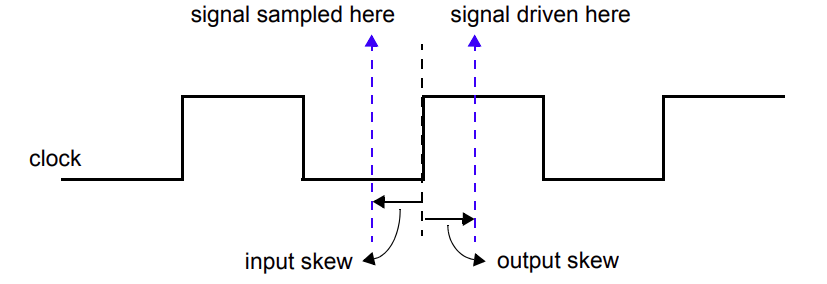

# 14. 时钟块
## 14.1 概述
本章描述以下内容：
 - 时钟块声明
 - 输入和输出偏移
 - 时钟块信号事件
 - 周期延迟
 - 同步事件
 - 同步驱动

## 14.2 总览
模块端口连接和接口可以指定测试台与被测设备（DUT）之间通信的信号或网络。然而，这种规范并没有明确地表示任何时序规则、同步要求或时钟范式。

*时钟块* 构造标识时钟信号并捕获被建模块的时序和同步要求。时钟块在关键字 `clocking` 和 `endclocking` 之间定义。

时钟块汇集了与特定时钟同步的信号，并使它们的时序明确。时钟块是基于周期的方法论的关键元素，它使用户能够在更高的抽象级别编写测试台。与其关注信号和时间转换，不如用周期和事务来定义测试。根据环境的不同，一个测试台可以包含一个或多个时钟块，每个时钟块包含自己的时钟和任意数量的信号。

时钟块将时序和同步细节与测试台的结构、功能和过程元素分离开来。因此，采样和驱动时钟块信号的时序是隐式的，相对于时钟块的时钟。这使得一组关键操作可以非常简洁地编写，而无需显式使用时钟或指定时序。这些操作如下：
 - 同步事件
 - 输入采样
 - 同步驱动

## 14.3 时钟块声明
时钟块的语法如下 14-1：
---
```verilog
clocking_declaration ::= // from A.6.11
[ default ] clocking [ clocking_identifier ] clocking_event ;
{ clocking_item } 
endclocking [ : clocking_identifier ] 
| global clocking [ clocking_identifier ] clocking_event ; endclocking [ : clocking_identifier ] 
clocking_event ::= 
@ identifier 
| @ ( event_expression )
clocking_item ::= 
default default_skew ;
| clocking_direction list_of_clocking_decl_assign ;
| { attribute_instance } assertion_item_declaration 
default_skew ::= 
input clocking_skew 
| output clocking_skew 
| input clocking_skew output clocking_skew 
clocking_direction ::= 
input [ clocking_skew ] 
| output [ clocking_skew ] 
| input [ clocking_skew ] output [ clocking_skew ] 
| inout
list_of_clocking_decl_assign ::= clocking_decl_assign { , clocking_decl_assign } 
clocking_decl_assign ::= signal_identifier [ = expression ] 
clocking_skew ::= 
edge_identifier [ delay_control ] 
| delay_control 
edge_identifier ::= posedge | negedge | edge // from A.7.4
delay_control ::= // from A.6.5
# delay_value 
| # ( mintypmax_expression )
```
---
语法 14-1—时钟块语法（摘自附录 A）

`delay_control` 应当是一个时间字面量或者一个计算为正整数值的常量表达式。

`clocking_identifier` 指定了被声明的时钟块的名称。只有默认时钟块可以没有名称。在未命名的时钟块中声明的内容不可被引用。

`signal_identifier` 指定了时钟块声明的范围内的信号（网络或变量），并定义了 *时钟变量*。指定的信号称为 *时钟信号*。除非使用了分层表达式（见 14.5），时钟信号和时钟变量的名称应当相同。时钟信号指定的信号不得指定为过程块（见 6.21）中的变量。

`clocking_event` 指定了一个特定事件作为时钟块的时钟。用于驱动和采样时钟块中的所有其他信号的时序由其时钟事件控制。有关采样和驱动时钟信号的精确时序语义的详细信息，请参见 14.13 和 14.16。

对于 `input` 方向的时钟变量写入是非法的。

对于 `output` 方向的时钟变量读取是非法的。

`inout` 方向的时钟变量应当被视为两个时钟变量，一个输入一个输出，具有相同的名称和相同的时钟信号。读取这样的 `inout` 时钟变量等效于读取相应的输入时钟变量。写入这样的 `inout` 时钟变量等效于写入相应的输出时钟变量。

`clocking_skew` 确定了信号距离时钟事件多少个时间单位被采样或驱动。输入偏移隐式为负，即，它们总是指向时钟之前的时间，而输出偏移总是指向时钟之后的时间（见 14.4）。当时钟事件指定了一个简单的边缘时，而不是一个数字时，偏移可以指定为信号的特定边缘。可以通过使用默认时钟项为整个块指定单个偏移。

```verilog
clocking ck1 @(posedge clk);
    default input #1step output negedge; // 合法
    // 输出在 clk 的下降沿驱动
    input ... ;
    output ... ;
endclocking

clocking ck2 @(clk); // 未指定边缘！
    default input #1step output negedge; // 合法
    input ... ;
    output ... ;
endclocking
```

分配给时钟变量的表达式指定与时钟块关联的信号与指定的分层表达式关联。例如，可以使用跨模块引用而不是本地端口。有关更多信息，请参见 14.5。

```verilog
clocking bus @(posedge clock1);
    default input #10ns output #2ns; 
    input data, ready, enable = top.mem1.enable;
    output negedge ack;
    input #1step addr;
endclocking
```

在上面的示例中，第一行声明了一个名为 bus 的时钟块，它在信号 clock1 的上升沿触发时钟。第二行指定默认情况下时钟块中的所有信号都使用 10ns 的输入偏移和 2ns 的输出偏移。下一行将三个输入信号 data、ready 和 enable 添加到时钟块中；最后一个信号引用了层次信号 top.mem1.enable。第四行将信号 ack 添加到时钟块中，并覆盖默认的输出偏移，以便 ack 在时钟的下降沿上驱动。最后一行将信号 addr 添加到时钟块中，并覆盖默认的输入偏移，以便 addr 在时钟的上升沿之前采样一步。

除非另有说明，默认的输入偏移是 1step，输出偏移是 0。一个步骤是一个特殊的时间单位，其值在 3.14.3 中定义。1step 的输入偏移允许输入信号在时钟事件之前的时间步中采样其稳态值（即，在前一个 Postponed 区域中）。

## 14.4 输入和输出偏移
输入（或双向）信号在指定的时钟事件处采样。如果指定了输入偏移，则信号将在时钟事件 *之前* 的 *偏移* 时间单位处采样。类似地，输出（或双向）信号在相应的时钟事件 *之后* 的 *偏移* 时间单位处驱动。图 14-1 显示了相对于时钟的正边缘的基本采样和驱动时间。


图 14-1—相对于时钟的正边缘的采样和驱动时间，包括偏移

偏移应当是一个常量表达式，并且可以作为参数指定。如果偏移没有指定时间单位，则使用当前时间单位。如果使用数字，则使用当前作用域的时间刻度解释偏移。

```verilog
clocking dram @(clk);
    input #1ps address;
    input #5 output #6 data;
endclocking
```

1step 的输入偏移表示信号将在前一个时间步的末尾采样。换句话说，采样的值始终是与相应时钟边缘之前的最后一个值。

注意：时钟块不会消除当一个程序块外的事件控制对与时钟块相同的时钟敏感，并且事件控制后的语句尝试读取时钟块成员时可能出现的竞争。竞争是在读取旧采样值和新采样值之间的竞争。

具有显式 `#0` 偏移的输入信号应当在与其相应的时钟块的相同时间采样，但为了避免竞争，它们在 Observed 区域中采样。同样，没有偏移（或显式 `#0` 偏移）的时钟块输出应当在与其指定的时钟事件相同时驱动，在 Re-NBA 区域中驱动。

偏移是声明性构造；因此，它们在语法上非常不同于类似的过程延迟语句。特别地，显式 `#0` 偏移不会挂起任何过程，也不会在 Inactive 区域执行或采样值。

## 14.5 分层表达式
时钟块中的任何信号都可以与任意分层表达式相关联。如 14.3 中所述，分层表达式通过附加一个等号（=）后跟分层表达式来引入：
```verilog
clocking cd1 @(posedge phi1);
    input #1step state = top.cpu1.state;
endclocking
```

然而，分层表达式不仅限于简单的名称或其他作用域中的信号。它们可以用于声明其他作用域或当前作用域中的信号的切片和串联（或二者的组合）。

```verilog
clocking mem @(clock);
    input instruction = { opcode, regA, regB[3:1] };
endclocking
```

在时钟块中，在其声明中指定给信号的任何表达式应是在端口连接到适当方向的端口时合法的表达式。任何在时钟 input 或 inout 声明中赋值给信号的表达式都应该是一个合法连接到模块输入端口的表达式。任何在时钟 output 或 inout 声明中赋值给信号的表达式都应该是一个合法连接到模块输出端口的表达式。

时钟 inout 声明不是一个 inout 端口；它是两个时钟声明的简写，一个输入一个输出，具有相同的信号。因此，这样的信号必须满足时钟输入和时钟输出的要求，但不需要满足连接到模块 inout 端口的更严格的要求。特别地，将变量指定为时钟 inout 信号是可以接受的。

## 14.6 多个时钟块中的信号
相同的信号——时钟、输入、inout 或输出——可以出现在多个时钟块中。当时钟块使用相同的时钟（或时钟表达式）时，它们应该共享相同的同步事件，就像几个锁存器可以由相同的时钟控制一样。输入语义见 14.13，输出语义见 14.16。

## 14.7 时钟块的作用域和生命周期
时钟块既是声明又是该声明的实例。不需要单独的实例化步骤。相反，为包含声明的块的每个实例创建一个副本（就像一个 always 过程）。一旦声明，时钟信号可以通过时钟块名称和点（.）运算符访问：
```verilog
dom.sig // 时钟 dom 中的信号 sig
```

多个时钟块不能嵌套。它们不能在函数、任务或包中声明，也不能在编译单元的所有声明之外声明。时钟块只能在模块、接口、检查器或程序中声明（见第 24 章）。

时钟块具有静态生命周期和作用域，局限于其封闭模块、接口或程序。

## 14.8 多个时钟块示例
在这个例子中，一个简单的测试程序包括两个时钟块。本例中使用的程序构造在第 24 章中讨论。
```verilog
program test( input phi1, input [15:0] data, output logic write,
              input phi2, inout [8:1] cmd, input enable
            );
    reg [8:1] cmd_reg;

    clocking cd1 @(posedge phi1);
        input data;
        output write;
        input state = top.cpu1.state;
    endclocking

    clocking cd2 @(posedge phi2);
        input #2 output #4ps cmd;
        input enable;
    endclocking

    initial begin
        // 程序从这里开始
        ...
        // 用户可以访问 cd1.data , cd2.cmd 等...
    end

    assign cmd = enable ? cmd_reg: 'x;

endprogram
```

测试程序可以被实例化并连接到一个 DUT（cpu 和 mem）。
```verilog
module top;
    logic phi1, phi2;
    wire [8:1] cmd; // 不能是 logic（两个双向驱动器）
    logic [15:0] data;
    test main (phi1, data, write, phi2, cmd, enable);
    cpu cpu1 (phi1, data, write);
    mem mem1 (phi2, cmd, enable);
endmodule
```

## 14.9 接口和时钟块
时钟块封装了一组共享相同时钟的信号；因此，使用 SystemVerilog `interface`（见第 25 章）可以显著减少连接测试台所需的代码量。此外，因为时钟块中的信号方向是相对于测试台而不是被测设计的，所以 `modport` 声明（见 25.5）可以适当地描述任一方向。一个测试程序可以包含在一个程序中，并且其端口可以是与每个时钟块中声明的信号相对应的接口。接口的线应当与从测试台侧（即 modport test）查看时钟块中指定的方向相同，从 DUT（即 modport dut）查看时相反。

例如，前面的例子可以使用接口重写如下：
```verilog
interface bus_A (input clk);
    logic [15:0] data;
    logic write;
    modport test (input data, output write);
    modport dut (output data, input write);
endinterface

interface bus_B (input clk);
    logic [8:1] cmd;
    logic enable;
    modport test (input enable);
    modport dut (output enable);
endinterface

program test( bus_A.test a, bus_B.test b );
    clocking cd1 @(posedge a.clk);
        input data = a.data;
        output write = a.write;
        inout state = top.cpu.state;
    endclocking

    clocking cd2 @(posedge b.clk);
        input #2 output #4ps cmd = b.cmd;
        input en = b.enable;
    endclocking

    initial begin
        // program begins here
        ...
        // user can access cd1.data, cd1.write, cd1.state,
        // cd2.cmd, and cd2.en
    end
endprogram
```

测试模块可以像以前一样实例化和连接：
```verilog
module top;
    logic phi1, phi2;

    bus_A a (phi1);
    bus_B b (phi2);

    test main (a, b);
    cpu cpu1 (a);
    mem mem1 (b);
endmodule
```

## 14.10 时钟块事件
时钟块的时钟事件可以直接使用时钟块名称获得，而不管用于声明时钟块的实际时钟事件是什么。

例如：
```verilog
clocking dram @(posedge phi1);
    inout data;
    output negedge #1 address;
endclocking
```

dram 时钟块的时钟事件可以用于等待特定事件：
```verilog
@(dram);
```

上面的语句等效于 @(posedge phi1)。

## 14.11 周期延迟：`##`
`##` 运算符可以用于延迟执行指定数量的时钟事件或时钟周期。

周期延迟语句的语法如下 14-2。
---
```verilog
procedural_timing_control_statement ::= // from A.6.5
procedural_timing_control statement_or_null 
procedural_timing_control ::= 
... 
| cycle_delay 
cycle_delay ::= // from A.6.11
## integral_number 
| ## identifier 
| ## ( expression )
```
---
语法 14-2—周期延迟语法（摘自附录 A）

表达式可以是任何计算为正整数值的 SystemVerilog 表达式。

什么构成一个周期是由实际的默认时钟决定（见 14.12）。如果当前模块、接口、检查器或程序没有指定默认时钟，则编译器应当发出错误。

例如：
```verilog
##5; // 使用默认时钟等待 5 个周期（时钟事件）
##(j + 1); // 使用默认时钟等待 j+1 个周期（时钟事件）
```

周期延迟时序控制应当等待指定数量的时钟事件。这意味着对于一个执行在当前时间步中不与关联的时钟事件同时发生的 `##1` 语句，调用进程将被延迟一个关联时钟周期的一部分。

`##0` 的周期延迟被特殊处理。如果在当前时间步中尚未发生时钟事件，则 `##0` 周期延迟将挂起调用进程，直到时钟事件发生。当一个进程执行 `##0` 周期延迟并且关联的时钟事件已经在当前时间步中发生时，进程将继续执行而不挂起。当用于同步驱动的右侧时，`##0` 周期延迟将不起作用，就好像它不存在一样。

周期延迟时序控制不得在阻塞或非阻塞赋值语句的内部使用。

## 14.12 默认时钟
一个时钟块可以被指定为给定模块、接口、程序或检查器中所有周期延迟操作的默认时钟。

默认时钟规范语句的语法如下 14-3。
---
```verilog
module_or_generate_item_declaration ::= // from A.1.4
... 
| default clocking clocking_identifier ;
... 
checker_or_generate_item_declaration ::= // from A.1.8
...
| default clocking clocking_identifier ;
... 
clocking_declaration ::= // from A.6.11
[ default ] clocking [ clocking_identifier ] clocking_event ;
{ clocking_item } 
endclocking [ : clocking_identifier ] 
... 
```
---
语法 14-3—默认时钟语法（摘自附录 A）

`clocking_identifier` 应当是一个时钟块的名称。

在一个模块、接口、程序或检查器中只能指定一个默认时钟。在同一个模块、接口、程序或检查器中指定默认时钟超过一次将导致编译器错误。

默认时钟仅在包含默认时钟规范语句的范围内有效。这个范围包括包含声明的模块、接口、程序或检查器以及任何嵌套的模块、接口或检查器。它不包括实例化的模块、接口或检查器。

例1：声明一个时钟为默认时钟：
```verilog
program test(input logic clk, input logic [15:0] data);
    default clocking bus @(posedge clk);
    inout data;
    endclocking
    initial begin
        ## 5;
        if (bus.data == 10)
            ## 1;
        else
        ...
    end
endprogram
```

例2：将现有时钟指定为默认时钟：
```verilog
module processor ... 
    clocking busA @(posedge clk1); ... endclocking
    clocking busB @(negedge clk2); ... endclocking
    module cpu( interface y );
        default clocking busA ;
        initial begin
            ## 5; // use busA => (posedge clk1)
            ...
        end
    endmodule
endmodule
```

## 14.13 输入采样
所有时钟块输入（input 或 inout）在相应的时钟事件处采样。如果输入偏移不是显式的 `#0`，则采样的值对应于时钟事件之前的偏移时间单位的时间步 Postponed 区域的信号值（见 14.4 的图 14-1）。如果输入偏移是显式的 `#0`，则采样的值对应于 Observed 区域中的信号值。在这种情况下，新采样的值应当在 Observed 区域处理结束时可供读取。如果在处理 Reactive 区域时，仿真必须在不推进时间的情况下处理 Active 事件（从而执行 Observed 区域多次），则采样偏移为 `#0` 的时钟输入不应当重新采样，除非在 active 区域集中发生新的时钟事件。

注意：当时钟事件由程序的执行触发时，更新时钟块输入值和未同步与对应时钟事件读取该值的程序之间存在潜在的竞争。当时钟块事件由模块内部触发时，这种竞争是不存在的。

在处理其指定的时钟事件时，时钟块应当在触发与时钟块名称相关联的事件之前更新其采样值。这个事件应当在 Observed 区域触发。因此，等待时钟块本身的进程保证读取更新的采样值，无论等待或触发进程在哪个调度区域执行。例如：
```verilog
clocking cb @(negedge clk);
    input v;
endclocking

always @(cb) $display(cb.v);

always @(negedge clk) $display(cb.v);
```

上面的第一个 always 过程保证显示信号 v 的更新采样值。相反，第二个 always 存在潜在的竞争，可能显示旧的或新的更新采样值。

当一个输入或 inout 时钟变量出现在任何表达式中时，它的值是信号的采样值；即，时钟块在最近的时钟事件中采样的值。

当相同的信号是多个时钟块的输入时，语义是直接的；每个时钟块使用自己的时钟事件采样相应的信号。

## 14.14 全局时钟
一个时钟块可以被声明为设计层次结构的全部或部分的全局时钟。全局时钟的主要目的是指定仿真中的哪个时钟事件对应于形式验证中使用的主系统时钟（见 F.3.1）。这样的规范可以用于整个设计，或者当有多个时钟并且构建单个全局时钟事件很具有挑战性时，可以分别为设计中的不同子系统进行规范。

全局时钟声明的语法如下 14-4。
---
```verilog
clocking_declaration ::= // from A.6.11
... 
| global clocking [ clocking_identifier ] clocking_event ; endclocking [ : clocking_identifier ] 
```
---
语法 14-4—全局时钟语法（摘自附录 A）

全局时钟可以在模块、接口、检查器或程序中声明。给定模块、接口、检查器或程序中最多可以包含一个全局时钟声明。全局时钟不得在 generate 块中声明。

虽然在设计层次结构的不同部分中可以出现多个全局时钟声明，但在精化设计层次结构的每个点上最多只有一个全局时钟声明有效。系统函数 `$global_clock` 应当用于显式引用有效全局时钟声明中的事件表达式。对于特定引用点，全局时钟声明的有效全局时钟声明使用以下层次查找规则确定。这些规则迭代地检查设计层次结构，以找到最接近引用点的全局时钟声明。
 - `a)` 查找封闭模块、接口、检查器或程序实例范围中的全局时钟声明。如果找到，则查找终止，结果为该全局时钟声明的事件表达式。如果未找到并且当前范围是顶层层次结构块（见 3.11），则查找终止，并且应当报告错误。否则，继续到步骤 b）。
 - `b)` 查找封闭实例化的父模块、接口或检查器范围中的全局时钟声明。如果找到，则查找终止，结果为该全局时钟声明的事件表达式。否则，继续向上查找，直到找到全局时钟声明或达到顶层层次结构块。如果未找到全局时钟声明并且达到顶层层次结构块，则查找终止，并且应当报告错误。

当全局时钟在序列声明、属性声明或作为命名序列实例、命名属性实例或检查器实例的实际参数引用时，引用点应当在 F.4.1 中定义的重写算法应用之后考虑。因此，当属性或序列声明在断言语句中实例化时，应当从源描述中的断言语句出现的点开始应用层次查找规则，而不是从序列或属性声明的点开始。类似地，在检查器体内部的实际参数的替换之后应用层次查找规则。

下面是一个全局时钟声明的示例：
```verilog
module top;
    logic clk1, clk2;
    global clocking sys @(clk1 or clk2); endclocking
    // ...
endmodule
```

在这个例子中，sys 被声明为全局时钟事件，并且只有当两个信号 clk1 和 clk2 中的任何一个发生变化时才会发生。在全局时钟声明中指定名称 sys 是可选的，因为全局时钟事件可以通过 `$global_clock` 引用。

在下面的例子中，设计层次结构包含两个全局时钟声明。在 top.sub1.common 中的 `$global_clock` 调用解析为时钟事件 top.sub1.sub_sys1。在 top.sub2.common 中的 `$global_clock` 调用解析为时钟事件 top.sub2.sub_sys2。
```verilog
module top; 
    subsystem1 sub1(); 
    subsystem2 sub2();
endmodule

module subsystem1; 
    logic subclk1; 
    global clocking sub_sys1 @(subclk1); endclocking
    // ... 
    common_sub common();
endmodule

module subsystem2; 
    logic subclk2; 
    global clocking sub_sys2 @(subclk2); endclocking
    // ... 
    common_sub common();
endmodule

module common_sub; 
    always @($global_clock) begin
    // ... 
    end
endmodule
```

在下面的例子中，属性 p 在包含全局时钟声明的模块中声明。然而，在实例化属性 p 的地方，该全局时钟声明在该点不起作用。与前面的例子类似，top.sub1.checks 中的 `$global_clock` 调用解析为时钟事件 top.sub1.sub_sys1，而 top.sub2.checks 中的 `$global_clock` 调用解析为时钟事件 top.sub2.sub_sys2。
```verilog
module top; 
    subsystem1 sub1(); 
    subsystem2 sub2();
endmodule

module subsystem1; 
    logic subclk1, req, ack; 
    global clocking sub_sys1 @(subclk1); endclocking
    // ... 
    common_checks checks(req, ack);
endmodule

module subsystem2; 
    logic subclk2, req, ack; 
    global clocking sub_sys2 @(subclk2); endclocking
    // ... 
    common_checks checks(req, ack);
endmodule

module another_module; 
    logic another_clk; 
    global clocking another_clocking @(another_clock); endclocking
    // ... 
    property p(req, ack); 
        @($global_clock) req |=> ack; 
    endproperty
endmodule

checker common_checks(logic req, logic ack); 
    assert property another_module.p(req, ack); 
endchecker
```

在下面的例子中，`$global_clock` 在任务中使用。在任务中对 `$global_clock` 的调用解析为时钟事件 another_module.another_clocking。
```verilog
module top; 
    subsystem1 sub1(); 
    subsystem2 sub2();
endmodule

module subsystem1; 
    logic subclk1, req, ack; 
    global clocking sub_sys1 @(subclk1); endclocking
    // ... 
    always another_module.t(req, ack);
endmodule

module subsystem2; 
    logic subclk2, req, ack; 
    global clocking sub_sys2 @(subclk2); endclocking
    // ... 
    always another_module.t(req, ack);
endmodule

module another_module; 
    logic another_clk; 
    global clocking another_clocking @(another_clk); endclocking
    task t(input req, input ack); 
        @($global_clock); 
        // ... 
    endtask
endmodule
```

下面的例子演示了在检查器参数中使用 `$global_clock` 的用法。在实际检查器参数替换相应的形式参数，并且在断言语句中展开属性之后，对 `$global_clock` 的所有调用被解析。在这个例子中，所有对 `$global_clock` 的调用都引用 top.check.checker_clocking 时钟事件。
```verilog
module top; 
    logic a, b, c, clk; 
    global clocking top_clocking @(clk); endclocking
    // ... 
    property p1(req, ack); 
        @($global_clock) req |=> ack; 
    endproperty
    property p2(req, ack, interrupt); 
        @($global_clock) accept_on(interrupt) p1(req, ack); 
    endproperty
    my_checker check(
        p2(a, b, c),
        @$global_clock a[*1:$] ##1 b);
endmodule

checker my_checker(property p, sequence s); 
    logic checker_clk; 
    global clocking checker_clocking @(checker_clk); endclocking
    // ... 
    assert property (p); 
    cover property (s);
endchecker
```

注意：这是这个标准与 IEEE Std 1800-2009 14.14 的一个不兼容的领域。在 2009 版本中，只允许在精化设计描述中声明一个全局时钟；它可以在任何模块、接口或检查器中指定，并且在描述中的任何地方引用。符合 IEEE Std 1800-2009 的设计可以在非顶层模块中定义全局时钟声明，并在描述中的该模块的子层次结构之外使用 `$global_clock`。这样的设计不符合本标准。

## 14.15 同步事件
显式同步通过事件控制运算符 `@` 完成，它允许一个进程等待特定信号值的变化或时钟事件（见 14.10）。

同步事件控制运算符的语法在 9.4.2 给出。

和事件控制一起使用的表达式可以表示时钟块输入（input 或 inout）或其切片。切片可以包括动态索引，这些索引在 `@` 表达式执行时计算一次。

以下是一些同步语句的示例：
 - 等待时钟块 ram_bus 的信号 ack_1 的下一个变化
```verilog
@(ram_bus.ack_l);
```
 - 等待时钟块 ram_bus 的下一个时钟事件
```verilog
@(ram_bus);
```
 - 等待信号 ram_bus.enable 的正边沿
```verilog
@(posedge ram_bus.enable);
```
 - 等待指定 1 位切片 `dom.sign[a]` 的下降沿
```verilog
@(negedge dom.sign[a]);
```
注意：索引 a 在运行时计算。
 - 等待 dom.sig1 的下一个正边沿或 dom.sig2 的下一个变化，以先发生者为准
```verilog
@(posedge dom.sig1 or dom.sig2);
```
 - 等待 dom.sig1 的下降沿或 dom.sig2 的正边沿，以先发生者为准
```verilog
@(negedge dom.sig1 or posedge dom.sig2);
```
 - 等待 dom.sig1 的边沿（无论是下降沿还是正边沿，以先发生者为准）
```verilog
@(edge dom.sig1);
```

或者等效地
```verilog
@(negedge dom.sig1 or posedge dom.sig1);
```

同步事件控制使用的值是同步值，即在相应时钟事件中采样的值。

## 14.16 同步驱动
时钟块输出（output 或 inout）用于驱动值到其相应的信号，但在指定的时间。换句话说，相应信号在指定的时钟事件上改变值，但受输出偏移的影响。

对于没有周期延迟的零偏移时钟块输出，同步驱动应当在对应时钟事件的 Re-NBA 区域中调度新值。对于具有非零偏移或具有非零周期延迟的时钟块输出，相应信号应当在未来时间步的 Re-NBA 区域中调度改变值。

对于每个目标是线网的时钟块输出，应当创建一个驱动器。这样创建的驱动器应当具有（`strong1`, `strong0`）驱动强度，并且应当像从时钟块内部的变量连续赋值一样更新。这个隐式变量对用户代码是不可见的，应当通过执行同步驱动到相应的时钟变量的 Re-NBA 区域来更新。创建的驱动器应当初始化为 `'z`；因此，驱动器对其目标线网没有影响，直到执行同步驱动到相应的时钟变量。

指定同步驱动的语法类似于赋值，并在语法 14-5 中显示。
---
```verilog
statement ::= [ block_identifier : ] { attribute_instance } statement_item // from A.6.4
statement_item ::= 
... 
| clocking_drive ;
clocking_drive ::= // from A.6.11
clockvar_expression <= [ cycle_delay ] expression 
cycle_delay ::= ## expression 
clockvar ::= hierarchical_identifier 
clockvar_expression ::= clockvar select 
```
---
语法 14-5—同步驱动语法（摘自附录 A）

`clockvar_expression` 是一个位选择、切片或整个时钟块输出，其相应的信号将被驱动（不允许串联）：
 - `dom.sig` // 整个时钟变量
 - `dom.sig[2]` // 位选择
 - `dom.sig[8:2]` // 切片

`expression`（在 `clocking_drive` 产生中）可以是任何与相应信号的类型赋值兼容的有效表达式。

出现在 `clocking_drive` 语句的右侧的可选 `cycle_delay` 结构类似于非阻塞赋值中的内部赋值延迟。就像非阻塞内部赋值延迟一样，它不应当导致执行语句阻塞。右侧表达式应当立即计算，即使存在 `cycle_delay`。然而，目标信号的更新应当延迟到目标时钟变量的时钟块的指定周期数，加上为该时钟变量指定的任何时钟输出偏移。

在同步驱动中不得使用其他形式的内部赋值延迟语法。

过程周期延迟，如 14.11 中所述，可以作为任何过程语句的前缀使用。如果过程周期延迟作为同步驱动的前缀使用，它应当阻塞其指定的默认时钟的指定周期数，就像它作为任何其他过程语句的前缀使用一样。

例：
```verilog
bus.data[3:0] <= 4'h5; // 在当前周期的 Re-NBA 区域中驱动数据

##1 bus.data <= 8'hz; // 等待 1 个默认时钟周期，然后驱动数据

##2; bus.data <= 2; // 等待 2 个默认时钟周期，然后驱动数据

bus.data <= ##2 r; // 记住 r 的值，然后在 2 个（bus）周期后驱动数据

bus.data <= #4 r; // 错误：同步驱动中不允许常规内部赋值延迟
```

无论同步驱动是在当前时钟事件上生效还是在未来时钟事件上生效，相应信号应当在由输出偏移指定的时候之后的时间更新。

一个驱动语句可能在不与其时钟事件同时发生的时间执行。这样的驱动语句应当在不阻塞的情况下执行，但应当像在下一个时钟事件的时间执行一样执行其驱动操作。右侧的表达式应当立即计算，但驱动的处理应当延迟到下一个时钟事件的时间。

例如：
```verilog
default clocking cb @(posedge clk); // 假设 clk 的周期为 #10 单位
    output v;
endclocking

initial begin
    #3 cb.v <= expr1; // 在周期 1 中成熟；等效于 ##1 cb.v <= expr1
end
```

写入时钟变量除了使用本子句中描述的同步驱动语法之外是错误的。因此，使用任何连续赋值、强制语句或过程连续赋值写入时钟变量是非法的。

### 14.16.1 驱动和非阻塞赋值
尽管同步驱动使用与非阻塞变量赋值相同的运算符语法，但它们并不相同。一个区别是同步驱动不支持内部赋值延迟语法。同步驱动到 inout 时钟变量的一个关键特性是驱动不会改变时钟块输入。这是因为读取输入始终产生最后采样的值，而不是驱动的值。

例如，考虑以下代码：
```verilog
clocking cb @(posedge clk);
    inout a;
    output b;
endclocking

initial begin
    cb.a <= c; // a 的值将在 Re-NBA 区域中改变
    cb.b <= cb.a; // b 被赋予 a 改变之前的值
end
```

### 14.16.2 驱动时钟输出信号
当在同一时钟块输出（或 inout）上的多个同步驱动调度在同一时间步的同一 Re-NBA 区域中成熟时，只有最后一个值被驱动到输出信号上。这是真实的，无论同步驱动是否在与时钟事件同时发生的时间上执行，或者在时钟事件之间的时间上执行（在同一时钟周期内）。

例如：
```verilog
default clocking pe @(posedge clk);
    output nibble; // 四位输出
endclocking

initial begin
    ##2; 
    pe.nibble <= 4'b0101;
    pe.nibble <= 4'b0011;
end
```

nibble 的驱动值是 `4'b0011`，无论 nibble 是变量还是线网。

调度 4.4 中描述的循环可能在同一时间步中的同一 Re-NBA 区域中迭代多次。如果这种情况发生，同步驱动将导致其关联的时钟块输出信号出现毛刺（即，在一个时间步中改变值多次），如果它们在调度循环的不同迭代中为其关联的时钟变量分配不同的值。

在下面的示例中，变量 a 将在 clk 的第一个 posedge 上出现毛刺 1 -> 0 -> 1。
```verilog
module m;
    bit a = 1'b1;
    default clocking cb @(posedge clk);
        output a; 
    endclocking

    initial begin
        ## 1;
        cb.a <= 1'b0;
        @(x); // x 由同一时间步中运行的反应性刺激触发
        cb.a <= 1'b1;
    end
endmodule
```

如果一个给定的时钟输出由多个同步驱动驱动，这些驱动被调度在不同的未来周期中，因为使用周期延迟，驱动将在各自的未来周期中成熟。

例如：
```verilog
bit v;
default clocking cb @(posedge clk);
    output v;
endclocking

initial begin
    ##1; // 等到周期 1
    cb.v <= expr1; // 在周期 1 中成熟，v 被赋予 expr1
    cb.v <= ##2 expr2; // 在周期 3 中成熟
    #1 cb.v <= ##2 expr3; // 在周期 3 中成熟
    ##1 cb.v <= ##1 expr4; // 在周期 3 中成熟，v 被赋予 expr4
end
```

当相同的变量是多个时钟块的输出时，最后一个驱动决定变量的值。这允许使用单一模块来模拟多速率设备，例如使用不同的时钟块来模拟每个活动边缘的 DDR 存储器。例如：
```verilog
reg j;

clocking pe @(posedge clk);
    output j;
endclocking

clocking ne @(negedge clk);
    output j;
endclocking
```

变量 j 是两个使用不同时钟事件的时钟块的输出，`@(posedge clk)` 和 `@(negedge clk)`。当驱动时，变量 j 将采用最近由任一时钟块分配的值。一个时钟块输出只在发生同步驱动的时钟周期中为其关联的信号分配一个值。

有了 `edge` 事件，这等效于以下简化声明：
```verilog
reg j;
clocking e @(edge clk);
    output j;
endclocking
```

驱动一个线网的多个时钟块输出会导致线网被驱动到其解析的信号值。如 14.16 中所述，当一个时钟块输出对应于一个线网时，将创建一个驱动器。这个语义模型适用于驱动线网的每个时钟块输出。这些驱动器的驱动值，以及线网的其他驱动器的驱动值，应当根据线网的类型确定。

可以使用过程赋值来分配与输出时钟变量关联的信号。当关联信号是变量时，过程赋值将为变量分配一个新值，变量将保持该值，直到发生另一个赋值（从时钟块输出驱动或另一个过程赋值）。

如果在同一时间步中的同一时间步中对同一个变量进行同步驱动和过程非阻塞赋值，则这些写入将以任意顺序进行。

当一个变量与连续赋值、过程连续赋值或原语一起使用时，当该变量与输出时钟变量相关联时，写入该变量是非法的。
