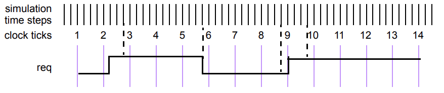
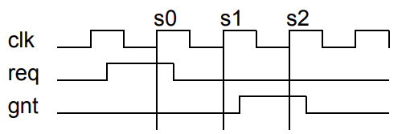

# 16. 断言
## 16.1 概述
本条款描述以下内容：
 - 立即断言
 - 并发断言
 - 序列规范
 - 属性规范

## 16.2 总览
断言指定系统的行为。断言主要用于验证设计的行为。此外，断言还可用于提供功能覆盖和标记用于验证的输入刺激不符合假定的要求。

断言出现为断言语句，指定要执行的验证功能。该语句应为以下类型之一：
 - `assert`，指定属性作为要检查的设计的义务，以验证该属性是否成立。
 - `assume`，将属性指定为环境的假设。仿真器检查属性是否成立，而形式工具使用该信息生成输入刺激。
 - `cover`，监视属性计算以进行覆盖。
 - `restrict`，将属性指定为形式验证计算的约束。仿真器不检查这个属性。

有两种类型的断言：*并发* 和 *立即*。
 - 立即断言遵循其执行的仿真事件语义，并像过程块中的语句一样执行。立即断言主要用于仿真。没有立即 `restrict` 断言语句。
 - 并发断言基于时钟语义，并使用其表达式的采样值。SystemVerilog 断言的一个目标是提供断言的共同语义含义，以便用于驱动各种设计和验证工具。许多工具，如形式验证工具，使用基于周期的语义评估电路描述，这些工具通常依赖于时钟信号或信号来驱动电路的评估。在时钟边缘之间的任何时间或事件行为都被抽象掉。并发断言包含这种时钟语义。虽然这种方法通常简化了电路描述的评估，但在许多情况下，这种基于周期的评估提供了与 SystemVerilog 标准事件评估不同的行为。
 
本章描述了这两种断言类型。

## 16.3 立即断言
立即断言语句是在过程代码中执行时对表达式的测试。表达式是非时间的，解释方式与过程 `if` 语句中的表达式相同。换句话说，如果表达式评估为 X、Z 或 0，则解释为 false，并且断言语句被认为失败。否则，表达式被解释为 true，并且断言语句被认为通过或等效地成功。

立即断言有两种模式，*简单立即断言* 和 *延迟立即断言*。在简单立即断言中，通过和失败操作在断言评估时立即发生。在延迟立即断言中，操作被延迟到时间步骤的后期，提供了一定程度的保护，防止对瞬态或“毛刺”值的意外多次执行。延迟立即断言在 16.4 中详细描述。

立即断言语句是 `statement_item`，可以在任何指定过程语句的地方指定。通过使用断言控制系统任务（见 20.12），可以控制立即断言的执行。
---
```verilog
procedural_assertion_statement ::= // from A.6.10
... 
| immediate_assertion_statement 
...
immediate_assertion_statement ::= 
simple_immediate_assertion_statement 
| deferred_immediate_assertion_statement 
simple_immediate_assertion_statement ::= 
simple_immediate_assert_statement 
| simple_immediate_assume_statement 
| simple_immediate_cover_statement 
simple_immediate_assert_statement ::= 
assert ( expression ) action_block 
simple_immediate_assume_statement ::= 
assume ( expression ) action_block 
simple_immediate_cover_statement ::= 
cover ( expression ) statement_or_null 
deferred_immediate_assertion_item ::= [ block_identifier : ] deferred_immediate_assertion_statement 
deferred_immediate_assertion_statement ::= 
deferred_immediate_assert_statement 
| deferred_immediate_assume_statement 
| deferred_immediate_cover_statement 
deferred_immediate_assert_statement ::= 
assert #0 ( expression ) action_block 
| assert final ( expression ) action_block 
deferred_immediate_assume_statement ::= 
assume #0 ( expression ) action_block 
| assume final ( expression ) action_block 
deferred_immediate_cover_statement ::= 
cover #0 ( expression ) statement_or_null 
| cover final ( expression ) statement_or_null 
action_block ::= // from A.6.3
statement _or_null 
| [ statement ] else statement_or_null 
```
---
语法 16-1—立即断言语法（摘自附录 A）

立即断言语句可以是立即 `assert`、立即 `assume` 或立即 `cover`。

立即 `assert` 语句指定其表达式必须保持。立即 `assert` 语句的失败表示违反了要求，因此设计中可能存在错误。如果 `assert` 语句失败且未指定 `else` 子句，则工具默认调用 `$error`，除非使用 `$assertcontrol` 控制类型 9（FailOff）来抑制失败。

立即 `assume` 语句指定其表达式被假定为保持。例如，立即 `assume` 语句可与形式验证工具一起使用，以指定对设计输入的约束，以约束验证计算。在这种情况下使用，它们指定设计环境的预期行为，而不是设计本身的行为。在仿真中，立即 `assume` 可以像立即 `assert` 一样行为，以验证环境是否符合假设。仿真工具应提供检查立即 `assume` 语句的能力。

立即 `assert` 或 `assume` 语句的 `action_block` 指定断言成功或失败时执行的操作。与成功关联的语句是第一个语句。它称为 *通过语句*，如果表达式评估为 true，则应执行。通过语句可以，例如，记录覆盖日志的成功次数，但也可以完全省略。如果省略通过语句，则当立即 `assert` 或 `assume` 语句的 `assert` 表达式为 true 时，不会执行任何用户指定的操作。与 `else` 关联的语句称为 *失败语句*，如果表达式评估为 false，则应执行。也可以省略 `else` 语句。`action_block` 应在立即 `assert` 或 `assume` 语句的 `assert` 表达式评估后立即启用执行。通过和失败语句的执行可以通过使用断言动作控制任务来控制。断言动作控制任务在 20.12 中描述。

立即 `cover` 语句指定其表达式的成功评估是覆盖目标。工具应收集覆盖信息，并在仿真结束时或通过断言 API（见第 39 章）按需报告结果。立即 `cover` 语句的覆盖结果应包含以下内容：
 - 评估次数
 - 成功次数

立即 `cover` 的通过语句可以在 `statement_or_null` 中指定。如果表达式评估为 true，则应执行通过语句。通过语句应在立即 `cover` 的表达式评估后立即启用执行。

可选的语句标签（标识符和冒号）在断言语句（或任何其他语句）周围创建了一个命名块，并且可以使用 `%m` 格式规范显示作用域的层次结构名称。

关于断言失败的信息可以使用以下严重性系统任务之一在 `action_block` 中打印：
 - `$fatal` 是运行时致命错误。
 - `$error` 是运行时错误。
 - `$warning` 是运行时警告。
 - `$info` 表示断言失败不具有特定严重性。

这些严重性系统任务的语法如 20.10 中所示。

严重性系统任务可以在断言通过或失败语句中使用。这些任务在通过或失败语句中使用时应打印相同的特定工具消息。例如：
```verilog
assert_f: assert(f) $info("passed"); else $error("failed");
assume_inputs: assume (in_a || in_b) $info("assumption holds");
else $error("assumption does not hold");
cover_a_and_b: cover (in_a && in_b) $info("in_a && in_b == 1 covered");
```

例如，形式验证工具可能在假设 `assume_inputs` 的前提下证明 `assert_f`，表达了 `in_a` 和 `in_b` 不同时为 0 的条件。`cover` 语句检测 `in_a` 和 `in_b` 是否同时为 1。

如果在活动块中包含多个这些系统任务，则应按照指定的方式执行每个任务。

如果在立即 `assert` 或 `assume` 失败时以外的时间执行严重性系统任务，则可以记录并以编程方式显示立即 `assert` 或 `assume` 的实际失败时间。例如：
```verilog
time t;

always @(posedge clk)
    if (state == REQ)
        assert (req1 || req2)
        else begin
            t = $time;
            #5 $error("assert failed at time %0t",t);
        end
```

如果立即 `assert` 在时间 10 失败，则错误消息将在时间 15 打印，但打印的用户定义字符串将是“assert failed at time 10”。

因为失败语句，就像通过语句一样，是任何合法的 SystemVerilog 过程语句，所以也可以用来向测试台的其他部分发出失败信号。
```verilog
assert (myfunc(a,b)) count1 = count + 1; else ->event1;
assert (y == 0) else flag = 1;
```

## 16.4 延迟断言
---
```verilog
immediate_assertion_statement ::= // from A.6.10
... 
| deferred_immediate_assertion_statement 
deferred_immediate_assertion_item ::= [ block_identifier : ] deferred_immediate_assertion_statement 
deferred_immediate_assertion_statement ::= 
deferred_immediate_assert_statement 
| deferred_immediate_assume_statement 
| deferred_immediate_cover_statement 
deferred_immediate_assert_statement ::= 
assert #0 ( expression ) action_block 
| assert final ( expression ) action_block 
deferred_immediate_assume_statement ::= 
assume #0 ( expression ) action_block 
| assume final ( expression ) action_block 
deferred_immediate_cover_statement ::= 
cover #0 ( expression ) statement_or_null 
| cover final ( expression ) statement_or_null 
```
---
语法 16-2—延迟立即断言语法（摘自附录 A）

延迟断言是立即断言的一种。它们可用于抑制由于组合输入的毛刺活动而发生的错误报告。由于延迟断言是立即断言的子集，因此 *延迟断言*（通常用于简洁）一词等效于 *延迟立即断言*。*简单立即断言* 一词指的是不是延迟的立即断言。此外，有两种不同类型的延迟断言：*观察到的延迟立即断言* 和 *最终延迟立即断言*。

延迟断言类似于简单立即断言，但具有以下关键区别：
 - 语法：延迟断言在验证指令后使用 #0（对于观察到的延迟断言）或 final（对于最终延迟断言）。
 - 延迟：报告被延迟，而不是立即报告。
 - 动作块限制：动作块只能包含单个子例程调用。
 - 在过程外部使用：延迟断言可以用作 `module_common_item`。
  
延迟断言语法类似于简单立即断言语法，不同之处在于在 `assert`、`assume` 或 `cover` 后指定 #0 或 `final`：
```verilog
assert #0 (expression) action_block
assert final (expression) action_block
```

与所有立即断言一样，延迟断言的表达式在处理延迟断言语句时进行评估。然而，为了便于避免毛刺，报告或动作块在当前时间步骤的后期安排。

延迟断言的 `action_block` 中的 `pass` 和 `fail` 语句（如果存在）应该分别包含单个子例程调用。子例程可以是任务、任务方法、void 函数、void 函数方法或系统任务。单个子例程调用的要求意味着 `pass` 或 `fail` 语句周围不应该有 `begin-end` 块，因为 `begin` 本身不是子例程调用。对于最终延迟断言，子例程应该是可以在 Postponed 区域（见 4.4.2.9）中合法调用的子例程。子例程参数可以通过值作为输入传递，也可以通过引用作为 `ref` 或 `const ref` 传递。按值传递的实际参数表达式，包括函数调用，应在评估延迟断言表达式时完全评估。将自动或动态变量作为实际参数传递给 ref 或 const ref 形式是错误的。动作块的处理在观察到的和最终延迟断言之间有所不同，如下所示：
 - 对于观察到的延迟断言，子例程应在 Reactive 区域中安排。通过引用传递的实际参数表达式使用或分配 Reactive 区域中底层变量的当前值。
 - 对于最终延迟断言，子例程应在 Postponed 区域中安排。通过引用传递的实际参数表达式使用 Postponed 区域中底层变量的当前值。

延迟断言也可以在过程代码之外使用，作为 `module_common_item`。这在 16.4.3 中有更详细的解释。

除了延迟 `assert` 语句，还定义了延迟 `assume` 和 `cover` 语句。除了如本节中所述的延迟评估之外，这些假设和覆盖语句的行为与 16.3 中描述的简单立即假设和覆盖语句相同。延迟假设通常在函数中检查组合条件，但需要将其用作形式工具的假设而不是验证目标。延迟覆盖对于避免将仅通过毛刺值通过的条件归功于测试是有用的。

### 16.4.1 延迟断言报告
当延迟断言通过或失败时，动作块不会立即执行。相反，动作块子例程调用（或 `$error`，如果断言失败且没有动作块）和其输入参数的当前值被放置在与当前执行的进程相关联的 *延迟断言报告队列* 中。这样的调用被称为 *挂起断言报告*。

如果进程达到 *延迟断言刷新点*（见 16.4.2），则其延迟断言报告队列将被清除。任何挂起的断言报告将不会被执行。

在每个仿真时间步骤的 Observed 区域中，每个未刷新其队列的挂起的观察到的延迟断言报告都将 *成熟*，或确认报告。一旦报告成熟，就不再能刷新。然后，在 Reactive 区域中执行相关的子例程调用（或 `$error`，如果断言失败且没有动作块），并从当前执行的进程的延迟断言报告队列中清除挂起的断言报告。

请注意，如果 Reactive 区域中的代码修改信号并导致再次进入 Active 区域，则这可能会导致观察到的延迟断言中的毛刺行为，因为 Active 区域中的新通行可能会重新执行某些延迟断言，并且具有不同的报告结果。通常，观察到的延迟断言防止由于过程执行顺序引起的毛刺，但不能防止由于 Reactive 区域的赋值可能导致的执行循环引起的毛刺。

在每个仿真时间步骤的 Postponed 区域中，每个未刷新其队列的挂起的最终延迟断言报告都将成熟。然后，在相同的 Postponed 区域中安排相关的子例程调用（或 `$error`，如果断言失败且没有动作块），并从当前执行的进程的延迟断言报告队列中清除挂起的断言报告。由于它们在非迭代的 Postponed 区域中执行，最终延迟断言不会受到之前描述的观察到的延迟断言可能引起的潜在毛刺行为的影响。

### 16.4.2 延迟断言刷新点
进程被定义为已达到延迟断言刷新点，如果发生以下情况之一：
 - 该进程，由于达到事件控制或等待语句，被挂起，然后恢复执行。
 - 该进程由 `always_comb` 或 `always_latch` 声明，并且由于其依赖信号的转换而恢复执行。
 - 该进程的最外层范围由 `disable` 语句禁用（见 16.4.4）。

下面的示例显示了如何使用延迟断言来避免由于单个仿真时间步骤中的过渡组合值而导致的失败报告：
```verilog
assign not_a = !a;
always_comb begin : b1
    a1: assert (not_a != a);
    a2: assert #0 (not_a != a); // 一旦值已经稳定，应该通过
end
```

当 `a` 改变时，仿真器可能会两次评估断言 `a1` 和 `a2`——一次是由于 `a` 的变化，一次是由于连续赋值的评估后 `not_a` 的变化。因此，在第一次执行 `a1` 时可能会报告失败。在第一次执行 `a2` 时，将在进程的延迟断言报告队列中安排失败。当 `not_a` 改变时，由于激活了 `b1`，延迟断言队列被刷新，因此不会报告 `a2` 的失败。

下面的示例说明了由于时间延迟的存在，延迟断言的行为：
```verilog
always @(a or b) begin : b1
    a3: assert #0 (a == b) rptobj.success(0); else rptobj.error(0, a, b); 
    #1;
    a4: assert #0 (a == b) rptobj.success(1); else rptobj.error(1, a, b);
end
```

在这种情况下，由于过程中的时间延迟，Observed 区域将始终在执行 `a3` 后和刷新点之前到达。因此，仿真器将始终报告 `a3` 的通过或失败。对于 `a4`，在执行后的周期中，如果 `a` 或 `b` 在执行后发生变化，将刷新失败，永远不会报告。通常，当与时间延迟混合使用时，必须小心使用延迟断言。

下面的示例说明了延迟覆盖语句的典型用法：
```verilog
assign a = ...;
assign b = ...;
always_comb begin : b1
    c1: cover (b != a);
    c2: cover #0 (b != a); 
end
```

在这个例子中，确保某些测试覆盖了 `a` 和 `b` 有不同值的情况是很重要的。由于仿真器中赋值的任意顺序，可能会出现这样的情况，即在两个变量都被赋值相同的值的周期中，当 `b1` 被执行时，`a` 已经被赋值，但 `b` 仍然保持其先前的值。因此，`c1` 将被触发，但这实际上是一个毛刺，可能不是一个有用的覆盖信息。在 `c2` 的情况下，这种覆盖将被添加到延迟报告队列中，但当 `b1` 再次执行时（在 `b` 也被赋值新值之后），该覆盖点将被刷新，因此 `c2` 将正确地在该时间步骤中未被报告为已覆盖。

下面的示例说明了一个情况，其中由于短路（见 11.3.5），延迟断言的结果可能乍看起来与时间步骤结束时的信号值不一致。
```verilog
function f(bit v);
    p: assert #0 (v);
    ...
endfunction
always_comb begin: myblk 
    a = b || f(c);
end
```

假设在某个时间步骤中发生以下事件序列：
 - `b` 被设置为 0，而 `c==1`，并且进入了 `myblk`。当调用 `f` 时，断言 `p` 具有通过值。
 - 后来在时间步骤中，`b` 在 1 处稳定，而 `c` 变为 0。当过程恢复时，将刷新之前的执行。这一次，由于短路，`f` 没有被评估——因此，断言 `p` 的新失败值从未被看到。
 - 在 Reactive 区域中，没有在断言 `p` 上报告通过或失败的执行。

注意—如果使用不允许短路的按位 `|` 运算符代替 `||`，则在到达赋值时每次都会评估 `f`。

下面的示例说明了对延迟断言动作块中的子例程参数的评估。
```verilog
function int error_type (int opcode);
    func_assert: assert (opcode < 64) else $display("Opcode error.");
    if (opcode < 32)
        return (0);
    else
        return (1);
endfunction

always_comb begin : b1
    a1: assert #0 (my_cond) else
        $error("Error on operation of type %d\n", error_type(opcode));
    a2: assert #0 (my_cond) else
        error_type(opcode);
    ...
end
```

假设块 `b1` 在单个时间步骤的 Active 区域中执行两次，`my_cond == 0`，因此两次失败断言 `a1` 和 `a2`。还假设 `opcode` 第一次执行时为 64，第二次为 0。在仿真期间将发生以下情况：
 - 在每次挂起的断言失败时，动作块的子例程参数被评估，即使动作块本身没有被执行。
   - 在第一次 `a1` 失败时，对 `$error` 的参数进行检查。由于第二个参数包含一个函数调用，因此该函数（`error_type(opcode)`，其中 `opcode=64`）被评估。在此函数调用期间，`func_assert` 失败并显示消息“Opcode error”。
   - 在第一次 `a2` 失败时，对 `error_type` 的参数进行检查。由于它的唯一参数是表达式 `opcode`，因此使用值 64，此时不需要进一步评估。
   - 带有 `opcode=64` 的挂起报告被放置在延迟断言报告队列中。
 - 当块 `b1` 再次执行时，挂起的报告从延迟断言报告队列中刷新。
   - 在第二次 `a1` 失败时，调用函数 `error_type`，`opcode==0`，因此断言 `func_assert` 通过。
   - 在第二次 `a2` 失败时，使用值 0 作为表达式 `opcode`，此时不需要进一步评估。
 - 当断言最终成熟时，将调用 `$error` 以报告 `a1` 的失败，并调用函数 `error_type` 以报告 `a2` 的失败。

推迟和刷新防止了对 a1 的第一次失败的报告。但是，对于延迟断言的动作块子例程参数的评估，即使动作块本身没有被执行，也会在每次失败时发生。通常，用户必须谨慎处理延迟断言的动作块子例程参数，因为在每次失败时对它们进行评估可能与推迟在某些用法中不一致。

下面的示例说明了观察到的延迟断言和最终延迟断言之间的差异。
```verilog
module dut(input logic clk, input logic a, input logic b);
    logic c;
    always_ff @(posedge clk)
        c <= b;
    a1: assert #0 (!(a & c)) $display("Pass"); else $display("Fail");
    a2: assert final (!(a & c)) $display("Pass"); else $display("Fail");
endmodule

program tb(input logic clk, output logic a, output logic b);
    default clocking m @(posedge clk);
        default input #0;
        default output #0;
        output a;
        output b;
    endclocking

    initial begin
        a = 1;
        b = 0;
        ##10;
        b = 1;
        ##1;
        a = 0;
    end
endprogram
```

在第 11 个时钟周期，观察到的延迟断言 `a1` 将首先在 Active 区域执行，并且将失败，因为此时 `a` 和 `c` 都为 1。此挂起的断言报告将在 Observed 区域成熟，并在 Reactive 区域中安排失败报告。然而，在同一时间步骤的 Reactive 区域中，测试台将 `a` 设置为 0，触发了隐式包含断言 `a1` 的 always_comb 块的执行。这次 `a1` 将通过。因此，在这个时间步骤中，将为 `a1` 显示通过和失败消息。

对于最终延迟断言 `a2`，行为将不同。与 `a1` 一样，当断言在 Active 区域失败时，将生成一个挂起的断言报告。然而，当 Reactive 区域中的值发生变化并且断言的隐式 always_comb 恢复时，这将创建一个刷新点，因此此挂起报告将被刷新。`a2` 将使用新值再次执行，并将新结果放入延迟断言报告队列。在 Postponed 区域中，这将成熟，并且将报告此断言的最终通过结果。

### 16.4.3 过程代码之外的延迟断言
延迟断言语句也可以出现在过程代码之外，此时称为 *静态延迟断言*。在这种情况下，它被视为包含在 `always_comb` 过程中。例如：
```verilog
module m (input a, b);
    a1: assert #0 (a == b);
endmodule
```

这等效于以下内容：
```verilog
module m (input a, b);
    always_comb begin
        assert #0 (a == b);
    end
endmodule
```

17.3 描述了检查器中的静态延迟断言。

### 16.4.4 禁用延迟断言
`disable` 语句应与延迟断言交互如下：
 - 可以禁用特定的延迟断言。取消该断言的所有挂起的断言报告。
 - 当应用于具有活动延迟断言队列的过程的最外层范围时，除了正常的禁用活动（见 9.6.2）之外，还会刷新延迟断言报告队列，并清除队列中的所有挂起断言报告。

禁用任务或过程的非最外层范围不会导致刷新任何挂起的报告。

下面的示例说明了用户代码如何显式刷新挂起的断言报告。在这种情况下，只有在 `bad_val_ok` 未稳定为 1 的值时，`a1` 的失败才会报告。
```verilog
always @(bad_val or bad_val_ok) begin : b1
    a1: assert #0 (bad_val) else $fatal(1, "Sorry"); 
    if (bad_val_ok) begin
        disable a1;
    end
end
```

下面的示例说明了用户代码如何显式刷新进程 `b2` 的延迟断言报告队列中的所有挂起报告：
```verilog
always @(a or b or c) begin : b2
    if (c == 8'hff) begin
        a2: assert #0 (a && b);
    end else begin
        a3: assert #0 (a || b);
    end
end

always @(clear_b2) begin : b3
    disable b2;
end
```

### 16.4.5 延迟断言和多个进程
如前面的子章节所述，延迟断言与执行它们的过程紧密相关。这意味着在函数中的延迟断言可能会由于函数被多个不同的进程调用而执行多次，而每个这些不同的进程执行是独立的。以下示例说明了这种情况：
```verilog
module fsm(...);
    function bit f (int a, int b)
    ...
        a1: assert #0 (a == b);
    ...
    endfunction
    ...
    always_comb begin : b1
        some_stuff = f(x,y) ? ...
    ...
    end
    always_comb begin : b2
        other_stuff = f(z,w) ? ...
    ...
    end
endmodule
```

在这种情况下，有两个不同的进程可能调用断言 `a1`：`b1` 和 `b2`。假设仿真执行以下场景：
 - 在第一个时间步骤中，`b1` 执行，`x!=y`，`b2` 执行，`z!=w`。
 - 在第二个时间步骤中，`b1` 执行，`x!=y`，然后再次执行，`x==y`。
 - 在第三个时间步骤中，`b1` 执行，`x!=y`，然后 `b2` 执行，`z==w`。

在第一个时间步骤中，由于 `a1` 对 `b1` 和 `b2` 独立失败，因此报告了两次失败。

在第二个时间步骤中，由于 `b1` 中的 `a1` 失败在重新触发时被刷新，因此不会报告失败。在 `b2` 中，断言通过，因此不会报告失败。

在第三个时间步骤中，`b1` 中的失败不会看到刷新点，因此报告失败。在 `b2` 中，断言通过，因此不会报告失败。

## 16.5 并发断言概述
并发断言描述了跨时间的行为。与立即断言不同，评估模型基于时钟，因此仅在时钟节拍发生时评估并发断言。

并发断言使用其表达式的采样值，除了禁用条件（见 16.15）和时钟事件。表达式采样在 16.5.1 中解释。并发断言在 Observed 区域中评估。

### 16.5.1 采样
并发断言和其他几个构造（例如检查器中的 always_ff 过程中引用的变量，见 17.5）对其表达式的值有特殊规则。在这些构造中对表达式的采样值称为 *采样值*。在大多数情况下，表达式的采样值是其在 Preponed 区域的值。然而，这个规则有几个重要的例外。以下是采样的正式定义。

表达式的默认采样值定义如下：
 - 静态变量的默认采样值是其声明中分配的值，或者在缺乏这样的分配时，是相应类型的默认值（见 6.8，表 6-7）。
 - 任何其他变量或网络的默认采样值是相应类型的默认值（见 6.8，表 6-7）。例如，逻辑类型变量 y 的默认采样值是 1'bx。
 - triggered 事件属性（见 15.5.3）和序列方法 triggered 和 matched 的默认采样值为 false（1'b0）。
 - 表达式的默认采样值通过递归地使用其组成子表达式和变量的默认采样值来定义。

默认采样值在定义表达式的采样值时使用，如下所示，并在时间 0 之前需要引用表达式的采样值时使用采样值函数（见 16.9.3）。

变量采样值的定义基于变量采样值的定义。变量采样值的一般规则如下：
 - 时间大于 0 的时间槽中的变量的采样值是该变量在该时间槽的 Preponed 区域中的值。
 - 时间 0 的时间槽中的变量的采样值是其默认采样值。

这个规则有以下例外：
 - 自动变量（见 16.14.6）、局部变量（见 16.10）和活动自由检查器变量（见 17.7.2）的采样值是它们的当前值。然而，
   - 当采样值函数引用活动自由检查器变量的过去或未来值时（见 16.9.3 和 16.9.4），这个值在相应的过去或未来时钟节拍的 Postponed 区域中被采样；
   - 当采样值函数引用自动变量的过去或未来值时，将取当前自动变量的值。
 - 如果变量是时钟块的输入变量，则变量应该通过 #1 步长采样由时钟块变量产生的采样值。时钟块变量的任何其他类型的采样都会导致错误。这在第 14 章中有解释。

表达式的采样值定义如下：
 - 由单个变量组成的表达式的采样值是该变量的采样值。
 - const 强制转换表达式（见 6.24.1 和 16.14.6）的采样值定义为其参数的当前值。例如，如果 a 是一个变量，则 const'(a) 的采样值是 a 的当前值。当采样值函数引用 const 强制转换表达式的过去或未来值时，将取当前此表达式的值。
 - triggered 事件属性和序列方法 triggered 和 matched（见 16.13.6）的采样值定义为事件属性或序列方法返回的当前值。当采样值函数引用事件属性或序列方法的过去或未来值时，将在相应的过去或未来时钟节拍的 Postponed 区域中采样此值。
 - 任何其他表达式的采样值通过使用其参数的值递归地定义。例如，由 e1 和 e2 组成的表达式 e1 & e2 的采样值是 e1 和 e2 的采样值的按位 AND。特别地，如果表达式包含函数调用，为了评估此表达式的采样值，将在表达式评估时调用函数，并在表达式评估时使用其参数的采样值。例如，如果 a 是一个静态模块变量，s 是一个序列，f 是一个函数，则 f(a, s.triggered) 的采样值是 f 应用于 a 和 s.triggered 的采样值的结果，即从 Preponed 中取 a 的值。

### 16.5.2 断言时钟
并发断言规范中使用的时序模型基于时钟节拍，并使用时钟周期的广义概念。时钟的定义由用户明确指定，可以在一个表达式中与另一个表达式不同。

*时钟节拍* 是一个原子时间点，本身不跨越时间段。时钟只在任何仿真时间点上打拍一次，并且在时钟节拍上采样的值用于评估并发断言。在断言中，采样值是时钟节拍上的变量的唯一有效值。图 16-1 显示了随着时钟的进行变量的值。变量 req 在时钟节拍 1 和 2 时的值为低。在时钟节拍 3 时，值被采样为高，并保持高直到时钟节拍 6。在时钟节拍 6 时，变量 req 的采样值为低，并保持低直到时钟节拍 9，包括时钟节拍 9。请注意，仿真值在时钟节拍 9 时转换为高。然而，在时钟节拍 9 时的采样值为低。


图 16-1—在仿真时间步骤中采样变量

断言中的表达式始终与一个时钟定义相关，除了使用过程代码中的常量或自动值（见 16.14.6）。采样值用于评估值变化表达式或布尔子表达式，这些表达式用于确定序列的匹配。

对于并发断言，以下声明适用：
 - 定义的时钟行为无毛刺非常重要。否则，可能会采样错误的值。
 - 如果在时钟表达式中出现的变量也在断言中的表达式中出现，则两个变量的值可能不同。变量的当前值用于时钟表达式，而变量的采样值用于断言中。

控制序列评估的时钟表达式可以比只是一个信号名更复杂。例如，可以使用 (clk && gating_signal) 和 (clk iff gating_signal) 表达一个门控时钟。其他更复杂的表达式也是可能的。然而，为了验证系统的正确行为并尽可能接近真正的基于周期的语义，用户应确保时钟表达式无毛刺，并且在任何仿真时间上只转换一次。

引用 `$global_clock`（见 14.14）被理解为引用 `global clocking` 声明中定义的 *时钟事件*。全局时钟与任何其他时钟事件一样。然而，在形式验证中，`$global_clock` 具有额外的意义，因为它被认为是主要的系统时钟（见 F.3.1）。因此，在以下示例中：
```verilog
global clocking @clk; endclocking
    ...
assert property(@$global_clock a);
```

断言说明 a 在全局时钟的每个节拍上都为真。这个断言在逻辑上等同于：
```verilog
assert property(@clk a);
```

并发断言的一个示例如下：
```verilog
base_rule1: assert property (cont_prop(rst,in1,in2)) $display("%m, passing"); 
else $display("%m, failed");
```

关键字 `property` 将并发断言与立即断言区分开来。并发断言的语法在 16.14 中讨论。

## 16.6 布尔表达式
表达式的评估结果是布尔值，以 if 语句中的表达式的方式解释。换句话说，如果表达式评估为 X、Z 或 0，则解释为假。否则，为真。

出现在并发断言中的表达式必须满足以下要求：
 - 表达式的结果是与整数类型转换兼容的类型。子表达式不需要满足此要求，只要整体表达式与整数类型兼容即可。
 - 动态数组、队列和关联数组的元素用于断言表达式的评估，可能在断言表达式评估之前从数组中删除，或者数组可能在断言表达式评估之前调整大小。这些用于断言表达式评估的特定数组元素应在断言的范围内继续存在，直到断言表达式评估完成。
 - 出现在过程并发断言中的表达式可以引用 16.14.6.1 中描述的自动变量。否则，出现在并发断言中的表达式不得引用自动变量。
 - 表达式不得引用非静态类属性或方法。
 - 表达式不得引用 chandle 数据类型的变量。
 - 具有局部变量作为 variable_lvalue 的序列匹配项可以使用 C 赋值、增量和减量运算符。否则，表达式的评估不得有任何副作用（例如，不允许增量和减量运算符）。
 - 表达式中的函数不得包含输出或 ref 参数（const ref 是允许的）。
 - 函数应为自动（或不保留状态信息）并且不得具有任何副作用。

并发断言中应当小心访问大型数据结构，特别是大型动态数据结构。一些类型的访问可能需要创建整个数据结构的副本，这可能会导致显著的性能损失。以下示例说明了复制整个数据结构可能怎样出现。在 p1 中，只有一个字节的 q 必须由断言采样，而且该字节的位置是固定的。然而，在 p2 中，将有多个具有潜在不同 l_b 值的活动线程。这增加了确定要采样的 q 字节的困难，并且可能导致采样所有 q。
```verilog
bit a;
integer b;
byte q[$];

property p1;
    $rose(a) |-> q[0];
endproperty

property p2;
    integer l_b;
    ($rose(a), l_b = b) |-> ##[3:10] q[l_b];
endproperty
```

在并发断言中出现布尔表达式的两个地方如下：
 - 在序列或属性表达式中
 - 在断言中推断的禁用条件中，指定在顶层 `disable iff` 子句中（见 16.12）或在默认 `disable iff` 声明中（见 16.15）

用于定义序列或属性表达式中的布尔表达式应在所有变量的采样值上进行评估。前面的规则不适用于在时钟事件中的表达式（见 16.5）。

在禁用条件中评估的表达式使用变量的当前值（而不是采样值），可能包含序列布尔方法 triggered。不得包含对局部变量或 matched 序列方法的引用。

基于时间值执行检查的断言应在相同上下文捕获这些值。不建议在断言之外捕获时间。应在断言内部使用局部变量捕获时间值。以下示例说明了在不同上下文中捕获时间值可能会出现问题。在属性 p1 中，时间值 t 是在过程上下文中基于 count 的当前值捕获的。在断言内部，将时间值 t 与断言上下文中基于 count 的采样值由 `$realtime` 返回的时间值进行比较。在两个上下文中，`$realtime` 返回当前时间值。结果，捕获在不同上下文中的时间值的比较产生不一致的结果。不一致导致 p1 的计算检查 clk 的 8 个周期之间的时间量，而不是预期的 7 个周期。在属性 p2 中，两个时间值都在断言上下文中捕获。这种策略产生一致的结果。
```verilog
bit count[2:0];
realtime t;

initial count = 0;
always @(posedge clk) begin
    if (count == 0) t = $realtime; //capture t in a procedural context
    count++;
end

property p1;
    @(posedge clk)
    count == 7 |-> $realtime – t < 50.5;
endproperty

property p2;
    realtime l_t;
    @(posedge clk)
    (count == 0, l_t = $realtime) ##1 (count == 7)[->1] |-> 
    $realtime – l_t < 50.5;
endproperty
```

## 16.7 序列
---
```verilog
sequence_expr ::= // from A.2.10
cycle_delay_range sequence_expr { cycle_delay_range sequence_expr }
| sequence_expr cycle_delay_range sequence_expr { cycle_delay_range sequence_expr }
| expression_or_dist [ boolean_abbrev ] 
| sequence_instance [ sequence_abbrev ] 
| ( sequence_expr {, sequence_match_item } ) [ sequence_abbrev ] 
| sequence_expr and sequence_expr 
| sequence_expr intersect sequence_expr 
| sequence_expr or sequence_expr 
| first_match ( sequence_expr {, sequence_match_item} )
| expression_or_dist throughout sequence_expr 
| sequence_expr within sequence_expr 
| clocking_event sequence_expr 
cycle_delay_range ::= 
## constant_primary 
| ## [ cycle_delay_const_range_expression ]
| ##[*]
| ##[+]
sequence_match_item ::= 
operator_assignment 
| inc_or_dec_expression 
| subroutine_call 
sequence_instance ::= 
ps_or_hierarchical_sequence_identifier [ ( [ sequence_list_of_arguments ] ) ] 
sequence_list_of_arguments ::= 
[sequence_actual_arg] { , [sequence_actual_arg] } { , . identifier ( [sequence_actual_arg] ) } 
| . identifier ( [sequence_actual_arg] ) { , . identifier ( [sequence_actual_arg] ) } 
sequence_actual_arg ::= 
event_expression
| sequence_expr 
boolean_abbrev ::= 
consecutive_repetition 
| non_consecutive_repetition
| goto_repetition
sequence_abbrev ::= consecutive_repetition 
consecutive_repetition ::= 
[* const_or_range_expression ]
| [*]
| [+]
non_consecutive_repetition ::= [= const_or_range_expression ]
goto_repetition ::= [-> const_or_range_expression ]
const_or_range_expression ::= 
constant_expression 
| cycle_delay_const_range_expression 
cycle_delay_const_range_expression ::= 
constant_expression : constant_expression 
| constant_expression : $
expression_or_dist ::= expression [ dist { dist_list } ] 
```
---
语法 16-3—序列语法（摘自附录 A）

属性通常由顺序行为构建。`sequence` 功能提供了构建和操作顺序行为的能力。最简单的顺序行为是线性的。线性序列是递增时间的有限 SystemVerilog 布尔表达式列表。线性序列在连续时钟节拍的有限间隔上匹配，前提是第一个布尔表达式在第一个时钟节拍上为真，第二个布尔表达式在第二个时钟节拍上为真，依此类推，直到最后一个布尔表达式在最后一个时钟节拍上为真。单个布尔表达式是简单线性序列的一个示例，它在单个时钟节拍上匹配，前提是该布尔表达式在该时钟节拍上为真。

更复杂的顺序行为由 SystemVerilog 序列描述。序列是 SystemVerilog 布尔表达式上的正则表达式，它简洁地指定了零个、有限多个或无限多个线性序列的集合。如果该集合中至少有一个线性序列在连续时钟节拍的有限间隔上匹配，则该序列在该间隔上匹配。

属性可能涉及从不同时间开始的一个或多个顺序行为的检查。尝试评估序列是搜索序列的匹配的尝试，从特定时钟节拍开始搜索序列的匹配。为了确定是否存在这样的匹配，从特定时钟节拍开始评估适当的布尔表达式，并在特定时钟节拍开始的每个连续时钟节拍上继续评估，直到找到匹配或推断出不存在匹配。

序列可以通过连接构成，类似于列表的连接。连接使用 `##` 指定从第一个序列的结束到第二个序列的开始的延迟。

序列连接的语法如语法 16-4 所示。
---
```verilog
sequence_expr ::= // from A.2.10
cycle_delay_range sequence_expr { cycle_delay_range sequence_expr }
| sequence_expr cycle_delay_range sequence_expr { cycle_delay_range sequence_expr }
... 
cycle_delay_range ::= 
## constant_primary 
| ## [ cycle_delay_const_range_expression ]
| ##[*]
| ##[+]
cycle_delay_const_range_expression ::= 
constant_expression : constant_expression 
| constant_expression : $
```
---
语法 16-4—序列连接语法（摘自附录 A）

在此语法中，以下语句适用：
 - `constant_primary` 是一个 `constant_expression`，在编译时计算，应产生整数值。此外，`constant_expression` 和 `cycle_delay_const_range_expression` 中的边界只能是 0 或更大。
 - `$` 标记用于指示仿真结束。对于形式验证工具，`$` 用于指示有限但无界的范围。
 - `##[*]` 用作 `##[0:$]` 的等效表示。
 - `##[+]` 用作 `##[1:$]` 的等效表示。
 - 当使用两个表达式指定范围时，第二个表达式应大于或等于第一个表达式。
 - 在 `cycle_delay_range` 中，`constant_primary` 不得包含不是 `constant_expression` 的 `constant_mintypmax_expression`。

序列出现的上下文决定了何时评估序列。序列中的第一个表达式在触发序列评估的表达式之后的第一个时钟节拍上检查。序列中的每个后续元素（如果有）在下一个连续时钟节拍上检查。

`##` 后跟数字或范围指定从当前时钟节拍到序列开始之间的延迟。延迟 `##1` 表示接下来的序列的开始比当前时钟节拍晚一个时钟节拍。延迟 `##0` 表示接下来序列的开始时刻与当前时钟节拍相同。

当用于两个序列之间的连接时，延迟是从第一个序列的结束到第二个序列的开始。延迟 `##1` 表示第二个序列的开始比第一个序列的结束晚一个时钟周期。delay ##0表示第二个序列的开始时间与第一个序列的结束时间相同。

下面是一些延迟表达式的示例。`` `true `` 是一个布尔表达式，总是评估为 true，并用于视觉清晰度。它可以定义如下：
```verilog
`define true 1

##0 a // means a
##1 a // means `true ##1 a
##2 a // means `true ##1 `true ##1 a
##[0:3]a // means (a) 或 (`true ##1 a) 或 (`true ##1 `true ##1 a) 或 (`true ##1 `true ##1 `true ##1 a)
a ##2 b // means a ##1 `true ##1 b
```

序列
```verilog
req ##1 gnt ##1 !req
```

指定 req 在当前时钟节拍上为 true，gnt 在第一个后续时钟节拍上为 true，req 在此后的下一个时钟节拍上为 false。`##1` 运算符指定一个时钟节拍的间隔。可以指定超过一个时钟节拍的延迟，如下所示：
```verilog
req ##2 gnt
```

这指定 req 在当前时钟节拍上为 true，gnt 在第二个后续时钟节拍上为 true，如图 16-2 所示。


图 16-2—序列的连接

以下指定信号 b 在信号 a 之后的第 N 个时钟节拍上为 true：
```verilog
a ##N b // check b on the Nth sample
```

为了指定重叠序列的连接，其中一个序列的结束点与下一个序列的开始点重合，使用值 0，如下所示：
```verilog
a ##1 b ##1 c // 第一个序列 seq1
d ##1 e ##1 f // 第二个序列 seq2
(a ##1 b ##1 c) ##0 (d ##1 e ##1 f) // 重叠连接
```

在前面的示例中，c 必须在 seq1 的结束点为 true，d 必须在 seq2 的开始点为 true。与 0 时钟节拍延迟连接时，c 和 d 必须在同一时间点为 true，导致等效于以下内容：
```verilog
a ##1 b ##1 c&&d ##1 e ##1 f
```

应该注意，不能使用连接操作来表达序列之间的其他形式的重叠。

在范围内的延迟可以指定为时间窗口，如下所示：
```verilog
req ##[4:32] gnt
```

在前面的情况下，req 必须在当前时钟节拍上为 true，gnt 必须在当前时钟节拍之后的第 4 到 32 个时钟节拍之间的某个时钟节拍上为 true。

时间窗口可以扩展到有限但无界的范围，如下所示：
```verilog
req ##[4:$] gnt
```

序列可以通过连接到 `` `true `` 无条件地扩展。
```verilog
a ##1 b ##1 c ##3 `true
```

在满足信号 c 之后，序列长度通过三个时钟节拍扩展。当通过组合较简单的序列构建复杂序列时，可能需要调整序列的长度。

## 16.8 声明序列
命名的 `sequence` 可以在以下情况下声明：
 - 模块
 - 接口
 - 程序
 - 时钟块
 - 包
 - 编译单元范围
 - 检查器
 - 生成块

命名序列使用语法 16-5 声明。
---
```verilog
assertion_item_declaration ::= // from A.2.10
... 
| sequence_declaration 
sequence_declaration ::= 
sequence sequence_identifier [ ( [ sequence_port_list ] ) ] ;
{ assertion_variable_declaration } 
sequence_expr [ ; ] 
endsequence [ : sequence_identifier ] 
sequence_port_list ::= 
sequence_port_item {, sequence_port_item} 
sequence_port_item ::= 
{ attribute_instance } [ local [ sequence_lvar_port_direction ] ] sequence_formal_type 
 formal_port_identifier {variable_dimension} [ = sequence_actual_arg ] 
sequence_lvar_port_direction ::= input | inout | output
sequence_formal_type ::= 
data_type_or_implicit 
| sequence
| untyped
formal_port_identifier ::= identifier // from A.9.3
sequence_instance ::= // from A.2.10
ps_or_hierarchical_sequence_identifier [ ( [ sequence_list_of_arguments ] ) ] 
sequence_list_of_arguments ::= 
[sequence_actual_arg] { , [sequence_actual_arg] } { , . identifier ( [sequence_actual_arg] ) } 
| . identifier ( [sequence_actual_arg] ) { , . identifier ( [sequence_actual_arg] ) } 
sequence_actual_arg ::= 
event_expression 
| sequence_expr 
assertion_variable_declaration ::= 
var_data_type list_of_variable_decl_assignments ;
```
---
语法 16-5—声明序列语法（摘自附录 A）

命名序列可以在可选的 `sequence_port_list` 中声明形式参数。

形式参数可以通过在 formal_port_identifier 之前指定类型来进行类型化。如果在端口列表中指定类型，则该类型适用于在类型之后和下一个类型之前指定的所有形式参数的标识符。有关指定和使用类型化形式参数的规则在 16.8.1 中讨论。

有关指定和使用本地变量形式参数的规则在 16.8.2 中讨论。

如果在端口列表中 formal_port_identifier 之前未指定类型，则形式参数被称为 *无类型*。无类型形式参数没有默认类型。

序列的支持数据类型为断言表达式中允许的操作数的类型（见 16.6）和关键字 `untyped`。

默认实际参数可以在关联的声明分配中指定。default_expression 在包含序列声明的范围中解析。对于类型化形式参数的默认实际参数的类型要求在 16.8.1 中描述。无类型形式参数的默认实际参数的类型可以是任何类型，只要其替换结果是有效序列，如重写算法中描述的那样（见 F.4.1）。

形式参数可以在命名序列的声明体中引用。对形式参数的引用可以写在各种语法实体的位置，例如：
 - 标识符
 - 表达式
 - sequence_expr
 - event_expression
 - 在 cycle_delay_const_range_expression 中的终止符 `$`

命名序列可以通过引用其名称来实例化。引用可以是分层名称（见 23.6）。命名序列可以在任何可以写入 sequence_expr 的地方实例化，包括在其声明之前。命名序列也可以作为 sequence_method_call（见 16.9.11，16.13.5）的一部分或作为 event_expression（见 9.4.2.4）实例化。如果从其实例化导致命名序列之间的循环依赖，则会发生错误。如果从其实例化导致命名序列之间的循环依赖，则会发生错误。命名序列之间存在循环依赖，当且仅当有向图中存在一个循环，该循环的节点为命名序列，其边由以下规则定义：一个命名序列和另一个命名序列之间有一条有向边，当且仅当：要么第一个命名序列在其声明中实例化了第二个命名序列（包括在默认实际参数声明中实例化），要么在实际参数中存在第一个命名序列实例实例化了第二个命名序列。

在命名序列的实例中，可以将实际参数传递给形式参数。实例应为每个没有声明默认实际参数的形式参数列表中的实际参数提供一个实际参数。实例可以为声明了默认实际参数的形式参数提供实际参数，从而覆盖默认值。实际参数列表中的实际参数可以按名称或按位置绑定到形式参数。

在实例的实际参数列表中，终止符 `$` 可以是一个实际参数，可以声明为默认实际参数或在实例的实际参数列表中传递。如果 `$` 是一个实际参数，则相应的形式参数应为无类型，并且其引用应该是 cycle_delay_const_range_expression 中的上界，或者应该是命名序列的实例中的实际参数。

如果命名序列的实例在本地变量的作用域内（见 16.10），则实例的实际参数列表中的实际参数可以引用本地变量。

在命名序列的声明中出现的除形式参数之外的名称，包括出现在默认实际参数中的名称，应根据命名序列声明的作用域中的作用域规则进行解析。在实例的实际参数列表中出现的名称应根据实例的作用域中的作用域规则进行解析。

命名序列的实例的顺序行为和匹配语义与通过 F.4.1 中定义的重写算法从命名序列的声明体中获得的扁平序列相同。重写算法将实际参数替换为声明体中对应形式参数的引用。重写算法本身不考虑名称解析，并假定在替换实际参数之前已解析名称。如果扁平序列不合法，则实例不合法，并且会发生错误。

在重写算法中，将实际参数替换为对应无类型形式参数的引用会将实际参数保留为表达式项。在替换对应无类型形式参数的引用时，实际参数应该在替换之前被括号括起来，并且应该在替换之前被转换为其自我确定的类型。除非满足以下条件之一，否则在替换对应无类型形式参数的引用时，实际参数应该在替换之前被括号括起来，并且应该在替换之前被转换为其自我确定的类型：
 - 实际参数是 `$`。
 - 实际参数是 variable_lvalue。

如果重写算法的结果是无效序列，则会发生错误。

例如，对于无类型的形式参数的引用可能出现在 cycle_delay_range、boolean_abbrev 或 sequence_abbrev（见 16.9.2）的规范中，只有在实际参数是建立时常量时才能出现。以下示例说明了形式参数的使用：
```verilog
sequence delay_example(x, y, min, max, delay1);
    x ##delay1 y[*min:max];
endsequence

// 合法
a1: assert property (@(posedge clk) delay_example(x, y, 3, $, 2));

int z, d;

// 非法：z 和 d 不是建立时常量
a2_illegal: assert property (@(posedge clk) delay_example(x, y, z, $, d));
```

下面的示例中，命名序列 s1 和 s2 在 clk 的连续 `posedge` 事件上评估。命名序列 s3 在 clk 的连续 `negedge` 事件上评估。命名序列 s4 在 clk 的连续交替 `posedge` 和 `negedge` 事件上评估。
```verilog
sequence s1;
    @(posedge clk) a ##1 b ##1 c;
endsequence

sequence s2;
    @(posedge clk) d ##1 e ##1 f;
endsequence

sequence s3;
    @(negedge clk) g ##1 h ##1 i;
endsequence

sequence s4;
    @(edge clk) j ##1 k ##1 l;
endsequence
```

命名序列声明的另一个示例，其中包括参数，如下所示：
```verilog
sequence s20_1(data,en);
    (!frame && (data==data_bus)) ##1 (c_be[0:3] == en);
endsequence
```

命名序列 s20_1 没有指定时钟。在这种情况下，时钟将从某些外部源（例如 `property` 或 `assert` 语句）继承。实例化命名序列的示例如下：
```verilog
sequence s;
    a ##1 b ##1 c;
endsequence

sequence rule;
    @(posedge sysclk)
    trans ##1 start_trans ##1 s ##1 end_trans;
endsequence
```

前面示例中的命名序列 rule 等效于以下内容：
```verilog
sequence rule;
    @(posedge sysclk)
    trans ##1 start_trans ##1 (a ##1 b ##1 c) ##1 end_trans;
endsequence
```

以下示例说明了命名序列 s1 和 s2 之间的非法循环依赖：
```verilog
sequence s1;
    @(posedge sysclk) (x ##1 s2);
endsequence

sequence s2;
    @(posedge sysclk) (y ##1 s1);
endsequence
```

### 16.8.1 序列声明中的类型化形式参数
序列的形式参数指定的数据类型可以是关键字 `untyped`。如果数据类型是 `untyped`，形式参数应当是无类型的（见 16.8）。绑定实际参数表达式到 `untyped` 形式参数的语义应当和无类型形式一样。在形式参数列表中如果无类型形式参数跟数据类型，应当使用关键字 `untyped`。

如果命名序列的形式参数是类型化的，那么类型应当是 `sequence` 或者 16.6 中允许的类型之一。以下规则适用于类型化形式参数及其对应的实际参数，包括在命名序列中声明的默认实际参数：
 - 如果形式参数是序列类型，那么实际参数应当是 sequence_expr。对于序列类型的形式参数的引用，应当在 sequence_expr 可以写入的地方，或者作为触发和匹配的序列方法的操作数。
 - 如果形式参数是事件类型，那么实际参数应当是 event_expression，并且每个对形式参数的引用应当在 event_expression 可以写入的地方。
 - 否则，实际参数的自我确定的结果类型应当和形式参数的类型是强制兼容的。如果实际参数是 variable_lvalue，那么对形式参数的引用应当被认为是形式参数的类型，任何对形式参数的赋值应当被认为是从形式参数到实际参数的后续赋值。如果实际参数不是 variable_lvalue，那么实际参数应当被转换为形式参数的类型，然后在重写算法中替换对形式参数的引用（见 F.4.1）。

例如，布尔表达式可以作为实际参数传递给 `sequence` 类型的形式参数，因为布尔表达式是 sequence_expr。类型是 sequence的形式参数，不可以作为 goto_repetition 的 sequence_expr 的操作数引用，无论对应的实际参数是什么，因为 sequence_expr 不能写入那个位置。

在 sequence_match_item（见 16.10）中的对类型化形式参数的引用不得作为 operator_assignment 或 inc_or_dec_expression 的 variable_lvalue，除非形式参数是本地变量参数（见 16.8.2，16.12.19）。

以下是声明形式参数的两个示例。s1 的所有形式参数都是无类型的。s2 的形式参数 w 和 y 是无类型的，而形式参数 x 是 bit 类型。
```verilog
sequence s1(w, x, y);
    w ##1 x ##[2:10] y;
endsequence

sequence s2(w, y, bit x);
    w ##1 x ##[2:10] y;
endsequence
```

以下 s1 和 s2 的实例是等效的：
```verilog
s1(.w(a), .x(bit'(b)), .y(c))
s2(.w(a), .x(b), .y(c))
```

在上面的示例 s2 中，如果 b 恰好是 8 位宽，则它将被截断为 bit，因为它被传递给了 bit 类型的形式参数。类似地，如果将 bit 类型的表达式作为实际参数传递给 byte 类型的形式参数，那么表达式将被扩展为 byte。

如果对类型化形式参数的引用出现在 cycle_delay_range、boolean_abbrev 或 sequence_abbrev（见 16.9.2）的规范中，则形式参数的类型应当是 shortint、int 或 longint。以下示例说明了形式参数的使用：
```verilog
sequence delay_arg_example (max, shortint delay1, delay2, min);
    x ##delay1 y[*min:max] ##delay2 z;
endsequence

parameter my_delay=2;
cover property (delay_arg_example($, my_delay, my_delay-1, 3));
```

前面示例中的 cover property 等效于以下内容：
```verilog
cover property (x ##2 y[*3:$] ##1 z);
```

以下是一个具有事件类型的形式参数的示例：
```verilog
sequence event_arg_example (event ev);
    @(ev) x ##1 y;
endsequence

cover property (event_arg_example(posedge clk));
```

前面示例中的 cover property 等效于以下内容：
```verilog
cover property (@(posedge clk) x ##1 y);
```

如果意图是将一个表达式作为实际参数传递，以便与 edge_identifier 结合创建 event_expression，则形式参数不应该是事件类型。以下示例说明了这种用法：
```verilog
sequence event_arg_example2 (reg sig);
    @(posedge sig) x ##1 y;
endsequence

cover property (event_arg_example2(clk));
```

前面示例中的 cover property 等效于以下内容：
```verilog
cover property (@(posedge clk) x ##1 y);
```

另一个示例，其中使用本地变量来采样形式参数，显示了如何获得“按值传递”的效果。目前不支持按值传递作为参数传递模式。
```verilog
sequence s(bit a, bit b);
    bit loc_a;
    (1'b1, loc_a = a;
```


