# 16. 断言
## 16.1 概述
本条款描述以下内容：
 - 立即断言
 - 并发断言
 - 序列规范
 - 属性规范

## 16.2 总览
断言指定系统的行为。断言主要用于验证设计的行为。此外，断言还可用于提供功能覆盖和标记用于验证的输入刺激不符合假定的要求。

断言出现为断言语句，指定要执行的验证功能。该语句应为以下类型之一：
 - `assert`，指定属性作为要检查的设计的义务，以验证该属性是否成立。
 - `assume`，将属性指定为环境的假设。仿真器检查属性是否成立，而形式工具使用该信息生成输入刺激。
 - `cover`，监视属性计算以进行覆盖。
 - `restrict`，将属性指定为形式验证计算的约束。仿真器不检查这个属性。

有两种类型的断言：*并发* 和 *立即*。
 - 立即断言遵循其执行的仿真事件语义，并像过程块中的语句一样执行。立即断言主要用于仿真。没有立即 `restrict` 断言语句。
 - 并发断言基于时钟语义，并使用其表达式的采样值。SystemVerilog 断言的一个目标是提供断言的共同语义含义，以便用于驱动各种设计和验证工具。许多工具，如形式验证工具，使用基于周期的语义评估电路描述，这些工具通常依赖于时钟信号或信号来驱动电路的评估。在时钟边缘之间的任何时间或事件行为都被抽象掉。并发断言包含这种时钟语义。虽然这种方法通常简化了电路描述的评估，但在许多情况下，这种基于周期的评估提供了与 SystemVerilog 标准事件评估不同的行为。
 
本章描述了这两种断言类型。

## 16.3 立即断言
立即断言语句是在过程代码中执行时对表达式的测试。表达式是非时间的，解释方式与过程 `if` 语句中的表达式相同。换句话说，如果表达式评估为 X、Z 或 0，则解释为 false，并且断言语句被认为失败。否则，表达式被解释为 true，并且断言语句被认为通过或等效地成功。

立即断言有两种模式，*简单立即断言* 和 *延迟立即断言*。在简单立即断言中，通过和失败操作在断言评估时立即发生。在延迟立即断言中，操作被延迟到时间步骤的后期，提供了一定程度的保护，防止对瞬态或“毛刺”值的意外多次执行。延迟立即断言在 16.4 中详细描述。

立即断言语句是 `statement_item`，可以在任何指定过程语句的地方指定。通过使用断言控制系统任务（见 20.12），可以控制立即断言的执行。
---
```verilog
procedural_assertion_statement ::= // from A.6.10
... 
| immediate_assertion_statement 
...
immediate_assertion_statement ::= 
simple_immediate_assertion_statement 
| deferred_immediate_assertion_statement 
simple_immediate_assertion_statement ::= 
simple_immediate_assert_statement 
| simple_immediate_assume_statement 
| simple_immediate_cover_statement 
simple_immediate_assert_statement ::= 
assert ( expression ) action_block 
simple_immediate_assume_statement ::= 
assume ( expression ) action_block 
simple_immediate_cover_statement ::= 
cover ( expression ) statement_or_null 
deferred_immediate_assertion_item ::= [ block_identifier : ] deferred_immediate_assertion_statement 
deferred_immediate_assertion_statement ::= 
deferred_immediate_assert_statement 
| deferred_immediate_assume_statement 
| deferred_immediate_cover_statement 
deferred_immediate_assert_statement ::= 
assert #0 ( expression ) action_block 
| assert final ( expression ) action_block 
deferred_immediate_assume_statement ::= 
assume #0 ( expression ) action_block 
| assume final ( expression ) action_block 
deferred_immediate_cover_statement ::= 
cover #0 ( expression ) statement_or_null 
| cover final ( expression ) statement_or_null 
action_block ::= // from A.6.3
statement _or_null 
| [ statement ] else statement_or_null 
```
---
语法 16-1—立即断言语法（摘自附录 A）

立即断言语句可以是立即 `assert`、立即 `assume` 或立即 `cover`。

立即 `assert` 语句指定其表达式必须保持。立即 `assert` 语句的失败表示违反了要求，因此设计中可能存在错误。如果 `assert` 语句失败且未指定 `else` 子句，则工具默认调用 `$error`，除非使用 `$assertcontrol` 控制类型 9（FailOff）来抑制失败。

立即 `assume` 语句指定其表达式被假定为保持。例如，立即 `assume` 语句可与形式验证工具一起使用，以指定对设计输入的约束，以约束验证计算。在这种情况下使用，它们指定设计环境的预期行为，而不是设计本身的行为。在仿真中，立即 `assume` 可以像立即 `assert` 一样行为，以验证环境是否符合假设。仿真工具应提供检查立即 `assume` 语句的能力。

立即 `assert` 或 `assume` 语句的 `action_block` 指定断言成功或失败时执行的操作。与成功关联的语句是第一个语句。它称为 *通过语句*，如果表达式评估为 true，则应执行。通过语句可以，例如，记录覆盖日志的成功次数，但也可以完全省略。如果省略通过语句，则当立即 `assert` 或 `assume` 语句的 `assert` 表达式为 true 时，不会执行任何用户指定的操作。与 `else` 关联的语句称为 *失败语句*，如果表达式评估为 false，则应执行。也可以省略 `else` 语句。`action_block` 应在立即 `assert` 或 `assume` 语句的 `assert` 表达式评估后立即启用执行。通过和失败语句的执行可以通过使用断言动作控制任务来控制。断言动作控制任务在 20.12 中描述。

立即 `cover` 语句指定其表达式的成功评估是覆盖目标。工具应收集覆盖信息，并在仿真结束时或通过断言 API（见第 39 章）按需报告结果。立即 `cover` 语句的覆盖结果应包含以下内容：
 - 评估次数
 - 成功次数

立即 `cover` 的通过语句可以在 `statement_or_null` 中指定。如果表达式评估为 true，则应执行通过语句。通过语句应在立即 `cover` 的表达式评估后立即启用执行。

可选的语句标签（标识符和冒号）在断言语句（或任何其他语句）周围创建了一个命名块，并且可以使用 `%m` 格式规范显示作用域的层次结构名称。

关于断言失败的信息可以使用以下严重性系统任务之一在 `action_block` 中打印：
 - `$fatal` 是运行时致命错误。
 - `$error` 是运行时错误。
 - `$warning` 是运行时警告。
 - `$info` 表示断言失败不具有特定严重性。

这些严重性系统任务的语法如 20.10 中所示。

严重性系统任务可以在断言通过或失败语句中使用。这些任务在通过或失败语句中使用时应打印相同的特定工具消息。例如：
```verilog
assert_f: assert(f) $info("passed"); else $error("failed");
assume_inputs: assume (in_a || in_b) $info("assumption holds");
else $error("assumption does not hold");
cover_a_and_b: cover (in_a && in_b) $info("in_a && in_b == 1 covered");
```

例如，形式验证工具可能在假设 `assume_inputs` 的前提下证明 `assert_f`，表达了 `in_a` 和 `in_b` 不同时为 0 的条件。`cover` 语句检测 `in_a` 和 `in_b` 是否同时为 1。

如果在活动块中包含多个这些系统任务，则应按照指定的方式执行每个任务。

如果在立即 `assert` 或 `assume` 失败时以外的时间执行严重性系统任务，则可以记录并以编程方式显示立即 `assert` 或 `assume` 的实际失败时间。例如：
```verilog
time t;

always @(posedge clk)
    if (state == REQ)
        assert (req1 || req2)
        else begin
            t = $time;
            #5 $error("assert failed at time %0t",t);
        end
```

如果立即 `assert` 在时间 10 失败，则错误消息将在时间 15 打印，但打印的用户定义字符串将是“assert failed at time 10”。

因为失败语句，就像通过语句一样，是任何合法的 SystemVerilog 过程语句，所以也可以用来向测试台的其他部分发出失败信号。
```verilog
assert (myfunc(a,b)) count1 = count + 1; else ->event1;
assert (y == 0) else flag = 1;
```

## 16.4 延迟断言
---
```verilog
immediate_assertion_statement ::= // from A.6.10
... 
| deferred_immediate_assertion_statement 
deferred_immediate_assertion_item ::= [ block_identifier : ] deferred_immediate_assertion_statement 
deferred_immediate_assertion_statement ::= 
deferred_immediate_assert_statement 
| deferred_immediate_assume_statement 
| deferred_immediate_cover_statement 
deferred_immediate_assert_statement ::= 
assert #0 ( expression ) action_block 
| assert final ( expression ) action_block 
deferred_immediate_assume_statement ::= 
assume #0 ( expression ) action_block 
| assume final ( expression ) action_block 
deferred_immediate_cover_statement ::= 
cover #0 ( expression ) statement_or_null 
| cover final ( expression ) statement_or_null 
```
---
语法 16-2—延迟立即断言语法（摘自附录 A）

延迟断言是立即断言的一种。它们可用于抑制由于组合输入的毛刺活动而发生的错误报告。由于延迟断言是立即断言的子集，因此 *延迟断言*（通常用于简洁）一词等效于 *延迟立即断言*。*简单立即断言* 一词指的是不是延迟的立即断言。此外，有两种不同类型的延迟断言：*观察到的延迟立即断言* 和 *最终延迟立即断言*。

延迟断言类似于简单立即断言，但具有以下关键区别：
 - 语法：延迟断言在验证指令后使用 #0（对于观察到的延迟断言）或 final（对于最终延迟断言）。
 - 延迟：报告被延迟，而不是立即报告。
 - 动作块限制：动作块只能包含单个子例程调用。
 - 在过程外部使用：延迟断言可以用作 `module_common_item`。
  
延迟断言语法类似于简单立即断言语法，不同之处在于在 `assert`、`assume` 或 `cover` 后指定 #0 或 `final`：
```verilog
assert #0 (expression) action_block
assert final (expression) action_block
```

与所有立即断言一样，延迟断言的表达式在处理延迟断言语句时进行评估。然而，为了便于避免毛刺，报告或动作块在当前时间步骤的后期安排。

延迟断言的 `action_block` 中的 `pass` 和 `fail` 语句（如果存在）应该分别包含单个子例程调用。子例程可以是任务、任务方法、void 函数、void 函数方法或系统任务。单个子例程调用的要求意味着 `pass` 或 `fail` 语句周围不应该有 `begin-end` 块，因为 `begin` 本身不是子例程调用。对于最终延迟断言，子例程应该是可以在 Postponed 区域（见 4.4.2.9）中合法调用的子例程。子例程参数可以通过值作为输入传递，也可以通过引用作为 `ref` 或 `const ref` 传递。按值传递的实际参数表达式，包括函数调用，应在评估延迟断言表达式时完全评估。将自动或动态变量作为实际参数传递给 ref 或 const ref 形式是错误的。动作块的处理在观察到的和最终延迟断言之间有所不同，如下所示：
 - 对于观察到的延迟断言，子例程应在 Reactive 区域中安排。通过引用传递的实际参数表达式使用或分配 Reactive 区域中底层变量的当前值。
 - 对于最终延迟断言，子例程应在 Postponed 区域中安排。通过引用传递的实际参数表达式使用 Postponed 区域中底层变量的当前值。

延迟断言也可以在过程代码之外使用，作为 `module_common_item`。这在 16.4.3 中有更详细的解释。

除了延迟 `assert` 语句，还定义了延迟 `assume` 和 `cover` 语句。除了如本节中所述的延迟评估之外，这些假设和覆盖语句的行为与 16.3 中描述的简单立即假设和覆盖语句相同。延迟假设通常在函数中检查组合条件，但需要将其用作形式工具的假设而不是验证目标。延迟覆盖对于避免将仅通过毛刺值通过的条件归功于测试是有用的。

### 16.4.1 延迟断言报告
当延迟断言通过或失败时，动作块不会立即执行。相反，动作块子例程调用（或 `$error`，如果断言失败且没有动作块）和其输入参数的当前值被放置在与当前执行的进程相关联的 *延迟断言报告队列* 中。这样的调用被称为 *挂起断言报告*。

如果进程达到 *延迟断言刷新点*（见 16.4.2），则其延迟断言报告队列将被清除。任何挂起的断言报告将不会被执行。

在每个仿真时间步骤的 Observed 区域中，每个未刷新其队列的挂起的观察到的延迟断言报告都将 *成熟*，或确认报告。一旦报告成熟，就不再能刷新。然后，在 Reactive 区域中执行相关的子例程调用（或 `$error`，如果断言失败且没有动作块），并从当前执行的进程的延迟断言报告队列中清除挂起的断言报告。

请注意，如果 Reactive 区域中的代码修改信号并导致再次进入 Active 区域，则这可能会导致观察到的延迟断言中的毛刺行为，因为 Active 区域中的新通行可能会重新执行某些延迟断言，并且具有不同的报告结果。通常，观察到的延迟断言防止由于过程执行顺序引起的毛刺，但不能防止由于 Reactive 区域的赋值可能导致的执行循环引起的毛刺。

在每个仿真时间步骤的 Postponed 区域中，每个未刷新其队列的挂起的最终延迟断言报告都将成熟。然后，在相同的 Postponed 区域中安排相关的子例程调用（或 `$error`，如果断言失败且没有动作块），并从当前执行的进程的延迟断言报告队列中清除挂起的断言报告。由于它们在非迭代的 Postponed 区域中执行，最终延迟断言不会受到之前描述的观察到的延迟断言可能引起的潜在毛刺行为的影响。

### 16.4.2 延迟断言刷新点
进程被定义为已达到延迟断言刷新点，如果发生以下情况之一：
 - 该进程，由于达到事件控制或等待语句，被挂起，然后恢复执行。
 - 该进程由 `always_comb` 或 `always_latch` 声明，并且由于其依赖信号的转换而恢复执行。
 - 该进程的最外层范围由 `disable` 语句禁用（见 16.4.4）。

下面的示例显示了如何使用延迟断言来避免由于单个仿真时间步骤中的过渡组合值而导致的失败报告：
```verilog
assign not_a = !a;
always_comb begin : b1
    a1: assert (not_a != a);
    a2: assert #0 (not_a != a); // 一旦值已经稳定，应该通过
end
```

当 `a` 改变时，仿真器可能会两次评估断言 `a1` 和 `a2`——一次是由于 `a` 的变化，一次是由于连续赋值的评估后 `not_a` 的变化。因此，在第一次执行 `a1` 时可能会报告失败。在第一次执行 `a2` 时，将在进程的延迟断言报告队列中安排失败。当 `not_a` 改变时，由于激活了 `b1`，延迟断言队列被刷新，因此不会报告 `a2` 的失败。

下面的示例说明了由于时间延迟的存在，延迟断言的行为：
```verilog
always @(a or b) begin : b1
    a3: assert #0 (a == b) rptobj.success(0); else rptobj.error(0, a, b); 
    #1;
    a4: assert #0 (a == b) rptobj.success(1); else rptobj.error(1, a, b);
end
```

在这种情况下，由于过程中的时间延迟，Observed 区域将始终在执行 `a3` 后和刷新点之前到达。因此，仿真器将始终报告 `a3` 的通过或失败。对于 `a4`，在执行后的周期中，如果 `a` 或 `b` 在执行后发生变化，将刷新失败，永远不会报告。通常，当与时间延迟混合使用时，必须小心使用延迟断言。

下面的示例说明了延迟覆盖语句的典型用法：
```verilog
assign a = ...;
assign b = ...;
always_comb begin : b1
    c1: cover (b != a);
    c2: cover #0 (b != a); 
end
```

在这个例子中，确保某些测试覆盖了 `a` 和 `b` 有不同值的情况是很重要的。由于仿真器中赋值的任意顺序，可能会出现这样的情况，即在两个变量都被赋值相同的值的周期中，当 `b1` 被执行时，`a` 已经被赋值，但 `b` 仍然保持其先前的值。因此，`c1` 将被触发，但这实际上是一个毛刺，可能不是一个有用的覆盖信息。在 `c2` 的情况下，这种覆盖将被添加到延迟报告队列中，但当 `b1` 再次执行时（在 `b` 也被赋值新值之后），该覆盖点将被刷新，因此 `c2` 将正确地在该时间步骤中未被报告为已覆盖。

下面的示例说明了一个情况，其中由于短路（见 11.3.5），延迟断言的结果可能乍看起来与时间步骤结束时的信号值不一致。
```verilog
function f(bit v);
    p: assert #0 (v);
    ...
endfunction
always_comb begin: myblk 
    a = b || f(c);
end
```

假设在某个时间步骤中发生以下事件序列：
 - `b` 被设置为 0，而 `c==1`，并且进入了 `myblk`。当调用 `f` 时，断言 `p` 具有通过值。
 - 后来在时间步骤中，`b` 在 1 处稳定，而 `c` 变为 0。当过程恢复时，将刷新之前的执行。这一次，由于短路，`f` 没有被评估——因此，断言 `p` 的新失败值从未被看到。
 - 在 Reactive 区域中，没有在断言 `p` 上报告通过或失败的执行。

注意—如果使用不允许短路的按位 `|` 运算符代替 `||`，则在到达赋值时每次都会评估 `f`。

下面的示例说明了对延迟断言动作块中的子例程参数的评估。
```verilog
function int error_type (int opcode);
    func_assert: assert (opcode < 64) else $display("Opcode error.");
    if (opcode < 32)
        return (0);
    else
        return (1);
endfunction

always_comb begin : b1
    a1: assert #0 (my_cond) else
        $error("Error on operation of type %d\n", error_type(opcode));
    a2: assert #0 (my_cond) else
        error_type(opcode);
    ...
end
```

假设块 `b1` 在单个时间步骤的 Active 区域中执行两次，`my_cond == 0`，因此两次失败断言 `a1` 和 `a2`。还假设 `opcode` 第一次执行时为 64，第二次为 0。在仿真期间将发生以下情况：
 - 在每次挂起的断言失败时，动作块的子例程参数被评估，即使动作块本身没有被执行。
   - 在第一次 `a1` 失败时，对 `$error` 的参数进行检查。由于第二个参数包含一个函数调用，因此该函数（`error_type(opcode)`，其中 `opcode=64`）被评估。在此函数调用期间，`func_assert` 失败并显示消息“Opcode error”。
   - 在第一次 `a2` 失败时，对 `error_type` 的参数进行检查。由于它的唯一参数是表达式 `opcode`，因此使用值 64，此时不需要进一步评估。
   - 带有 `opcode=64` 的挂起报告被放置在延迟断言报告队列中。
 - 当块 `b1` 再次执行时，挂起的报告从延迟断言报告队列中刷新。
   - 在第二次 `a1` 失败时，调用函数 `error_type`，`opcode==0`，因此断言 `func_assert` 通过。
   - 在第二次 `a2` 失败时，使用值 0 作为表达式 `opcode`，此时不需要进一步评估。
 - 当断言最终成熟时，将调用 `$error` 以报告 `a1` 的失败，并调用函数 `error_type` 以报告 `a2` 的失败。

推迟和刷新防止了对 a1 的第一次失败的报告。但是，对于延迟断言的动作块子例程参数的评估，即使动作块本身没有被执行，也会在每次失败时发生。通常，用户必须谨慎处理延迟断言的动作块子例程参数，因为在每次失败时对它们进行评估可能与推迟在某些用法中不一致。

下面的示例说明了观察到的延迟断言和最终延迟断言之间的差异。
```verilog
module dut(input logic clk, input logic a, input logic b);
    logic c;
    always_ff @(posedge clk)
        c <= b;
    a1: assert #0 (!(a & c)) $display("Pass"); else $display("Fail");
    a2: assert final (!(a & c)) $display("Pass"); else $display("Fail");
endmodule

program tb(input logic clk, output logic a, output logic b);
    default clocking m @(posedge clk);
        default input #0;
        default output #0;
        output a;
        output b;
    endclocking

    initial begin
        a = 1;
        b = 0;
        ##10;
        b = 1;
        ##1;
        a = 0;
    end
endprogram
```

在第 11 个时钟周期，观察到的延迟断言 `a1` 将首先在 Active 区域执行，并且将失败，因为此时 `a` 和 `c` 都为 1。此挂起的断言报告将在 Observed 区域成熟，并在 Reactive 区域中安排失败报告。然而，在同一时间步骤的 Reactive 区域中，测试台将 `a` 设置为 0，触发了隐式包含断言 `a1` 的 always_comb 块的执行。这次 `a1` 将通过。因此，在这个时间步骤中，将为 `a1` 显示通过和失败消息。

对于最终延迟断言 `a2`，行为将不同。与 `a1` 一样，当断言在 Active 区域失败时，将生成一个挂起的断言报告。然而，当 Reactive 区域中的值发生变化并且断言的隐式 always_comb 恢复时，这将创建一个刷新点，因此此挂起报告将被刷新。`a2` 将使用新值再次执行，并将新结果放入延迟断言报告队列。在 Postponed 区域中，这将成熟，并且将报告此断言的最终通过结果。

### 16.4.3 过程代码之外的延迟断言
延迟断言语句也可以出现在过程代码之外，此时称为 *静态延迟断言*。在这种情况下，它被视为包含在 `always_comb` 过程中。例如：
```verilog
module m (input a, b);
    a1: assert #0 (a == b);
endmodule
```

这等效于以下内容：
```verilog
module m (input a, b);
    always_comb begin
        assert #0 (a == b);
    end
endmodule
```

17.3 描述了检查器中的静态延迟断言。

### 16.4.4 禁用延迟断言
`disable` 语句应与延迟断言交互如下：
 - 可以禁用特定的延迟断言。取消该断言的所有挂起的断言报告。
 - 当应用于具有活动延迟断言队列的过程的最外层范围时，除了正常的禁用活动（见 9.6.2）之外，还会刷新延迟断言报告队列，并清除队列中的所有挂起断言报告。

禁用任务或过程的非最外层范围不会导致刷新任何挂起的报告。

下面的示例说明了用户代码如何显式刷新挂起的断言报告。在这种情况下，只有在 `bad_val_ok` 未稳定为 1 的值时，`a1` 的失败才会报告。
```verilog
always @(bad_val or bad_val_ok) begin : b1
    a1: assert #0 (bad_val) else $fatal(1, "Sorry"); 
    if (bad_val_ok) begin
        disable a1;
    end
end
```

下面的示例说明了用户代码如何显式刷新进程 `b2` 的延迟断言报告队列中的所有挂起报告：
```verilog
always @(a or b or c) begin : b2
    if (c == 8'hff) begin
        a2: assert #0 (a && b);
    end else begin
        a3: assert #0 (a || b);
    end
end

always @(clear_b2) begin : b3
    disable b2;
end
```

### 16.4.5 延迟断言和多个进程
如前面的子章节所述，延迟断言与执行它们的过程紧密相关。这意味着在函数中的延迟断言可能会由于函数被多个不同的进程调用而执行多次，而每个这些不同的进程执行是独立的。以下示例说明了这种情况：
```verilog
module fsm(...);
    function bit f (int a, int b)
    ...
        a1: assert #0 (a == b);
    ...
    endfunction
    ...
    always_comb begin : b1
        some_stuff = f(x,y) ? ...
    ...
    end
    always_comb begin : b2
        other_stuff = f(z,w) ? ...
    ...
    end
endmodule
```

在这种情况下，有两个不同的进程可能调用断言 `a1`：`b1` 和 `b2`。假设仿真执行以下场景：
 - 在第一个时间步骤中，`b1` 执行，`x!=y`，`b2` 执行，`z!=w`。
 - 在第二个时间步骤中，`b1` 执行，`x!=y`，然后再次执行，`x==y`。
 - 在第三个时间步骤中，`b1` 执行，`x!=y`，然后 `b2` 执行，`z==w`。

在第一个时间步骤中，由于 `a1` 对 `b1` 和 `b2` 独立失败，因此报告了两次失败。

在第二个时间步骤中，由于 `b1` 中的 `a1` 失败在重新触发时被刷新，因此不会报告失败。在 `b2` 中，断言通过，因此不会报告失败。

在第三个时间步骤中，`b1` 中的失败不会看到刷新点，因此报告失败。在 `b2` 中，断言通过，因此不会报告失败。

## 16.5 并发断言概述
并发断言描述了跨时间的行为。与立即断言不同，评估模型基于时钟，因此仅在时钟节拍发生时评估并发断言。

并发断言使用其表达式的采样值，除了禁用条件（见 16.15）和时钟事件。表达式采样在 16.5.1 中解释。并发断言在 Observed 区域中评估。

### 16.5.1 采样
并发断言和其他几个构造（例如检查器中的 always_ff 过程中引用的变量，见 17.5）对其表达式的值有特殊规则。在这些构造中对表达式的采样值称为 *采样值*。在大多数情况下，表达式的采样值是其在 Preponed 区域的值。然而，这个规则有几个重要的例外。以下是采样的正式定义。

表达式的默认采样值定义如下：
 - 静态变量的默认采样值是其声明中分配的值，或者在缺乏这样的分配时，是相应类型的默认值（见 6.8，表 6-7）。
 - 任何其他变量或网络的默认采样值是相应类型的默认值（见 6.8，表 6-7）。例如，逻辑类型变量 y 的默认采样值是 1'bx。
 - triggered 事件属性（见 15.5.3）和序列方法 triggered 和 matched 的默认采样值为 false（1'b0）。
 - 表达式的默认采样值通过递归地使用其组成子表达式和变量的默认采样值来定义。

默认采样值在定义表达式的采样值时使用，如下所示，并在时间 0 之前需要引用表达式的采样值时使用采样值函数（见 16.9.3）。

变量采样值的定义基于变量采样值的定义。变量采样值的一般规则如下：
 - 时间大于 0 的时间槽中的变量的采样值是该变量在该时间槽的 Preponed 区域中的值。
 - 时间 0 的时间槽中的变量的采样值是其默认采样值。

这个规则有以下例外：
 - 自动变量（见 16.14.6）、局部变量（见 16.10）和活动自由检查器变量（见 17.7.2）的采样值是它们的当前值。然而，
   - 当采样值函数引用活动自由检查器变量的过去或未来值时（见 16.9.3 和 16.9.4），这个值在相应的过去或未来时钟节拍的 Postponed 区域中被采样；
   - 当采样值函数引用自动变量的过去或未来值时，将取当前自动变量的值。
 - 如果变量是时钟块的输入变量，则变量应该通过 #1 步长采样由时钟块变量产生的采样值。时钟块变量的任何其他类型的采样都会导致错误。这在第 14 章中有解释。

表达式的采样值定义如下：
 - 由单个变量组成的表达式的采样值是该变量的采样值。
 - const 强制转换表达式（见 6.24.1 和 16.14.6）的采样值定义为其参数的当前值。例如，如果 a 是一个变量，则 const'(a) 的采样值是 a 的当前值。当采样值函数引用 const 强制转换表达式的过去或未来值时，将取当前此表达式的值。
 - triggered 事件属性和序列方法 triggered 和 matched（见 16.13.6）的采样值定义为事件属性或序列方法返回的当前值。当采样值函数引用事件属性或序列方法的过去或未来值时，将在相应的过去或未来时钟节拍的 Postponed 区域中采样此值。
 - 任何其他表达式的采样值通过使用其参数的值递归地定义。例如，由 e1 和 e2 组成的表达式 e1 & e2 的采样值是 e1 和 e2 的采样值的按位 AND。特别地，如果表达式包含函数调用，为了评估此表达式的采样值，将在表达式评估时调用函数，并在表达式评估时使用其参数的采样值。例如，如果 a 是一个静态模块变量，s 是一个序列，f 是一个函数，则 f(a, s.triggered) 的采样值是 f 应用于 a 和 s.triggered 的采样值的结果，即从 Preponed 中取 a 的值。

### 16.5.2 断言时钟
并发断言规范中使用的时序模型基于时钟节拍，并使用时钟周期的广义概念。时钟的定义由用户明确指定，可以在一个表达式中与另一个表达式不同。

*时钟节拍* 是一个原子时间点，本身不跨越时间段。时钟只在任何仿真时间点上打拍一次，并且在时钟节拍上采样的值用于评估并发断言。在断言中，采样值是时钟节拍上的变量的唯一有效值。图 16-1 显示了随着时钟的进行变量的值。变量 req 在时钟节拍 1 和 2 时的值为低。在时钟节拍 3 时，值被采样为高，并保持高直到时钟节拍 6。在时钟节拍 6 时，变量 req 的采样值为低，并保持低直到时钟节拍 9，包括时钟节拍 9。请注意，仿真值在时钟节拍 9 时转换为高。然而，在时钟节拍 9 时的采样值为低。
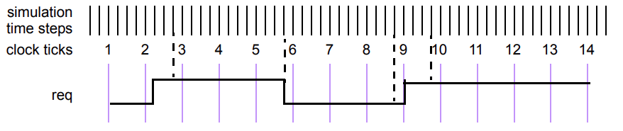

图 16-1—在仿真时间步骤中采样变量

断言中的表达式始终与一个时钟定义相关，除了使用过程代码中的常量或自动值（见 16.14.6）。采样值用于评估值变化表达式或布尔子表达式，这些表达式用于确定序列的匹配。

对于并发断言，以下声明适用：
 - 定义的时钟行为无毛刺非常重要。否则，可能会采样错误的值。
 - 如果在时钟表达式中出现的变量也在断言中的表达式中出现，则两个变量的值可能不同。变量的当前值用于时钟表达式，而变量的采样值用于断言中。

控制序列评估的时钟表达式可以比只是一个信号名更复杂。例如，可以使用 (clk && gating_signal) 和 (clk iff gating_signal) 表达一个门控时钟。其他更复杂的表达式也是可能的。然而，为了验证系统的正确行为并尽可能接近真正的基于周期的语义，用户应确保时钟表达式无毛刺，并且在任何仿真时间上只转换一次。

引用 `$global_clock`（见 14.14）被理解为引用 `global clocking` 声明中定义的 *时钟事件*。全局时钟与任何其他时钟事件一样。然而，在形式验证中，`$global_clock` 具有额外的意义，因为它被认为是主要的系统时钟（见 F.3.1）。因此，在以下示例中：
```verilog
global clocking @clk; endclocking
    ...
assert property(@$global_clock a);
```

断言说明 a 在全局时钟的每个节拍上都为真。这个断言在逻辑上等同于：
```verilog
assert property(@clk a);
```

并发断言的一个示例如下：
```verilog
base_rule1: assert property (cont_prop(rst,in1,in2)) $display("%m, passing"); 
else $display("%m, failed");
```

关键字 `property` 将并发断言与立即断言区分开来。并发断言的语法在 16.14 中讨论。

## 16.6 布尔表达式
表达式的评估结果是布尔值，以 if 语句中的表达式的方式解释。换句话说，如果表达式评估为 X、Z 或 0，则解释为假。否则，为真。

出现在并发断言中的表达式必须满足以下要求：
 - 表达式的结果是与整数类型转换兼容的类型。子表达式不需要满足此要求，只要整体表达式与整数类型兼容即可。
 - 动态数组、队列和关联数组的元素用于断言表达式的评估，可能在断言表达式评估之前从数组中删除，或者数组可能在断言表达式评估之前调整大小。这些用于断言表达式评估的特定数组元素应在断言的范围内继续存在，直到断言表达式评估完成。
 - 出现在过程并发断言中的表达式可以引用 16.14.6.1 中描述的自动变量。否则，出现在并发断言中的表达式不得引用自动变量。
 - 表达式不得引用非静态类属性或方法。
 - 表达式不得引用 chandle 数据类型的变量。
 - 具有局部变量作为 variable_lvalue 的序列匹配项可以使用 C 赋值、增量和减量运算符。否则，表达式的评估不得有任何副作用（例如，不允许增量和减量运算符）。
 - 表达式中的函数不得包含输出或 ref 参数（const ref 是允许的）。
 - 函数应为自动（或不保留状态信息）并且不得具有任何副作用。

并发断言中应当小心访问大型数据结构，特别是大型动态数据结构。一些类型的访问可能需要创建整个数据结构的副本，这可能会导致显著的性能损失。以下示例说明了复制整个数据结构可能怎样出现。在 p1 中，只有一个字节的 q 必须由断言采样，而且该字节的位置是固定的。然而，在 p2 中，将有多个具有潜在不同 l_b 值的活动线程。这增加了确定要采样的 q 字节的困难，并且可能导致采样所有 q。
```verilog
bit a;
integer b;
byte q[$];

property p1;
    $rose(a) |-> q[0];
endproperty

property p2;
    integer l_b;
    ($rose(a), l_b = b) |-> ##[3:10] q[l_b];
endproperty
```

在并发断言中出现布尔表达式的两个地方如下：
 - 在序列或属性表达式中
 - 在断言中推断的禁用条件中，指定在顶层 `disable iff` 子句中（见 16.12）或在默认 `disable iff` 声明中（见 16.15）

用于定义序列或属性表达式中的布尔表达式应在所有变量的采样值上进行评估。前面的规则不适用于在时钟事件中的表达式（见 16.5）。

在禁用条件中评估的表达式使用变量的当前值（而不是采样值），可能包含序列布尔方法 triggered。不得包含对局部变量或 matched 序列方法的引用。

基于时间值执行检查的断言应在相同上下文捕获这些值。不建议在断言之外捕获时间。应在断言内部使用局部变量捕获时间值。以下示例说明了在不同上下文中捕获时间值可能会出现问题。在属性 p1 中，时间值 t 是在过程上下文中基于 count 的当前值捕获的。在断言内部，将时间值 t 与断言上下文中基于 count 的采样值由 `$realtime` 返回的时间值进行比较。在两个上下文中，`$realtime` 返回当前时间值。结果，捕获在不同上下文中的时间值的比较产生不一致的结果。不一致导致 p1 的计算检查 clk 的 8 个周期之间的时间量，而不是预期的 7 个周期。在属性 p2 中，两个时间值都在断言上下文中捕获。这种策略产生一致的结果。
```verilog
bit count[2:0];
realtime t;

initial count = 0;
always @(posedge clk) begin
    if (count == 0) t = $realtime; //capture t in a procedural context
    count++;
end

property p1;
    @(posedge clk)
    count == 7 |-> $realtime – t < 50.5;
endproperty

property p2;
    realtime l_t;
    @(posedge clk)
    (count == 0, l_t = $realtime) ##1 (count == 7)[->1] |-> 
    $realtime – l_t < 50.5;
endproperty
```

## 16.7 序列
---
```verilog
sequence_expr ::= // from A.2.10
cycle_delay_range sequence_expr { cycle_delay_range sequence_expr }
| sequence_expr cycle_delay_range sequence_expr { cycle_delay_range sequence_expr }
| expression_or_dist [ boolean_abbrev ] 
| sequence_instance [ sequence_abbrev ] 
| ( sequence_expr {, sequence_match_item } ) [ sequence_abbrev ] 
| sequence_expr and sequence_expr 
| sequence_expr intersect sequence_expr 
| sequence_expr or sequence_expr 
| first_match ( sequence_expr {, sequence_match_item} )
| expression_or_dist throughout sequence_expr 
| sequence_expr within sequence_expr 
| clocking_event sequence_expr 
cycle_delay_range ::= 
## constant_primary 
| ## [ cycle_delay_const_range_expression ]
| ##[*]
| ##[+]
sequence_match_item ::= 
operator_assignment 
| inc_or_dec_expression 
| subroutine_call 
sequence_instance ::= 
ps_or_hierarchical_sequence_identifier [ ( [ sequence_list_of_arguments ] ) ] 
sequence_list_of_arguments ::= 
[sequence_actual_arg] { , [sequence_actual_arg] } { , . identifier ( [sequence_actual_arg] ) } 
| . identifier ( [sequence_actual_arg] ) { , . identifier ( [sequence_actual_arg] ) } 
sequence_actual_arg ::= 
event_expression
| sequence_expr 
boolean_abbrev ::= 
consecutive_repetition 
| non_consecutive_repetition
| goto_repetition
sequence_abbrev ::= consecutive_repetition 
consecutive_repetition ::= 
[* const_or_range_expression ]
| [*]
| [+]
non_consecutive_repetition ::= [= const_or_range_expression ]
goto_repetition ::= [-> const_or_range_expression ]
const_or_range_expression ::= 
constant_expression 
| cycle_delay_const_range_expression 
cycle_delay_const_range_expression ::= 
constant_expression : constant_expression 
| constant_expression : $
expression_or_dist ::= expression [ dist { dist_list } ] 
```
---
语法 16-3—序列语法（摘自附录 A）

属性通常由顺序行为构建。`sequence` 功能提供了构建和操作顺序行为的能力。最简单的顺序行为是线性的。线性序列是递增时间的有限 SystemVerilog 布尔表达式列表。线性序列在连续时钟节拍的有限间隔上匹配，前提是第一个布尔表达式在第一个时钟节拍上为真，第二个布尔表达式在第二个时钟节拍上为真，依此类推，直到最后一个布尔表达式在最后一个时钟节拍上为真。单个布尔表达式是简单线性序列的一个示例，它在单个时钟节拍上匹配，前提是该布尔表达式在该时钟节拍上为真。

更复杂的顺序行为由 SystemVerilog 序列描述。序列是 SystemVerilog 布尔表达式上的正则表达式，它简洁地指定了零个、有限多个或无限多个线性序列的集合。如果该集合中至少有一个线性序列在连续时钟节拍的有限间隔上匹配，则该序列在该间隔上匹配。

属性可能涉及从不同时间开始的一个或多个顺序行为的检查。尝试评估序列是搜索序列的匹配的尝试，从特定时钟节拍开始搜索序列的匹配。为了确定是否存在这样的匹配，从特定时钟节拍开始评估适当的布尔表达式，并在特定时钟节拍开始的每个连续时钟节拍上继续评估，直到找到匹配或推断出不存在匹配。

序列可以通过连接构成，类似于列表的连接。连接使用 `##` 指定从第一个序列的结束到第二个序列的开始的延迟。

序列连接的语法如语法 16-4 所示。
---
```verilog
sequence_expr ::= // from A.2.10
cycle_delay_range sequence_expr { cycle_delay_range sequence_expr }
| sequence_expr cycle_delay_range sequence_expr { cycle_delay_range sequence_expr }
... 
cycle_delay_range ::= 
## constant_primary 
| ## [ cycle_delay_const_range_expression ]
| ##[*]
| ##[+]
cycle_delay_const_range_expression ::= 
constant_expression : constant_expression 
| constant_expression : $
```
---
语法 16-4—序列连接语法（摘自附录 A）

在此语法中，以下语句适用：
 - `constant_primary` 是一个 `constant_expression`，在编译时计算，应产生整数值。此外，`constant_expression` 和 `cycle_delay_const_range_expression` 中的边界只能是 0 或更大。
 - `$` 标记用于指示仿真结束。对于形式验证工具，`$` 用于指示有限但无界的范围。
 - `##[*]` 用作 `##[0:$]` 的等效表示。
 - `##[+]` 用作 `##[1:$]` 的等效表示。
 - 当使用两个表达式指定范围时，第二个表达式应大于或等于第一个表达式。
 - 在 `cycle_delay_range` 中，`constant_primary` 不得包含不是 `constant_expression` 的 `constant_mintypmax_expression`。

序列出现的上下文决定了何时评估序列。序列中的第一个表达式在触发序列评估的表达式之后的第一个时钟节拍上检查。序列中的每个后续元素（如果有）在下一个连续时钟节拍上检查。

`##` 后跟数字或范围指定从当前时钟节拍到序列开始之间的延迟。延迟 `##1` 表示接下来的序列的开始比当前时钟节拍晚一个时钟节拍。延迟 `##0` 表示接下来序列的开始时刻与当前时钟节拍相同。

当用于两个序列之间的连接时，延迟是从第一个序列的结束到第二个序列的开始。延迟 `##1` 表示第二个序列的开始比第一个序列的结束晚一个时钟周期。delay ##0表示第二个序列的开始时间与第一个序列的结束时间相同。

下面是一些延迟表达式的示例。`` `true `` 是一个布尔表达式，总是评估为 true，并用于视觉清晰度。它可以定义如下：
```verilog
`define true 1

##0 a // means a
##1 a // means `true ##1 a
##2 a // means `true ##1 `true ##1 a
##[0:3]a // means (a) 或 (`true ##1 a) 或 (`true ##1 `true ##1 a) 或 (`true ##1 `true ##1 `true ##1 a)
a ##2 b // means a ##1 `true ##1 b
```

序列
```verilog
req ##1 gnt ##1 !req
```

指定 req 在当前时钟节拍上为 true，gnt 在第一个后续时钟节拍上为 true，req 在此后的下一个时钟节拍上为 false。`##1` 运算符指定一个时钟节拍的间隔。可以指定超过一个时钟节拍的延迟，如下所示：
```verilog
req ##2 gnt
```

这指定 req 在当前时钟节拍上为 true，gnt 在第二个后续时钟节拍上为 true，如图 16-2 所示。
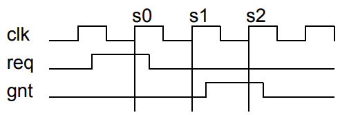

图 16-2—序列的连接

以下指定信号 b 在信号 a 之后的第 N 个时钟节拍上为 true：
```verilog
a ##N b // check b on the Nth sample
```

为了指定重叠序列的连接，其中一个序列的结束点与下一个序列的开始点重合，使用值 0，如下所示：
```verilog
a ##1 b ##1 c // 第一个序列 seq1
d ##1 e ##1 f // 第二个序列 seq2
(a ##1 b ##1 c) ##0 (d ##1 e ##1 f) // 重叠连接
```

在前面的示例中，c 必须在 seq1 的结束点为 true，d 必须在 seq2 的开始点为 true。与 0 时钟节拍延迟连接时，c 和 d 必须在同一时间点为 true，导致等效于以下内容：
```verilog
a ##1 b ##1 c&&d ##1 e ##1 f
```

应该注意，不能使用连接操作来表达序列之间的其他形式的重叠。

在范围内的延迟可以指定为时间窗口，如下所示：
```verilog
req ##[4:32] gnt
```

在前面的情况下，req 必须在当前时钟节拍上为 true，gnt 必须在当前时钟节拍之后的第 4 到 32 个时钟节拍之间的某个时钟节拍上为 true。

时间窗口可以扩展到有限但无界的范围，如下所示：
```verilog
req ##[4:$] gnt
```

序列可以通过连接到 `` `true `` 无条件地扩展。
```verilog
a ##1 b ##1 c ##3 `true
```

在满足信号 c 之后，序列长度通过三个时钟节拍扩展。当通过组合较简单的序列构建复杂序列时，可能需要调整序列的长度。

## 16.8 声明序列
命名的 `sequence` 可以在以下情况下声明：
 - 模块
 - 接口
 - 程序
 - 时钟块
 - 包
 - 编译单元范围
 - 检查器
 - 生成块

命名序列使用语法 16-5 声明。
---
```verilog
assertion_item_declaration ::= // from A.2.10
... 
| sequence_declaration 
sequence_declaration ::= 
sequence sequence_identifier [ ( [ sequence_port_list ] ) ] ;
{ assertion_variable_declaration } 
sequence_expr [ ; ] 
endsequence [ : sequence_identifier ] 
sequence_port_list ::= 
sequence_port_item {, sequence_port_item} 
sequence_port_item ::= 
{ attribute_instance } [ local [ sequence_lvar_port_direction ] ] sequence_formal_type 
 formal_port_identifier {variable_dimension} [ = sequence_actual_arg ] 
sequence_lvar_port_direction ::= input | inout | output
sequence_formal_type ::= 
data_type_or_implicit 
| sequence
| untyped
formal_port_identifier ::= identifier // from A.9.3
sequence_instance ::= // from A.2.10
ps_or_hierarchical_sequence_identifier [ ( [ sequence_list_of_arguments ] ) ] 
sequence_list_of_arguments ::= 
[sequence_actual_arg] { , [sequence_actual_arg] } { , . identifier ( [sequence_actual_arg] ) } 
| . identifier ( [sequence_actual_arg] ) { , . identifier ( [sequence_actual_arg] ) } 
sequence_actual_arg ::= 
event_expression 
| sequence_expr 
assertion_variable_declaration ::= 
var_data_type list_of_variable_decl_assignments ;
```
---
语法 16-5—声明序列语法（摘自附录 A）

命名序列可以在可选的 `sequence_port_list` 中声明形式参数。

形式参数可以通过在 formal_port_identifier 之前指定类型来进行类型化。如果在端口列表中指定类型，则该类型适用于在类型之后和下一个类型之前指定的所有形式参数的标识符。有关指定和使用类型化形式参数的规则在 16.8.1 中讨论。

有关指定和使用本地变量形式参数的规则在 16.8.2 中讨论。

如果在端口列表中 formal_port_identifier 之前未指定类型，则形式参数被称为 *无类型*。无类型形式参数没有默认类型。

序列的支持数据类型为断言表达式中允许的操作数的类型（见 16.6）和关键字 `untyped`。

默认实际参数可以在关联的声明分配中指定。default_expression 在包含序列声明的范围中解析。对于类型化形式参数的默认实际参数的类型要求在 16.8.1 中描述。无类型形式参数的默认实际参数的类型可以是任何类型，只要其替换结果是有效序列，如重写算法中描述的那样（见 F.4.1）。

形式参数可以在命名序列的声明体中引用。对形式参数的引用可以写在各种语法实体的位置，例如：
 - 标识符
 - 表达式
 - sequence_expr
 - event_expression
 - 在 cycle_delay_const_range_expression 中的终止符 `$`

命名序列可以通过引用其名称来实例化。引用可以是分层名称（见 23.6）。命名序列可以在任何可以写入 sequence_expr 的地方实例化，包括在其声明之前。命名序列也可以作为 sequence_method_call（见 16.9.11，16.13.5）的一部分或作为 event_expression（见 9.4.2.4）实例化。如果从其实例化导致命名序列之间的循环依赖，则会发生错误。如果从其实例化导致命名序列之间的循环依赖，则会发生错误。命名序列之间存在循环依赖，当且仅当有向图中存在一个循环，该循环的节点为命名序列，其边由以下规则定义：一个命名序列和另一个命名序列之间有一条有向边，当且仅当：要么第一个命名序列在其声明中实例化了第二个命名序列（包括在默认实际参数声明中实例化），要么在实际参数中存在第一个命名序列实例实例化了第二个命名序列。

在命名序列的实例中，可以将实际参数传递给形式参数。实例应为每个没有声明默认实际参数的形式参数列表中的实际参数提供一个实际参数。实例可以为声明了默认实际参数的形式参数提供实际参数，从而覆盖默认值。实际参数列表中的实际参数可以按名称或按位置绑定到形式参数。

在实例的实际参数列表中，终止符 `$` 可以是一个实际参数，可以声明为默认实际参数或在实例的实际参数列表中传递。如果 `$` 是一个实际参数，则相应的形式参数应为无类型，并且其引用应该是 cycle_delay_const_range_expression 中的上界，或者应该是命名序列的实例中的实际参数。

如果命名序列的实例在本地变量的作用域内（见 16.10），则实例的实际参数列表中的实际参数可以引用本地变量。

在命名序列的声明中出现的除形式参数之外的名称，包括出现在默认实际参数中的名称，应根据命名序列声明的作用域中的作用域规则进行解析。在实例的实际参数列表中出现的名称应根据实例的作用域中的作用域规则进行解析。

命名序列的实例的顺序行为和匹配语义与通过 F.4.1 中定义的重写算法从命名序列的声明体中获得的扁平序列相同。重写算法将实际参数替换为声明体中对应形式参数的引用。重写算法本身不考虑名称解析，并假定在替换实际参数之前已解析名称。如果扁平序列不合法，则实例不合法，并且会发生错误。

在重写算法中，将实际参数替换为对应无类型形式参数的引用会将实际参数保留为表达式项。在替换对应无类型形式参数的引用时，实际参数应该在替换之前被括号括起来，并且应该在替换之前被转换为其自我确定的类型。除非满足以下条件之一，否则在替换对应无类型形式参数的引用时，实际参数应该在替换之前被括号括起来，并且应该在替换之前被转换为其自我确定的类型：
 - 实际参数是 `$`。
 - 实际参数是 variable_lvalue。

如果重写算法的结果是无效序列，则会发生错误。

例如，对于无类型的形式参数的引用可能出现在 cycle_delay_range、boolean_abbrev 或 sequence_abbrev（见 16.9.2）的规范中，只有在实际参数是建立时常量时才能出现。以下示例说明了形式参数的使用：
```verilog
sequence delay_example(x, y, min, max, delay1);
    x ##delay1 y[*min:max];
endsequence

// 合法
a1: assert property (@(posedge clk) delay_example(x, y, 3, $, 2));

int z, d;

// 非法：z 和 d 不是建立时常量
a2_illegal: assert property (@(posedge clk) delay_example(x, y, z, $, d));
```

下面的示例中，命名序列 s1 和 s2 在 clk 的连续 `posedge` 事件上评估。命名序列 s3 在 clk 的连续 `negedge` 事件上评估。命名序列 s4 在 clk 的连续交替 `posedge` 和 `negedge` 事件上评估。
```verilog
sequence s1;
    @(posedge clk) a ##1 b ##1 c;
endsequence

sequence s2;
    @(posedge clk) d ##1 e ##1 f;
endsequence

sequence s3;
    @(negedge clk) g ##1 h ##1 i;
endsequence

sequence s4;
    @(edge clk) j ##1 k ##1 l;
endsequence
```

命名序列声明的另一个示例，其中包括参数，如下所示：
```verilog
sequence s20_1(data,en);
    (!frame && (data==data_bus)) ##1 (c_be[0:3] == en);
endsequence
```

命名序列 s20_1 没有指定时钟。在这种情况下，时钟将从某些外部源（例如 `property` 或 `assert` 语句）继承。实例化命名序列的示例如下：
```verilog
sequence s;
    a ##1 b ##1 c;
endsequence

sequence rule;
    @(posedge sysclk)
    trans ##1 start_trans ##1 s ##1 end_trans;
endsequence
```

前面示例中的命名序列 rule 等效于以下内容：
```verilog
sequence rule;
    @(posedge sysclk)
    trans ##1 start_trans ##1 (a ##1 b ##1 c) ##1 end_trans;
endsequence
```

以下示例说明了命名序列 s1 和 s2 之间的非法循环依赖：
```verilog
sequence s1;
    @(posedge sysclk) (x ##1 s2);
endsequence

sequence s2;
    @(posedge sysclk) (y ##1 s1);
endsequence
```

### 16.8.1 序列声明中的类型化形式参数
序列的形式参数指定的数据类型可以是关键字 `untyped`。如果数据类型是 `untyped`，形式参数应当是无类型的（见 16.8）。绑定实际参数表达式到 `untyped` 形式参数的语义应当和无类型形式一样。在形式参数列表中如果无类型形式参数跟数据类型，应当使用关键字 `untyped`。

如果命名序列的形式参数是类型化的，那么类型应当是 `sequence` 或者 16.6 中允许的类型之一。以下规则适用于类型化形式参数及其对应的实际参数，包括在命名序列中声明的默认实际参数：
 - 如果形式参数是序列类型，那么实际参数应当是 sequence_expr。对于序列类型的形式参数的引用，应当在 sequence_expr 可以写入的地方，或者作为触发和匹配的序列方法的操作数。
 - 如果形式参数是事件类型，那么实际参数应当是 event_expression，并且每个对形式参数的引用应当在 event_expression 可以写入的地方。
 - 否则，实际参数的自我确定的结果类型应当和形式参数的类型是强制兼容的。如果实际参数是 variable_lvalue，那么对形式参数的引用应当被认为是形式参数的类型，任何对形式参数的赋值应当被认为是从形式参数到实际参数的后续赋值。如果实际参数不是 variable_lvalue，那么实际参数应当被转换为形式参数的类型，然后在重写算法中替换对形式参数的引用（见 F.4.1）。

例如，布尔表达式可以作为实际参数传递给 `sequence` 类型的形式参数，因为布尔表达式是 sequence_expr。类型是 sequence的形式参数，不可以作为 goto_repetition 的 sequence_expr 的操作数引用，无论对应的实际参数是什么，因为 sequence_expr 不能写入那个位置。

在 sequence_match_item（见 16.10）中的对类型化形式参数的引用不得作为 operator_assignment 或 inc_or_dec_expression 的 variable_lvalue，除非形式参数是本地变量参数（见 16.8.2，16.12.19）。

以下是声明形式参数的两个示例。s1 的所有形式参数都是无类型的。s2 的形式参数 w 和 y 是无类型的，而形式参数 x 是 bit 类型。
```verilog
sequence s1(w, x, y);
    w ##1 x ##[2:10] y;
endsequence

sequence s2(w, y, bit x);
    w ##1 x ##[2:10] y;
endsequence
```

以下 s1 和 s2 的实例是等效的：
```verilog
s1(.w(a), .x(bit'(b)), .y(c))
s2(.w(a), .x(b), .y(c))
```

在上面的示例 s2 中，如果 b 恰好是 8 位宽，则它将被截断为 bit，因为它被传递给了 bit 类型的形式参数。类似地，如果将 bit 类型的表达式作为实际参数传递给 byte 类型的形式参数，那么表达式将被扩展为 byte。

如果对类型化形式参数的引用出现在 cycle_delay_range、boolean_abbrev 或 sequence_abbrev（见 16.9.2）的规范中，则形式参数的类型应当是 shortint、int 或 longint。以下示例说明了形式参数的使用：
```verilog
sequence delay_arg_example (max, shortint delay1, delay2, min);
    x ##delay1 y[*min:max] ##delay2 z;
endsequence

parameter my_delay=2;
cover property (delay_arg_example($, my_delay, my_delay-1, 3));
```

前面示例中的 cover property 等效于以下内容：
```verilog
cover property (x ##2 y[*3:$] ##1 z);
```

以下是一个具有事件类型的形式参数的示例：
```verilog
sequence event_arg_example (event ev);
    @(ev) x ##1 y;
endsequence

cover property (event_arg_example(posedge clk));
```

前面示例中的 cover property 等效于以下内容：
```verilog
cover property (@(posedge clk) x ##1 y);
```

如果意图是将一个表达式作为实际参数传递，以便与 edge_identifier 结合创建 event_expression，则形式参数不应该是事件类型。以下示例说明了这种用法：
```verilog
sequence event_arg_example2 (reg sig);
    @(posedge sig) x ##1 y;
endsequence

cover property (event_arg_example2(clk));
```

前面示例中的 cover property 等效于以下内容：
```verilog
cover property (@(posedge clk) x ##1 y);
```

另一个示例，其中使用本地变量来采样形式参数，显示了如何获得“按值传递”的效果。目前不支持按值传递作为参数传递模式。
```verilog
sequence s(bit a, bit b);
    bit loc_a;
    (1'b1, loc_a = a) ##0 
    (t == loc_a) [*0:$] ##1 b; 
endsequence
```

### 16.8.2 序列声明中的本地变量形式参数
本节描述声明本地变量形式参数的机制和针对它们的用法规则。本地变量形式参数是局部变量的特殊情况（见 16.10）。

命名序列的形式参数可以通过在端口项中指定关键字 `local`，后面可以选择指定方向 `input`、`inout` 或 `output` 来指定为本地变量参数。如果未显式指定方向，则应从先前的参数中推断出方向 `input`。如果在端口项中指定了关键字 `local`，则应在该端口项中显式指定该参数的类型，并且不应从先前的参数中推断出该参数的类型。本地变量参数的类型应当是 16.6 中允许的类型之一。如果在端口项中指定了 input、inout 或 output 中的一个，则应在该端口项中指定关键字 local。

将形式参数指定为给定方向和类型的本地变量参数应用于端口列表中的后续标识符，只要后续端口项中没有指定关键字 `local` 或显式类型。换句话说，如果端口项仅包含标识符，并且最近的显式指定了类型的参数也指定了关键字 local，则该端口项是一个本地变量参数，其方向和类型与该前面参数相同。

如果本地变量形式参数的方向是 input，则可以在端口项的可选声明赋值中为该参数指定默认实际参数，受 16.8 中描述的默认实际参数的规则约束。对于方向为 `inout` 或 `output` 的本地变量参数，不得为该参数指定默认实际参数。

以下是声明使用本地变量形式参数的命名序列的合法示例：
```verilog
logic b_d, d_d;
sequence legal_loc_var_formal (
    local inout logic a,
    local logic b = b_d, // 推断为 input，默认实际参数 b_d
    c, // 推断为 local input logic，没有默认实际参数
    d = d_d, // 推断为 local input logic，默认实际参数 d_d
    logic e, f // e 和 f 不是本地变量形式参数
);
    logic g = c, h = g || d;
    ...
endsequence
```

以下是声明使用本地变量形式参数的命名序列的非法示例：
```verilog
sequence illegal_loc_var_formal (
    output logic a, // 非法：必须指定 local 方向
    local inout logic b,
    c = 1'b0, // 对 inout 指定默认实际参数是非法的
    local d = expr, // 非法：必须显式指定类型
    local event e, // 非法：event 是 16.6 中不允许的类型
    local logic f = g // 非法：g 不得引用下面的本地变量，必须从上面的声明向上解析
);
    logic g = b;
    ...
endsequence
```

一般来说，本地变量形式参数的行为与在 assertion_variable_declaration 中声明的本地变量相同。16.10 中对分配给和引用本地变量的规则，包括本地变量流的规则，适用于本地变量形式参数，使用以下规定：
 - 没有进一步规定，术语 *本地变量* 应当指本地变量形式参数或在 assertion_variable_declaration 中声明的本地变量。
 - 在每次对命名序列的实例的评估尝试开始时，将为其每个本地变量形式参数创建一个新副本。
 - 具有方向 `input` 或 `inout` 的本地变量形式参数应当像具有声明赋值的 assertion_variable_declaration 中声明的本地变量一样处理。本地变量形式参数的初始值由实例的相关实际参数提供。实际参数的自我确定的结果类型应当与本地变量形式参数的类型是强制兼容的（见 6.22.4）。实际参数的值应当在分配给本地变量形式参数之前转换为本地变量形式参数的类型。这种分配被称为本地变量形式参数的 *初始化赋值*。应当在初始化 assertion_variable_declaration 中声明的所有本地变量之前初始化所有输入和 inout 本地变量形式参数。对 assertion_variable_declaration 中声明的本地变量的声明赋值的表达式可以引用方向为 `input` 或 `inout` 的本地变量形式参数。
 - 如果 `inout` 或 `output` 方向的本地变量形式参数绑定到实例的参数列表中的实际参数，并且实际参数引用本地变量，则如果在实例的上下文中引用时该本地变量未分配，则在该实例的上下文中引用该本地变量是错误的。
 - 具有方向 `output` 的本地变量形式参数在实例的评估尝试开始时未分配。
 - 绑定到 `inout` 或 `output` 方向的本地变量形式参数的整个实际参数表达式本身应当是对其类型与本地变量形式参数的类型是强制兼容的本地变量的引用。如果将对同一本地变量的引用绑定为两个或更多方向为 `inout` 或 `output` 的本地变量形式参数的实际参数，则是错误的。如果存在一个匹配的命名序列，那么在实例的完成时，如果 `inout` 或 `output` 方向的本地变量形式参数未分配，则是错误的。在命名序列实例匹配完成时，input 或 output 本地变量形式参数的值应当被转换并赋值为引用相关实际参数的本地变量的类型。如果命名序列实例的多个线程的求值匹配，那么多个线程的求值将在实例化上下文中继续，每个线程都有自己的实际参数局部变量的副本。对于命名序列实例的每个匹配线程，在该线程的匹配完成时，该线程中的局部变量形式参数的值应转换并分配为实际参数局部变量的关联副本的类型。
 - 有 input 或 output 本地变量形式参数的命名序列实例有空匹配是错误的。
 - 应用任何序列方法 triggered 或 matched 到有 input 或 inout 本地变量形式参数的命名序列实例是错误的。

以下示例说明了本地变量形式参数的使用：
```verilog
sequence sub_seq2(local inout int lv);
    (a ##1 !a, lv += data_in)
    ##1 !b[*0:$] ##1 b && (data_out == lv);
endsequence

sequence seq2;
    int v1;
    (c, v1 = data)
    ##1 sub_seq2(v1) // lv is initialized by assigning it the value of v1;
    // when the instance sub_seq2(v1) matches, v1 is
    // assigned the value of lv 
    ##1 (do1 == v1);
endsequence
```

seq2 的匹配行为等效于 seq2_inlined，如下所示：
```verilog
sequence seq2_inlined;
    int v1, lv;
    (c, v1 = data) ##1
    (
        (1, lv = v1) ##0
        (a ##1 !a, lv += data_in)
        ##1 (!b[*0:$] ##1 b && (data_out == lv), v1 = lv) 
    )
    ##1 (do1 == v1);
endsequence
```

无类型参数提供了将本地变量传递给子序列实例的另一种机制，包括将本地变量分配给子序列中的本地变量，并在实例化上下文中引用分配的值（见 16.10）。

## 16.9 序列操作
### 16.9.1 操作符优先级
操作符优先级和结合性列在表 16-1 中。最高优先级首先列出。

表 16-1—操作符优先级和结合性
| SystemVerilog 表达式操作符 | 结合性 |
| --- | --- |
| `[* ]` `[= ]` `[-> ]` | — |
| `##` | 左 |
| `throughout` | 右 |
| `within` | 左 |
| `intersect` | 左 |
| `and` | 左 |
| `or` | 左 |

### 16.9.2 序列中的重复
序列重复的语法如 Syntax 16-6 所示。
---
```verilog
sequence_expr ::= // from A.2.10
...
| expression_or_dist [ boolean_abbrev ] 
| sequence_instance [ sequence_abbrev ] 
| ( sequence_expr {, sequence_match_item} ) [ sequence_abbrev ] 
... 
boolean_abbrev ::= 
consecutive_repetition 
| non_consecutive_repetition
| goto_repetition
sequence_abbrev ::= consecutive_repetition 
consecutive_repetition ::= 
[* const_or_range_expression ]
| [*]
| [+]
non_consecutive_repetition ::= [= const_or_range_expression ]
goto_repetition ::= [-> const_or_range_expression ]
const_or_range_expression ::= 
constant_expression 
| cycle_delay_const_range_expression 
cycle_delay_const_range_expression ::= 
constant_expression : constant_expression 
| constant_expression : $
```
---
语法 16-6—序列重复语法（摘自附录 A）

重复的迭代次数可以通过精确计数或需要落在有限范围内来指定。如果通过精确计数指定，则迭代次数由非负整数常量表达式定义。如果需要落在有限范围内，则最小迭代次数由非负整数常量表达式定义；最大迭代次数由非负整数常量表达式定义，或者是 `$`，表示有限但无界的最大值。

如果最小和最大迭代次数都由非负整数常量表达式定义（见 11.2.1），则最小数应小于或等于最大数。提供了以下三种重复：
 - *连续重复*（`[* const_or_range_expression ]`）：连续重复指定操作数序列的有限次迭代匹配，从一个匹配的结束到下一个匹配的开始延迟一个时钟节拍。整体重复序列在操作数的最后一个迭代匹配结束时匹配。`[*]` 是 `[*0:$]` 的等效表示，`[+]` 是 `[*1:$]` 的等效表示。
 - *跳转重复*（`[-> const_or_range_expression ]`）：跳转重复指定操作数布尔表达式的有限次迭代匹配，从一个操作数的匹配到下一个连续匹配之间的一个或多个时钟节拍延迟，且在两个匹配之间没有严格匹配的操作数。整体重复序列在操作数的最后一个迭代匹配结束时匹配。
 - *非连续重复*（`[= const_or_range_expression ]`）：非连续重复指定操作数布尔表达式的有限次迭代匹配，从一个操作数的匹配到下一个连续匹配之间的一个或多个时钟节拍延迟，且在两个匹配之间没有严格匹配的操作数。整体重复序列在操作数的最后一个迭代匹配之后，但在任何后续操作数的匹配之前匹配。

序列内的子序列的连续重复的效果可以通过显式迭代子序列来实现，如下所示：
```verilog
a ##1 b ##1 b ##1 b ##1 c
```

使用连续重复操作符 `[*3]`，表示三次迭代，可以更简洁地指定这种顺序行为：
```verilog
a ##1 b [*3] ##1 c
```

连续重复指定操作数序列必须匹配指定次数。连续重复操作符 `[*N]` 指定操作数序列必须连续匹配 N 次。例如：
```verilog
a [*3] // 等价于 a ##1 a ##1 a
```

使用 0 作为重复次数，将产生一个空序列，如下所示：
```verilog
a [*0]
```

空序列是一个在零个时钟节拍上匹配的序列，不匹配任何正数时钟节拍。以下规则适用于连接具有空序列的序列。空序列表示为 empty，序列表示为 seq。
 - `(empty ##0 seq)` 不会产生匹配。
 - `(seq ##0 empty)` 不会产生匹配。
 - `(empty ##n seq)`，其中 n 大于 0，等价于 `(##(n-1) seq)`。
 - `(seq ##n empty)`，其中 n 大于 0，等价于 `` (seq ##(n-1) `true) ``。

例如：
```verilog
b ##1 ( a[*0] ##0 c)
```

不会产生序列的匹配。例如：
```verilog
b ##1 a[*0:1] ##2 c
```

等价于
```verilog
(b ##2 c) or (b ##1 a ##2 c)
```

语法允许延迟和重复在同一个序列中组合。以下情况都是允许的：
```verilog
`true ##3 (a [*3]) // 等价于 `true ##1 `true ##1 `true ##1 a ##1 a ##1 a
(`true ##2 a) [*3] // 等价于 (`true ##2 a) ##1 (`true ##2 a) ##1
// (`true ##2 a)，这意味着 `true ##1 `true
##1
// a ##1 `true ##1 `true ##1 a ##1 `true ##1 `true ##1 a
```

序列可以重复如下：
```verilog
(a ##2 b) [*5]
```

这等价于
```verilog
(a ##2 b ##1 a ##2 b ##1 a ##2 b ##1 a ##2 b ##1 a ##2 b)
```

重复的范围最小最大次数可以通过连续重复操作符 `[* min:max]` 来表示。

例如：
```verilog
(a ##2 b)[*1:5]
```

等价于
```verilog
(a ##2 b)
or (a ##2 b ##1 a ##2 b)
or (a ##2 b ##1 a ##2 b ##1 a ##2 b)
or (a ##2 b ##1 a ##2 b ##1 a ##2 b ##1 a ##2 b)
or (a ##2 b ##1 a ##2 b ##1 a ##2 b ##1 a ##2 b ##1 a ##2 b)
```

类似地，
```verilog
(a[*0:3] ##1 b ##1 c)
```

等价于
```verilog
(b ##1 c)
or (a ##1 b ##1 c)
or (a ##1 a ##1 b ##1 c)
or (a ##1 a ##1 a ##1 b ##1 c)
```

为了指定有限但无界的迭代次数，使用美元符号（`$`）。例如，重复
```verilog
a ##1 b [*1:$] ##1 c
```

在三个或更多连续时钟节拍上匹配，如果 a 在第一个时钟节拍上为真，c 在最后一个时钟节拍上为真，并且 b 在第一个和最后一个之间的每个时钟节拍上严格为真。

通过精确计数指定重复的迭代次数等效于指定最小迭代次数等于最大迭代次数的范围。换句话说，`seq[*n]` 等效于 `seq[*n:n]`。

跳转重复（非连续精确重复）采用布尔表达式而不是序列作为操作数。它指定布尔表达式的迭代匹配，这些匹配不一定连续，并在最后一个迭代匹配结束。例如：
```verilog
a ##1 b [->2:10] ##1 c
```

在连续时钟节拍上匹配，如果 a 在第一个时钟节拍上为真，c 在最后一个时钟节拍上为真，b 在倒数第二个时钟节拍上为真，并且包括倒数第二个时钟节拍，有至少 2 个且最多 10 个不一定连续的时钟节拍严格在第一个和最后一个时钟节拍之间，b 在这些时钟节拍上为真。这个序列等效于以下内容：
```verilog
a ##1 ((!b[*0:$] ##1 b) [*2:10]) ##1 c
```

非连续重复类似于跳转重复，但是匹配不必在操作数布尔表达式的最后一个迭代匹配结束。非连续重复操作符允许匹配在操作数布尔表达式的最后一个迭代匹配结束后任意多个时钟节拍上延续，只要布尔表达式在所有额外的时钟节拍上为假。例如：
```verilog
a ##1 b [=2:10] ##1 c
```

在连续时钟节拍上匹配，如果 a 在第一个时钟节拍上为真，c 在最后一个时钟节拍上为真，并且在第一个和最后一个时钟节拍之间至少有 2 个且最多 10 个不一定连续的时钟节拍，b 在这些时钟节拍上为真。这个序列等效于以下内容：
```verilog
a ##1 ((!b [*0:$] ##1 b) [*2:10]) ##1 !b[*0:$] ##1 c
```

连续重复操作符可以应用于一般序列表达式，但是跳转重复和非连续重复操作符只能应用于布尔表达式。特别地，跳转重复和非连续重复不能应用于附加了序列匹配项（见 16.10，16.11）的布尔表达式。例如，以下是合法的序列表达式：
```verilog
(b[->1], v = e)[*2]
```

但以下是非法的：
```verilog
(b, v = e)[->2]
```

### 16.9.3 采样值函数
本小节描述用于访问表达式的采样值的系统函数。这些函数包括访问当前采样值、访问过去的采样值或检测表达式的采样值的变化的功能。采样表达式的采样在 16.5.1 中解释。不允许在传递给这些函数的参数表达式中使用本地变量（见 16.10）和 matched 序列方法。提供以下函数：
 - `$sampled(expression)`
 - `$rose(expression [, [clocking_event] ] )`
 - `$fell(expression [, [clocking_event] ] )`
 - `$stable(expression [, [clocking_event] ] )`
 - `$changed(expression [ , [ clocking_event ] ] )`
 - `$past(expression1 [, [number_of_ticks ] [, [expression2 ] [, [clocking_event]]] ] )`

这些函数的使用不限于断言功能；它们也可以作为过程代码中的表达式使用。时钟事件，虽然作为 `$past`、`$rose`、`$stable`、`$changed` 和 `$fell` 函数的显式参数是可选的，但是对于它们的语义是必需的。时钟事件用于对参数表达式的值进行采样。

函数 `$sampled` 不使用时钟事件。

对于除 `$sampled` 之外的采样值函数，时钟事件应当作为显式参数指定，或者从调用函数的代码中推断。推断时钟事件的规则如下：
 - 如果在断言中调用，则使用时钟流规则（见 16.13.3）确定的适当时钟事件。
 - 否则，如果在断言中的禁用条件或时钟表达式中调用，则应当显式时钟。
 - 否则，如果在断言的动作块中调用，则使用断言的主时钟。
 - 否则，如果在过程中调用，则使用过程上下文中推断的时钟（见 16.14.6）。
 - 否则，如果在断言之外调用，则使用默认时钟（见 14.12）。

函数 `$sampled` 返回其参数（见 16.5.1）的采样值。在并发断言中使用 `$sampled` 是多余的，尽管允许，因为函数的结果与在断言中使用的表达式的采样值相同。在 `disable iff` 子句中使用 `$sampled` 是有意义的，因为默认情况下禁用条件不会被采样（见 16.12）。

函数 `$sampled` 用于访问在并发断言中的动作块中使用的表达式的值。考虑以下示例：
```verilog
logic a, b, clk;
// ...
a1_bad: assert property (@clk a == b)
    else $error("Different values: a = %b, b = %b", a, b);
a2_ok: assert property (@clk a == b)
    else $error("Different values: a = %b, b = %b",
        $sampled(a), $sampled(b));
```

如果在某个时钟节拍中，a 的采样值为 0，b 的采样值为 1，但它们在该时钟节拍的 Reactive 区域中的当前值为 0，则断言 a1_bad 将报告 Different values: a = 0, b = 0。这是因为动作块在 Reactive 区域中评估（见 16.14.1）。断言 a2_ok 报告预期的消息 Different values: a = 0, b = 1，因为在其动作块中的 a 和 b 的值在断言中的上下文中评估。

以下函数称为值变化函数，用于检测表达式的采样值的变化：`$rose`、`$fell`、`$stable` 和 `$changed`。

值变化函数检测表达式的采样值的变化（或在 `$stable` 的情况下，没有变化）。通过将表达式的采样值与最近的严格前一个时钟节拍中发生的时钟事件（采样上一拍的定义和 `$past` 怎样计算过去值的描述参见 16.5.1）的采样值进行比较来确定变化（或缺乏变化）。值变化函数的结果是 true 或 false，并且值变化函数的调用可以用作布尔表达式。值变化函数的结果应当按照以下规则确定：
 - `$rose` 如果表达式的最低有效位更改为 1，则返回 true。否则，返回 false。
 - `$fell` 如果表达式的最低有效位更改为 0，则返回 true。否则，返回 false。
 - `$stable` 如果表达式的值没有更改，则返回 true。否则，返回 false。
 - `$changed` 如果表达式的值更改，则返回 true。否则，返回 false。

当这些函数在或在第一个时钟事件发生之前的模拟时间步骤时调用时，结果是通过将表达式的采样值与其默认采样值（见 16.5.1）进行比较计算的。

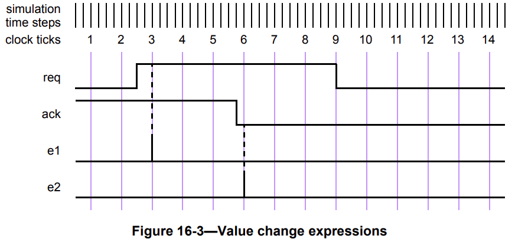

图 16-3—值变化表达式

图 16-3 说明了值变化的两个示例：
 - 值变化表达式 e1 定义为 `$rose(req)`。
 - 值变化表达式 e2 定义为 `$fell(ack)`。

用于采样值函数的时钟节拍是从属性的时钟中派生的，这与模拟时间步骤的时钟不同。假设，到目前为止，这个时钟在别处定义。在时钟节拍 3，e1 发生，因为 req 在时钟节拍 2 的值为低，时钟节拍 3 的值为高。类似地，e2 在时钟节拍 6 发生，因为 ack 在时钟节拍 5 的值被采样为高，时钟节拍 6 的值被采样为低。

以下示例说明了在 SystemVerilog 断言之外使用 `$rose`：
```verilog
always @(posedge clk)
    reg1 <= a & $rose(b);
```

在此示例中，时钟事件 `@(posedge clk)` 应用于 `$rose`。当 b 的采样值从其在前一个时钟事件的采样值更改为 1 时，`$rose` 为 true。

`$past` 函数用于访问过去采样值。以下三个可选参数提供：
 - expression2 用作时钟事件的门控表达式。
 - number_of_ticks 指定过去的时钟节拍数。
 - clocking_event 指定用于采样 expression1 的时钟事件。

expression1 和 expression2 可以是断言中允许的任何表达式。如果未指定 expression2，则默认为 1'b1。

number_of_ticks 应当是 1 或更大的编译时常量表达式。如果未指定 number_of_ticks，则默认为 1。

`$past` 返回在 `$past` 评估之前的特定时间步骤中 expression1 的采样值（参见 16.5.1 有关过去时钟节拍中采样值的定义）。如果 number_of_ticks 等于 k，并且 ev 是 clocking_event 下的事件表达式，则特定时间步骤是事件 ev iff expression2 的第 k 个严格之前的时间步骤。如果不存在 k 个严格之前的时间步骤，则从 `$past` 函数返回的值是 expression1 的默认采样值（见 16.5.1）。

`$past` 的时钟事件应当通过 clocking_event 参数显式指定，或者从调用 `$past` 的代码中推断。推断时钟事件的规则在之前描述过。

当两个参数之间的中间可选参数不需要时，应当为每个省略的参数放置一个逗号。例如：
```verilog
$past(in1, , enable);
```

这样，指定了逗号以省略 number_of_ticks。对于空 number_of_ticks 参数，使用默认值 1。对于省略的 clocking_event 参数，不需要包含逗号，因为它不在指定的参数范围内。

`$past` 可以在任何 SystemVerilog 表达式中使用。以下是一个示例：
```verilog
always @(posedge clk)
    reg1 <= a & $past(b);
```

在此示例中，推断的时钟事件 `@(posedge clk)` 应用于 `$past`。`$past` 在当前 (posedge clk) 的发生中评估，并返回在前一个 (posedge clk) 中采样的 b 的值。

函数 `$past` 可能引用自动变量，例如，过程循环变量，如下所示：
```verilog
always @(posedge clk)
    for (int i = 0; i < 4; i ++)
        if (cond[i])
            reg1[i] <= $past(b[i]);
```

根据过去采样值的定义（见 16.5.1），`$past` 在每次循环迭代中返回 b 的第 i 位的过去值。

当指定 expression2 时，expression1 的采样是基于其与 expression2 时钟门控的采样。例如：
```verilog
always @(posedge clk)
    if (enable) q <= d;

always @(posedge clk)
    assert property (done |=> (out == $past(q, 2,enable)) );
```

在此示例中，采样 q 用于评估 `$past` 的采样是基于以下时钟表达式：
```verilog
posedge clk iff enable
```

采样值函数的时钟事件参数可能与调用函数的代码中的上下文中的时钟事件不同，由时钟解算（见 16.16）确定。

考虑以下断言：
```verilog
bit clk, fclk, req, gnt, en;
...
a1: assert property
    (@(posedge clk) en && $rose(req) |=> gnt);

a2: assert property
    (@(posedge clk) en && $rose(req, @(posedge fclk)) |=> gnt);
```

断言 a1 和 a2 读作：“每当 en 为高且 req 上升时，下一个周期 gnt 必须被断言”。在这两个断言中，req 的上升发生当且仅当 req 在当前 clk 的上升沿的采样值为 1'b1，且在一个特定的前一个时钟事件中，req 的采样值与 1'b1 不同。这两个断言在指定前一个点的方式上有所不同。在 a1 中，前一个点是前一个 clk 的上升沿，而在 a2 中，前一个点是前一个 fclk 的上升沿。

另一个例子，
```verilog
always_ff @(posedge clk1)
    reg1 <= $rose(b, @(posedge clk2));
```

在这里，reg1 在每次发生 posedge clk1 的时间步骤中更新，使用从 $rose 采样值函数返回的值。$rose 比较 b 的 LSB 的采样值从当前时间步骤（发生 posedge clk1 的时间步骤）的 LSB 的采样值与在发生 posedge clk2 的严格前一个时间步骤的 LSB 的采样值。

如果没有在默认时钟的范围内，以下示例是非法的，因为无法推断任何时钟：
```verilog
always @(posedge clk) begin
    ...
    @(negedge clk2);
    x = $past(y, 5); // 非法，如果不在默认时钟范围内
end
```

这个例子是合法的，因为处于默认时钟范围内。

### 16.9.4 全局时钟的过去和未来采样值函数
本节描述了用于访问由全局时钟采样的表达式的最近过去和未来值的系统函数。只有在定义了全局时钟时才能使用这些函数（见 14.14）。这些函数包括访问在全局时钟节拍之前或之后的最近采样值的能力。采样值在 16.5.1 中解释。提供以下函数。

全局时钟的过去采样值函数如下：
 - `$past_gclk(expression)`
 - `$rose_gclk(expression)`
 - `$fell_gclk(expression)`
 - `$stable_gclk(expression)`
 - `$changed_gclk(expression)`

全局时钟的未来采样值函数如下：
 - `$future_gclk(expression)`
 - `$rising_gclk(expression)`
 - `$falling_gclk(expression)`
 - `$steady_gclk(expression)`
 - `$changing_gclk(expression)`

全局时钟的过去采样值函数的行为可以使用采样值函数定义如下（符号 ≡ 在这里表示“按定义等价”）：
 - `$past_gclk(v) ≡ $past(v,,, @$global_clock)`
 - `$rose_gclk(v) ≡ $rose(v, @$global_clock)`
 - `$fell_gclk(v) ≡ $fell(v, @$global_clock)`
 - `$stable_gclk(v) ≡ $stable(v, @$global_clock)`
 - `$changed_gclk(v) ≡ $changed(v, @$global_clock)`

全局时钟的未来采样值函数是相似的，只是它们使用表达式的后续值。

`$future_gclk(v)` 是 v 在下一个全局时钟节拍的采样值（见 16.5.1 有关未来时钟节拍中采样值的定义）。

其他函数定义如下：
 - `$rising_gclk(expression)` 如果表达式的最低有效位在下一个全局时钟节拍上变为 1，则返回 true。否则，返回 false。
 - `$falling_gclk(expression)` 如果表达式的最低有效位在下一个全局时钟节拍上变为 0，则返回 true。否则，返回 false。
 - `$steady_gclk(expression)` 如果表达式的采样值在下一个全局时钟节拍上不变，则返回 true。否则，返回 false。
 - `$changing_gclk(expression)` 是 `$steady_gclk` 的补集，即，`!$steady_gclk(expression)`。

全局时钟的未来采样值函数只能在 property_expr 或 sequence_expr 中调用；这意味着它们不应该在断言动作块中使用。全局时钟的过去采样值函数是采样值函数的特例，因此对采样值函数及其参数的常规限制适用（见 16.9.3）。特别是，全局时钟的过去采样值函数可以在一般过程代码和动作块中使用。额外的限制被强加在全局时钟的未来采样值函数的使用上：它们不应该被嵌套使用，也不应该在包含序列匹配项的断言中使用（见 16.10，16.11）。

以下示例说明了全局时钟的未来采样值函数的非法使用：
```verilog
// 非法：全局时钟的未来采样值函数不应该被嵌套使用
a1: assert property (@clk $future_gclk(a || $rising_gclk(b)));
sequence s;
    bit v;
    (a, v = a) ##1 (b == v)[->1];
endsequence : s

// 非法：全局时钟的未来采样值函数不应该在包含序列匹配项的断言中使用
a2: assert property (@clk s |=> $future_gclk(c));
```

尽管全局时钟的未来采样值函数依赖于其参数的未来值，但是对于包含全局时钟的未来采样值函数的断言的评估尝试的模拟时间步骤的区间被定义为未来采样值是提前知道的。评估尝试的结束被定义为断言时钟的最后一个节拍，并且不会延迟任何额外的时间步骤直到下一个全局时钟节拍。

`disable iff` 和其他异步断言相关控件，如 `$assertcontrol`（见 20.12），的行为是相对于先前定义的评估尝试的区间。例如，如果在评估尝试的最后一个节拍之后的时间步骤严格执行 带有 control_type 5（Kill） 的 `$assertcontrol`，则它不会影响该尝试，即使 `$assertcontrol` 在下一个全局时钟节拍之前执行。

包含全局时钟的未来采样值函数的断言的动作块的执行应当延迟到跟随评估尝试的最后一个节拍的全局时钟节拍。如果评估尝试失败并且默认情况下调用了 `$error`（见 16.14.1），则 `$error` 应当在跟随评估尝试的最后一个节拍的全局时钟节拍上调用。

用于包含全局时钟的未来采样值函数的断言的评估尝试的开始或结束时间步骤的工具特定消息应当与前面定义的评估尝试的模拟时间步骤的区间一致。消息也可以报告写入的时间步骤，这可能是跟随评估尝试的最后一个节拍的全局时钟节拍的时间步骤。

示例 1：

表 16-2 显示了在不同时间点对 sig 的全局时钟未来采样值函数的返回值。

下面的断言说明了信号只能在下降时钟上改变：
```verilog
a1: assert property (@$global_clock $changing_gclk(sig) 
    |-> $falling_gclk(clk))
    else $error("sig is not stable");
```

在图 16-4 中，垂直箭头表示全局时钟的节拍。在时间 80，断言 a1 被违反，因为 `$changing_gclk(sig)` 为 true，`$falling_gclk(clk)` 为 false。因为断言包含全局时钟未来采样值函数，所以动作块中的错误任务 `$error("sig is not stable")` 在时间 90 执行。如果作为由 `$error` 打印的工具特定消息的一部分，工具报告这个评估尝试的开始或结束时间步骤，那么报告的时间是 80。

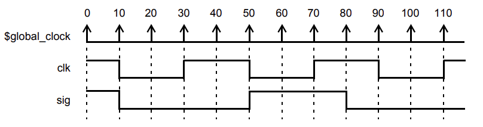

图 16-4—未来值变化

表 16-2—全局时钟未来采样值函数
| 时间 | `$sampled(sig)` | `$future_gclk(sig)` | `$rising_gclk(sig)` | `$falling_gclk(sig)` | `$changing_gclk(sig)` | `$steady_gclk(sig)` |
| --- | --- | --- | --- | --- | --- | --- |
| 10 | `1'b1` | `1'b0` | `1'b0` | `1'b1` | `1'b1` | `1'b0` |
| 30 | `1'b0` | `1'b0` | `1'b0` | `1'b0` | `1'b0` | `1'b1` |
| 40 | `1'b0` | `1'b0` | `1'b0` | `1'b0` | `1'b0` | `1'b1` |
| 50 | `1'b0` | `1'b1` | `1'b1` | `1'b0` | `1'b1` | `1'b0` |
| 80 | `1'b1` | `1'b0` | `1'b0` | `1'b1` | `1'b1` | `1'b0` |

示例 2：

下列假设说明了一个信号 sig 在两个下降时钟 clk 之间必须保持稳定。这与示例 1 中的属性不同，因为 sig 在第一个下降时钟 clk 之前尚未发生。在示例 1 中，sig 在这种情况下不允许改变，但在这个示例中，sig 可以自由切换，直到 clk 开始。
```verilog
a2: assume property(@$global_clock 
    $falling_gclk(clk) ##1 (!$falling_gclk(clk)[*1:$]) |-> 
    $steady_gclk(sig));
```

示例 3：

假设信号 rst 在时间 82 和 84 之间为高，其他时间为低。然后以下断言：
```verilog
a3: assert property (@$global_clock disable iff (rst) $changing_gclk(sig) 
    |-> $falling_gclk(clk))
    else $error("sig is not stable");
```

在时间 80 失败（见图 16-4），因为 rst 在时间 80 时不活动。失败评估尝试的区间从时间 80 开始，到时间 80 结束。尽管在时间 90 之前，rst 是活动的，但是尝试没有被禁用。

示例 4：

在某些情况下，全局时钟未来值函数提供了一个比过去值函数更自然的属性表达式。例如，以下两个断言是等价的：
```verilog
// 由于在周期 0 的边缘的边缘情况，a4 需要 ##1
a4: assert property (##1 $stable_gclk(sig));

// 在 a5 中，在周期 0 没有问题
a5: assert property ($steady_gclk(sig));
```

### 16.9.5 AND 操作
二进制运算符 `and` 用于当期望两个操作数匹配时，但操作数序列的结束时间可以不同的情况（见 16-7）。
---
```verilog
sequence_expr ::= // from A.2.10
...
| sequence_expr and sequence_expr
```
---
语法 16-7—And 操作符语法（摘自附录 A）

`and` 的两个操作数是序列。`and` 操作的匹配要求是两个操作数都匹配。操作数序列从相同时间开始。当一个操作数序列匹配时，它等待另一个操作数序列匹配。复合序列的结束时间是最后完成的操作数序列的结束时间。

当 te1 和 te2 是序列时，复合序列
```verilog
te1 and te2
```

匹配，如果 te1 和 te2 匹配。结束时间是 te1 或 te2 的结束时间，以后者为准。

以下示例是一个带有操作符 and 的序列，其中两个操作数是序列：
```verilog
(te1 ##2 te2) and (te3 ##2 te4 ##2 te5)
```

图 16-5 展示的操作显示了在时钟节拍 8 的评估尝试。这里，两个操作数序列是 `(te1 ##2 te2)` 和 `(te3 ##2 te4 ##2 te5)`。第一个操作数序列要求首先 te1 评估为 true，然后两个时钟节拍后 te2 评估为 true。第二个序列要求首先 te3 评估为 true，然后两个时钟节拍后 te4 评估为 true，再两个时钟节拍后 te5 评估为 true。

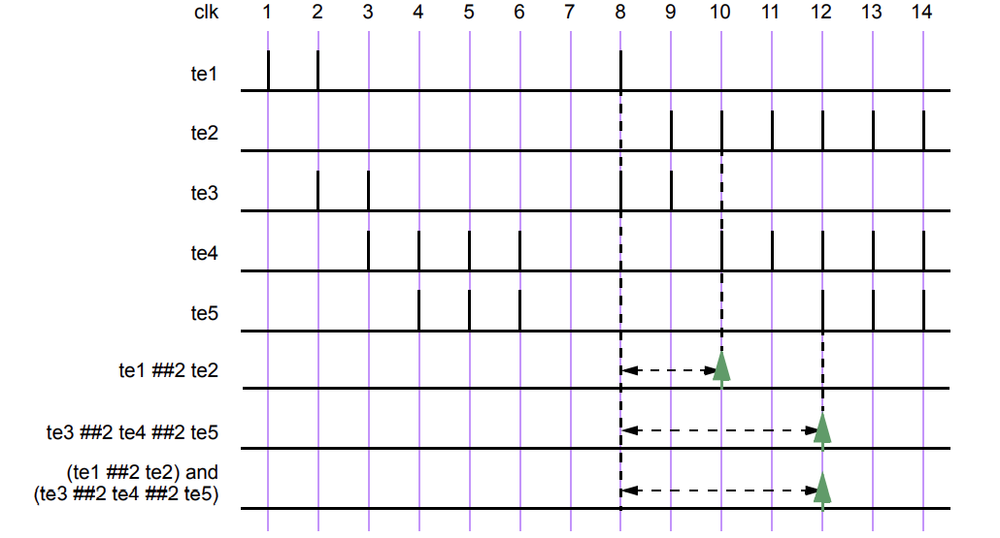

图 16-5—AND 两个序列

这个尝试的结果是匹配，因为两个操作数序列都匹配。各个序列的匹配结束时间是时钟节拍 10 和 12。复合序列的结束时间是两个结束时间中较晚的时间；因此，在时钟节拍 12 识别复合序列的匹配。

在下面的例子中，第一个操作数序列有一个连接操作符，范围从 1 到 5：
```verilog
(te1 ##[1:5] te2) and (te3 ##2 te4 ##2 te5)
```

第一个操作数序列要求 te1 评估为 true，并且 te2 在 1、2、3、4 或 5 个时钟节拍后评估为 true。第二个操作数序列与前一个例子相同。为了考虑复合序列的所有可能匹配，可以采取以下步骤：
 - 为与第一个序列操作数关联的五个可能的线性序列启动五个评估线程。
 - 第二个操作数序列只有一个关联的线性序列；因此，只有一个评估线程为它启动。
 - 图 16-6 显示了从时钟节拍 8 开始的评估尝试。第一个操作数序列的所有五个线性序列都匹配，如时间窗口所示；因此，第一个操作数序列有五个匹配，分别在时钟节拍 9、10、11、12 和 13 结束。第二个操作数序列在时钟节拍 12 匹配。
 - 每个第一个操作数序列的匹配与第二个操作数序列的单个匹配结合，复合序列的匹配的结束时间由匹配的规则确定。

这个计算的结果是复合序列的五个匹配，其中四个在时钟节拍 12 结束，第五个在时钟节拍 13 结束。图 16-6 显示了在时钟节拍 12 和 13 结束的复合序列的匹配。

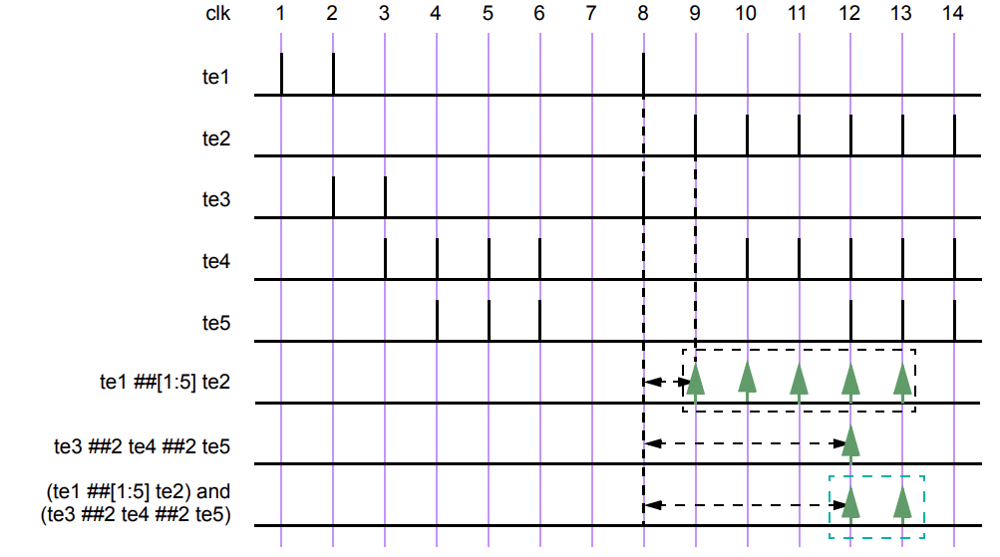

图 16-6—AND 两个序列，包括时间范围

如果 te1 和 te2 是采样表达式（而不是序列），则序列 `(te1 and te2)` 匹配，如果 te1 和 te2 同时评估为 true。

图 16-7 显示了尝试在每个时钟节拍的结果。序列在时钟节拍 1、3、8 和 14 匹配，因为 te1 和 te2 同时为 true。在所有其他时钟节拍，AND 操作的匹配失败，因为 te1 或 te2 为 false。

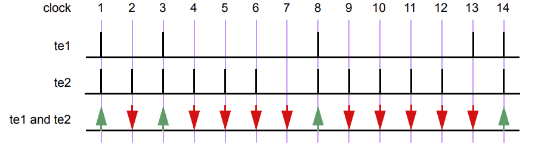

图 16-7—AND 两个布尔表达式

### 16.9.6 交集（AND 与长度限制）
二进制运算符 `intersect` 用于当期望两个操作数匹配时，但操作数序列的结束时间必须相同（见 16-8）。
---
```verilog
sequence_expr ::= // from A.2.10
...
| sequence_expr intersect sequence_expr
```
---
语法 16-8—交集操作符语法（摘自附录 A）

`intersect` 的两个操作数是序列。`intersect` 操作匹配要求如下：
 - 两个操作数都匹配。
 - 两个操作数的匹配长度相同。

`and` 和 `intersect` 的基本区别是序列长度的额外要求。

尝试评估交集序列可能导致多个匹配。这样的尝试的结果可以计算如下：
 - 匹配的第一个和第二个操作数的长度相同的匹配成对。每个这样的对导致复合序列的匹配，长度和结束点等于操作数序列的匹配的共享长度和结束点。
 - 如果找不到这样的对，则没有复合序列的匹配。

图 16-8 类似于图 16-6，除了 `and` 被 `intersect` 替换。在这种情况下，与图 16-6 相比，只有一个时钟节拍 12 的匹配。

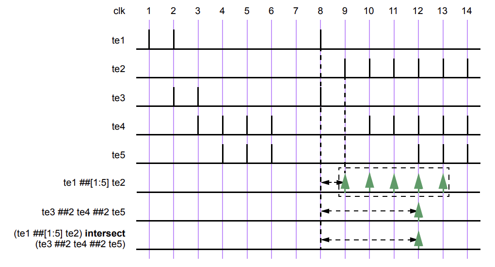

图 16-8—交集两个序列

### 16.9.7 OR 操作
运算符 `or` 用于当期望两个操作数序列中至少一个匹配时（见 16-9）。
---
```verilog
sequence_expr ::= // from A.2.10
...
| sequence_expr or sequence_expr
```
---
语法 16-9—或操作符语法（摘自附录 A）

`or` 的两个操作数是序列。

如果操作数 te1 和 te2 是表达式，则
```verilog
te1 or te2
```

在任何时钟节拍上匹配，其中至少一个 te1 和 te2 为 true。

图 16-9 说明了一个 OR 操作，其中两个操作数 te1 和 te2 是表达式。复合序列在时钟节拍 7 和 13 不匹配，因为 te1 和 te2 在这些时钟节拍上都为 false。在所有其他时钟节拍上，复合序列匹配，因为 te1 和 te2 至少有一个为 true。

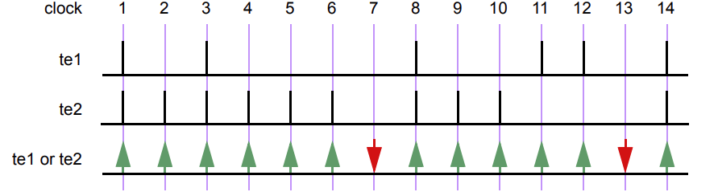

图 16-9—OR 两个布尔表达式

当 te1 和 te2 是序列时，复合序列
```verilog
te1 or te2
```

匹配，如果至少一个 te1 和 te2 匹配。每个 te1 或 te2 的匹配都是复合序列的匹配。复合序列的结束时间是 te1 或 te2 的结束时间。换句话说，复合序列的匹配是 te1 的匹配的并集和 te2 的匹配的并集的联合。

下面的例子展示了一个带有操作符 or 的序列，其中两个操作数是序列。图 16-10 说明这个例子。
```verilog
(te1 ##2 te2) or (te3 ##2 te4 ##2 te5)
```

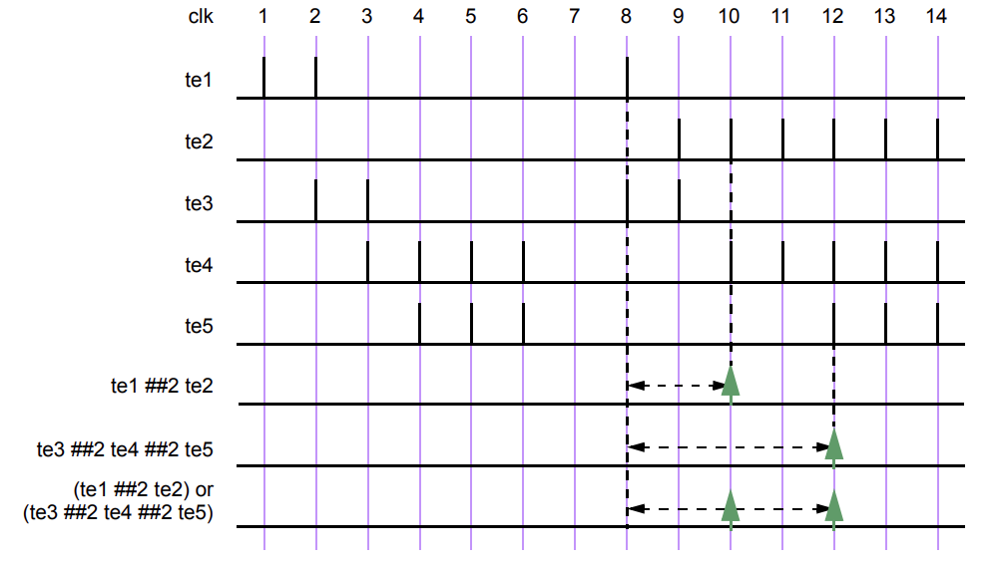

图 16-10—OR 两个序列

在上面的例子中，两个操作数是 `(te1 ##2 te2)` 和 `(te3 ##2 te4 ##2 te5)`。第一个序列要求 te1 首先评估为 true，然后两个时钟节拍后 te2 评估为 true。第二个序列要求 te3 评估为 true，然后两个时钟节拍后 te4 评估为 true，再两个时钟节拍后 te5 评估为 true。图 16-10 显示了在时钟节拍 8 的评估尝试。第一个序列在时钟节拍 10 匹配，第二个序列在时钟节拍 12 匹配。因此，复合序列在时钟节拍 10 和 12 匹配。

在下面的例子中，第一个操作数序列有一个连接操作符，范围从 1 到 5：
```verilog
(te1 ##[1:5] te2) or (te3 ##2 te4 ##2 te5)
```

第一个操作数序列要求 te1 评估为 true，并且 te2 在 1、2、3、4 或 5 个时钟节拍后评估为 true。第二个操作序列要求 te3 评估为 true，两拍后 te4 评估为 true，再两拍后 te5 评估为 true。复合序列在任何时钟节拍上匹配，其中至少一个操作数序列匹配。如图 16-11 所示，对于时钟节拍 8 的尝试，第一个操作数序列在时钟节拍 9、10、11、12 和 13 匹配，第二个操作数序列在时钟节拍 12 匹配。因此，复合序列在时钟节拍 9、10、11 和 13 上有一个匹配，在时钟节拍 12 上有两个匹配。

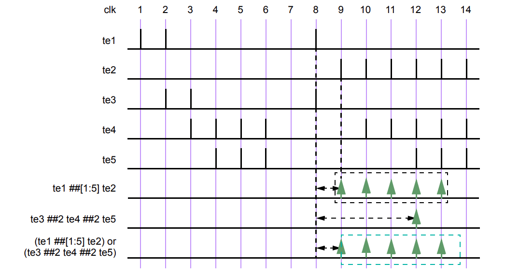

图 16-11—OR 两个序列，包括时间范围

### 16.9.8 first_match 操作
`first_match` 操作符仅匹配其操作数序列的评估尝试中的第一个可能的匹配。这允许所有后续匹配被丢弃。特别是，当一个序列是另一个序列的子序列时，应用 `first_match` 操作符对包含序列的评估有重要影响（见 16-10）。
---
```verilog
sequence_expr ::= // from A.2.10
...
| first_match ( sequence_expr {, sequence_match_item} )
```
---
语法 16-10—first_match 操作符语法（摘自附录 A）

`first_match` 的评估尝试的操作数 seq 的匹配开始于相同的时钟节拍。如果 seq 的评估尝试没有匹配，则 `first_match` 的评估尝试也没有匹配。否则，seq 的最早结束时钟节拍的匹配是 `first_match` 的匹配。如果有多个 seq 的匹配在最早结束时钟节拍上，那么所有这些匹配都是 `first_match` 的匹配。

以下示例显示了一个变量延迟规范：
```verilog
sequence t1;
    te1 ## [2:5] te2;
endsequence

sequence ts1;
    first_match(te1 ## [2:5] te2);
endsequence
```

在这里，te1 和 te2 是表达式。序列 t1 的每次尝试最多可以匹配以下四个序列：
```verilog
te1 ##2 te2
te1 ##3 te2
te1 ##4 te2
te1 ##5 te2
```

然而，序列 ts1 只能匹配前面四个序列中的一个。在前面四个序列中，最早结束的匹配是 ts1 的匹配。

例如：
```verilog
sequence t2;
    (a ##[2:3] b) or (c ##[1:2] d);
endsequence

sequence ts2;
    first_match(t2);
endsequence
```

序列 t2 的每次尝试最多可以匹配以下四个序列：
```verilog
a ##2 b
a ##3 b
c ##1 d
c ##2 d
```

序列 ts2 只匹配这些序列中最早结束的匹配。如果 a、b、c 和 d 是表达式，则可能同时结束的匹配是：
```verilog
a ##2 b
c ##2 d
```

如果这两个序列匹配，并且 `(c ##1 d)` 不匹配，则 ts2 的评估结果是这两个匹配。

序列匹配项可以附加到 `first_match` 操作符的操作数序列。序列匹配项放置在与操作数相同的括号中。因此，例如，局部变量赋值 `x = e` 可以通过
```verilog
first_match(seq, x = e)
```

等效于以下内容：
```verilog
first_match((seq, x = e))
```

有关序列匹配项的讨论，请参见 16.10 和 16.11。

### 16.9.9 在序列上的条件
序列通常在一些正确行为的条件假设下发生。例如，处理事务时必须满足逻辑条件。另外，处理事务时禁止出现某些值。这种情况可以直接使用 16-11 中显示的构造。
---
```verilog
sequence_expr ::= // from A.2.10
...
| expression_or_dist throughout sequence_expr
```
---
语法 16-11—Throughout 构造语法（摘自附录 A）

构造 exp `throughout` seq 是以下内容的缩写：
```verilog
(exp) [*0:$] intersect seq
```

复合序列 exp `throughout` seq 在一系列连续时钟节拍的有限间隔内匹配，前提是 seq 在该间隔内匹配，并且 exp 在该间隔内的每个时钟节拍上评估为 true。

下面的示例在图 16-12 中说明。
```verilog
sequence burst_rule1;
    @(posedge mclk)
    $fell(burst_mode) ##0 
    ((!burst_mode) throughout (##2 ((trdy==0)&&(irdy==0)) [*7]));
endsequence
```

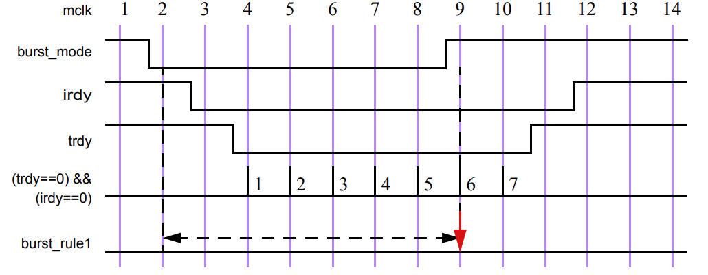

图 16-12—Throughout 限制失败的匹配

图 16-13 说明了从时钟节拍 2 开始的序列 burst_rule1 的评估尝试。因为信号 burst_mode 在时钟节拍 1 为高，在时钟节拍 2 为低，所以 `$fell(burst_mode)` 在时钟节拍 2 为 true。为了完成 burst_rule1 的匹配，需要 burst_mode 的值在从时钟节拍 2 开始的子序列 `(##2 ((trdy==0)&&(irdy==0)) [*7])` 的匹配期间保持低。这个子序列从时钟节拍 2 到时钟节拍 10 匹配。然而，在时钟节拍 9，burst_mode 变为高，因此不符合 `throughout` 的规则。

如果信号 burst_mode 在至少时钟节拍 10 保持低，则从时钟节拍 2 到时钟节拍 10 有一个 burst_rule1 的匹配，如图 16-13 所示。

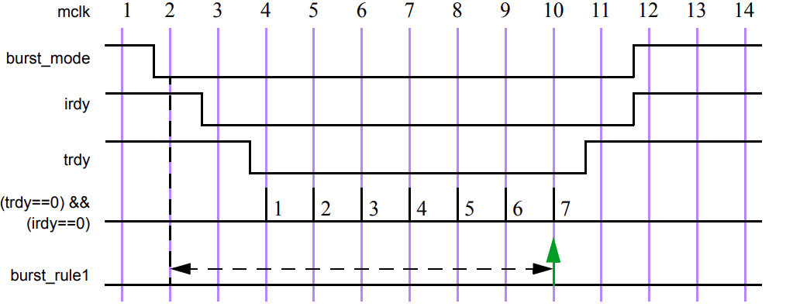

图 16-13—Throughout 限制成功的匹配

### 16.9.10 包含在另一个序列中的序列
序列包含在另一个序列中的情况可以通过 16-12 中显示的构造来表示。
---
```verilog
sequence_expr ::= // from A.2.10
...
| sequence_expr within sequence_expr
```
---
语法 16-12—Within 构造语法（摘自附录 A）

构造 seq1 `within` seq2 是以下内容的缩写：
```verilog
(1[*0:$] ##1 seq1 ##1 1[*0:$]) intersect seq2
```

复合序列 seq1 `within` seq2 在一系列连续时钟节拍的有限间隔内匹配，前提是 seq2 在该间隔内匹配，并且 seq1 在该间隔内的某个子间隔内匹配。换句话说，seq1 和 seq2 的匹配必须满足以下条件：
 - seq1 的匹配的开始点不早于 seq2 的匹配的开始点。
 - seq1 的匹配的结束点不晚于 seq2 的匹配的结束点。

例如，序列
```verilog
!trdy[*7] within ($fell(irdy) ##1 !irdy[*8])
```

在图 16-13 中显示的跟踪上匹配，从时钟节拍 3 到时钟节拍 11。

### 16.9.11 从更简单的子序列组合序列
有两种方法可以使用更简单的子序列组合复杂序列。

一种是通过引用其名称实例化命名序列。这种引用的求值要求命名序列从封闭序列求值期间到达引用的时钟节拍开始匹配。例如：
```verilog
sequence s;
    a ##1 b ##1 c;
endsequence

sequence rule;
    @(posedge sysclk)
        trans ##1 start_trans ##1 s ##1 end_trans;
endsequence
```

序列 s 在序列 rule 的 start_trans 求值后的一个时钟节拍被计算。

另一种使用序列的方法是在另一个序列中检测其结束点。序列的结束点在匹配序列的结束时钟节拍到达时到达，无论匹配的开始时钟节拍如何。到达结束点可以通过使用方法 `triggered` 来测试。

要检测结束点，可以将 `triggered` 方法应用于命名序列实例，带或不带参数，未命名的形式参数，或类型为 `sequence` 的形式参数，如果允许的话，如下所示：
```verilog
sequence_instance.triggered
```

或
```verilog
formal_argument_sequence.triggered
```

`triggered` 是序列上的方法。其操作的结果是 true（1'b1）或 false（1'b0）。当 `triggered` 方法在表达式中求值时，它测试其操作数序列在特定时间点是否到达其结束点。`triggered` 的结果不取决于其操作数序列的匹配的开始点。下面展示一个示例：
```verilog
sequence e1;
    @(posedge sysclk) $rose(ready) ##1 proc1 ##1 proc2 ;
endsequence

sequence rule;
    @(posedge sysclk) reset ##1 inst ##1 e1.triggered ##1 branch_back;
endsequence
```

在这个示例中，序列 e1 必须在 inst 之后的一个时钟节拍开始匹配。如果 `triggered` 方法被替换为序列 e1 的实例，e1 必须在 inst 之后的一个时钟节拍开始匹配。注意，`triggered` 方法只测试 e1 的结束点，并且与 e1 的开始点无关。

下面的示例展示了在带有参数的命名序列实例上应用 `triggered` 方法的应用：
```verilog
sequence e2(a,b,c);
    @(posedge sysclk) $rose(a) ##1 b ##1 c;
endsequence

sequence rule2;
    @(posedge sysclk) reset ##1 inst ##1 e2(ready,proc1,proc2).triggered 
    ##1 branch_back;
endsequence
```

rule2 等价于 rule2a，如下所示：
```verilog
sequence e2_instantiated;
    e2(ready,proc1,proc2);
endsequence

sequence rule2a;
    @(posedge sysclk) reset ##1 inst ##1 e2_instantiated.triggered ##1 
    branch_back;
endsequence
```

下面的示例展示了在类型为 `sequence` 的形式参数上应用 `triggered` 方法的应用：
```verilog
sequence e3(sequence a, untyped b); 
    @(posedge sysclk) a.triggered ##1 b;
endsequence

sequence rule3; 
    @(posedge sysclk) reset ##1 e3(ready ##1 proc1, proc2) ##1 branch_back;
endsequence
```

对于将本地变量传递到应用了 `triggered` 的序列实例的情况有额外的限制（见 16.10）。

`triggered` 方法可以在多个时钟的情况下使用。然而，应用 `triggered` 的序列实例的结束时钟始终与出现 `triggered` 方法的上下文中的时钟相同（见 16.13.5）。

## 16.10 局部变量
数据可以在命名序列（见 16.8）和属性（见 16.12）中使用动态创建的本地变量进行操作。使用静态 SystemVerilog 变量意味着只存在一个副本。如果需要在流水线设计中检查数据值，那么对于进入管道的每个数据量，可以使用一个单独的变量来存储管道的预测输出，以便在结果实际退出管道时进行比较。可以通过使用数组变量来构建这种存储，这些变量按移位寄存器的方式排列，以模拟数据通过管道传播。然而，在更复杂的情况下，管道的延迟是变量，且无序，这种构造可能变得非常复杂且容易出错。因此，变量被需要是局部的，在特定事务检查中使用，并且可以跨越任意时间间隔并且可以与其他事务检查重叠。因此，当需要时，将在命名序列的实例内动态创建一个局部变量，并在到达序列的末尾时删除它。

动态创建局部变量及其赋值通过使用局部变量形式参数声明（见 16.8.2，16.12.18）或在命名序列或属性声明中使用断言变量声明（见 16.12）来实现。没有进一步的规定，术语 *局部变量* 将意味着局部变量形式参数或在 assertion_variable_declaration 中声明的局部变量。没有进一步的规定，术语 *局部变量初始化赋值* 将意味着将方向为 `input` 或 `inout` 的局部变量形式参数的初始值赋为相应实际参数的值，或在 assertion_variable_declaration 中声明的局部变量的声明赋值（见 语法 16-13）。
---
```verilog
assertion_variable_declaration ::= // from A.2.10
var_data_type list_of_variable_decl_assignments ;
```
---
语法 16-13—断言变量声明语法（摘自附录 A）

断言变量声明的数据类型必须显式指定。数据类型必须是断言中允许的类型之一（见 16.6）。数据类型后面必须是一个或多个逗号分隔的标识符，可选地带有声明赋值。如果存在声明赋值，则定义了要放入相应局部变量的初始值。初始值由一个表达式定义，该表达式不必是常量。

局部变量的采样值定义为当前值（见 16.5.1）。

在对命名序列或属性的实例的每次评估尝试开始时，将创建每个局部变量的新副本，并且如果存在，则将执行相应的初始化赋值。初始化赋值将按照序列或属性声明中的顺序在 Observed 区域中执行。对于此规则，所有局部变量形式参数的初始化赋值将在任何 assertion_variable_declaration 中声明的局部变量的初始化赋值之前执行。局部变量的初始化赋值使用在评估尝试开始时的时间槽中对其表达式的采样值。给定局部变量的初始化赋值的表达式可能引用先前声明的局部变量。在这种情况下，先前声明的局部变量本身必须有初始化赋值，并且将使用先前声明的局部变量的初始值在给定局部变量的表达式的评估中使用。局部变量没有默认初始值。没有初始化赋值的局部变量在评估尝试开始时未分配。

例如，在实例的评估尝试开始时
```verilog
sequence s;
    logic u, v = a, w = v || b;
    ...
endsequence
```

首先执行 a 到 v 的赋值，然后执行 `v || b` 到 w 的赋值。赋给 w 的值与声明赋值 w = a || b 的结果相同。局部变量 u 在评估尝试开始时未分配。

局部变量可以在声明它们的命名序列或属性的主体中分配和重新分配。
---
```verilog
sequence_expr ::= // from A.2.10
... 
| ( sequence_expr {, sequence_match_item} ) [ sequence_abbrev ] 
... 
sequence_match_item ::= 
operator_assignment 
| inc_or_dec_expression 
... 
```
---
语法 16-14—变量赋值语法（摘自附录 A）

可以在语法子序列的末尾添加一个或多个局部变量，方法是将子序列放在括号中，子序列与局部变量的赋值列表之间用逗号分隔。在子序列的任何非空匹配结束时，局部变量赋值将按照它们在列表中出现的顺序执行。例如，在
```verilog
a ##1 b[->1] ##1 c[*2]
```

如果希望在 `b[->1]` 的匹配中赋值 `x = e`，然后 `y = x && f`，可以将序列重写为
```verilog
a ##1 (b[->1], x = e, y = x && f) ##1 c[*2]
```

局部变量可以在序列或属性中的任何地方重新赋值。例如
```verilog
a ##1 (b[->1], x = e, y = x && f) ##1 (c[*2], x &= g)
```

局部变量赋值附加的子序列不允许空匹配。例如，序列
```verilog
a ##1 (b[*0:1], x = e) ##1 c[*2] // 非法
```

是非法的，因为子序列 `b[*0:1]` 可以匹配空字。序列
```verilog
(a ##1 b[*0:1], x = e) ##1 c[*2] // 合法
```

是合法的，因为连接的子序列 `a ##1 b[*0:1]` 不能匹配空字。

局部变量可以在声明它们的序列或属性中引用。在引用被引用之前，序列或属性必须在该点之前为局部变量赋值。先前的赋值可以是初始化赋值或附加到子序列的赋值。存在使用增量或减量运算符或除“`=`”之外的赋值运算符的引用关联的隐式引用。因此，局部变量必须在使用增量或减量运算符或除“`=`”之外的赋值运算符之前被赋值。

在某些情况下，赋值的局部变量稍后变得未赋值。如果局部变量不流出子序列（见下文），则局部变量在该子序列的末尾变得未分配，无论它是否在该点之前被赋值。在局部变量再次被赋值之前，局部变量不得在该点之后引用。请参见 F.5.4，以了解定义局部变量流的精确条件。

局部变量不得被层次引用。

局部变量的使用示例是，假设管道具有固定的五个时钟周期的延迟。数据在 pipe_in 上进入管道，当 valid_in 为 true 时，管道计算的值在五个时钟周期后出现在信号 pipe_out1 上。管道转换的数据由一个函数预测，该函数递增数据。以下属性验证了这种行为：
```verilog
property e;
    int x;
    (valid_in, x = pipe_in) |-> ##5 (pipe_out1 == (x+1));
endproperty
```

属性 e 的评估如下：
 - 当 valid_in 为 true 时，x 被赋值为 pipe_in 的值。如果五个周期后，pipe_out1 等于 x+1，则属性 e 为 true。否则，属性 e 为 false。
 - 当 valid_in 为 false 时，属性 e 评估为 true。

局部变量可以像使用相同类型的静态变量一样用于形成表达式。这包括在向量的位选择和部分选择或数组的索引中使用局部变量。局部变量不得在时钟事件表达式中使用。

局部变量可以在序列或属性中使用。
```verilog
sequence data_check;
    int x;
    a ##1 (!a, x = data_in) ##1 !b[*0:$] ##1 b && (data_out == x);
endsequence

property data_check_p
    int x;
    a ##1 (!a, x = data_in) |=> !b[*0:$] ##1 b && (data_out == x);
endproperty
```

局部变量赋值可以附加到重复的操作数序列，并完成值的累积。
```verilog
sequence rep_v;
    int x = 0;
    (a[->1], x += data)[*4] ##1 b ##1 c && (data_out == x);
endsequence
```

累积局部变量可以用于计算条件重复的次数，如下面的示例所示：
```verilog
sequence count_a_cycles;
    int x;
    ($rose(a), x = 1)
    ##1 (a, x++)[*0:$]
    ##1 !a && (x <= MAX);
endsequence
```

在命名序列或属性中声明的局部变量在实例化上下文中不可见。下面的示例说明了在序列 seq1 中的序列 sub_seq1 的局部变量 v1 的非法访问。
```verilog
sequence sub_seq1;
    int v1;
    (a ##1 !a, v1 = data_in) ##1 !b[*0:$] ##1 b && (data_out == v1);
endsequence

sequence seq1;
    c ##1 sub_seq1 ##1 (do1 == v1); // 错误，因为 v1 不可见
endsequence
```

给命名序列实例的局部变量赋值，并且在实例匹配完成时或之后的实例上下文中引用局部变量是有用的。这种能力在以下条件下得到支持：
 - 局部变量应在命名序列外部声明，并且其作用域应包括命名序列的实例和实例化上下文中的所需引用。
 - 局部变量应作为命名序列的实例的参数列表中的整个实际参数传递。
 - 相应的形式参数应是无类型的。

命名序列可以在一个或多个 sequence_match_items 中指定对形式参数的赋值。

以下示例说明了这种用法：
```verilog
sequence sub_seq2(lv);
    (a ##1 !a, lv = data_in) ##1 !b[*0:$] ##1 b && (data_out == lv);
endsequence

sequence seq2;
    int v1;
    c ##1 sub_seq2(v1) // v1 绑定到 lv
    ##1 (do1 == v1); // v1 包含被分配给 lv 的值
endsequence
```

通过使用局部变量形式参数（见 16.8.2），可以实现类似的功能。

局部变量可以作为整个实际参数传递到应用了 `triggered` 的命名序列实例，并以类似的方式访问。例如：
```verilog
sequence seq2a;
    int v1;
    c ##1 sub_seq2(v1).triggered ##1 (do1 == v1); // v1 现在绑定到 lv
endsequence
```

当将局部变量作为实际参数传递到应用了 `triggered` 的命名序列实例时，有额外的限制：
 - 局部变量只能作为整个实际参数传递，不能作为实际参数的适当子表达式。
 - 在命名序列的声明中，局部变量绑定到的形式参数在分配之前不得引用。

第二个限制由 sub_seq2 满足，因为赋值 lv = data_in 在引用 lv 的 data_out == lv 之前发生。

如果局部变量在传递到应用了 `triggered` 的命名序列实例之前被赋值，则限制将阻止此分配值在命名序列内部可见。这些限制很重要，因为使用 `triggered` 意味着命名序列外部赋值的时间点与实例的匹配开始之间没有保证的关系。

局部变量作为应用 triggered 的命名序列实例的形式参数传递时，将流出应用 `triggered` 的实例，前提是满足以下两个条件：
 - 局部变量从命名序列实例的末尾流出，如序列的局部变量流规则所定义的那样（见下文和 F.5.4）。
 - 对此实例应用 `triggered` 的应用是最大布尔表达式。换句话说，对此实例应用 `triggered` 不能有否定或任何其他表达式运算符。

sub_seq2 和 seq2a 都满足这两个条件。因此，在 seq2a 中，比较 do1 == v1 中的 v1 的值是通过赋值 lv = data_in 给 sub_seq2 中的 lv 而得到的。然而，在
```verilog
sequence seq2b;
    int v1;
    c ##1 !sub_seq2(v1).triggered ##1 (do1 == v1); // v1 未分配
endsequence
```

第二个条件被违反，因为否定应用于 `sub_seq2(v1).triggered`。因此，v1 不会从应用 triggered 到此实例的应用中流出，do1 == v1 中的引用是一个未分配的变量。

在一个时钟周期内，可以有多个应用了 `triggered` 的命名序列实例的匹配，这些匹配可以具有不同的局部变量值。多个匹配在语义上与匹配 `or` 的两个分支相同。换句话说，评估应用了 `triggered` 的实例的线程将分叉以考虑这种不同的局部变量值。

当局部变量作为序列声明的形式参数时，声明该变量是非法的，如下面的示例所示：
```verilog
sequence sub_seq3(lv);
    int lv; // 因为 lv 是一个形式参数，所以是非法的
    (a ##1 !a, lv = data_in) ##1 !b[*0:$] ##1 b && (data_out == lv);
endsequence
```

在使用分支运算符 `or`、`and` 和 `intersect` 的序列中使用局部变量时，有特殊的考虑。由这些运算符其中一个构造的复合序列的评估可以被认为是在并行评估操作数序列的两个线程中分叉。局部变量可能在复合序列的评估开始之前被赋值，或者从初始化赋值或者从前面的子序列的赋值中被赋值。这样的局部变量被认为 *流入* 每个操作数序列。这种局部变量可能在一个或两个操作数序列中被赋值或重新赋值。一般来说，不能保证两个线程的局部变量的值是一致的，甚至不能保证局部变量是否被赋值。因此，复合序列计算之前和期间的赋给局部变量的值并不总是允许在复合序列的评估之后可见。

在某些情况下，局部变量的值的一致性并不重要，而在其他情况下则很重要。在 F.5.4 中给出了定义局部变量在复合序列的评估之后是否可见的静态（即，编译时可计算的）条件。如果满足这些条件，则局部变量被认为 *流出* 复合序列。否则，局部变量在复合序列的末尾将变得未分配。局部变量流的条件的直观描述如下：
 - 在并行线程中赋值的变量不能在兄弟线程中访问。例如：
```verilog
sequence s4;
    int x;
    (a ##1 (b, x = data) ##1 c) or (d ##1 (e==x)); // 非法
endsequence
```

 - 在或运算中，局部变量流出复合序列，当且仅当它从每个操作数序列中流出。如果局部变量在复合序列的开始之前没有被赋值，并且它只在一个操作数序列中被赋值，则它不会从复合序列中流出。
 - 与操作数序列匹配的每个线程作为一个单独的线程继续，带有它自己的局部变量的最新赋值，这些局部变量流出复合序列。这些线程不必具有局部变量的一致值。例如：
```verilog
sequence s5;
    int x,y;
    ((a ##1 (b, x = data, y = data1) ##1 c) or (d ##1 (`true, x = data) ##0 (e==x))) ##1 (y==data2); // 非法，因为 y 不在交集中
endsequence

sequence s6;
    int x,y;
    ((a ##1 (b, x = data, y = data1) ##1 c) or (d ##1 (`true, x = data) ##0 (e==x))) ##1 (x==data2); // 合法，因为 x 在交集中
endsequence
```

 - 在与和交集的情况下，至少一个操作数流出的局部变量应流出复合序列，除非它被阻止。局部变量被阻止从复合序列流出的条件是：
   - 局部变量在每个操作数中被赋值并且流出复合序列，或者
   - 局部变量被阻止从至少一个操作数序列流出。
流出复合序列的局部变量的值是最新赋值的值。两个操作数的线程在复合序列的评估结束时合并为一个。

```verilog
sequence s7;
    int x,y;
    ((a ##1 (b, x = data, y = data1) ##1 c) and (d ##1 (`true, x = data) ##0 (e==x))) ##1 (x==data2); // 非法，因为 x 是两个线程的公共变量
endsequence

sequence s8;
    int x,y;
    (a ##1 (b, x = data, y = data1) ##1 c) and (d ##1 (`true, x = data) ##0 (e==x))) ##1 (y==data2); // 合法，因为 y 在差集中
endsequence
```

## 16.11 在序列匹配时调用子程序
在成功匹配序列的非空序列的末尾，可以调用任务、任务方法、无函数、无函数方法和系统任务。子程序调用，如局部变量赋值一样，出现在序列后面的逗号分隔列表中。子程序调用被称为附加到序列。附加的子程序调用或任何序列_match_item 附加到不允许空匹配的序列是一个错误。序列和后面的列表用括号括起来（见 语法 16-15）。
---
```verilog
sequence_expr ::= // from A.2.10
... 
| ( sequence_expr {, sequence_match_item} ) [ sequence_abbrev ] 
... 
sequence_match_item ::= 
operator_assignment 
| inc_or_dec_expression 
| subroutine_call 
```
---
语法 16-15—序列语法中的子程序调用（摘自附录 A）

例如：
```verilog
sequence s1;
    logic v, w;
    (a, v = e) ##1 
    (b[->1], w = f, $display("b after a with v = %h, w = %h\n", v, w));
endsequence
```

定义了一个序列 s1，该序列在 a 的第一次出现后严格匹配 b。在匹配时，执行系统任务 $display 来写一个消息，宣布匹配并显示分配给局部变量 v 和 w 的值。

附加到序列的所有子程序调用都在每次成功匹配序列时执行。对于每次成功匹配，附加的调用按它们在列表中出现的顺序执行。断言评估不会等待或接收来自任何附加子程序的数据。子程序被调度在 Reactive 区域，就像动作块一样。

附加到序列的每个子程序调用的参数应该作为输入按值传递，或者作为引用传递（ref 或 const ref；见 13.5.2）。作为值传递的实际参数表达式使用底层变量的采样值，并且与用于评估序列匹配的变量值一致。作为输入值传递的变量应该是 16.6 中允许的类型。自动变量可以作为程序代码中断言语句中的子程序调用的常量输入传递（见 16.14.6.1）。自动变量不得作为引用传递，也不得作为程序代码中断言语句中的子程序调用的非常量输入传递。将动态数组、队列和关联数组的元素作为 ref 参数传递的规则在 13.5.2 中描述。

局部变量可以传递到附加到序列的子程序调用中。在序列后面的列表中的子程序调用之前流出序列或在序列后面的列表中分配的任何局部变量都可以在调用的实际参数表达式中使用。如果局部变量出现在实际参数表达式中，则该参数应该按值传递。

## 16.12 声明属性
属性定义了设计的行为。命名属性可以用于验证作为假设、义务或覆盖规范。为了使用行为进行验证，必须使用 assert、assume 或 cover 语句。属性声明本身不产生任何结果。

可以在以下任何地方声明命名属性：
 - 模块
 - 接口
 - 程序
 - 时钟块
 - 包
 - 编译单元范围
 - 生成块
 - 检查器

为了声明命名属性，使用属性构造，如语法 16-16 所示。
---
```verilog
assertion_item_declaration ::= // from A.2.10
property_declaration 
... 
property_declaration ::= 
property property_identifier [ ( [ property_port_list ] ) ] ;
{ assertion_variable_declaration } 
 property_spec [ ; ] 
endproperty [ : property_identifier ] 
property_port_list ::= 
property_port_item {, property_port_item} 
property_port_item ::= 
{ attribute_instance } [ local [ property_lvar_port_direction ] ] property_formal_type
property_lvar_port_direction ::= input
property_formal_type ::= 
sequence_formal_type 
| property
property_spec ::= 
[clocking_event ] [ disable iff ( expression_or_dist ) ] property_expr 
property_expr ::= 
sequence_expr 
| strong ( sequence_expr )
| weak ( sequence_expr )
| ( property_expr )
| not property_expr 
| property_expr or property_expr 
| property_expr and property_expr 
| sequence_expr |-> property_expr 
| sequence_expr |=> property_expr 
| if ( expression_or_dist ) property_expr [ else property_expr ] 
| case ( expression_or_dist ) property_case_item { property_case_item } endcase
| sequence_expr #-# property_expr 
| sequence_expr #=# property_expr 
| nexttime property_expr 
| nexttime [ constant _expression ] property_expr 
| s_nexttime property_expr 
| s_nexttime [ constant_expression ] property_expr 
| always property_expr 
| always [ cycle_delay_const_range_expression ] property_expr 
| s_always [ constant_range ] property_expr 
| s_eventually property_expr 
| eventually [ constant_range ] property_expr 
| s_eventually [ cycle_delay_const_range_expression ] property_expr 
| property_expr until property_expr 
| property_expr s_until property_expr 
| property_expr until_with property_expr 
| property_expr s_until_with property_expr 
| property_expr implies property_expr 
| property_expr iff property_expr
| accept_on ( expression_or_dist ) property_expr 
| reject_on ( expression_or_dist ) property_expr 
| sync_accept_on ( expression_or_dist ) property_expr 
| sync_reject_on ( expression_or_dist ) property_expr 
| property_instance 
| clocking_event property_expr 
property_case_item::= 
expression_or_dist { , expression_or_dist } : property_expr [ ; ] 
| default [ : ] property_expr [ ; ] 
assertion_variable_declaration ::= 
var_data_type list_of_variable_decl_assignments ;
property_instance ::= 
ps_or_hierarchical_property_identifier [ ( [ property_list_of_arguments ] ) ] 
property_list_of_arguments ::= 
[property_actual_arg] { , [property_actual_arg] } { , . identifier ( [property_actual_arg] ) }
| . identifier ( [property_actual_arg] ) { , . identifier ( [property_actual_arg] ) } 
property_actual_arg ::= 
property_expr 
| sequence_actual_arg 
```
---
语法 16-16—属性构造语法（摘自附录 A）

命名属性可以在可选的 property_port_list 中声明形式参数。

除了在 16.12.18、16.12.19 和 16.12.17 中描述的情况外，在命名属性中声明形式参数和默认实际参数的规则以及使用实际参数实例化命名属性的规则与在 16.8、16.8.1 和 16.8.2 中描述的命名序列的规则相同。

命名属性中规定和使用形式参数的规则特别讨论在 16.12.18 中。

命名属性中规定和使用局部变量形式参数的规则特别讨论在 16.12.19 中。

在命名属性的声明的 body property_spec 中可以引用形式参数。对形式参数的引用可以写在各种语法实体的位置，包括除 16.8 中列出的语法实体之外的以下语法实体：
 - property_expr
 - property_spec

命名属性可以在其声明之前实例化。命名属性可以在可以写 property_spec 的任何地方实例化。命名属性可以在可以写 property_expr 的地方实例化，前提是实例不生成非法的 disable iff 子句（见下文）。命名属性的实例之间可能存在循环依赖。如果，且仅如果，存在一个有向图中的循环，其节点是命名属性，其边由以下规则定义：如果第一个命名属性在其声明中实例化第二个命名属性，包括在默认实际参数的声明中实例化第二个命名属性的实例，或者第一个命名属性的实例在实际参数中实例化第二个命名属性，则从第一个命名属性到第二个命名属性有一个有向边。具有这种循环依赖的命名属性称为递归的，并在 16.12.17 中讨论。

如果 `$` 是命名属性实例的实际参数，则相应的形式参数应该是无类型的，并且其引用应该是 cycle_delay_const_range_expression 中的上界，或者应该本身是命名序列或属性的实际参数。

非递归命名属性的行为和语义与通过 F.4.1 中定义的重写算法从命名属性的声明的主体中获得的展开属性的行为和语义相同。重写算法在命名属性的声明的主体中的实际参数替换相应的形式参数的引用。重写算法本身不考虑名称解析，并假定在替换实际参数之前已解析名称。如果展开的属性不合法，则实例不合法，并且应该有一个错误。

属性评估的结果是 true 或 false。属性可以使用实例化和在以下子句中描述的运算符构建属性。

表 16-3 列出了从最高到最低优先级的序列和属性运算符，并显示了非一元运算符的结合性。强序列运算符和弱序列运算符的优先级未定义，因为这些运算符需要括号。表 11-2 中描述的运算符的优先级高于序列和属性运算符。

表 16-3—序列和属性运算符优先级和结合性
| 序列运算符 | 属性运算符 | 结合性 |
| --- | --- | --- |
| `[*]`, `[=]`, `[->]` | | — |
| `##` | | 左 |
| `throughout` | | 右 |
| `within` | | 左 |
| `intersect` | | 左 |
| | `not`, `nexttime`, `s_nexttime` | — |
| `and` | `and` | 左 |
| `or` | `or` | 左 |
| | `iff` | 右 |
| | `until`, `s_until`, `until_with`, `s_until_with`, `implies` | 右 |
| | `|->`, `|=>`, `#-#`, `#=#` | 右 |
| | `always`, `s_always`, `eventually`, `s_eventually`, `if-else`, `case`, `accept_on`, `reject_on`, `sync_accept_on`, `sync_reject_on` | — |

可以将 disable iff 子句附加到 property_expr 以生成 property_spec。
```verilog
disable iff ( expression_or_dist ) property_expr
```

disable iff 的表达式称为 disable 条件。disable iff 子句允许指定预先重置。对于属性_spec 的评估，将评估底层 property_expr。如果在观察区域的尝试开始和结束之间的任何时间 disable 条件为 true，则属性的整体评估结果为 disabled。属性的 disabled 评估不会导致成功或失败。否则，属性_spec 的评估与 property_expr 的评估相同。对于不同的属性_spec 评估尝试，将独立测试 disable 条件。在 disable 条件中使用的变量的值是当前模拟周期中的值，即未采样的值。表达式可以通过使用该方法的触发器引用序列的端点来引用序列的端点。disable 条件不得包含对局部变量或匹配的序列方法的引用。如果在 disable 条件中使用除 $sampled 之外的采样值函数，则采样时钟应在其实际参数列表中明确指定，如 16.9.3 中所述。disable iff 子句的嵌套，无论是显式还是通过属性实例化，都是非法的。

### 16.12.1 序列属性
序列属性有三种形式：sequence_expr、`weak`(sequence_expr) 和 `strong`(sequence_expr)。`strong` 和 `weak` 运算符称为 *序列运算符*。strong(sequence_expr) 仅在 sequence_expr 有非空匹配时为 true。weak(sequence_expr) 仅在没有证据表明无法匹配 sequence_expr 的有限前缀时为 true。顺序属性的序列_expr 不得允许空匹配。

如果省略了强序列或弱序列运算符，则 sequence_expr 的评估取决于使用它的断言语句。如果断言语句是 assert property 或 assume property，则 sequence_expr 被评估为 weak(sequence_expr)。否则，sequence_expr 被评估为 strong(sequence_expr)。

注意—IEEE 1800-2009 和 IEEE 1800-2012 对于 sequence_expr 定义的语义与 IEEE Std 1800-2005 不兼容。IEEE 1800-2009 和 IEEE 1800-2012 中与 IEEE Std 1800-2005 中定义的 sequence_expr 等效的是 strong(sequence_expr)。

由于 strong(sequence_expr) 仅需要一次 sequence_expr 的匹配，因此 strong(sequence_expr) 为 true 当且仅当属性 strong(first_match(sequence_expr)) 为 true。

类似地，属性 weak(sequence_expr) 为 true 当且仅当属性 weak(first_match(sequence_expr)) 为 true。这是因为前缀证明无法匹配 sequence_expr 当且仅当它证明无法匹配 first_match(sequence_expr)。

以下示例说明了顺序属性形式： 
```verilog
property p3;
    b ##1 c;
endproperty

c1: cover property (@(posedge clk) a #-# p3);
a1: assert property (@(posedge clk) a |-> p3);
```

在覆盖属性 c1 中，顺序属性 p3 被解释为强序列。c1 的评估尝试返回 true 当且仅当 a 在尝试开始时的 posedge clk 时为 true，并且满足以下两个条件：
 - b 在尝试开始时的 posedge clk 时为 true。
 - 如果存在 posedge clk 的后续时刻，则 c 在第一个这样的时刻为 true。

在断言属性 a1 中，顺序属性 p3 被解释为弱序列。a1 的评估尝试返回 true 当且仅当 a 在尝试开始时的 posedge clk 时为 false，或者满足以下两个条件：
 - b 在尝试开始时的 posedge clk 时为 true。
 - 如果存在 posedge clk 的后续时刻，则 c 在第一个这样的时刻为 true。

### 16.12.2 否定属性
如果属性具有形式 `not` property_expr，则该属性是一个 *否定属性*。对于属性的每次评估尝试，有一个 property_expr 的评估尝试。关键字 not 表明属性的评估结果与 property_expr 的评估结果相反。因此，如果 property_expr 为 true，则否定属性为 false；如果 property_expr 为 false，则否定属性为 true。

`not` 运算符切换属性的强度。特别是，当否定一个序列时，应谨慎。例如，考虑以下断言：
```verilog
a1: assert property (@clk not a ##1 b);
```

由于在断言中使用了序列属性 `a ##1 b`，因此它是弱的。这意味着如果 clk 停止计数，并且 a 在 clk 的最后一个时刻为 true，则弱序列属性 a ##1 b 也将从该时刻开始保持，因此断言 a1 将失败。在这种情况下，更合理的是使用：
```verilog
a2: assert property (@clk not strong(a ##1 b));
```

### 16.12.3 或属性
*或* 属性具有以下形式： 
```verilog
property_expr or property_expr
```

如果至少有一个 property_expr1 和 property_expr2 为 true，则属性为 true。

### 16.12.4 与属性
*与* 属性具有以下形式： 
```verilog
property_expr and property_expr
```

如果 property_expr1 和 property_expr2 均为 true，则属性为 true。

### 16.12.5 如果-否则属性
*如果-否则* 属性具有以下形式之一： 
```verilog
if ( expression_or_dist ) property_expr
```

或者
```verilog
if ( expression_or_dist ) property_expr else property_expr
```

第一种形式的属性在 expression_or_dist 为 false 或 property_expr 为 true 时为 true。第二种形式的属性在 expression_or_dist 为 true 且 property_expr1 为 true 或 expression_or_dist 为 false 且 property_expr2 为 true 时为 true。

### 16.12.6 蕴含
蕴含构造指定在顺序前提匹配的条件下执行属性的检查（见 语法 16-17）。
---
```verilog
property_expr ::= // from A.2.10
... 
| sequence_expr |-> property_expr 
| sequence_expr |=> property_expr
```
---
语法 16-17—蕴含语法（摘自附录 A）

此构造用于预先条件监视属性表达式，并允许在属性级别使用。蕴含的结果是 true 或 false。左操作数 sequence_expr 称为 *前提*，而右操作数 property_expr 称为 *结果*。

对于 `|->` 蕴含有下列注意事项：
 - 从给定的起始点，前提 sequence_expr 可以有零个、一个或多个成功匹配。
 - 如果没有从给定的起始点匹配前提 sequence_expr，则从该起始点开始的蕴含的评估成功并返回 true。
 - 对于前提 sequence_expr 的每个成功匹配，结果 property_expr 都会单独评估。前提 sequence_expr 的匹配结束点是结果 property_expr 评估的起始点。
 - 从给定的起始点，蕴含的评估成功并返回 true 当且仅当对于从该起始点开始的前提 sequence_expr 的每个匹配，从该匹配的结束点开始的结果 property_expr 的评估成功并返回 true。

提供了两种形式的蕴含：使用运算符 `|->` 的重叠蕴含和使用运算符 `|=>` 的非重叠蕴含。对于重叠蕴含，如果前提 sequence_expr 有匹配，则匹配的结束点是结果 property_expr 的评估的起始点。对于非重叠蕴含，结果 property_expr 的评估的起始点是匹配的结束点的下一个时钟节拍。因此，
```verilog
sequence_expr |=> property_expr
```

等效于以下内容：
```verilog
sequence_expr ##1 `true |-> property_expr
```

当涉及多时钟序列和属性时，使用蕴含的情况在 16.13 中解释。

以下示例说明了从主设备传输数据到目标设备的总线操作。当总线进入数据传输阶段时，可以发生多个数据阶段以传输数据块。在数据传输阶段期间，数据阶段在断言的任何上升时钟边沿上完成，irdy 被断言，并且 trdy 或 stop 被断言。在此示例中，断言的信号表示为低值。对于数据阶段的结束的要求可以表示如下：
```verilog
property data_end;
    @(posedge mclk)
    $rose(data_phase) |-> ##[1,5] ((irdy==0) && ($fell(trdy) || $fell(stop)));
endproperty
```

每次序列 `$rose(data_phase)` 匹配时，开始评估结果属性。在图 16-14 中，`$rose(data_phase)` 的匹配发生在时钟节拍 2。这开始了结果属性的评估。然后，在时钟节拍 6，data_end 评估为 true，因为 `$fell(stop)` 和 `irdy==0` 都评估为 true。

在另一个示例中，data_end_exp 用于验证 frame 在 data_end_exp 发生后的两个时钟节拍内取消断言（值为高）。此外，还要求在 frame 取消断言后的两个时钟节拍内取消断言 irdy（值为高）。

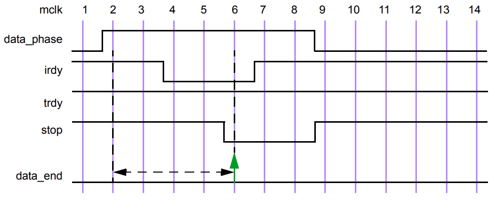

图 16-14—条件序列匹配

编写用于表达此条件的属性如下：
```verilog
`define data_end_exp (data_phase && ((irdy==0)&&($fell(trdy)||$fell(stop))))
property data_end_rule1;
    @(posedge mclk)
    `data_end_exp |-> ##[1:2] $rose(frame) ##1 $rose(irdy);
endproperty
```

属性 data_end_rule1 首先在每个时钟节拍评估 data_end_exp 以测试其值是否为 true。如果值为 false，则将该特定尝试评估为 true。否则，将评估以下序列：
```verilog
##[1:2] $rose(frame) ##1 $rose(irdy)
```

该序列指定在未来两个时钟节拍内查找 frame 的上升沿。在 frame 切换为高电平后的一个时钟节拍内，irdy 也必须切换为高。这在图 16-15 中时钟节拍 6 的评估尝试进行了说明。`` `data_end_exp `` 在时钟节拍 6 被确认。接下来，frame 在时钟节拍 7 切换为高电平。因为这在 `[1:2]` 强制约束的时间限制内，它满足序列并继续进一步评估。在时钟节拍 8，irdy 被评估。信号 irdy 在时钟节拍 8 切换为高电平，完全匹配了从时钟节拍 6 开始的尝试的序列规范。

一般，断言与前提相关联，以便只在满足特定条件时执行检查。如前面的示例所示，`|->` 运算符提供了这种能力，以指定在评估属性之前必须满足的条件。下一个示例修改前面的示例，以查看删除断言的前提对断言结果的影响。如下所示，并在图 16-16 中说明。
```verilog
property data_end_rule2;
    @(posedge mclk) ##[1:2] $rose(frame) ##1 $rose(irdy);
endproperty
```

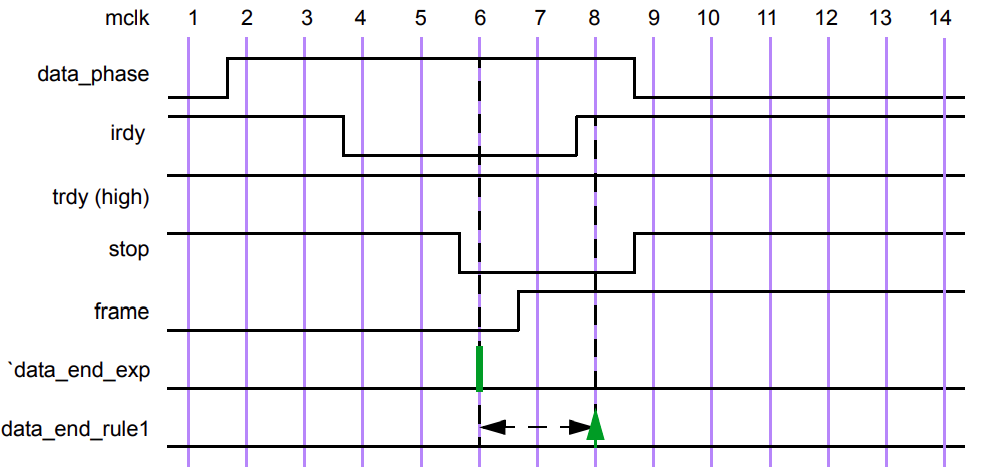

图 16-15—条件序列

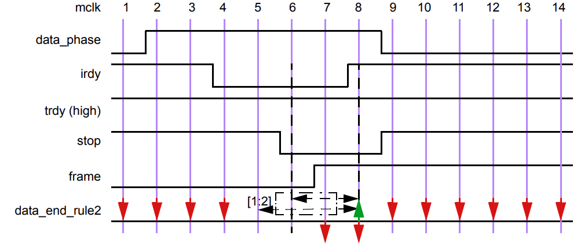

图 16-16—没有条件的结果

属性在每个时钟节拍评估。对于时钟节拍 1 的评估，信号 frame 的上升沿不会在时钟节拍 2 或 3 发生，因此属性在时钟节拍 1 失败。类似地，在时钟节拍 2、3 和 4 失败。从时钟节拍 5 和 6 开始的尝试，信号 frame 在时钟节拍 7 上升沿允许进一步检查。在时钟节拍 8，序列根据规范完成，导致在时钟节拍 5 和 6 开始的尝试匹配。所有后续尝试匹配序列失败，因为 `$rose(frame)` 不再发生。

图 16-16 显示，删除检查 `data_end_exp` 的前提导致与验证目标无关的失败。从验证的角度来看，确定这些前提条件并使用它们来过滤不适当或多余的情况是很重要的。

一个前提是序列的蕴含示例如下：
```verilog
(a ##1 b ##1 c) |-> (d ##1 e)
```

如果序列 `(a ##1 b ##1 c)` 匹配，则序列 `(d ##1 e)` 必须匹配。另一方面，如果序列 `(a ##1 b ##1 c)` 不匹配，则结果为 true。

另一个蕴含的示例如下：
```verilog
property p16;
    (write_en & data_valid) ##0 
    (write_en && (retire_address[0:4]==addr)) [*2] |-> 
    ##[3:8] write_en && !data_valid &&(write_address[0:4]==addr);
endproperty
```

此属性可以编码为嵌套蕴含：
```verilog
property p16_nested;
    (write_en & data_valid) |->
        (write_en && (retire_address[0:4]==addr)) [*2] |-> 
            ##[3:8] write_en && !data_valid && (write_address[0:4]==addr);
endproperty
```

多时钟序列蕴含在 16.13 中解释。

### 16.12.7 蕴含和 iff 属性
如果属性具有以下形式，则该属性是一个 *蕴含* 属性：
```verilog
property_expr1 implies property_expr2
```

具有此形式的属性在以下情况下为 true：如果且仅当 property_expr1 评估为 false 或 property_expr2 评估为 true 时。

如果属性具有以下形式，则该属性是一个 *iff* 属性：
```verilog
property_expr1 iff property_expr2
```

具有此形式的属性在以下情况下为 true：如果且仅当 property_expr1 评估为 false 并且 property_expr2 评估为 false 或 property_expr1 评估为 true 并且 property_expr2 评估为 true 时。

### 16.12.8 属性实例化
可以将命名属性的实例用作 property_expr 或 property_spec。一般来说，如果可以将命名属性的 body property_spec 替换为实例，则该实例是合法的，实际参数替换为形式参数，并且结果为合法的属性_expr 或 property_spec。例如，如果命名属性的实例用作属性构建运算符的 property_expr 操作数，则命名属性不得具有 `disable iff` 子句。

### 16.12.9 跟随属性
如果属性具有以下形式，则该属性是一个 *跟随* 属性，该形式使用在语法 16-18 中显示的跟随运算符。
---
```verilog
property_expr ::= // from A.2.10
... 
| sequence_expr #-# property_expr 
| sequence_expr #=# property_expr 
```
---
语法 16-18—跟随语法（摘自附录 A）

此子句用于触发属性表达式的监视，并允许在属性级别使用。

跟随的结果是 true 或 false。左操作数 sequence_expr 称为 *前提*，而右操作数 property_expr 称为 *结果*。为了使跟随成功，必须满足以下条件：
 - 从给定的起始点，前提 sequence_expr 必须至少有一个成功匹配。
 - property_expr 必须从某个成功匹配的结束点开始成功评估。

从给定的起始点，跟随的评估成功并返回 true 当且仅当存在前提 sequence_expr 的匹配，其中该匹配的结束点是结果 property_expr 的评估的起始点。

提供了两种形式的跟随：使用运算符 `#-#` 的重叠跟随和使用运算符 `#=#` 的非重叠跟随。对于重叠跟随，如果前提 sequence_expr 有匹配，则匹配的结束点是结果 property_expr 的评估的起始点。对于非重叠跟随，结果 property_expr 的评估的起始点是匹配的结束点的下一个时钟节拍。

跟随运算符是蕴含运算符的对偶。因此，sequence_expr `#-#` property_expr 等效于以下内容：
```verilog
not (sequence_expr |-> not property_expr)
```

sequence_expr `#=#` property_expr 等效于以下内容：
```verilog
not (sequence_expr |=> not property_expr)
```

例如：
```verilog
property p1;
    ##[0:5] done #-# always !rst;
endproperty

property p2;
    ##[0:5] done #=# always !rst;
endproperty
```

属性 p1 表示 done 在前 6 个时钟节拍中的某个时钟节拍被断言，并且从 done 被断言的某个时钟节拍开始，rst 总是低电平。属性 p2 表示 done 在前 6 个时钟节拍中的某个时钟节拍被断言，并且从 done 被断言的某个时钟节拍的下一个时钟节拍开始，rst 总是低电平。

sequence_expr `#-#` strong(sequence_expr1) 在语义上等效于 strong(sequence_expr ##0 sequence_expr1)，而 sequence_expr `#=#` strong(sequence_expr1) 在语义上等效于 strong(sequence_expr ##1 sequence_expr1)。

跟随运算符特别适用于指定序列后跟属性的 `cover property` 指令。

### 16.12.10 下次属性
如果属性具有以下形式，则该属性是一个 *下次* 属性：
 - 弱下次
```verilog
nexttime property_expr
```
弱下次属性 nexttime property_expr 仅在 property_expr 在下一个时钟节拍开始时为 true 或没有进一步的时钟节拍时为 true。

 - 弱下次索引形式
```verilog
nexttime [ constant_expression ] property_expr
```
弱下次索引形式属性 nexttime [constant_expression] property_expr 仅在没有 constant_expression 个时钟节拍或 property_expr 在下 constant_expression 个时钟节拍开始时为 true。

 - 强下次
```verilog
s_nexttime property_expr
```
强下次属性 s_nexttime property_expr 仅在存在下一个时钟节拍并且 property_expr 在该时钟节拍开始时为 true 时为 true。

 - 强下次索引形式
```verilog
s_nexttime [ constant_expression ] property_expr
```
强下次索引形式属性 s_nexttime [constant_expression] property_expr 仅在存在 constant_expression 个时钟节拍并且 property_expr 在下 constant_expression 个时钟节拍开始时为 true 时为 true。

constant_expression 给出的时钟节拍数应为非负整数常数表达式。

前述解释是指在下次属性在下次属性的时钟节拍上评估时。当在不是下次属性的时钟节拍上评估下次属性时，下次属性的时钟的节拍应用对齐。因此，更精确地说，`s_nexttime[n]` property_expr 仅在存在 n+1 个下次属性的时钟节拍，包括当前时钟节拍时，property_expr 在 n+1 个时钟节拍上为 true 时为 true，其中计数从当前时钟节拍开始。特别是 `nexttime[0]` 和 `s_nexttime[0]` 作为对齐运算符。

下例的注释描述了属性为 true 的条件：
```verilog
// 如果时钟再跳动一次，那么 a 在下一个时钟节拍开始时为 true
property p1;
    nexttime a;
endproperty

// 时钟再跳动一次，a 在下一个时钟节拍开始时为 true
property p2;
    s_nexttime a;
endproperty

// 只要时钟跳动，a 在从下一个时钟节拍开始的每个未来时钟节拍上为 true
property p3;
    nexttime always a;
endproperty

// 时钟至少再跳动一次，只要时钟跳动，a 在从下一个时钟节拍开始的每个时钟节拍上为 true
property p4;
    s_nexttime always a;
endproperty

// 如果时钟再跳动至少一次，那么 a 在未来某个时刻开始为 true
property p5;
    nexttime s_eventually a;
endproperty

// a 在严格未来的某个时刻为 true
property p6;
    s_nexttime s_eventually a;
endproperty

// 如果时钟再跳动至少两次，a 在第二个未来时钟节拍开始时为 true
property p7;
    nexttime[2] a;
endproperty

// 至少再跳动两次时钟，a 在第二个未来时钟节拍开始时为 true
property p8;
    s_nexttime[2] a;
endproperty
```

### 16.12.11 总是属性
属性是一个 *总是* 属性，如果它具有以下使用总是运算符的形式之一：
 - 弱总是
```verilog
always property_expr
```
属性 always property_expr 仅在 property_expr 在每个当前或未来的时钟节拍上为 true 时为 true。

 - 弱总是范围形式
```verilog
always [ cycle_delay_const_range_expression ] property_expr
```
属性 always [cycle_delay_const_range_expression] property_expr 仅在 property_expr 在 cycle_delay_const_range_expression 指定的时钟节拍范围内的每个当前或未来的时钟节拍上为 true 时为 true。不需要所有这个范围内的时钟节拍存在。弱总是的范围可以是无界的。

 - 强总是范围形式
```verilog
s_always [ constant_range ] property_expr
```
属性 s_always [constant_range] property_expr 仅在 constant_range 指定的所有当前或未来的时钟节拍存在并且 property_expr 在这些时钟节拍上为 true 时为 true。强总是的范围应该是有界的。

constant_range 指定的时钟节拍范围应遵循以下限制。时钟节拍的最小数量由非负整数常数表达式定义；时钟节拍的最大数量由非负整数常数表达式或 `$` 定义，表示有限但无界的最大数量。如果最小和最大时钟节拍数量由非负整数常数表达式定义（见 11.2.1），则最小数量应小于或等于最大数量。

前述解释是指在总是属性在总是属性的时钟节拍上评估时。当在不是总是属性的时钟节拍上评估总是属性时，应用总是属性的时钟节拍的对齐。因此，更精确地说，`s_always[n:m]` property_expr 仅在存在 m+1 个总是属性的时钟节拍，包括当前时钟节拍时，property_expr 在 n+1 到 m+1 个时钟节拍上为 true 时为 true，其中计数从当前时钟节拍开始。

与并发断言相关联的隐式总是属性也存在（见 16.5）。未放置在初始块中的验证语句指定其顶级属性的每次评估尝试应从其前导时钟事件的每次出现开始。在以下两个示例中，从验证语句 implicit_always 指定的 p 的评估尝试的顶级属性与从显式总是运算符中的 p 的评估尝试的 p 的评估尝试之间存在一对一的对应关系：

隐式形式：
```verilog
implicit_always: assert property(p);
```

显式形式：
```verilog
initial explicit_always: assert property(always p);
```

这不是一个实际示例，而是用于说明总是的含义。

示例：
```verilog
initial a1: assume property( @(posedge clk) reset[*5] #=# always !reset);

property p1;
    a ##1 b |=> always c;
endproperty

property p2;
    always [2:5] a;
endproperty

property p3;
    s_always [2:5] a;
endproperty

property p4;
    always [2:$] a;
endproperty

property p5;
    s_always [2:$] a; // 非法
endproperty
```

断言 a1 表示 reset 在前 5 个时钟节拍中为 true，然后在计算的其余部分保持为 0。假设在第一个时钟节拍开始时评估。属性 p1 在第一个时钟节拍开始时为 true，如果 a 在第一个时钟节拍为 true 并且 b 在第二个时钟节拍为 true，则 c 应在第二个之后的每个时钟节拍为 true。属性 p2 和 p3 在第一个时钟节拍开始时为 true，如果 a 在第二个到第五个时钟节拍中的每个时钟节拍为 true，则为 true。属性 p3 要求这些时钟节拍存在，而属性 p2 不要求。属性 p4 在第一个时钟节拍开始时为 true，如果 a 在第二个时钟节拍后的每个时钟节拍为 true，则为 true。这些时钟节拍不需要存在。属性 p5 是非法的，因为在强总是属性中不允许指定无界范围。

### 16.12.12 直到属性
属性是一个 *直到* 属性，如果它具有以下使用直到运算符的形式之一：
 - 弱不重叠
```verilog
property_expr1 until property_expr2
```

 - 强不重叠
```verilog
property_expr1 s_until property_expr2
```

 - 弱重叠
```verilog
property_expr1 until_with property_expr2
```

 - 强重叠
```verilog
property_expr1 s_until_with property_expr2
```

直到属性的非重叠形式计算为真，如果 property_expr1 在评估尝试的开始时钟节拍开始为 true，并且持续到 property_expr2 为 true 的至少一拍之前。直到属性的重叠形式计算为真，如果 property_expr1 在评估尝试的开始时钟节拍开始为 true，并且持续到 property_expr2 为 true 的时钟节拍。直到属性的一种强形式要求存在当前或未来的时钟节拍，其中 property_expr2 为 true，而直到属性的一种弱形式不要求这一点。直到属性的一种弱形式计算为真，如果 property_expr1 在每个时钟节拍为 true，即使 property_expr2 从未为真也是如此。

示例：
```verilog
property p1;
    a until b;
endproperty

property p2;
    a s_until b;
endproperty

property p3;
    a until_with b;
endproperty

property p4;
    a s_until_with b;
endproperty
```

属性 p1 计算为真，当且仅当 a 在评估尝试的开始时钟节拍开始为 true，并且持续到但不一定包括 property_expr2 为 true 的时钟节拍。如果不存在当前或未来的时钟节拍，其中 b 为 true，则 a 应在每个当前或未来的时钟节拍为 true。如果 b 在评估尝试的开始时钟节拍为 true，则 a 不必在该时钟节拍为 true。属性 p2 计算为真，如果存在当前或未来的时钟节拍，其中 b 为 true，并且 a 在评估尝试的开始时钟节拍开始为 true，并且持续到但不一定包括 b 为 true 的时钟节拍。如果 b 在评估尝试的开始时钟节拍为 true，则 a 不必在该时钟节拍为 true。属性 p3 计算为真，如果 a 在评估尝试的开始时钟节拍开始为 true，并且持续到包括 b 为 true 的时钟节拍为止。如果不存在当前或未来的时钟节拍，其中 b 为 true，则 a 应在每个当前或未来的时钟节拍为 true。属性 p4 计算为真，如果存在当前或未来的时钟节拍，其中 b 为 true，并且 a 在评估尝试的开始时钟节拍开始为 true，并且持续到包括 b 为 true 的时钟节拍为止。属性 p4 等效于 `strong(a[*1:$] ##0 b)`（这里 a 和 b 是布尔表达式）。

### 16.12.13 最终属性
属性是一个 *最终* 属性，如果它具有以下使用最终运算符的形式之一：
 - 强最终
```verilog
s_eventually property_expr
```

属性 s_eventually property_expr 计算为真，当且仅当存在当前或未来的时钟节拍，其中 property_expr 为 true。

 - 弱最终的范围形式
```verilog
eventually [ constant_range ] property_expr
```

属性 `eventually [constant_range] property_expr` 计算为真，当且仅当 constant_range 指定的范围内存在当前或未来的时钟节拍，其中 property_expr 为 true 或不是所有当前或未来的时钟节拍都存在。弱最终的范围应该是有界的。

 - 强最终的范围形式
```verilog
s_eventually [ cycle_delay_const_range_expression ] property_expr
```

属性 `s_eventually [cycle_delay_const_range_expression] property_expr` 计算为真，当且仅当 cycle_delay_const_range_expression 指定的范围内存在当前或未来的时钟节拍，其中 property_expr 为 true。强最终的范围可以是无界的。

在下面的示例中，a 和 b 是布尔表达式：
```verilog
property p1;
    s_eventually a;
endproperty

property p2;
    s_eventually always a;
endproperty

property p3;
    always s_eventually a;
endproperty

property p4;
    eventually [2:5] a;
endproperty

property p5;
    s_eventually [2:5] a;
endproperty

property p6;
    eventually [2:$] a; // 非法
endproperty

property p7;
    s_eventually [2:$] a;
endproperty
```

属性 p1 计算为真，当且仅当存在当前或未来的时钟节拍，其中 a 为 true。它等效于 `strong(##[*0:$] a)`。属性 p2 计算为真，当且仅当存在当前或未来的时钟节拍，其中 a 为 true，并且它在每个后续时钟节拍上也为 true。在具有无限多个时钟节拍的计算中，属性 p3 计算为真，当且仅当 a 在这些时钟节拍中的无限多个时钟节拍上为 true。在具有有限多个时钟节拍的计算中，属性 p3 计算为真，只要至少有一个时钟节拍，那么 a 保持在最后一拍。属性 p4 计算为真，只要从开始时钟节拍的第二个到第五个时钟节拍中的某个时钟节拍开始，a 为 true。p4 等效于 `weak(##[2:5] a)`。属性 p5 计算为真，只要从开始时钟节拍的第二个到第五个时钟节拍中内的某个时钟节拍，a 为 true。p5 等效于 `strong(##[2:5] a)`。属性 p7 计算为真，当且仅当 a 为 true，并且它不早于开始时钟节拍的第二个时钟节拍。

前述解释是指在最终属性在最终属性的时钟节拍上评估时。当在不是最终属性的时钟节拍上评估最终属性时，应用最终属性的时钟节拍的对齐。因此，更精确地说，`s_eventually[n:m]` property_expr 计算为真，当且仅当存在 n+1 个最终属性的时钟节拍，包括当前时钟节拍时，property_expr 在 n+1 到 m+1 个时钟节拍上为 true 时为真，其中计数从当前时钟节拍开始。

### 16.12.14 终止属性
如果属性具有以下形式，则该属性是一个终止属性：
```verilog
accept_on ( expression_or_dist ) property_expr
reject_on ( expression_or_dist ) property_expr
sync_accept_on ( expression_or_dist ) property_expr
sync_reject_on ( expression_or_dist ) property_expr
```

其中 expression_or_dist 称为 *终止条件*。属性 `accept_on` 和 `reject_on` 称为 *异步终止属性*，而属性 `sync_accept_on` 和 `sync_reject_on` 称为 *同步终止属性*。

对 `accept_on` (expression_or_dist) property_expr 和 `sync_accept_on` (expression_or_dist) property_expr 的评估会导致对底层 property_expr 的评估。如果在评估过程中终止条件为 true，则属性的整体评估结果为 true。否则，属性的整体评估等于 property_expr 的评估。

对 `reject_on` (expression_or_dist) property_expr 和 `sync_reject_on` (expression_or_dist) property_expr 的评估会导致对底层 property_expr 的评估。如果在评估过程中终止条件为 true，则属性的整体评估结果为 false。否则，属性的整体评估等于 property_expr 的评估。

`accept_on` 和 `reject_on` 运算符在仿真时间步长的粒度上进行评估，就像 `disable iff` 一样，但是它们的终止条件使用采样值作为断言中的常规布尔表达式。`accept_on` 和 `reject_on` 运算符表示异步复位。

`sync_accept_on` 和 `sync_reject_on` 运算符在发生时钟事件的仿真时间步长进行评估，不像 `disable iff`、`accept_on` 和 `reject_on`。它们的终止条件使用采样值，就像 `accept_on` 和 `reject_on` 一样。`sync_accept_on` 和 `sync_reject_on` 表示同步复位。

`accept_on` 的语义类似于 `disable iff`，但有以下区别：
 - `accept_on` 在属性级别操作，而不是并发断言级别。
 - `accept_on` 使用采样值。
 - 当 `disable iff` 中的禁用条件可能导致禁用属性规范的评估时，`accept_on` 中的终止条件可能导致属性规范的评估为 true。

`reject_on(expression_or_dist) property_expr` 的语义与 `not(accept_on(expression_or_dist) not(property_expr))` 相同。

`sync_accept_on` 的语义类似于 `accept_on`，但它仅在发生时钟事件的仿真时间步长进行评估。

`sync_reject_on(expression_or_dist) property_expr` 的语义与 `not(sync_accept_on(expression_or_dist) not(property_expr))` 相同。

任何嵌套的终止运算符 `accept_on`、`reject_on`、`sync_accept_on` 和 `sync_reject_on` 都是允许的。

例如，每当 go 为高电平，后跟两次 get 为高电平，然后 stop 不能在 put 断言两次之后（不一定是连续的）之前为高电平。
```verilog
assert property (@(clk) go ##1 get[*2] |-> reject_on(stop) put[->2]);
```

在此示例中，stop 是一个异步终止，其值在 clk 的节拍之间检查。以下是相同示例的同步版本：
```verilog
assert property (@(clk) go ##1 get[*2] |-> sync_reject_on(stop) put[->2]);
```

在此示例中，stop 仅在 clk 节拍时检查。后一个断言也可以写成如下形式：
```verilog
assert property (@(clk) go ##1 get[*2] |-> !stop throughout put[->2]);
```

当终止条件发生在 property_expr 结束的同一时间步时，终止条件优先。例如：
```verilog
property p; (accept_on(a) p1) and (reject_on(b) p2); endproperty
```

如果 a 在评估 p1 期间变为 true，则在决定 p 的真实性时将忽略第一项。另一方面，如果 b 在评估 p2 期间变为 true，则 p 为 false。

```verilog
property p; (accept_on(a) p1) or (reject_on(b) p2); endproperty
```

如果 a 在评估 p1 期间变为 true，则 p 为 true。另一方面，如果 b 在评估 p2 期间变为 true，则在决定 p 的真实性时将忽略第二项。

```verilog
property p; not (accept_on(a) p1); endproperty
```

`not` 反转终止运算符的效果。因此，如果 a 在评估 p1 期间变为 true，则属性 p 为 false。

嵌套的终止运算符 `accept_on`、`reject_on`、`sync_accept_on` 和 `sync_reject_on` 按词法顺序（从左到右）进行评估。因此，如果两个嵌套运算符条件在相同的时间步骤中变为 true，则最外层运算符优先。例如：
```verilog
property p; accept_on(a) reject_on(b) p1; endproperty
```

如果 a 在 p1 评估期间和 b 在同一拍中变为 true，则 p 在该时间步骤中成功。如果 b 在 a 之前并在 p1 评估期间变为 true，则 p 失败。

终止条件可能包含采样值函数（见 16.9.3）。当终止条件中使用除 `$sampled` 之外的采样值函数时，应明确指定时钟参数。终止条件不得包含任何局部变量和序列方法 triggered 和 matched 的引用。


