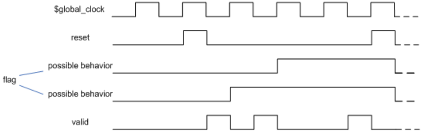

# 17. 检查器
## 17.1 概述
断言提供了验证设计行为的构建块。在许多情况下，需要将几个断言组合成具有明确定义功能的更大块。这些验证块还可能需要包含建模代码，以计算用于断言或与覆盖语句集成的 covergroup 实例的辅助变量的值。SystemVerilog 中的检查器构造专门用于表示这样的验证块，封装了断言以及建模代码。检查器的预期用途是作为验证库单元，或用于创建形式验证中使用的抽象辅助模型的构建块。

检查器中的建模机制类似于模块和接口中的建模机制，尽管存在一些限制。例如，检查器中不能声明和分配任何线网。另一方面，检查器允许非确定性建模，这在模块和接口中不存在。在检查器中声明的每个变量都可以是确定性的或随机的。检查器建模在 17.7 中进行了解释。随机变量对于构建用于形式验证的抽象非确定性模型非常有用。有时，对非确定性模型进行推理比对确定性 RTL 模型进行推理要容易得多。

确定性变量允许断言的常规（确定性）建模。在检查器中使用随机变量而不是常规变量的优点是，同一检查器可以用于确定性和非确定性情况。

## 17.2 检查器声明
---
```verilog
checker_declaration ::= // from A.1.2
checker checker_identifier [ ( [ checker_port_list ] ) ] ;
{ { attribute_instance } checker_or_generate_item } 
endchecker [ : checker_identifier ] 
checker_port_list ::= // from A.1.8
checker_port_item {, checker_port_item}
checker_port_item ::= 
{ attribute_instance } [ checker_port_direction ] property_formal_type formal_port_identifier 
{variable_dimension} [ = property_actual_arg ]
checker_port_direction ::= 
input | output
checker_or_generate_item ::= 
checker_or_generate_item_declaration 
| initial_construct
| always_construct 
| final_construct
| assertion_item
| continuous_assign 
| checker_generate_item
checker_or_generate_item_declaration ::=
[ rand ] data_declaration
| function_declaration 
| checker_declaration 
| assertion_item_declaration
| covergroup_declaration 
| overload_declaration
| genvar_declaration
| clocking_declaration
| default clocking clocking_identifier ;
| default disable iff expression_or_dist ;
| ;
checker_generate_item6 ::= 
loop_generate_construct
| conditional_generate_construct
| generate_region
| elaboration_system_task
checker_identifier ::= // from A.9.3
identifier
// 6) 对于 checker_generate_item 来说，包含在 checker_declaration 外部的任何项都是非法的。
```
---
语法 17-1—检查器声明语法（摘自附录 A）

检查器可以在以下范围内声明：
 - 模块
 - 接口
 - 程序
 - 检查器
 - 包
 - 生成块
 - 编译单元范围

检查器使用关键字 `checker` 后跟名称和可选的形式参数列表声明，并以关键字 `endchecker` 结束。

包含检查器声明的范围中的以下元素不得在检查器中引用：
 - 自动变量和动态变量的成员或元素（参见 6.21）。
 - `fork...join`、`fork...join_any` 或 `fork...join_none` 块的元素。

检查器中断言的动作块将被称为 *检查器动作块*，检查器的其余部分将被称为 *检查器主体*。

检查器主体可以包含以下元素：
 - `let` 构造、序列、属性和函数的声明
 - 延迟断言（参见 16.4）
 - 并发断言（参见 16.14）
 - 检查器声明
 - 其他检查器实例
 - 覆盖组声明和实例
 - 检查器变量声明和赋值（参见 17.7）
 - `default clocking` 和 `default disable iff` 声明
 - `initial`、`always_comb`、`always_latch`、`always_ff` 和 `final` 过程（参见 9.2）
 - 包含上述任何元素的生成块

不得在检查器中声明模块、接口、程序和包。不得在检查器中实例化模块、接口和程序。

检查器的形式参数可以选择由方向限定符 `input` 或 `output` 修饰。如果未显式指定方向，则将推断前一个参数的方向。如果省略了第一个检查器参数的方向，则默认为 `input`。输入检查器形式参数不得由检查器修改。

检查器形式参数的合法数据类型是属性合法的数据类型（参见 16.12）。输出参数的类型不得是 `untyped`、`sequence` 或 `property`。如果省略了检查器形式参数的类型，则根据以下规则推断：
 - 如果参数具有显式方向限定符，则省略其类型将是一个错误。
 - 否则，如果参数是检查器的第一个参数，则假定为 `input untyped`。
 - 否则，将根据序列和属性的描述推断前一个形式参数的类型（参见 16.8 和 16.12）。

与序列和属性类似，检查器声明可以为每个单一输入端口指定默认值，如 16.8 中所述。检查器声明还可以使用与输入参数的默认值规范相同的语法为每个单一输出端口指定初始值。检查器输出端口初始化具有与变量初始化相同的语义（参见 6.8）。

以下是简单检查器的示例：

示例 1：
```verilog
// 包含并发断言的简单检查器
checker my_check1 (logic test_sig, event clock);
    default clocking @clock; endclocking
    property p(logic sig);
        ...
    endproperty
    a1: assert property (p (test_sig));
    c1: cover property (!test_sig ##1 test_sig);
endchecker : my_check1
```

示例 2：
```verilog
// 包含延迟断言的简单检查器
checker my_check2 (logic a, b);
    a1: assert #0 ($onehot0({a, b}));
    c1: cover #0 (a == 0 && b == 0);
    c2: cover #0 (a == 1);
    c3: cover #0 (b == 1);
endchecker : my_check2
```

示例 3：
```verilog
// 带有输出参数的简单检查器
checker my_check3 (logic a, b, event clock, output bit failure, undef);
    default clocking @clock; endclocking
    a1: assert property ($onehot0({a, b})) failure = 1’b0; else failure = 1’b1;
    a2: assert property ($isunknown({a, b})) undef = 1’b0; else undef = 1’b1;
endchecker : my_check3
```

示例 4：
```verilog
// 具有默认输入和初始化输出参数的检查器
checker my_check4 (input logic in,
    en = 1’b1, // 默认值
    event clock,
    output int ctr = 0); // 初始值
    default clocking @clock; endclocking
    always_ff @clock
        if (en && in) ctr <= ctr + 1;
    a1: assert property (ctr < 5);
endchecker : my_check4
```

检查器中的类型和数据声明仅在检查器范围内是局部的，并且是静态的。时钟和 `disable iff` 上下文从检查器声明的范围继承（但请参见 17.4，用于使用上下文值函数将实例化上下文传递给检查器的用法）。例如：
```verilog
module m;
    default clocking @clk1; endclocking
    default disable iff rst1;
    checker c1;
    // 继承 @clk1 和 rst1
    ...
    endchecker : c1
    checker c2;
    // 显式重新定义其默认值
    default clocking @clk2; endclocking
    default disable iff rst2;
    ...
    endchecker : c2
    ...
endmodule : m
```

在检查器中使用的变量，既不是检查器的形式参数，也不是检查器的内部变量，将根据从声明检查器的范围中的作用域规则解析。

## 17.3 检查器实例化
---
```verilog
concurrent_assertion_item ::= // from A.2.10
...
| checker_instantiation
checker_instantiation ::= // from A.4.1.4
 ps_checker_identifier name_of_instance ( [list_of_checker_port_connections] ) ;
list_of_checker_port_connections29 ::= 
ordered_checker_port_connection { , ordered_checker_port_connection }
| named_checker_port_connection { , named_checker_port_connection }
ordered_checker_port_connection ::= { attribute_instance } [ property_actual_arg ]
named_checker_port_connection ::=
{ attribute_instance } . formal_port_identifier [ ( [ property_actual_arg ] ) ]
| { attribute_instance } .*
ps_checker_identifier ::= // from A.9.3
[ package_scope ] checker_identifier 
// 29) .* 标记在端口连接列表中最多出现一次。
```
---
语法 17-2—检查器实例化语法（摘自附录 A）

检查器可以在并发断言可能出现的任何地方实例化（参见 16.14），但有以下例外：
 - 在 `fork...join`、`fork...join_any` 或 `fork...join_none` 块中实例化检查器是非法的。
 - 在另一个检查器的过程中实例化检查器是非法的。

检查器的行为取决于它是在过程代码内部还是外部实例化的。在过程代码中实例化检查器称为 *过程检查器实例*。在过程代码外部实例化检查器称为 *静态检查器实例*。有关过程和静态断言语句的相应定义，请参见 16.14.6。

当实例化检查器时，将向检查器传递实际参数。传递输入参数给检查器的机制类似于传递参数给属性（参见 16.12）。以下限制适用：
 - 与序列和属性的情况一样，如果 `$` 是检查器实例的实际输入参数，则相应的形式参数应为无类型的，并且其每个引用都应是 cycle_delay_const_range_expression 中的上限，或者应该是一个命名序列或属性的实例，或者应该是检查器实例中的实际参数。
 - 如果实际输入参数包含任何子表达式，该子表达式是从过程代码的 `const` 强制转换或自动值，则相应的形式参数不得在连续赋值或检查器内部的过程代码中使用。

检查器实际输出参数应为 `variable_lvalue` 或 `net_lvalue`。检查器实例应被视为在 Reactive 区域中执行的连续赋值，将检查器的输出形式参数分配给其相应的实际参数。

检查器形式参数可以通过类似于模块端口的方式连接到其实际参数（参见 23.3.2）：
 - 按端口顺序的位置连接。
 - 使用完全显式连接的命名端口连接。
 - 使用隐式连接的命名端口连接。
 - 使用通配符端口名称的命名端口连接。

以下示例说明了检查器实例化的行为：
```verilog
checker mutex (logic sig, event clock, output bit failure);
    assert property (@clock $onehot0(sig))
        failure = 1’b0; else failure = 1’b1;
endchecker : mutex

module m(wire [31:0] bus, logic clk);
    logic res, scan;
    // ...
    mutex check_bus(bus, posedge clk, res);
    always @(posedge clk) scan <= res;
endmodule : m
```

在每个时钟上升沿，检查 bus 的位是否互斥，并在 Reactive 区域将结果分配给 res。如果 clk 在 Active 区域中更改，则 scan 将捕获在前一个 clk 上升沿生成的 res 的值。

检查器实例的所有内容，除了静态断言语句之外，都被认为在每个时间步骤中存在，无论检查器是静态的还是过程的。这些内容的每个实例都存在一次。检查器中的过程并发断言语句应像 16.14.6 中描述的其他过程断言语句一样处理。但是，检查器中的静态断言语句被视为出现在检查器的实例化点。如果检查器在某个范围内实例化，那么检查器中的所有静态断言，无论是并发的还是延迟的，都被视为在该范围内实例化。因此，对于检查器中的静态断言，以下规则适用：
 - 如果检查器是静态的，则并发断言将持续监视，并在其初始时钟事件匹配的任何时间步骤上开始执行。延迟断言在其表达式更改时随时监视。
 - 如果检查器是过程的，则检查器中的所有静态并发断言在到达检查器实例化点时添加到待处理的过程断言队列中，然后可能成熟或被刷新，就像任何过程并发断言一样（参见 16.14.6.2）。类似地，检查器中的所有静态延迟断言在到达检查器实例化点时添加到待处理的延迟断言报告中，然后可能成熟或被刷新，就像任何过程延迟断言一样（参见 16.4.1）。
 - 如果检查器在另一个检查器内部静态实例化，则检查器的所有静态断言，包括并发和延迟断言，都被视为在父检查器中实例化，因此在检查器层次结构中的顶层祖先的实例化点被访问时，将被视为过程断言。

以下示例说明了这种行为：
```verilog
checker c1(event clk, logic[7:0] a, b);
    logic [7:0] sum;
    always_ff @(clk) begin
        sum <= a + 1'b1;
        p0: assert property (sum < `MAX_SUM);
    end
    p1: assert property (@clk sum < `MAX_SUM);
    p2: assert property (@clk a != b);
    p3: assert #0 ($onehot(a));
endchecker

module m(input logic rst, clk, logic en, logic[7:0] in1, in2, 
    in_array [20:0]);
    c1 check_outside(posedge clk, in1, in2);
    always @(posedge clk) begin
        automatic logic [7:0] v1=0;
        if (en) begin
            // v1 是自动的，所以使用当前过程值
            c1 check_inside(posedge clk, in1, v1);
        end
        for (int i = 0; i < 4; i++) begin
            v1 = v1+5;
            if (i != 2) begin
                // v1 是自动的，所以使用当前过程值
                c1 check_loop(posedge clk, in1, in_array[v1]);
            end
        end
    end
endmodule : m
```

在此示例中，有三个 c1 的实例化：check_outside、check_inside 和 check_loop。它们具有以下特征：
 - check_outside 是静态实例化，而 check_inside 和 check_loop 是过程的。
 - 三个实例化中的每一个都有自己的 sum 版本，在每个正时钟边沿更新，无论该实例是否在过程代码中被访问。即使在 check_loop 的情况下，只有一个 sum 实例，并且将使用 in1 的采样值更新。
 - 三个实例化将在每个时钟上升沿排队评估 p0（根据 16.14.6 中的规则），在 sum 不小于 MAX_SUM 时成熟并报告违规，无论模块 m 中的过程代码的行为如何。
 - 对于检查器实例 check_outside，p1 和 p2 在每个正时钟边沿检查。对于检查器实例 check_inside，p1 和 p2 被排队成熟，并在 en 为真时的任何正时钟边沿上检查。对于 check_loop，三个过程实例的 p1 和 p2 被排队成熟，并在任何正时钟边沿上检查。对于 p1，所有三个实例都是相同的，使用 sum 的采样值；但对于 p2，三个实例将 in1 的采样值与常量 v1 值为 5、10 和 20 的 in_array 索引的采样值进行比较。
 - 对于检查器实例 check_outside，p3 在 a 更改时检查。对于检查器实例 check_inside 和 check_loop，延迟断言 p3 表现为过程延迟断言，放置在其检查器的实例化点。

## 17.4 上下文推断
上下文值函数（参见 16.14.7）可以用作检查器声明中形式参数的默认值。这些函数使得可以根据其实例化上下文调整检查器行为。例如：
```verilog
// 检查器中的上下文推断
checker check_in_context (logic test_sig,
    event clock = $inferred_clock,
    logic reset = $inferred_disable);
    property p(logic sig);
        ...
    endproperty
    a1: assert property (@clock disable iff (reset) p(test_sig));
    c1: cover property (@clock !reset throughout !test_sig ##1 test_sig);
endchecker : check_in_context

module m(logic rst);
    wire clk;
    logic a, en;
    wire b = a && en;
    // 无上下文推断
    check_in_context my_check1(.test_sig(b), .clock(clk), .reset(rst));
    always @(posedge clk) begin
        a <= ...;
        if (en) begin
            ...
            // 从上下文推断：
            // .clock(posedge clk)
            // .reset(1'b0)
            check_in_context my_check2(a);
        end
        en <= ...;
    end
endmodule : m
```

在上述示例中，check_in_context 中 clock 和 reset 的默认值从实例化上下文中获取。在实例化 my_check1 中，所有形式参数都是显式提供的。在实例化 my_check2 中，所有可选参数都传递其默认值：时钟从模块 m 的 always 过程的时钟推断，禁用条件推断为 1'b0。

## 17.5 检查器过程
在检查器主体中允许以下过程：
 - `initial` 过程
 - `always` 过程
 - `final` 过程

检查器中的 `initial` 过程可以包含 `let` 声明、立即、延迟和并发断言，以及使用事件控制的过程定时控制语句。

允许在检查器中的 `always` 过程中使用以下形式的过程：`always_comb`、`always_latch` 和 `always_ff`。检查器 `always` 过程可以包含以下语句：
 - 阻塞赋值（参见 10.4.1；仅适用于 always_comb 和 always_latch 过程）
 - 非阻塞赋值（参见 10.4.2）
 - 选择语句（参见 12.4 和 12.5）
 - 循环语句（参见 12.7）
 - 时序事件控制（参见 9.4.2；仅适用于 always_ff 过程）
 - 子例程调用（参见第 13 章）
 - `let` 声明

除了事件控制中使用的变量外，`always_ff` 过程中的所有其他表达式都是采样的（参见 16.5.1）。由此规则可知，在此过程中实例化的立即和延迟断言中的表达式也是采样的。`always_comb` 和 `always_latch` 过程中的表达式不是隐式采样的，这些过程中的赋值使用其表达式的当前值。例如：
```verilog
checker check(logic a, b, c, clk, rst);
    logic x, y, z, v, t;
    assign x = a; // a 的当前值
    always_ff @(posedge clk or negedge rst) // clk 和 rst 的当前值
    begin
        a1: assert (b); // b 的采样值
        if (rst) // rst 的当前值
            z <= b; // b 的采样值
        else z <= !c; // c 的采样值
    end
    always_comb begin
        a2: assert (b); // b 的当前值
        if (a) // a 的当前值
            v = b; // b 的当前值
        else v = !b; // b 的当前值
    end
    always_latch begin
        a3: assert (b); // b 的当前值
        if (clk) // clk 的当前值
            t <= b; // b 的当前值
    end
    // ...
endchecker : check
```

以下示例说明了检查器过程的时钟推断，遵循 16.14.6 中的规则。
```verilog
checker clocking_example (logic sig1, sig2, default_clk, rst,
    event e1, e2, e3 );
    bit local_sig;
    default clocking @(posedge default_clk); endclocking
    always_ff @(e1) begin: p1_block
        p1a: assert property (sig1 == sig2);
        p1b: assert property (@(e1) (sig1 == sig2));
    end
    always_ff @(e2 or e3) begin: p2_block
        local_sig <= rst;
        p2a: assert property (sig1 == sig2);
        p2b: assert property (@(e2) (sig1 == sig2));
    end
    always_ff @(rst or e3) begin: p3_block
        local_sig <= rst;
        p3a: assert property (sig1 == sig2);
        p3b: assert property (@(e3) (sig1 == sig2));
    end
    ...
endchecker
...

clocking_example c1 (s1, s2, default_clk, rst,
    posedge clk1 or posedge clk2,
    posedge clk1,
    negedge rst); 
```

在 clocking_example 的实例 c1 中，断言将被赋予时钟，如下：
 - 断言 p1a 将由 `posedge` default_clk 确定时钟。这是因为在将实际参数 `posedge` clk1 `or posedge` clk2 替换为形式参数 e1 后，它不满足 16.14.6 中的时钟推断条件，特别是条件（b）。如果需要基于 e1 的时钟，则必须显式执行，如属性 p1b 中所示。
 - 断言 p2a 将由 `posedge` clk1 确定时钟。这是因为 p2_block 的事件控制满足 16.14.6 中的条件，包括条件（c 2），在将实际参数替换为形式参数后。因此，断言 p2a 和 p2b 是等效的。
 - 断言 p3a 将由 `posedge` default_clk 确定时钟。这是因为 p3_block 的事件控制不满足 16.14.6 中的条件，特别是条件（c 2）。如果需要基于 e3 的时钟，则必须显式执行，如属性 p3b 中所示。

检查器中的 `final` 过程可以像模块中一样在检查器中指定（参见 9.2.3）。这允许检查器在检查器的实例化上下文中检查条件或在模拟结束时打印统计信息。`final` 过程的操作与包含它的检查器的实例化上下文无关。它将在每个该检查器的实例化结束时执行一次。多个 `final` 过程的执行中没有暗含的顺序。检查器中的 `final` 过程可以包含任何允许在非检查器 `final` 过程中的构造。

## 17.6 检查器中的覆盖组
在检查器中允许一个或多个 `covergroup` 声明或实例（参见 19.3）。这些声明和实例不得出现在检查器中的任何过程块中。`covergroup` 可以引用其范围内可见的任何变量，包括检查器形式参数和检查器变量。但是，如果 `covergroup` 引用的形式参数具有 `const` 实际参数，则将出现错误。例如：
```verilog
checker my_check(logic clk, active);
    bit active_d1 = 1'b0;

    always_ff @(posedge clk) begin
        active_d1 <= active;
    end

    covergroup cg_active @(posedge clk);
        cp_active : coverpoint active
        {
            bins idle = { 1'b0 };
            bins active = { 1'b1 };
        }
        cp_active_d1 : coverpoint active_d1
        {
            bins idle = { 1'b0 };
            bins active = { 1'b1 };
        }
        option.per_instance = 1;
    endgroup
    cg_active cg_active_1 = new();
endchecker : my_check
```

覆盖组也可以通过对其 `sample()` 方法的过程调用触发（参见 19.8）。以下示例显示了如何从序列匹配项调用 `sample()` 方法来触发覆盖组。
```verilog
checker op_test (logic clk, vld_1, vld_2, logic [3:0] opcode);
    bit [3:0] opcode_d1;

    always_ff @(posedge clk) opcode_d1 <= opcode;

    covergroup cg_op;
        cp_op : coverpoint opcode_d1;
        endgroup: cg_op
    cg_op cg_op_1 = new();

    sequence op_accept;
        @(posedge clk) vld_1 ##1 (vld_2, cg_op_1.sample());
    endsequence
    cover property (op_accept);
endchecker
```

在此示例中，覆盖点 cp_op 直接引用检查器变量 opcode_d1。它通过从序列匹配项调用默认 `sample()` 方法来触发。此函数调用发生在 Reactive 区域，而对检查器变量的非阻塞赋值将发生在 Re-NBA 区域。因此，覆盖组将采样检查器变量 opcode_d1 的旧值。

还可以为覆盖组定义自定义 `sample()` 方法（参见 19.8.1）。以下是此示例：
```verilog
checker op_test (logic clk, vld_1, vld_2, logic [3:0] opcode);
    bit [3:0] opcode_d1;

    always_ff @(posedge clk) opcode_d1 <= opcode;

    covergroup cg_op with function sample(bit [3:0] opcode_d1);
        cp_op : coverpoint opcode_d1;
        endgroup: cg_op
    cg_op cg_op_1 = new();

    sequence op_accept;
        @(posedge clk) vld_1 ##1 (vld2, cg_op_1.sample(opcode_d1));
    endsequence
    cover property (op_accept);
endchecker
```

在此示例中，为覆盖组 cg_op 定义了自定义 `sample()` 方法，并覆盖点 cp_op 引用自定义 `sample()` 方法的形式参数。此自定义方法将在序列匹配时调用，但将检查器变量 opcode_d1 的采样值传递给 `sample()` 函数。因此，覆盖组将从 Preponed 区域采样检查器变量 opcode_d1 的值。

## 17.7 检查器变量
在检查器中允许定义变量，但在检查器主体中定义的变量不得是线网。在检查器主体中定义的变量的生命周期是静态的（参见 17.2）。在检查器主体中定义的变量被称为 *检查器变量*。下面的例子说明了检查器变量的用法：
```verilog
checker counter_model(logic flag);
    bit [2:0] counter = '0;
    always_ff @$global_clock
        counter <= counter + 1'b1;
    assert property (@$global_clock counter == 0 |-> flag);
endchecker : counter_model
```

检查器变量可以具有可选的 `rand` 限定符。在这种情况下，它们被称为 *自由变量*；自由变量可能表现为非确定性。

形式分析工具应考虑由假设和赋值（参见 17.7.1）施加的自由检查器变量的所有可能值。模拟器应按照 17.7.2 中解释的方式为自由变量分配随机值。

以下示例显示了如何使用自由变量进行形式验证建模：
```verilog
checker observer_model(bit valid, reset);
    default clocking @$global_clock; endclocking
    rand bit flag;
    m1: assume property (reset |=> !flag);
    m2: assume property (!reset && flag |=> flag);
    m3: assume property ($rising_gclk(flag) |-> valid);
endchecker : observer_model
```

这个例子中，下面的约束被施加到自由变量 flag：
 - 如果它是高的，只要没有复位，它就保持高。
 - 如果有复位，它在下一个时钟的上升沿变为低。
 - 它只有在 valid 为高时才能上升。

尽管自由变量 flag 的行为受到假设 m1、m2 和 m3 的限制，但它仍然是非确定性的，因为它不必在 valid 为高时上升。图 17-1 显示了这个变量的两种可能的合法行为，给定相同的 reset 和 valid 行为。形式分析工具应考虑 flag 的所有可能的合法行为。模拟器应按照 17.7.2 中解释的方式为变量 flag 分配随机值。


图 17-1—非确定性自由检查器变量

下面的例子说明了如何使用自由变量来实现非确定性选择：
```verilog
// a 只能取值 3 和 5
rand bit r;
let a = r ? 3'd3 : 3'd5;
```

自由变量声明可以具有 `const` 限定符。如果初始化了常量自由变量，则它将永远保留其初始值。未初始化的常量自由变量在初始化时具有非确定性值，并且此值不会更改。以下示例演示了常量自由检查器变量的用法。

形式分析工具应考虑与施加的假设一致的常量自由检查器变量的所有可能值。模拟器应按照 17.7.2 中解释的方式为常量自由变量分配随机常量值。

示例：

关于代表位的推理：
```verilog
checker reason_about_one_bit(bit [63:0] data1, bit [63:0] data2,
    event clock);
    rand const bit [5:0] idx;
    a1: assert property (@clock data1[idx] == data2[idx]);
endchecker : reason_about_one_bit
```

在这个例子中，断言 a1 表明 data1 的每个固定位都与 data2 的相应位相同。因此，checker reason_about_one_bit 在形式验证中等效于以下 checker（这两个 checker 在模拟中不等效）：
```verilog
checker reason_about_all_bit(bit [63:0] data1, bit [63:0] data2,
    event clock);
    a1: assert property (@clock data1 == data2);
endchecker : reason_about_all_bit
```

第二个 checker 比较两个 64 位值，而第一个 checker 仅比较 1 位值，对于每个可能的索引。第一个版本可能对某些形式工具更有效。

数据完整性检查：
```verilog
// 如果 start_ev 被断言，则在下一个 end_ev 被断言时 out_data 的值必须等于 start_ev 时 in_data 的当前值。
// 假设 in_data 和 out_data 具有相同的大小
checker data_legal(start_ev, end_ev, in_data, out_data);
    rand const bit [$bits(in_data)-1:0] mem_data;
    sequence transaction;
    start_ev && (in_data == mem_data) ##1 end_ev[->1];
    endsequence
    a1: assert property (@clock transaction |-> out_data == mem_data);
endchecker : data_legal
```

由于 mem_data 是一个常量自由变量，如果在事务开始时 in_data 等于 mem_data，则 mem_data 记录该值并在整个跟踪中保持该值。特别是，在事务结束时，mem_data 仍然保持该值，并且断言检查它是否等于 out_data。进一步，mem_data 是用非确定性值初始化的；因此，对于 in_data 的每个值，存在一个计算，其中 mem_data 等于该 in_data 值，这又意味着正在检查数据传输的合法性。在模拟中，mem_data 将被随机初始化（参见 17.7.2），并且只会检查如果在事务开始时 in_data 等于 mem_data，则在事务结束时 out_data 将具有与事务开始时 in_data 相同的值。

后一个示例可以重写为使用本地变量而不是常量自由变量进行形式验证（参见 16.10；这些实现在模拟中不等效）：
```verilog
// 如果 start_ev 被断言，则在下一个 end_ev 被断言时 in_data 的值必须等于 start_ev 时 out_data 的当前值。
// 假设 in_data 和 out_data 具有相同的大小
checker data_legal_with_loc(start_ev, end_ev, in_data, out_data);
    sequence transaction (loc_var);
        (start_ev, loc_var = in_data) ##1 end_ev[->1];
    endsequence
    property data_legal;
        bit [$bits(in_data)-1:0] mem_data;
        transaction(mem_data) |-> out_data == mem_data;
    endproperty
    a1: assert property (@clock data_legal);
endchecker : data_legal_with_loc
```

常量和非常量自由变量之间存在区别：常量自由变量不会更改其值，而非常量自由变量可以在任何时候假设新值。如果非常量自由变量已初始化但从未被赋值，则在形式验证中它可以在任何时间步骤中假设任何值，或在模拟中的后续时间步骤中被随机化（参见 17.7.2），除了第一个时间步骤，其中其值由初始化定义。考虑以下声明：
```verilog
rand bit a = 1'b0, b;
```

自由变量 a 具有初始值 0，但在其他时间步骤中，它的值可能会更改。自由检查器变量 b 可以在任何时间步骤中假设任何值 0 或 1，与未初始化的常量自由检查器变量相反，后者保持一个特定值。

### 17.7.1 检查器变量赋值
检查器变量可以通过阻塞和非阻塞过程赋值，或通过非过程连续赋值进行赋值。

以下规则和限制适用：
 - 在 `always_ff` 过程中只允许非阻塞赋值。
 - 在赋值中引用检查器变量的层次名称（参见 23.6）是非法的。例如：
   ```verilog
   checker check(...);
       bit a;
       ...
   endchecker
   
   module m(...);
       ...
       check my_check(...);
       ...
       wire x = my_check.a; // 非法
       bit y;
       ...
       always @(posedge clk) begin
           my_check.a = y; // 非法
           ...
       end
       ...
   endmodule
   ```

 - 连续赋值和阻塞过程赋值到自由检查器变量是非法的。
   ```verilog
   checker check1(bit a, b, event clk, ...);
       rand bit x, y, z, v;
       ...
       assign x = a & b; // 非法
       always_comb
           y = a & b; // 非法
       always_ff @clk
           z <= a & b; // 合法
   endchecker : check1
   ```

 - 检查器变量不能在 `initial` 过程中赋值，但可以在其声明中初始化。例如：
   ```verilog
   bit v;
   initial v = 1'b0; // 非法
   bit w = 1'b0; // 合法
   ```

 - 检查器变量赋值的右侧可以包含 triggered 序列方法（参见 16.13.6）。
 - 非阻塞赋值的左侧可以包含自由检查器变量。以下示例说明了自由变量赋值的用法。
   ```verilog
   // 切换变量：
   // a 可能具有 0101... 或 1010... 模式
   rand bit a;
   always_ff @clk a <= !a;
   ```

### 17.7.2 带有假设的检查器变量随机化
检查器 `assume` 语句用于描述可能对变量值的假设。它们可以由模拟器用于约束自由检查器变量的随机生成，或由形式分析工具用于约束自由检查器变量的解决方案。与正常的 `assume` 语句一样，检查器 `assume` 语句在模拟期间也会检查违规。

基于假设的检查器变量随机化是周期性地解决出现在 `assume` 语句中的属性集（称为 *假设集*）的过程，以找到满足自由检查器变量的值，然后使用新发现的值更新这些变量。与基于类的约束随机生成不同，解决是由假设集中的任何属性的时钟事件（称为 *假设集时钟事件*）触发的，而不是由显式过程调用触发的 [例如，没有 `randomize()` 用于检查器]。一旦使用新值更新了自由检查器变量，这些变量将保持不变，直到下一个假设集时钟事件或时间步骤结束，以先到者为准。

对于基于假设的随机化，所有非常量自由检查器变量都被视为活动或非活动的，就像类约束随机生成（见 17.9）中的 `rand` 变量一样，但没有显式的控制设施 [例如，没有 `rand_mode()` 用于检查器]。所有其他变量（例如，非自由检查器变量和检查器形式参数）始终被视为非活动的。出现在检查器变量赋值（见 17.7.1）的左侧的自由检查器变量是非活动的；所有其他自由检查器变量是活动的。自由检查器变量对于每个变量的单个元素是活动的或非活动的。例如，打包数组或结构是整体活动或非活动的，而未打包数组或结构的元素是单独活动或非活动的。

所有自由检查器变量，包括常量和非常量，活动和非活动，除非在声明中明确初始化，否则都将使用无约束的随机值初始化。

每个检查器实例有且只有一个假设集，该假设集可能为空。与检查器过程和变量一样，检查器假设集被认为在每个时间步骤都存在，无论检查器实例是静态的还是过程的（见 17.3）。

检查器实例的假设集由检查器 `assume` 语句和子检查器 `assume` 语句组成。引用实际参数包含任何是 `const` 转换或自动变量子表达式的形式的假设语句（见 17.3）的假设集被排除。此限制允许为每个实例化在仿真期间存在一个有效的假设集的副本，如 17.3 中所述。在剩余的 `assume` 语句中，引用检查器的活动自由变量的假设集被包括。例如：
```verilog
module my_mod();
    bit mclk, v1, v2;
    checker c1(bit fclk, bit a, bit b);
        default clocking @ (posedge fclk); endclocking
        checker c2(bit bclk, bit x, bit y);
            default clocking @ (posedge bclk); endclocking
            rand bit m, n;
            u1: assume property (f1(x,m));
            u2: assume property (f2(y,n));
        endchecker
        rand bit q, r;
        c2 B1(fclk, q+r, r);
        always_ff @ (posedge fclk)
            r <= a || q; // 赋值使 r 非活动
        u3: assume property (f3(a, q));
        u4: assume property (f4(b, r));
    endchecker
    ...
    c1 F1(mclk, v1, const'(v2));
endmodule
```

F1 的假设集包含 F1.u3 和 F1.B1.u1。包括 F1.B1.u1 是因为它引用了形式 x，其实际表达式 q+r 包含一个活动自由检查器变量。F1.u4 被排除，因为它引用了形式 b，它与 const 转换实际参数 v2 相关。F1.B1.u2 被排除，因为唯一引用的形式是 y，它不与活动自由变量实际相关（实际 r 是非活动的）。但是，检查器实例 F1.B1 有自己的假设集，其中包括 u2 以及 u1；这两个假设语句都不涉及具有 const 转换或自动实际的形式。

当对假设集进行解决尝试时，将寻找所有活动检查器变量的值，以便和非活动变量和状态一起，在该时间步骤中不会有任何假设失败。如果找到了这样的值集，则解决尝试成功。否则，可以为活动变量选择任何值，并且解决尝试失败。如果存在解决方案，则不要求找到解决方案，也不要求避免“死胡同”状态。例如：
```verilog
u_deadend: assume property (@(posedge clk) x |=> ##5 1'b0);
```

如果选择 1 作为 x 的值，属性在当前时间步中不会失败；但是，它将在六个时钟周期后不可避免地失败。这种不可避免的未来失败称为 *死胡同*。尽管存在死胡同，选择 1 作为 x 的值被认为是解决尝试成功。

空假设集应被视为在 Observed 区域之前的每个时间步中都有一个隐式假设集时钟事件。具有空假设集的检查器中的活动变量称为 *隐式时钟* 活动自由变量；具有非空假设集的检查器中的活动变量称为 *显式时钟* 活动自由变量。隐式时钟活动变量可以在每个时间步中使用无约束的随机值进行更新。一旦更新，变量将保持不变，直到时间步结束。

不出现在任何非空假设集属性中的活动变量是无约束但显式时钟的。它们可以在每个假设集时钟事件中使用随机值进行更新。

当实现即将开始 Observed 区域时，应使用所有其他变量的采样值为所有活动检查器变量解决。活动检查器变量的采样值定义为其当前值（见 16.5.1）。注意，检查器过程和属性在 Reactive 和 Observed 区域中执行（见 17.7.3），因此具有新值可用。

当解决尝试失败时，任何结果的假设失败直到在 Observed 区域中时钟和检查属性时才会发生。

### 17.7.3 调度语义
检查器中对变化敏感的语句和结构（例如，时钟事件、连续赋值）以及所有阻塞语句都在 Reactive 区域中调度（类似于程序，见 24.3.1）。检查器变量的非阻塞赋值在 Re-NBA 区域中调度其更新。在 Reactive 和 Re-Inactive 区域中的事件已被清空后，Re-NBA 区域被处理（见 4.2）。这些调度规则使得可能将序列端点值分配给检查器变量。例如：
```verilog
checker my_check(...);
    ...
    sequence s; ...; endsequence
    always_ff @clk a <= s.triggered;
endchecker
```

对于信号 clk 的每个过渡，模拟器将在 Re-NBA 区域中使用在 Reactive 区域中捕获的 s.triggered 的值更新变量 a。如果检查器在 Active 区域中捕获了 s.triggered 的值，a 将始终被赋值为 1'b0，因为 s.triggered 在 Observed 区域中评估，上述代码将毫无意义。

并发断言具有不变的调度语义，无论其是否存在于检查器代码或设计代码中。

## 17.8 检查器中的函数
在检查器中使用的函数的形式参数和内部变量不得声明为自由变量。但是，允许将自由变量作为实际参数传递给函数。

检查器变量赋值的右侧表达式允许包含函数调用，这些函数调用具有在并发断言中强制执行的相同限制（见 16.6）：
 - 出现在表达式中的函数不得包含 `output` 或 `ref` 参数（`const ref` 是允许的）。
 - 函数应为自动的（或不保留状态信息）且不具有副作用。

17.9 的示例显示了检查器中使用函数的用法。

## 17.9 复杂检查器示例
下面例子中的检查器确保在由 start_event 和 end_event 限定的窗口中表达式为真。当 start_event 和 end_event 是布尔值时，检查器可以实现如下所示的示例 1。

示例 1：
```verilog
typedef enum { cover_none, cover_all } coverage_level;
checker assert_window1 (
    logic test_expr, // 表达式在窗口中为真
    untyped start_event, // 窗口在 start_event 完成时打开
    untyped end_event, // 窗口在 end_event 完成时关闭
    event clock = $inferred_clock,
    logic reset = $inferred_disable,
    string error_msg = "violation",
    coverage_level clevel = cover_all // 此参数应绑定到一个实例化时间常量表达式
);
    default clocking @clock; endclocking
    default disable iff reset;
    bit window = 1'b0, next_window = 1'b1;

    // 计算窗口的下一个值
    always_comb begin
        if (reset || window && end_event)
            next_window = 1'b0;
        else if (!window && start_event)
            next_window = 1'b1;
        else
            next_window = window;
    end

    always_ff @clock
        window <= next_window;

    property p_window;
        start_event && !window |=> test_expr[+] ##0 end_event;
    endproperty

    a_window: assert property (p_window) else $error(error_msg);

    generate
        if (clevel != cover_none) begin : cover_b
            cover_window_open: cover property (start_event && !window)
                $display("window_open covered");
            cover_window: cover property (
                start_event && !window
                ##1 (!end_event && window) [*]
                ##1 end_event && window
            ) $display("window covered");
        end : cover_b
    endgenerate
endchecker : assert_window1
```

如果 start_event 和 end_event 可能是任意序列，而不一定是布尔值，则需要以示例 2 中所示的不同方式实现检查器。这种情况需要不同的实现，因为序列的触发状态的复位不会创建事件（见 9.4.4），因此不应在连续赋值的右侧或在 always_comb 过程中的赋值中使用序列触发方法。

示例 2：
```verilog
typedef enum { cover_none, cover_all } coverage_level;
checker assert_window2 (
    logic test_expr, // 表达式在窗口中为真
    sequence start_event, // 窗口在 start_event 完成时打开
    sequence end_event, // 窗口在 end_event 完成时关闭
    event clock = $inferred_clock,
    logic reset = $inferred_disable,
    string error_msg = "violation",
    coverage_level clevel = cover_all // 此参数应绑定到一个实例化时间常量表达式
);
    default clocking @clock; endclocking
    default disable iff reset;
    bit window = 0;
    let start_flag = start_event.triggered;
    let end_flag = end_event.triggered;

    // 计算窗口的下一个值
    function bit next_window (bit win);
        if (reset || win && end_flag)
            return 1'b0;
        if (!win && start_flag)
            return 1'b1;
        return win;
    endfunction

    always_ff @clock
        window <= next_window(window);

    property p_window;
        start_flag && !window |=> test_expr[+] ##0 end_flag;
    endproperty

    a_window: assert property (p_window) else $error(error_msg);

    generate
        if (clevel != cover_none) begin : cover_b
            cover_window_open: cover property (start_flag && !window)
                $display("window_open covered");
            cover_window: cover property (
                start_flag && !window
                ##1 (!end_flag && window) [*]
                ##1 end_flag && window
            ) $display("window covered");
        end : cover_b
    endgenerate
endchecker : assert_window2
```
