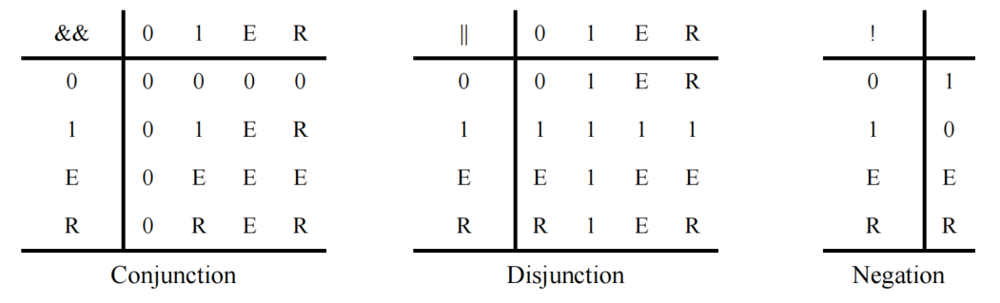

# 18. 受约束的随机数生成
## 18.1 概述
本章描述以下内容：
 - 随机变量
 - 约束块
 - 随机化方法
 - 禁用随机化
 - 控制约束
 - 作用域变量随机化
 - 给随机数生成器（RNG）设置种子
 - 随机加权 case 语句
 - 随机序列生成

## 18.2 总览
约束驱动的测试生成允许用户自动生成功能验证测试。随机测试可能比传统的有针对性的测试方法更有效。通过指定约束，可以轻松创建可以找到难以到达的边界情况的测试。SystemVerilog 允许用户以一种紧凑的声明方式指定约束。然后，约束由求解器处理，生成满足约束的随机值。

随机约束通常在面向对象数据抽象之上指定，模拟要随机化的数据为包含随机变量和用户定义约束的对象。约束确定可以分配给随机变量的合法值。对象非常适合表示复杂的聚合数据类型和协议，例如以太网数据包。

章节 18.3 提供了基于对象的随机化和约束编程的概述。本章的其余部分提供了有关随机变量、约束块和用于操作它们的机制的详细信息。

## 18.3 概念和用法
本小节介绍了在对象中生成随机激励的基本概念和用法。SystemVerilog 使用面向对象的方法为对象的成员变量分配随机值，受用户定义的约束限制。例如：
```verilog
class Bus;
    rand bit[15:0] addr;
    rand bit[31:0] data;

    constraint word_align {addr[1:0] == 2'b0;}
endclass
```

Bus 类模拟了一个简化的总线，其中包含两个随机变量 addr 和 data，分别表示总线上的地址和数据值。word_align 约束声明了 addr 的随机值必须是字对齐的（低位 2 位为 0）。

调用 randomize() 方法会为总线对象生成新的随机值：
```verilog
Bus bus = new;

repeat (50) begin
    if ( bus.randomize() == 1 )
        $display ("addr = %16h data = %h\n", bus.addr, bus.data);
    else
        $display ("Randomization failed.\n");
end
```

调用 randomize() 会为对象的所有随机变量选择新的值，以使所有约束为真（满足）。在上面的程序测试中，创建了一个 bus 对象，然后随机化 50 次。检查每次随机化的结果是否成功。如果随机化成功，则打印 addr 和 data 的新随机值；如果随机化失败，则打印错误消息。在此示例中，只约束了 addr 值，而 data 值是无约束的。无约束的变量会被分配其声明范围内的任何值。

约束编程是一种强大的方法，允许用户构建通用、可重用的对象，稍后可以扩展或约束以执行特定功能。该方法与传统的过程式和面向对象编程都不同，如下面的示例所示，该示例扩展了 Bus 类：
```verilog
typedef enum {low, mid, high} AddrType;

class MyBus extends Bus;
    rand AddrType atype;

    constraint addr_range
    {
        (atype == low ) -> addr inside { [0 : 15] };
        (atype == mid ) -> addr inside { [16 : 127]};
        (atype == high) -> addr inside {[128 : 255]};
    }
endclass
```

MyBus 类继承了 Bus 类的所有随机变量和约束，并添加了一个名为 atype 的随机变量，用于使用另一个约束控制地址范围。addr_range 约束使用蕴含来根据 atype 的随机值选择三个范围约束中的一个。当随机化 MyBus 对象时，将计算 addr、data 和 atype 的值，以使所有约束都得到满足。使用继承构建分层约束系统使得能够开发通用模型，可以约束以执行特定应用程序功能。

可以使用 randomize() `with` 构造进一步约束对象。该构造在调用 randomize() 时内联声明附加约束：
```verilog
task exercise_bus (MyBus bus);
    int res;

    // 示例 1：限制为低地址
    res = bus.randomize() with {atype == low;};

    // 示例 2：限制地址在 10 到 20 之间
    res = bus.randomize() with {10 <= addr && addr <= 20;};

    // 示例 3：将数据值限制为 2 的幂
    res = bus.randomize() with {(data & (data - 1)) == 0;};
endtask
```

此示例说明了约束的几个重要属性，如下所示：
 - 约束可以是任何 SystemVerilog 整数类型（例如 `bit`、`reg`、`logic`、`integer`、`enum`、`packed struct`）的变量和常量组成的表达式。
 - 约束求解器应能够处理各种方程，例如代数因式分解、复杂的布尔表达式和混合整数和位表达式。在上面的示例中，2 的幂约束是用算术表达的。也可以使用移位运算符定义表达式；例如，1 << n，其中 n 是一个 5 位随机变量。
 - 如果存在解，则约束求解器将找到解。只有在问题过度约束且没有组合满足约束的随机值时，求解器才会失败。
 - 约束双向交互。在此示例中，为 addr 选择的值取决于 atype 及其如何约束，为 atype 选择的值取决于 addr 及其如何约束。所有表达式运算符都是双向处理的，包括蕴含运算符（`->`）。
 - 约束仅支持 2 状态值。4 状态值（X 或 Z）或 4 状态运算符（例如，`===`、`!==`）是非法的，将导致错误。

有时，禁用随机变量的约束是有用的。例如，为了故意生成非法地址（非字对齐）：
```verilog
task exercise_illegal(MyBus bus, int cycles);
    int res;

    // 禁用字对齐约束。
    bus.word_align.constraint_mode(0);

    repeat (cycles) begin
        // CASE 1：限制为小地址。
        res = bus.randomize() with {addr[0] || addr[1];};
        ...
    end

    // 重新启用字对齐约束
    bus.word_align.constraint_mode(1);
endtask
```

constraint_mode() 方法可用于启用或禁用对象中的任何命名约束块。在此示例中，禁用了字对齐约束，然后使用额外约束强制低位地址位非零（因此不对齐）随机化对象。

启用或禁用约束的能力允许用户设计约束层次结构。在这些层次结构中，最低级约束可以表示由共同属性分组的物理限制，这些属性分组为命名约束块，可以独立启用或禁用。

类似地，rand_mode() 方法可用于启用或禁用任何随机变量。当禁用随机变量时，它的行为与其他非随机变量完全相同。

有时，希望在随机化之前或之后立即执行操作。这通过两个内置方法 pre_randomize() 和 post_randomize() 实现，这两个方法在随机化之前和之后自动调用。这些方法可以被覆盖以实现所需的功能：
```verilog
class XYPair;
    rand integer x, y;
endclass

class MyXYPair extends XYPair ;
    function void pre_randomize();
        super.pre_randomize(); 
        $display("Before randomize x=%0d, y=%0d", x, y);
    endfunction

    function void post_randomize();
        super.post_randomize();
        $display("After randomize x=%0d, y=%0d", x, y);
    endfunction
endclass
```

默认情况下，pre_randomize() 和 post_randomize() 调用它们被覆盖的基类的方法。当 pre_randomize() 或 post_randomize() 被重载，必须小心执行基类的方法，除非类是基类（没有基类）。否则，基类方法不应被调用。

随机激励生成的能力和面向对象基于约束的验证方法学使用户快速开发测试，覆盖复杂功能，更好保证设计正确性。

## 18.4 随机变量
可以使用 `rand` 和 `randc` 类型修饰符关键字声明类变量为随机。在类中声明随机变量的语法如下 8-1：
---
```verilog
class_property ::= // from A.1.9
{ property_qualifier } data_declaration 
property_qualifier8 ::= 
random_qualifier 
| class_item_qualifier 
random_qualifier8 ::= 
rand
| randc
// 8) 在任一声明中，只允许 protected 或 local 中的一个，只允许 rand 或 randc 中的一个，static 和/或 virtual 只能出现一次。
```
---
语法 18-1—随机变量声明语法（摘自附录 A）

 - 求解器可以随机化任何整数类型的单个变量。
 - 数组可以声明为 `rand` 或 `randc`，此时其所有成员元素都被视为 `rand` 或 `randc`。
 - 可以约束单个数组元素，此时索引表达式可能包括迭代约束循环变量、常量和状态变量。
 - 动态数组、关联数组和队列可以声明为 `rand` 或 `randc`。数组中的所有元素都被随机化，覆盖任何先前的数据。
 - 可以约束动态数组或队列的大小。在这种情况下，数组将根据大小约束调整大小，然后随机化所有数组元素。数组大小约束使用 size 方法声明。例如：
   ```verilog
   rand bit [7:0] len;
   rand integer data[];
   constraint db { data.size == len; }
   ```

   变量 len 被声明为 8 位宽。随机化器计算 len 变量的随机值，范围为 8 比特的 0 到 255，然后随机化 data 数组的前 len 个元素。
   
   当动态数组被随机化调整大小时，调整后的数组将被初始化（参见 7.5.1）为原始数组。当队列被随机化调整大小时，根据需要在队列的后面（即右侧）插入或删除元素（参见 7.10.2.2 和 7.10.2.3）以生成新的队列大小；插入的任何新元素都采用元素类型的默认值。也就是说，调整大小会增长或缩小数组。这对于类句柄的动态数组或队列很重要。随机化不会分配任何类对象。直到新大小，现有类对象被保留并且其内容被随机化。如果新大小大于原始大小，则每个附加元素都具有不需要随机化的 `null` 值。

   在通过随机化或 `new` 调整动态数组或队列的大小时，保留了每个保留元素的 rand_mode，并且每个新元素的 rand_mode 设置为 active。

   如果动态数组的大小没有约束，则数组不会被调整大小，所有数组元素都会被随机化。

 - 可以声明对象句柄为 `rand`，在这种情况下，该对象的所有变量和约束与包含该句柄的对象的变量和约束同时求解。随机化不会修改实际对象句柄。对象句柄不应声明为 `randc`。
 - 可以声明未打包结构为 `rand`，在这种情况下，该结构的所有随机成员使用本节中列出的规则同时求解。未打包结构不应声明为 `randc`。未打包结构的成员可以通过在其类型声明中使用 `rand` 或 `randc` 修饰符使其成为随机。包含联合的未打包结构的成员以及打包结构的成员不允许具有随机修饰符。

   例如：
   ```verilog
   class packet;
       typedef struct {
           randc int addr = 1 + constant;
           int crc;
           rand byte data [] = {1,2,3,4};
       } header;
       rand header h1;
   endclass
   packet p1=new;
   ```

### 18.4.1 Rand 修饰符
使用 `rand` 关键字声明的变量是标准随机变量。它们的值在其范围内均匀分布。例如：
```verilog
rand bit [7:0] y;
```

这是一个 8 位无符号整数，范围为 0 到 255。如果未约束，则该变量将被分配 0 到 255 范围内的任何值，概率相等。在此示例中，连续调用 randomize() 时相同值重复的概率为 1/256。

### 18.4.2 Randc 修饰符
使用 `randc` 关键字声明的变量是随机循环变量，它们在其声明范围的随机排列中循环。

为了理解 `randc`，考虑一个 2 位随机变量 y：
```verilog
randc bit [1:0] y;
```

变量 y 可以取值 0、1、2 和 3（范围为 0 到 3）。randomize() 计算 y 的范围值的初始随机排列，然后在连续调用中按顺序返回这些值。在返回排列的最后一个元素后，它会重复该过程，计算一个新的随机排列。

随机循环变量的基本思想是，`randc` 在范围内随机迭代所有值，并且在迭代中不重复任何值。当迭代完成后，新的迭代会自动开始（参见图 18-1）。


图 18-1—`randc` 示例

对于任何给定的 `randc` 变量，当该变量的约束发生变化或者该变量的剩余值中没有一个可以满足约束时，求解器会重新计算该变量的随机排列。随机排列序列只能包含 2 状态值。

为了减少内存需求，实现可能对 `randc` 变量的最大大小施加限制，但不得少于 8 位。

随机循环变量的语义要求它们在其他随机变量之前解决。包含 `rand` 和 `randc` 变量的约束集应该这样解决，以便 `randc` 变量首先解决，这有时会导致 randomize() 失败。

如果随机变量声明为 `static`，则该变量的 randc 状态也应为静态。因此，当通过基类的任何实例随机化变量时，randomize 会选择下一个循环值（从单个序列中）。

## 18.5 约束块
使用约束表达式确定随机变量的值，约束表达式使用约束块声明。约束块是类成员，如任务、函数和变量。约束块名称在类中必须是唯一的。

声明约束块的语法如下 18-2：
---
```verilog
constraint_declaration ::= // from A.1.10
[ static ] constraint constraint_identifier constraint_block 
constraint_block ::= { { constraint_block_item } }
constraint_block_item ::= 
solve solve_before_list before solve_before_list ;
| constraint_expression 
solve_before_list ::= constraint_primary { , constraint_primary } 
constraint_primary ::= [ implicit_class_handle . | class_scope ] hierarchical_identifier select 
constraint_expression ::= 
[ soft ] expression_or_dist ;
| expression –> constraint_set 
| if ( expression ) constraint_set [ else constraint_set ] 
| foreach ( ps_or_hierarchical_array_identifier [ loop_variables ] ) constraint_set 
| disable soft constraint_primary ;
constraint_set ::= 
constraint_expression 
| { { constraint_expression } }
dist_list ::= dist_item { , dist_item } 
dist_item ::= value_range [ dist_weight ] 
dist_weight ::= 
:= expression 
| :/ expression 
constraint_prototype ::= [constraint_prototype_qualifier] [ static ] constraint constraint_identifier ;
constraint_prototype_qualifier ::= extern | pure
extern_constraint_declaration ::= 
[ static ] constraint class_scope constraint_identifier constraint_block 
identifier_list ::= identifier { , identifier } 
expression_or_dist ::= expression [ dist { dist_list } ] // from A.2.10
loop_variables ::= [ index_variable_identifier ] { , [ index_variable_identifier ] } // from A.6.8
```
---
语法 18-2—约束语法（摘自附录 A）

constraint_identifier 是约束块的名称。这个名称可以用来使用 constraint_mode() 方法启用或禁用约束（参见 18.9）。

constraint_block 是限制变量范围或定义变量之间关系的表达式语句列表。constraint_expression 是任何 SystemVerilog 表达式或约束特定运算符，如 `dist` 和 `->`（参见 18.5.4 和 18.5.6）。

约束的声明性质对约束表达式施加以下限制：
 - 函数允许，但有一定限制（参见 18.5.12）。
 - 具有副作用的运算符，例如 `++` 和 `--`，是不允许的。
 - 不能在顺序约束中指定 `randc` 变量（参见 18.5.10 中的 `solve...before`）。
 - `dist` 表达式不能出现在其他表达式中。

### 18.5.1 外部约束块
如果 *约束原型* 出现在类声明中，则可以在其封闭类声明之外声明约束块。约束原型指定类应具有指定名称的约束，但不指定实现该约束的约束块。约束原型可以采用两种形式，如下面的示例所示：
```verilog
class C;
    rand int x;
    constraint proto1; // 隐式形式
    extern constraint proto2; // 显式形式
endclass
```

对于这两种形式，可以通过使用类作用域解析运算符提供 *外部约束块* 来完成约束，如下例所示：
```verilog
constraint C::proto1 { x inside {-4, 5, 7}; }
constraint C::proto2 { x >= 0; }
```

外部约束块应出现在与相应类声明相同的作用域中，并且应在该作用域中的类声明之后出现。如果使用显式形式的约束原型，并且未提供相应的外部约束块，则如果没有提供相应的外部约束块，则应该是一个错误。如果使用隐式形式的原型，并且没有提供相应的外部约束块，则应将约束视为空约束，并可能发出警告。空约束是对随机化没有影响的约束，等效于包含常量表达式 1 的约束块。

对于任一形式，如果为任何给定原型提供了多个外部约束块，则应该是一个错误，如果在同一类声明中出现与原型同名的约束块，则应该是一个错误。

### 18.5.2 约束继承
约束遵循与其他类成员相同的一般继承规则。randomize() 方法是虚拟的，因此无论调用它的对象句柄的数据类型如何，它都会遵守调用该对象的约束。

派生类应继承其超类的所有约束。派生类中具有与其超类中的约束相同名称的约束将替换该名称的继承约束。派生类中具有与其超类中约束不同名称的约束将是附加约束。

如果派生类具有与其超类中约束原型相同名称的约束原型，则该约束原型将替换继承的约束。然后，派生类的约束原型的完成应遵循 18.5.1 中描述的规则。

可以在抽象类中（即使用 8.21 中描述的 `virtual class` 语法声明的类）中包含 *纯约束*。纯约束在语法上类似于约束原型，但使用 `pure` 关键字，如下例所示：
```verilog
virtual class D;
    pure constraint Test;
endclass
```

纯约束表示对任何非抽象派生类（即不是 `virtual` 的派生类）提供同名约束的义务。如果非抽象类没有提供其继承的每个纯约束的实现，则应该是一个错误。在非抽象类中声明纯约束应该是一个错误。

如果一个类包含一个纯约束，同时也有与其继承的同名约束块、约束原型或外部约束块，则应该是一个错误。但是，任何类（无论是否是抽象类）都可以包含与其继承的纯约束同名的约束块或约束原型；这样的约束将覆盖纯约束，并且对于该类及其任何派生类都是非纯约束。

从超类继承约束的抽象类可能具有与其继承的约束相同名称的纯约束。在这种情况下，派生虚拟类中的纯约束将替换继承的约束。

覆盖纯约束的约束可以在覆盖类的主体中使用约束块声明，也可以使用约束原型和外部约束块，如 18.5.1 中所述。

### 18.5.3 集合成员
约束支持整数值集合和集合成员运算符（如 11.4.13 中定义）。

在没有其他约束的情况下，所有值（单个值或值范围）都有相等的概率被 `inside` 运算符选择。

`inside` 运算符的否定形式表示表达式不在集合中：`!(expression inside {set})`。

例如：
```verilog
rand integer x, y, z;
constraint c1 {x inside {3, 5, [9:15], [24:32], [y:2*y], z};}

rand integer a, b, c;
constraint c2 {a inside {b, c};}

integer fives[4] = '{ 5, 10, 15, 20 };
rand integer v;
constraint c3 { v inside {fives}; }
```

在 SystemVerilog 中，`inside` 运算符是双向的；因此，上面的第二个示例等效于 `a == b || a == c`。

### 18.5.4 分布
除了集合成员，约束还支持加权值集合，称为 *分布*。分布具有两个属性：它们是集合成员的关系测试，它们指定结果的统计分布函数。

定义分布表达式的语法如下 18-3：
---
```verilog
constraint_expression ::= // from A.1.10
expression_or_dist ;
... 
dist_list ::= dist_item { , dist_item }
dist_item ::= value_range [ dist_weight ] 
dist_weight ::= 
:= expression 
| :/ expression 
expression_or_dist ::= expression [ dist { dist_list } ] // from A.2.10
```
---
语法 18-3—约束分布语法（摘自附录 A）

表达式可以是任何整数 SystemVerilog 表达式。

如果表达式的值包含在集合中，则分布运算符 `dist` 返回 true；否则，返回 false。

在没有其他约束的情况下，表达式匹配列表中任何值的概率与其指定的权重成比例。如果对某些表达式的约束导致这些表达式上的分布权重不可满足，则实现只需要满足约束。一个例外是权重为零，它被视为约束。

分布集合是一个逗号分隔的整数表达式和范围列表。可选地，列表中的每个项都可以有一个权重，使用 `:=` 或 `:/` 运算符指定。如果没有为项指定权重，则默认权重为 `:= 1`。权重可以是任何整数 SystemVerilog 表达式。

`:=` 运算符将指定权重分配给项，或者如果项是范围，则将权重分配给范围中的每个值。

`:/` 运算符将指定权重分配给项，或者如果项是范围，则将权重分配给整个范围。如果范围中有 n 个值，则每个值的权重为 `range_weight / n`。例如：
```verilog
x dist {100 := 1, 200 := 2, 300 := 5}
```

意味着 x 等于 100、200 或 300，权重比为 1-2-5。如果添加了一个额外约束，指定 x 不能为 200：
```verilog
x != 200;
x dist {100 := 1, 200 := 2, 300 := 5}
```

那么 x 等于 100 或 300，权重比为 1-5。

更容易考虑混合比率，如 1-2-5，而不是实际概率，因为混合比率不必规范化为 100%。将概率转换为混合比率很简单。

当权重应用于范围时，它们可以应用于范围中的每个值，或者应用于整个范围。例如：
```verilog
x dist { [100:102] := 1, 200 := 2, 300 := 5}
```

意味着 x 等于 100、101、102、200 或 300，权重比为 1-1-1-2-5，以及
```verilog
x dist { [100:102] :/ 1, 200 := 2, 300 := 5}
```

意味着 x 等于 100、101、102、200 或 300，权重比为 1/3-1/3-1/3-2-5。

总的来说，分布保证两个属性：集合成员和单调加权。换句话说，增加权重会增加选择这些值的可能性。

限制如下：
 - 不得将 `dist` 操作应用于 `randc` 变量。
 - `dist` 表达式要求表达式至少包含一个 `rand` 变量。

### 18.5.5 唯一性约束
可以使用 `unique` 约束来确保一组变量的值中没有两个变量具有相同的值。被约束的变量组应当使用 `open_range_list` 语法指定，其中每个项都是以下之一：
 - 整数类型的标量变量
 - 其叶元素类型为整数的未打包数组变量，或这样一个变量的切片

---
```verilog
constraint_expression ::= // from A.1.10
... 
| uniqueness_constraint ;
uniqueness_constraint ::= 
unique { open_range_list9 }
// 9) uniqueness_constraint 中的 open_range_list 只能包含表示标量或数组变量的表达式，如 18.5.5 中所述。
```
---
语法 18-4—唯一性约束语法（摘自附录 A）

未打包数组的 *叶子元素* 通过向下遍历数组找到，直到找到一个不是未打包数组类型的元素。

所有指定的变量组成员（即任何标量变量和任何数组或切片的所有叶子元素）必须是等效类型。变量组中不得出现 `randc` 变量。

如果指定的变量组成员少于两个，则约束不起作用，不会导致约束冲突。

在下面的示例中，变量 `a[2]`、`a[3]`、b 和 excluded 在随机化后都将包含不同的值。由于约束 exclusion，变量 `a[2]`、`a[3]` 和 b 都不会包含值 5。
```verilog
rand byte a[5];
rand byte b;
rand byte excluded;
constraint u { unique {b, a[2:3], excluded}; }
constraint exclusion { excluded == 5; }
```

### 18.5.6 蕴含
约束提供了两个用于声明条件（谓词）关系的构造：蕴含和 `if-else`。

蕴含运算符（`->`）可用于声明蕴含约束表达式。

定义蕴含约束的语法如下 18-5：
---
```verilog
constraint_expression ::= // from A.1.10
... 
| expression –> constraint_set 
```
---
语法 18-5—约束蕴含语法（摘自附录 A）

expression 可以是任何整数 SystemVerilog 表达式。

蕴含运算符 `a -> b` 的布尔等价形式是 `!a || b`。这表示如果表达式为真，则生成的随机数受约束（或约束集）约束。否则，生成的随机数是无约束的。

constraint_set 表示任何有效的约束或未命名的约束集。如果表达式为真，则约束集中的所有约束也应满足。

例如：
```verilog
mode == little -> len < 10;
mode == big -> len > 100;
```

在此示例中，mode 的值意味着 len 的值应受到小于 10（mode == little）、大于 100（mode == big）或无约束（mode != little 和 mode != big）的约束。

在示例
```verilog
bit [3:0] a, b;
constraint c { (a == 0) -> (b == 1); }
```

a 和 b 都是 4 位；因此，a 和 b 有 256 种组合。约束 c 表示 `a == 0` 意味着 `b == 1`，从而消除了 15 种组合：`{0,0}、{0,2}、… {0,15}`。因此，`a == 0` 的概率为 `1/(256-15)` 或 `1/241`。

### 18.5.7 if-else 约束
`if-else` 约束也是支持的。

定义 `if-else` 约束的语法如下 18-6：
---
```verilog
constraint_expression ::= // from A.1.10
... 
| if ( expression ) constraint_set [ else constraint_set ] 
```
---
语法 18-6—If-else 约束语法（摘自附录 A）

expression 可以是任何整数 SystemVerilog 表达式。

constraint_set 表示任何有效的约束或未命名的约束集。如果表达式为真，则应满足第一个约束或约束集；否则，应满足可选 `else` 约束或约束集。约束集可用于组合多个约束。

`if-else` 风格约束声明等效于蕴含
```verilog
if (mode == little)
    len < 10;
else if (mode == big)
    len > 100;
```

等效于
```verilog
mode == little -> len < 10 ;
mode == big -> len > 100 ;
```

在此示例中，mode 的值意味着 len 的值应受到小于 10（mode == little）、大于 100（mode == big）或无约束（mode != little 和 mode != big）的约束。

与蕴含一样，`if-else` 风格约束是双向的。在前面的声明中，mode 的值约束 len 的值，len 的值约束 mode 的值。

因为 `if-else` 约束声明中的 `else` 部分是可选的，所以在嵌套的 `if` 序列中省略 `else` 时可能会引起混淆。这通过总是将 `else` 与最近的前一个缺少 `else` 的 `if` 关联来解决。在下面的示例中，`else` 与内部 `if` 关联，如缩进所示：
```verilog
if (mode != big) 
    if (mode == little)
        len < 10;
    else // else 应用于前面的 if
        len > 100;
```

### 18.5.8 迭代约束
迭代约束允许数组类变量使用循环变量和索引表达式随机化，或者使用数组缩减方法。

#### 18.5.8.1 foreach 迭代约束
定义 `foreach` 迭代约束的语法如下 18-7：
---
```verilog
constraint_expression ::= // from A.1.10
... 
| foreach ( ps_or_hierarchical_array_identifier [ loop_variables ] ) constraint_set 
loop_variables ::= [ index_variable_identifier ] { , [ index_variable_identifier ] } // from A.6.8
```
---
语法 18-7—Foreach 迭代约束语法（摘自附录 A）

`foreach` 构造指定对数组元素的迭代。其参数是一个标识符，指定任何类型的数组（固定大小、动态、关联或队列），后跟一个方括号括起来的循环变量列表。每个循环变量对应数组的一个维度。

例如：
```verilog
class C;
    rand byte A[] ;
    constraint C1 { foreach ( A [ i ] ) A[i] inside {2,4,8,16}; }
    constraint C2 { foreach ( A [ j ] ) A[j] > 2 * j; }
endclass
```

C1 约束数组 A 的每个元素在集合 `[2,4,8,16]` 中。C2 约束数组 A 的每个元素大于其索引的两倍。

循环变量的数量不得超过数组变量的维数。每个循环变量的作用域是 `foreach` 约束构造，包括其 constraint_set。每个循环变量的类型隐式声明为与数组索引的类型一致。空循环变量表示不迭代数组的该维度。与默认参数一样，末尾的逗号列表可以省略；因此，`foreach( arr [ j ] )` 是 `foreach( arr [ j, , , , ] )` 的简写。任何循环变量具有与数组相同的标识符应该是一个错误。

循环变量到数组索引的映射由维度基数确定，如 20.7 中所述。
```verilog
//     1  2  3         3    4       1   2   -> 维度编号
int A [2][3][4]; bit [3:0][2:1] B [5:1][4];

foreach( A [ i, j, k ] ) ...
foreach( B [ q, r, , s ] ) ...
```

第一个 `foreach` 使 i 从 0 到 1，j 从 0 到 2，k 从 0 到 3。第二个 `foreach` 使 q 从 5 到 1，r 从 0 到 3，s 从 2 到 1。

`foreach` 迭代约束可以包含谓词。例如：
```verilog
class C;
    rand int A[] ;
    constraint c1 { A.size inside {[1:10]}; }
    constraint c2 { foreach ( A[ k ] ) (k < A.size - 1) -> A[k + 1] > A[k]; }
endclass
```

第一个约束 c1 限制数组 A 的大小在 1 到 10 之间。第二个约束 c2 限制每个数组值大于其前一个值，即按升序排序的数组。

在 `foreach` 中，涉及只包含常量、状态变量、对象句柄比较、循环变量或正在迭代的数组大小的谓词表达式作为约束的保护，而不是逻辑关系。例如，约束 c2 中的蕴含涉及循环变量和正在迭代的数组大小；因此，只有当 k < A.size() - 1 时才允许创建约束，这种情况下防止了约束中的越界访问。保护在 18.5.13 中有更详细的描述。

索引表达式可以包含循环变量、常量和状态变量。无效或越界的数组索引不会自动消除；用户必须使用谓词显式排除这些索引。

动态数组或队列的 size 方法可用于约束数组的大小（参见约束 c1）。如果数组同时受大小约束和迭代约束约束，则首先解决大小约束，然后解决迭代约束。由于大小约束和迭代约束之间的隐式顺序，size 方法应在相应数组的 `foreach` 块中视为状态变量。例如，约束 c1 中的表达式 A.size 在约束 c1 中被视为随机变量，在约束 c2 中被视为状态变量。这种隐式顺序在某些情况下可能导致求解器失败。

#### 18.5.8.2 数组缩减迭代约束
数组缩减方法可以从整数数组中生成单个整数值（参见 7.12.3）。在约束的上下文中，数组缩减方法被视为一个表达式，对数组的每个元素进行迭代，使用每种方法的相关操作数连接。结果返回与数组元素类型相同的单个值，或者如果指定，则返回 `with` 子句中表达式的类型。例如：
```verilog
class C;
    rand bit [7:0] A[] ;
    constraint c1 { A.size == 5; }
    constraint c2 { A.sum() with (int'(item)) < 1000; }
endclass
```

约束 c2 将被解释为
```verilog
( int'(A[0])+int'(A[1])+int'(A[2])+int'(A[3])+int'(A[4]) ) < 1000
```

### 18.5.9 全局约束
当一个类的对象成员声明为 rand 时，所有的约束和随机变量都会与其他类变量和约束同时随机化。涉及其他对象的随机变量的约束表达式称为 *全局约束*（参见图 18-2）。
```verilog
class A; // 叶节点 
    rand bit [7:0] v;
endclass

class B extends A; // 堆节点
    rand A left;
    rand A right;
    constraint heapcond { left.v <= v; right.v > v; }
endclass
```


图 18-2—全局约束

这个例子使用全局约束定义有序二叉树的合法值。类 A 表示一个具有 8 位值 v 的叶节点。类 B 扩展类 A，表示一个具有值 v、左子树和右子树的堆节点。两个子树都声明为 `rand`，以便在与其他类变量同时随机化时随机化它们。名为 heapcond 的约束块有两个全局约束，将左子树和右子树值与堆节点值相关联。当类 B 的实例被随机化时，求解器同时解决 B 及其左右子树，这些子树可以是叶节点或更多的堆节点。

以下规则确定哪些对象、变量和约束将被随机化：
 - `a)` 首先，确定要作为整体随机化的对象集。从调用 randomize() 方法的对象开始，添加所有包含在其中的对象，声明为 `rand`，并且是活动的（参见 18.8）。定义是递归的，并包括从起始对象到达的所有活动随机对象。在此步骤中选择的对象称为 *活动随机对象*。
 - `b)` 其次，从活动随机对象集合中选择所有活动约束。这些是应用于问题的约束。
 - `c)` 第三，从活动随机对象集合中选择所有活动随机变量。这些是要随机化的变量。所有其他变量引用被视为状态变量，其当前值被用作常量。

### 18.5.10 变量排序
求解器应确保随机值的选择使得合法值组合的值分布均匀（即，所有合法值组合具有相同的概率成为解）。这一重要属性保证了所有合法值组合的概率相等，从而使得随机化能够更好地探索整个设计空间。

有时，希望强制某些组合比其他组合更频繁地发生。考虑一个 1 位控制变量 s 限制 32 位数据值 d 的情况：
```verilog
class B;
    rand bit s;
    rand bit [31:0] d;
    constraint c { s -> d == 0; }
endclass
```

约束 c 表示 “s 蕴含 d 等于零”。尽管这看起来像 s 决定 d，实际上 s 和 d 是一起确定的。{s,d} 的合法值组合有 1 + 2^32 个，但是 s 只有一个为真。表 18-1 列出了每个合法值组合及其发生的概率：

表 18-1—无序约束 c 的合法值概率
| s | d | 概率 |
|---|---|------|
| 1 | `'h00000000` | 1/(1 + 2^32) |
| 0 | `'h00000000` | 1/(1 + 2^32) |
| 0 | `'h00000001` | 1/(1 + 2^32) |
| 0 | `'h00000002` | 1/(1 + 2^32) |
| 0 | ... | |
| 0 | `'hfffffffe` | 1/(1 + 2^32) |
| 0 | `'hffffffff` | 1/(1 + 2^32) |

约束提供了机制用于排序变量，所以 s 可以独立于 d 被选择。这种机制定义了变量评估的部分顺序，并使用 `solve` 关键字指定。

```verilog
class B;
    rand bit s;
    rand bit [31:0] d;
    constraint c { s -> d == 0; }
    constraint order { solve s before d; }
endclass
```

在这种情况下，order 约束告诉求解器在解决 d 之前解决 s。效果是 s 现在以 `50/50%` 的概率选择 0 或 1，然后 d 选择受 s 值约束。添加这个 order 约束不会改变合法值组合的集合，但会改变它们的发生概率，如表 18-2 所示：

表 18-2—有序约束 c 的合法值概率
| s | d | 概率 |
|---|---|------|
| 1 | `'h00000000` | 1/2 |
| 0 | `'h00000000` | 1/2 × 1/(1 + 2^32) |
| 0 | `'h00000001` | 1/2 × 1/(1 + 2^32) |
| 0 | `'h00000002` | 1/2 × 1/(1 + 2^32) |
| 0 | ... | |
| 0 | `'hfffffffe` | 1/2 × 1/(1 + 2^32) |
| 0 | `'hffffffff` | 1/2 × 1/(1 + 2^32) |

注意，d == 0 的概率为 1/(1 + 2^32)，接近 0%，没有 order 约束，而且是 1/2 × 1/(1 + 2^32)，略高于 50%，有 order 约束。

变量排序可以用于强制选择某些边界情况比它们本来会更频繁地发生。然而，“`solve...before...`” 约束不会改变解空间，因此不能导致求解器失败。

在约束块中定义变量顺序的语法如下 18-8。
---
```verilog
constraint_block_item ::= // from A.1.10
solve solve_before_list before solve_before_list ;
| constraint_expression 
solve_before_list ::= solve_before_primary { , solve_before_primary } 
solve_before_primary ::= [ implicit_class_handle . | class_scope ] hierarchical_identifier select 
```
---
语法 18-8—Solve...before 约束排序语法（摘自附录 A）

以下限制适用于变量排序：
 - 只允许随机变量，即它们应该是 `rand`。
 - 不允许 `randc` 变量。`randc` 变量总是在任何其他变量之前解决。
 - 变量应该是整数值。
 - 约束块可以包含常规值约束和排序约束。
 - 排序中不得存在循环依赖，例如“solve a before b”与“solve b before a”结合。
 - 没有明确排序的变量将与最后一组排序变量一起解决。这些值被推迟到尽可能晚，以确保值的分布良好。
 - 部分排序的变量将与最新的排序变量一起解决，以满足所有排序约束。这些值被推迟到尽可能晚，以确保值的分布良好。
 - 变量可以按照与排序约束不一致的顺序解决，只要结果相同。可能发生这种情况的一个示例情况如下：
   ```verilog
   x == 0;
   x < y;
   solve y before x;
   ```
   
   在这种情况下，因为 x 只有一个可能的赋值（0），所以 x 可以在 y 之前解决。求解器可以使用这种灵活性来加快求解过程。

### 18.5.11 静态约束块
通过在其定义中包含 static 关键字，可以将约束块定义为静态的。

声明静态约束块的语法如下 18-9。
---
```verilog
constraint_declaration ::= // from A.1.10
[ static ] constraint constraint_identifier constraint_block 
```
---
语法 18-9—静态约束语法（摘自附录 A）

如果约束块声明为 `static`，则调用 constraint_mode() 将影响所有对象中指定约束的所有实例。因此，如果将静态约束设置为 OFF，则该特定类的所有实例都将关闭。

当使用约束原型和外部约束块声明约束时，应用 `static` 关键字应用于约束原型和外部约束块，或者两者都不应用 static 关键字。如果一个应用了 static 关键字而另一个没有，则应该是一个错误。同样，纯约束可以应用 `static` 关键字，但任何覆盖约束必须匹配纯约束的资格或缺失。如果一个应用了 static 关键字而另一个没有，则应该是一个错误。

### 18.5.12 约束中的函数
有时，一些属性难以或无法在单个表达式中表达。例如，计算打包数组中的 1 的数量的自然方法使用循环：
```verilog
function int count_ones ( bit [9:0] w );
    for( count_ones = 0; w != 0; w = w >> 1 )
        count_ones += w & 1'b1;
endfunction
```

这样的函数可以用于将其他随机变量约束为 1 位的数量：
```verilog
constraint C1 { length == count_ones( v ) ; } 
```

如果不能调用函数，则需要展开循环并将其表示为单个位的和：
```verilog
constraint C2 
{
    length == ((v>>9)&1) + ((v>>8)&1) + ((v>>7)&1) + ((v>>6)&1) + ((v>>5)&1) +
((v>>4)&1) + ((v>>3)&1) + ((v>>2)&1) + ((v>>1)&1) + ((v>>0)&1); 
}
```

与 count_ones 函数不同，需要临时状态或无界循环的更复杂属性可能无法转换为单个表达式。因此，调用函数的能力增强了约束语言的表达能力，并减少了错误的可能性。上面的两个约束 C1 和 C2 并不完全等价；C2 是双向的（length 可以约束 v，反之亦然），而 C1 不是。

为了处理这些常见情况，SystemVerilog 允许约束表达式包含函数调用，但它施加了一些语义限制，如下所示：
 - 出现在约束表达式中的函数不能包含 `output` 或 `ref` 参数（`const ref` 是允许的）。
 - 出现在约束表达式中的函数应该是自动的（或不保留状态信息）且没有副作用。
 - 出现在约束中的函数不能修改约束，例如调用 rand_mode 或 constraint_mode 方法。
 - 函数应在解决约束之前被调用，并且它们的返回值应被视为状态变量。
 - 作为函数参数的随机变量应建立隐式变量排序或优先级。仅包含具有更高优先级的变量的约束在其他较低优先级约束之前解决。作为更高优先级约束的一部分解决的随机变量成为剩余约束的状态变量。例如：
   ```verilog
   class B;
       rand int x, y;
       constraint C { x <= F(y); } 
       constraint D { y inside { 2, 4, 8 } ; } 
   endclass
   ```

   强制 y 在 x 之前解决。因此，约束 D 在约束 C 之前单独解决，约束 C 使用 y 和 F(y) 的值作为状态变量。在 SystemVerilog 中，由函数参数变量排序暗示的行为与使用“`solve...before...`”约束指定的行为不同；函数参数变量排序将解决空间细分，从而改变它。因为仅解决具有更高优先级的变量的约束，而不考虑其他较低优先级约束，这种细分可能导致整体约束失败。在每个优先级约束集内，循环（`randc`）变量首先解决。
 - 由隐式变量排序创建的循环依赖将导致错误。
 - 在活动约束中执行函数调用的次数（至少一次）和顺序不确定。

### 18.5.13 约束保护
约束保护是谓词表达式，用作约束创建的保护，而不是求解器满足的逻辑关系。这些谓词表达式在解决约束之前评估，并且只包含以下项：
 - 常量
 - 状态变量
 - 对象句柄比较（两个句柄之间的比较或句柄与常量 `null` 之间的比较）

除了这些之外，迭代约束（参见 18.5.8）还考虑循环变量和正在迭代的数组的大小作为状态变量。

将这些谓词表达式视为约束保护可以防止求解器生成评估错误，从而在某些看似正确的约束上失败。这使用户能够编写约束，避免由于不存在的对象句柄或数组索引超出范围而导致的错误。例如，下面是单链表 SList 的排序约束，旨在分配一个按升序排序的随机数序列。然而，当 `next.n` 导致由于不存在的句柄而导致评估错误时，约束表达式将在最后一个元素上失败。
```verilog
class SList;
    rand int n;
    rand Slist next;
    constraint sort { n < next.n; }
endclass
```

通过编写谓词表达式来防止这种错误条件：
```verilog
constraint sort { if( next != null ) n < next.n; }
```

在上面的排序约束中，`if` 防止在 `next == null` 时创建约束，从而避免访问不存在的对象。蕴含（`->`）和 `if...else` 都可以用作保护。

保护表达式本身可能包含导致评估错误的子表达式（例如，空引用），并且也受到保护以防止生成错误。这种逻辑筛选通过使用以下 4 状态表示来评估谓词子表达式：
 - 0 FALSE：子表达式评估为 FALSE。
 - 1 TRUE：子表达式评估为 TRUE。
 - E ERROR：子表达式导致评估错误。
 - R RANDOM：表达式包含随机变量，无法评估。

谓词表达式中的每个子表达式都会评估为上述四个值之一。子表达式按任意顺序评估，其结果加上逻辑操作定义了备用 4 状态表示中的结果。子表达式的合取（`&&`）、析取（`||`）或否定（`!`）可以包含一些（也许全部）保护子表达式。以下规则指定了保护的结果：
 - 合取（`&&`）：如果任何一个子表达式评估为 FALSE，则保护评估为 FALSE。如果任何一个子表达式评估为 ERROR，则保护评估为 ERROR。否则，保护评估为 TRUE。
   - 如果保护评估为 FALSE，则约束被消除。
   - 如果保护评估为 TRUE，则生成（可能是条件的）约束。
   - 如果保护评估为 ERROR，则生成错误并且随机化失败。
 - 析取（`||`）：如果任何一个子表达式评估为 TRUE，则保护评估为 TRUE。如果任何一个子表达式评估为 ERROR，则保护评估为 ERROR。否则，保护评估为 FALSE。
   - 如果保护评估为 FALSE，则生成（可能是条件的）约束。
   - 如果保护评估为 TRUE，则生成无条件约束。
   - 如果保护评估为 ERROR，则生成错误并且随机化失败。
 - 否定（`!`）：如果子表达式评估为 ERROR，则保护评估为 ERROR。否则，如果子表达式评估为 TRUE 或 FALSE，则保护评估为 FALSE 或 TRUE，分别。

这些规则由图 18-3 中所示的真值表所规定。



图 18-3—合取、析取和否定规则的真值表

这些规则递归地应用，直到所有子表达式被评估。最终评估的谓词表达式的结果如下：
 - 如果结果为 TRUE，则生成无条件约束。
 - 如果结果为 FALSE，则约束被消除，不会生成错误。
 - 如果结果为 ERROR，则生成无条件错误并且随机化失败。
 - 如果评估的最终结果为 RANDOM，则生成条件约束。

当最终值为 RANDOM 时，需要遍历谓词表达式树以收集所有评估为 RANDOM 的条件保护。当最终值为 ERROR 时，不需要对表达式树进行后续遍历，从而允许实现只发出一个错误。

例1：
```verilog
class D;
    int x;
endclass

class C;
    rand int x, y;
    D a, b;
    constraint c1 { (x < y || a.x > b.x || a.x == 5) -> x + y == 10; }
endclass
```

在例 1 中，谓词子表达式是 `(x < y)`、`(a.x > b.x)` 和 `(a.x == 5)`，它们都由析取连接。一些可能的情况如下：
 - 情况 1：a 是非空，b 是空，a.x 是 5。
   - 因为 `(a.x==5)` 为真，b.x 生成错误不会导致错误。
   - 生成无条件约束 `(x+y == 10)`。
 - 情况 2：a 是空。
   - 这总是导致错误，无论其他条件如何。
 - 情况 3：a 是非空，b 是非空，a.x 是 10，b.x 是 20。
   - 所有保护子表达式评估为 FALSE。
   - 生成条件约束 `(x<y) -> (x+y == 10)`。

例 2：
```verilog
class D;
    int x;
endclass

class C;
    rand int x, y;
    D a, b;
    constraint c1 { (x < y && a.x > b.x && a.x == 5) -> x + y == 10; }
endclass
```

在例 2 中，谓词子表达式是 `(x < y)`、`(a.x > b.x)` 和 `(a.x == 5)`，它们都由合取连接。一些可能的情况如下：
 - 情况 1：a 是非空，b 是空，a.x 是 6。
   - 因为 `(a.x==5)` 为假，b.x 生成错误不会导致错误。
   - 约束被消除。
 - 情况 2：a 是空。
   - 这总是导致错误，无论其他条件如何。
 - 情况 3：a 是非空，b 是非空，a.x 是 5，b.x 是 2。
   - 所有保护子表达式评估为 TRUE。
   - 生成条件约束 `(x<y) -> (x+y == 10)`。

例 3：
```verilog
class D;
    int x;
endclass

class C;
    rand int x, y;
    D a, b;
    constraint c1 { (x < y && (a.x > b.x || a.x == 5)) -> x + y == 10; }
endclass
```

在例 3 中，谓词子表达式是 `(x < y)` 和 `(a.x > b.x || a.x == 5)`，它们由析取连接。一些可能的情况如下：
 - 情况 1：a 是非空，b 是空，a.x 是 5。
   - 保护表达式评估为 `(ERROR || a.x==5)`，评估为 `(ERROR || TRUE)`。
   - 保护子表达式评估为 TRUE。
   - 生成条件约束 `(x<y) -> (x+y == 10)`。
 - 情况 2：a 是非空，b 是空，a.x 是 8。
   - 保护表达式评估为 `(ERROR || FALSE)`，生成错误。
 - 情况 3：a 是空。
   - 这总是导致错误，无论其他条件如何。
 - 情况 4：a 是非空，b 是非空，a.x 是 5，b.x 是 2。
   - 所有保护子表达式评估为 TRUE。
   - 生成条件约束 `(x<y) -> (x+y == 10)`。


