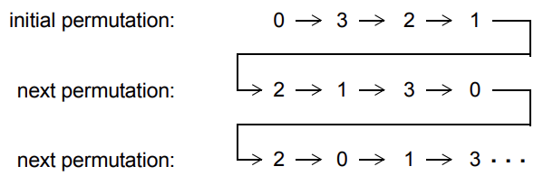

# 18. 受约束的随机数生成
## 18.1 概述
本章描述以下内容：
 - 随机变量
 - 约束块
 - 随机化方法
 - 禁用随机化
 - 控制约束
 - 作用域变量随机化
 - 给随机数生成器（RNG）设置种子
 - 随机加权 case 语句
 - 随机序列生成

## 18.2 总览
约束驱动的测试生成允许用户自动生成功能验证测试。随机测试可能比传统的有针对性的测试方法更有效。通过指定约束，可以轻松创建可以找到难以到达的边界情况的测试。SystemVerilog 允许用户以一种紧凑的声明方式指定约束。然后，约束由求解器处理，生成满足约束的随机值。

随机约束通常在面向对象数据抽象之上指定，模拟要随机化的数据为包含随机变量和用户定义约束的对象。约束确定可以分配给随机变量的合法值。对象非常适合表示复杂的聚合数据类型和协议，例如以太网数据包。

章节 18.3 提供了基于对象的随机化和约束编程的概述。本章的其余部分提供了有关随机变量、约束块和用于操作它们的机制的详细信息。

## 18.3 概念和用法
本小节介绍了在对象中生成随机激励的基本概念和用法。SystemVerilog 使用面向对象的方法为对象的成员变量分配随机值，受用户定义的约束限制。例如：
```verilog
class Bus;
    rand bit[15:0] addr;
    rand bit[31:0] data;

    constraint word_align {addr[1:0] == 2'b0;}
endclass
```

Bus 类模拟了一个简化的总线，其中包含两个随机变量 addr 和 data，分别表示总线上的地址和数据值。word_align 约束声明了 addr 的随机值必须是字对齐的（低位 2 位为 0）。

调用 randomize() 方法会为总线对象生成新的随机值：
```verilog
Bus bus = new;

repeat (50) begin
    if ( bus.randomize() == 1 )
        $display ("addr = %16h data = %h\n", bus.addr, bus.data);
    else
        $display ("Randomization failed.\n");
end
```

调用 randomize() 会为对象的所有随机变量选择新的值，以使所有约束为真（满足）。在上面的程序测试中，创建了一个 bus 对象，然后随机化 50 次。检查每次随机化的结果是否成功。如果随机化成功，则打印 addr 和 data 的新随机值；如果随机化失败，则打印错误消息。在此示例中，只约束了 addr 值，而 data 值是无约束的。无约束的变量会被分配其声明范围内的任何值。

约束编程是一种强大的方法，允许用户构建通用、可重用的对象，稍后可以扩展或约束以执行特定功能。该方法与传统的过程式和面向对象编程都不同，如下面的示例所示，该示例扩展了 Bus 类：
```verilog
typedef enum {low, mid, high} AddrType;

class MyBus extends Bus;
    rand AddrType atype;

    constraint addr_range
    {
        (atype == low ) -> addr inside { [0 : 15] };
        (atype == mid ) -> addr inside { [16 : 127]};
        (atype == high) -> addr inside {[128 : 255]};
    }
endclass
```

MyBus 类继承了 Bus 类的所有随机变量和约束，并添加了一个名为 atype 的随机变量，用于使用另一个约束控制地址范围。addr_range 约束使用蕴含来根据 atype 的随机值选择三个范围约束中的一个。当随机化 MyBus 对象时，将计算 addr、data 和 atype 的值，以使所有约束都得到满足。使用继承构建分层约束系统使得能够开发通用模型，可以约束以执行特定应用程序功能。

可以使用 randomize() `with` 构造进一步约束对象。该构造在调用 randomize() 时内联声明附加约束：
```verilog
task exercise_bus (MyBus bus);
    int res;

    // 示例 1：限制为低地址
    res = bus.randomize() with {atype == low;};

    // 示例 2：限制地址在 10 到 20 之间
    res = bus.randomize() with {10 <= addr && addr <= 20;};

    // 示例 3：将数据值限制为 2 的幂
    res = bus.randomize() with {(data & (data - 1)) == 0;};
endtask
```

此示例说明了约束的几个重要属性，如下所示：
 - 约束可以是任何 SystemVerilog 整数类型（例如 `bit`、`reg`、`logic`、`integer`、`enum`、`packed struct`）的变量和常量组成的表达式。
 - 约束求解器应能够处理各种方程，例如代数因式分解、复杂的布尔表达式和混合整数和位表达式。在上面的示例中，2 的幂约束是用算术表达的。也可以使用移位运算符定义表达式；例如，1 << n，其中 n 是一个 5 位随机变量。
 - 如果存在解，则约束求解器将找到解。只有在问题过度约束且没有组合满足约束的随机值时，求解器才会失败。
 - 约束双向交互。在此示例中，为 addr 选择的值取决于 atype 及其如何约束，为 atype 选择的值取决于 addr 及其如何约束。所有表达式运算符都是双向处理的，包括蕴含运算符（`->`）。
 - 约束仅支持 2 状态值。4 状态值（X 或 Z）或 4 状态运算符（例如，`===`、`!==`）是非法的，将导致错误。

有时，禁用随机变量的约束是有用的。例如，为了故意生成非法地址（非字对齐）：
```verilog
task exercise_illegal(MyBus bus, int cycles);
    int res;

    // 禁用字对齐约束。
    bus.word_align.constraint_mode(0);

    repeat (cycles) begin
        // CASE 1：限制为小地址。
        res = bus.randomize() with {addr[0] || addr[1];};
        ...
    end

    // 重新启用字对齐约束
    bus.word_align.constraint_mode(1);
endtask
```

constraint_mode() 方法可用于启用或禁用对象中的任何命名约束块。在此示例中，禁用了字对齐约束，然后使用额外约束强制低位地址位非零（因此不对齐）随机化对象。

启用或禁用约束的能力允许用户设计约束层次结构。在这些层次结构中，最低级约束可以表示由共同属性分组的物理限制，这些属性分组为命名约束块，可以独立启用或禁用。

类似地，rand_mode() 方法可用于启用或禁用任何随机变量。当禁用随机变量时，它的行为与其他非随机变量完全相同。

有时，希望在随机化之前或之后立即执行操作。这通过两个内置方法 pre_randomize() 和 post_randomize() 实现，这两个方法在随机化之前和之后自动调用。这些方法可以被覆盖以实现所需的功能：
```verilog
class XYPair;
    rand integer x, y;
endclass

class MyXYPair extends XYPair ;
    function void pre_randomize();
        super.pre_randomize(); 
        $display("Before randomize x=%0d, y=%0d", x, y);
    endfunction

    function void post_randomize();
        super.post_randomize();
        $display("After randomize x=%0d, y=%0d", x, y);
    endfunction
endclass
```

默认情况下，pre_randomize() 和 post_randomize() 调用它们被覆盖的基类的方法。当 pre_randomize() 或 post_randomize() 被重载，必须小心执行基类的方法，除非类是基类（没有基类）。否则，基类方法不应被调用。

随机激励生成的能力和面向对象基于约束的验证方法学使用户快速开发测试，覆盖复杂功能，更好保证设计正确性。

## 18.4 随机变量
可以使用 `rand` 和 `randc` 类型修饰符关键字声明类变量为随机。在类中声明随机变量的语法如下 8-1：
---
```verilog
class_property ::= // from A.1.9
{ property_qualifier } data_declaration 
property_qualifier8 ::= 
random_qualifier 
| class_item_qualifier 
random_qualifier8 ::= 
rand
| randc
// 8) 在任一声明中，只允许 protected 或 local 中的一个，只允许 rand 或 randc 中的一个，static 和/或 virtual 只能出现一次。
```
---
语法 18-1—随机变量声明语法（摘自附录 A）

 - 求解器可以随机化任何整数类型的单个变量。
 - 数组可以声明为 `rand` 或 `randc`，此时其所有成员元素都被视为 `rand` 或 `randc`。
 - 可以约束单个数组元素，此时索引表达式可能包括迭代约束循环变量、常量和状态变量。
 - 动态数组、关联数组和队列可以声明为 `rand` 或 `randc`。数组中的所有元素都被随机化，覆盖任何先前的数据。
 - 可以约束动态数组或队列的大小。在这种情况下，数组将根据大小约束调整大小，然后随机化所有数组元素。数组大小约束使用 size 方法声明。例如：
   ```verilog
   rand bit [7:0] len;
   rand integer data[];
   constraint db { data.size == len; }
   ```

   变量 len 被声明为 8 位宽。随机化器计算 len 变量的随机值，范围为 8 比特的 0 到 255，然后随机化 data 数组的前 len 个元素。
   
   当动态数组被随机化调整大小时，调整后的数组将被初始化（参见 7.5.1）为原始数组。当队列被随机化调整大小时，根据需要在队列的后面（即右侧）插入或删除元素（参见 7.10.2.2 和 7.10.2.3）以生成新的队列大小；插入的任何新元素都采用元素类型的默认值。也就是说，调整大小会增长或缩小数组。这对于类句柄的动态数组或队列很重要。随机化不会分配任何类对象。直到新大小，现有类对象被保留并且其内容被随机化。如果新大小大于原始大小，则每个附加元素都具有不需要随机化的 `null` 值。

   在通过随机化或 `new` 调整动态数组或队列的大小时，保留了每个保留元素的 rand_mode，并且每个新元素的 rand_mode 设置为 active。

   如果动态数组的大小没有约束，则数组不会被调整大小，所有数组元素都会被随机化。

 - 可以声明对象句柄为 `rand`，在这种情况下，该对象的所有变量和约束与包含该句柄的对象的变量和约束同时求解。随机化不会修改实际对象句柄。对象句柄不应声明为 `randc`。
 - 可以声明未打包结构为 `rand`，在这种情况下，该结构的所有随机成员使用本节中列出的规则同时求解。未打包结构不应声明为 `randc`。未打包结构的成员可以通过在其类型声明中使用 `rand` 或 `randc` 修饰符使其成为随机。包含联合的未打包结构的成员以及打包结构的成员不允许具有随机修饰符。

   例如：
   ```verilog
   class packet;
       typedef struct {
           randc int addr = 1 + constant;
           int crc;
           rand byte data [] = {1,2,3,4};
       } header;
       rand header h1;
   endclass
   packet p1=new;
   ```

### 18.4.1 Rand 修饰符
使用 `rand` 关键字声明的变量是标准随机变量。它们的值在其范围内均匀分布。例如：
```verilog
rand bit [7:0] y;
```

这是一个 8 位无符号整数，范围为 0 到 255。如果未约束，则该变量将被分配 0 到 255 范围内的任何值，概率相等。在此示例中，连续调用 randomize() 时相同值重复的概率为 1/256。

### 18.4.2 Randc 修饰符
使用 `randc` 关键字声明的变量是随机循环变量，它们在其声明范围的随机排列中循环。

为了理解 `randc`，考虑一个 2 位随机变量 y：
```verilog
randc bit [1:0] y;
```

变量 y 可以取值 0、1、2 和 3（范围为 0 到 3）。randomize() 计算 y 的范围值的初始随机排列，然后在连续调用中按顺序返回这些值。在返回排列的最后一个元素后，它会重复该过程，计算一个新的随机排列。

随机循环变量的基本思想是，`randc` 在范围内随机迭代所有值，并且在迭代中不重复任何值。当迭代完成后，新的迭代会自动开始（参见图 18-1）。


图 18-1—`randc` 示例

对于任何给定的 `randc` 变量，当该变量的约束发生变化或者该变量的剩余值中没有一个可以满足约束时，求解器会重新计算该变量的随机排列。随机排列序列只能包含 2 状态值。

为了减少内存需求，实现可能对 `randc` 变量的最大大小施加限制，但不得少于 8 位。

随机循环变量的语义要求它们在其他随机变量之前解决。包含 `rand` 和 `randc` 变量的约束集应该这样解决，以便 `randc` 变量首先解决，这有时会导致 randomize() 失败。

如果随机变量声明为 `static`，则该变量的 randc 状态也应为静态。因此，当通过基类的任何实例随机化变量时，randomize 会选择下一个循环值（从单个序列中）。

## 18.5 约束块
使用约束表达式确定随机变量的值，约束表达式使用约束块声明。约束块是类成员，如任务、函数和变量。约束块名称在类中必须是唯一的。

声明约束块的语法如下 18-2：
---
```verilog
constraint_declaration ::= // from A.1.10
[ static ] constraint constraint_identifier constraint_block 
constraint_block ::= { { constraint_block_item } }
constraint_block_item ::= 
solve solve_before_list before solve_before_list ;
| constraint_expression 
solve_before_list ::= constraint_primary { , constraint_primary } 
constraint_primary ::= [ implicit_class_handle . | class_scope ] hierarchical_identifier select 
constraint_expression ::= 
[ soft ] expression_or_dist ;
| expression –> constraint_set 
| if ( expression ) constraint_set [ else constraint_set ] 
| foreach ( ps_or_hierarchical_array_identifier [ loop_variables ] ) constraint_set 
| disable soft constraint_primary ;
constraint_set ::= 
constraint_expression 
| { { constraint_expression } }
dist_list ::= dist_item { , dist_item } 
dist_item ::= value_range [ dist_weight ] 
dist_weight ::= 
:= expression 
| :/ expression 
constraint_prototype ::= [constraint_prototype_qualifier] [ static ] constraint constraint_identifier ;
constraint_prototype_qualifier ::= extern | pure
extern_constraint_declaration ::= 
[ static ] constraint class_scope constraint_identifier constraint_block 
identifier_list ::= identifier { , identifier } 
expression_or_dist ::= expression [ dist { dist_list } ] // from A.2.10
loop_variables ::= [ index_variable_identifier ] { , [ index_variable_identifier ] } // from A.6.8
```
---
语法 18-2—约束语法（摘自附录 A）

constraint_identifier 是约束块的名称。这个名称可以用来使用 constraint_mode() 方法启用或禁用约束（参见 18.9）。

constraint_block 是限制变量范围或定义变量之间关系的表达式语句列表。constraint_expression 是任何 SystemVerilog 表达式或约束特定运算符，如 `dist` 和 `->`（参见 18.5.4 和 18.5.6）。

约束的声明性质对约束表达式施加以下限制：
 - 函数允许，但有一定限制（参见 18.5.12）。
 - 具有副作用的运算符，例如 `++` 和 `--`，是不允许的。
 - 不能在顺序约束中指定 `randc` 变量（参见 18.5.10 中的 `solve...before`）。
 - `dist` 表达式不能出现在其他表达式中。

### 18.5.1 外部约束块
如果 *约束原型* 出现在类声明中，则可以在其封闭类声明之外声明约束块。约束原型指定类应具有指定名称的约束，但不指定实现该约束的约束块。约束原型可以采用两种形式，如下面的示例所示：
```verilog
class C;
    rand int x;
    constraint proto1; // 隐式形式
    extern constraint proto2; // 显式形式
endclass
```

对于这两种形式，可以通过使用类作用域解析运算符提供 *外部约束块* 来完成约束，如下例所示：
```verilog
constraint C::proto1 { x inside {-4, 5, 7}; }
constraint C::proto2 { x >= 0; }
```

外部约束块应出现在与相应类声明相同的作用域中，并且应在该作用域中的类声明之后出现。如果使用显式形式的约束原型，并且未提供相应的外部约束块，则如果没有提供相应的外部约束块，则应该是一个错误。如果使用隐式形式的原型，并且没有提供相应的外部约束块，则应将约束视为空约束，并可能发出警告。空约束是对随机化没有影响的约束，等效于包含常量表达式 1 的约束块。

对于任一形式，如果为任何给定原型提供了多个外部约束块，则应该是一个错误，如果在同一类声明中出现与原型同名的约束块，则应该是一个错误。

### 18.5.2 约束继承
约束遵循与其他类成员相同的一般继承规则。randomize() 方法是虚拟的，因此无论调用它的对象句柄的数据类型如何，它都会遵守调用该对象的约束。

派生类应继承其超类的所有约束。派生类中具有与其超类中的约束相同名称的约束将替换该名称的继承约束。派生类中具有与其超类中约束不同名称的约束将是附加约束。

如果派生类具有与其超类中约束原型相同名称的约束原型，则该约束原型将替换继承的约束。然后，派生类的约束原型的完成应遵循 18.5.1 中描述的规则。

可以在抽象类中（即使用 8.21 中描述的 `virtual class` 语法声明的类）中包含 *纯约束*。纯约束在语法上类似于约束原型，但使用 `pure` 关键字，如下例所示：
```verilog
virtual class D;
    pure constraint Test;
endclass
```

纯约束表示对任何非抽象派生类（即不是 `virtual` 的派生类）提供同名约束的义务。如果非抽象类没有提供其继承的每个纯约束的实现，则应该是一个错误。在非抽象类中声明纯约束应该是一个错误。

如果一个类包含一个纯约束，同时也有与其继承的同名约束块、约束原型或外部约束块，则应该是一个错误。但是，任何类（无论是否是抽象类）都可以包含与其继承的纯约束同名的约束块或约束原型；这样的约束将覆盖纯约束，并且对于该类及其任何派生类都是非纯约束。

从超类继承约束的抽象类可能具有与其继承的约束相同名称的纯约束。在这种情况下，派生虚拟类中的纯约束将替换继承的约束。

覆盖纯约束的约束可以在覆盖类的主体中使用约束块声明，也可以使用约束原型和外部约束块，如 18.5.1 中所述。


